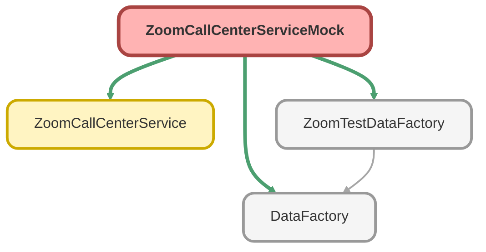

---
hide:
  - path
---

# ZoomCallCenterServiceMock Class

`ISTEST`

**Implements**

HttpCalloutMock

## Class Diagram



<!-- Apex description -->

## Apex Code

```java
@isTest
public with sharing class ZoomCallCenterServiceMock implements HttpCalloutMock{
	public HTTPResponse respond(HTTPRequest request) {
		DateTime now = DateTime.now();
		String nowString = now.format('yyyy-MM-dd\'T\'HH:mm:ss\'Z\'');
		HttpResponse response = new HttpResponse();
		response.setHeader('Content-Type', 'application/json');
		response.setBody(
			'{"next_page_token": "R4aF9Oj0fVM2hhezJTEmSKaBSkfesDwGy42","page_size": 30,"total_records": 3,"from": "2023-01-01T08:00:00Z","to": "2023-01-01T09:00:00Z","voice_calls": [{"engagement_id": "3XilEfOvQEKRIWMWhX1jDg","direction": "inbound","call_legs": ["inbound"],"distributions": ["acd"],"types": ["external_call"],"caller_number": "+18108001001","caller_number_type": "toll_free_number","callee_number": "+12055437350","callee_number_type": "toll_free_number","start_time": "'+nowString+'","end_time": "2023-01-01T01:00:00-08:00","total_duration": 10,"consumer_number": "+12059300920","consumer_display_name": "Tester","queues": [{"queue_id": "d95avl1eRJ-H162PZUJ-qg","queue_name": "agentQueue"}],"agents": [{"user_id": "ukAAkZKfROKMSw1bj_RDFQ","display_name": "Jilly"}],"flows": [{"flow_id": "zeYjXoDOS_eV1QmTpj63PQ","flow_name": "Demo"}],"country_name": "China","recorded": false,"monitored": false,"inbox": false,"result": "completed","caller_id": "+12058945728","calling_party": "consumer","charge": "$0.019","rates": ["$0.019"],"charge_type": "per_minute"}]}'
		);
		response.setStatusCode(200);
		return response;
	}
	@isTest
	public static void testCallCenterService() {
		List<Zoom_Users_Info__c> lstUsr = ZoomTestDataFactory.createListZoomUsersInfo(1, 'System Administrator', '@some.com');
	    Test.setMock(HttpCalloutMock.class, new ZoomCallCenterServiceMock());
	    Test.startTest();
			ZoomCallCenterService.createCallCenterCalls(lstUsr);
	    Test.stopTest();
	}
}
```

## Methods
### `respond(request)`

#### Signature
```apex
public HTTPResponse respond(HTTPRequest request)
```

#### Parameters
| Name | Type | Description |
|------|------|-------------|
| request | HTTPRequest |  |

#### Return Type
**HTTPResponse**

---

### `testCallCenterService()`

`ISTEST`

#### Signature
```apex
public static void testCallCenterService()
```

#### Return Type
**void**