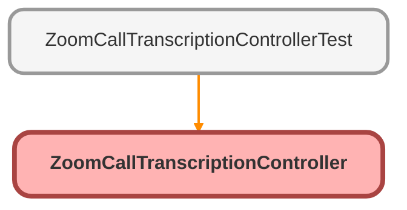

---
hide:
  - path
---

# ZoomCallTranscriptionController Class

## Class Diagram



<!-- Apex description -->

## Apex Code

```java
public with sharing class ZoomCallTranscriptionController {
    @AuraEnabled(cacheable=true)
    public static ServiceResponse getCallTranscription(String recordingId) {
        ServiceResponse result;
        if (recordingId == null) {
            return null;
        } else {
            String address = 'callout:ZoomPhone/phone/recording_transcript/download/' + recordingId;
            HttpRequest req = new HttpRequest();
            Http http = new Http();
            req.setEndpoint(address);
            req.setHeader('Content-type', 'application/json');
            req.setMethod('GET');
            HttpResponse res = http.send(req);
            String transcript;
            if (res.getStatusCode() == 200) {
                transcript = res.getBody();
                result = (ServiceResponse) JSON.deserialize(transcript, ServiceResponse.class);
            } else if (res.getStatusCode() == 302) {
                String redirectUrl = res.getHeader('location');
                req.setEndpoint(redirectUrl);
                res = http.send(req);
                transcript = res.getBody();
                result = (ServiceResponse) JSON.deserialize(transcript, ServiceResponse.class);
            } else {
                System.debug('Error: ' + res.getStatusCode() + ' ' + res.getStatus());
            }
            return result;
        }
    }

    public class ServiceResponse {
        @AuraEnabled
        public String type { get; set; }
        @AuraEnabled
        public Integer ver { get; set; }
        @AuraEnabled
        public String recording_id { get; set; }
        @AuraEnabled
        public String meeting_id { get; set; }
        @AuraEnabled
        public String account_id { get; set; }
        @AuraEnabled
        public String host_id { get; set; }
        @AuraEnabled
        public String recording_start { get; set; }
        @AuraEnabled
        public String recording_end { get; set; }
        @AuraEnabled
        public List<Timeline> timeline { get; set; }
    }

    public class Timeline {
        @AuraEnabled
        public String text { get; set; }
        @AuraEnabled
        public String end_ts { get; set; }
        @AuraEnabled
        public String ts { get; set; }
        @AuraEnabled
        public List<Users> users { get; set; }
    }

    public class Users {
        @AuraEnabled
        public String username { get; set; }
        @AuraEnabled
        public Boolean multiple_people { get; set; }
        @AuraEnabled
        public String user_id { get; set; }
        @AuraEnabled
        public String zoom_userid { get; set; }
        @AuraEnabled
        public Integer client_type { get; set; }
    }
}
```

## Methods
### `getCallTranscription(recordingId)`

`AURAENABLED`

#### Signature
```apex
public static ServiceResponse getCallTranscription(String recordingId)
```

#### Parameters
| Name | Type | Description |
|------|------|-------------|
| recordingId | String |  |

#### Return Type
**ServiceResponse**

## Classes
### ServiceResponse Class

#### Properties
##### `type`

`AURAENABLED`

###### Signature
```apex
public type
```

###### Type
String

---

##### `ver`

`AURAENABLED`

###### Signature
```apex
public ver
```

###### Type
Integer

---

##### `recording_id`

`AURAENABLED`

###### Signature
```apex
public recording_id
```

###### Type
String

---

##### `meeting_id`

`AURAENABLED`

###### Signature
```apex
public meeting_id
```

###### Type
String

---

##### `account_id`

`AURAENABLED`

###### Signature
```apex
public account_id
```

###### Type
String

---

##### `host_id`

`AURAENABLED`

###### Signature
```apex
public host_id
```

###### Type
String

---

##### `recording_start`

`AURAENABLED`

###### Signature
```apex
public recording_start
```

###### Type
String

---

##### `recording_end`

`AURAENABLED`

###### Signature
```apex
public recording_end
```

###### Type
String

---

##### `timeline`

`AURAENABLED`

###### Signature
```apex
public timeline
```

###### Type
List&lt;Timeline&gt;

### Timeline Class

#### Properties
##### `text`

`AURAENABLED`

###### Signature
```apex
public text
```

###### Type
String

---

##### `end_ts`

`AURAENABLED`

###### Signature
```apex
public end_ts
```

###### Type
String

---

##### `ts`

`AURAENABLED`

###### Signature
```apex
public ts
```

###### Type
String

---

##### `users`

`AURAENABLED`

###### Signature
```apex
public users
```

###### Type
List&lt;Users&gt;

### Users Class

#### Properties
##### `username`

`AURAENABLED`

###### Signature
```apex
public username
```

###### Type
String

---

##### `multiple_people`

`AURAENABLED`

###### Signature
```apex
public multiple_people
```

###### Type
Boolean

---

##### `user_id`

`AURAENABLED`

###### Signature
```apex
public user_id
```

###### Type
String

---

##### `zoom_userid`

`AURAENABLED`

###### Signature
```apex
public zoom_userid
```

###### Type
String

---

##### `client_type`

`AURAENABLED`

###### Signature
```apex
public client_type
```

###### Type
Integer