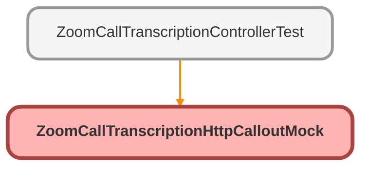

---
hide:
  - path
---

# ZoomCallTranscriptionHttpCalloutMock Class

`ISTEST`

**Implements**

HttpCalloutMock

## Class Diagram



<!-- Apex description -->

## Apex Code

```java
@isTest
public with sharing class ZoomCallTranscriptionHttpCalloutMock implements HttpCalloutMock {
    public HTTPResponse respond(HTTPRequest request) {
        String recordingId = '123456';

        HttpResponse response = new HttpResponse();
        response.setHeader('Content-Type', 'application/json');
        response.setHeader('location', 'https://api.zoom.us/v2/recordings/' + recordingId + '/transcript');
        response.setBody('{"type":"transcription","ver":1,"recording_id":"' + recordingId + '","meeting_id":"12345678","account_id":"123456789","host_id":"testhost","recording_start":"2022-01-01T00:00:00Z","recording_end":"2022-01-01T01:00:00Z","timeline":[{"text":"test transcription","end_ts":"2022-01-01T00:30:00Z","ts":"2022-01-01T00:00:00Z","users":[{"username":"testuser","multiple_people":false,"user_id":"testuserid","zoom_userid":"testzoomuserid","client_type":1}]}]}');
        response.setStatusCode(302);
        return response;
    }
}
```

## Methods
### `respond(request)`

#### Signature
```apex
public HTTPResponse respond(HTTPRequest request)
```

#### Parameters
| Name | Type | Description |
|------|------|-------------|
| request | HTTPRequest |  |

#### Return Type
**HTTPResponse**