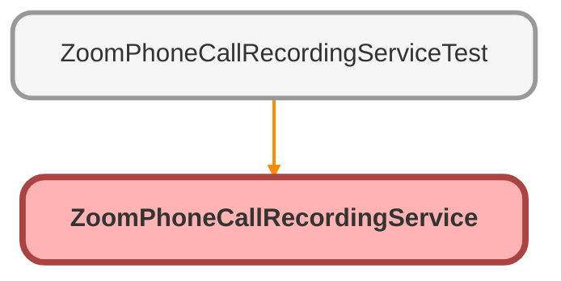

---
hide:
  - path
---

# ZoomPhoneCallRecordingService Class

## Class Diagram



<!-- Apex description -->

## Apex Code

```java
public with sharing class ZoomPhoneCallRecordingService {

    @AuraEnabled
	public static ResultWrapper getPhoneCallRecording(String callId, String recordId) {
        String address = 'callout:ZoomPhone/phone/call_logs/' + callId + '/recordings';
		HttpRequest req = new HttpRequest();
		Http http = new Http();
		req.setEndpoint(address);
		req.setHeader('Content-type', 'application/json');
		req.setMethod('GET');
		HttpResponse res = http.send(req);

        ResultWrapper result = new ResultWrapper();
        if(res.getStatusCode() == 200){
            String url = updatePhoneCall(res.getBody(), recordId);
            result.url = url;
            result.status = res.getStatus();
            result.status_code = res.getStatusCode();
            return result;
        } else {
            result.status = res.getStatus();
            result.status_code = res.getStatusCode();
            return result;
        }
	}

    public static String updatePhoneCall(String resBody, String recordId){

        ZoomPhoneRecordingResponse responseWrapper = (ZoomPhoneRecordingResponse) JSON.deserialize(resBody, ZoomPhoneRecordingResponse.class);
        String fileUrl = responseWrapper.file_url;
        if(fileUrl != null){
            Zoom_Phone_Calls_Info__c callInfo = [SELECT Id, Recording_link__c FROM Zoom_Phone_Calls_Info__c WHERE Id = :recordId];
            callInfo.Recording_link__c = fileUrl;
            update callInfo;
        }
        return fileUrl;
    }

    public class ResultWrapper{
        @AuraEnabled
        public String url;
        @AuraEnabled
        public String status;
        @AuraEnabled
        public Integer status_code;
    }
    // NOTE: add response fields if needed
    public class ZoomPhoneRecordingResponse {
        @AuraEnabled
        public String file_url;
        // @AuraEnabled
        // public String id;
        // @AuraEnabled
        // public String caller_number;
        // @AuraEnabled
        // public Integer caller_number_type;
        // @AuraEnabled
        // public String caller_name;
        // @AuraEnabled
        // public String callee_number;
        // @AuraEnabled
        // public Integer callee_number_type;
        // @AuraEnabled
        // public String callee_name;
        // @AuraEnabled
        // public String direction;
        // @AuraEnabled
        // public Integer duration;
        // @AuraEnabled
        // public String download_url;
        // @AuraEnabled
        // public Datetime date_time;
        // @AuraEnabled
        // public String recording_type;
        // @AuraEnabled
        // public String call_log_id;
        // @AuraEnabled
        // public String call_id;
        // @AuraEnabled
        // public Map<String, Object> site; // Use Map to handle dynamic content
        // @AuraEnabled
        // public Datetime end_time;
        // @AuraEnabled
        // public Integer disclaimer_status;
        // @AuraEnabled
        // public List<String> recordings;
    }
}
```

## Methods
### `getPhoneCallRecording(callId, recordId)`

`AURAENABLED`

#### Signature
```apex
public static ResultWrapper getPhoneCallRecording(String callId, String recordId)
```

#### Parameters
| Name | Type | Description |
|------|------|-------------|
| callId | String |  |
| recordId | String |  |

#### Return Type
**ResultWrapper**

---

### `updatePhoneCall(resBody, recordId)`

#### Signature
```apex
public static String updatePhoneCall(String resBody, String recordId)
```

#### Parameters
| Name | Type | Description |
|------|------|-------------|
| resBody | String |  |
| recordId | String |  |

#### Return Type
**String**

## Classes
### ResultWrapper Class

#### Fields
##### `url`

`AURAENABLED`

###### Signature
```apex
public url
```

###### Type
String

---

##### `status`

`AURAENABLED`

###### Signature
```apex
public status
```

###### Type
String

---

##### `status_code`

`AURAENABLED`

###### Signature
```apex
public status_code
```

###### Type
Integer

### ZoomPhoneRecordingResponse Class

#### Fields
##### `file_url`

`AURAENABLED`

###### Signature
```apex
public file_url
```

###### Type
String