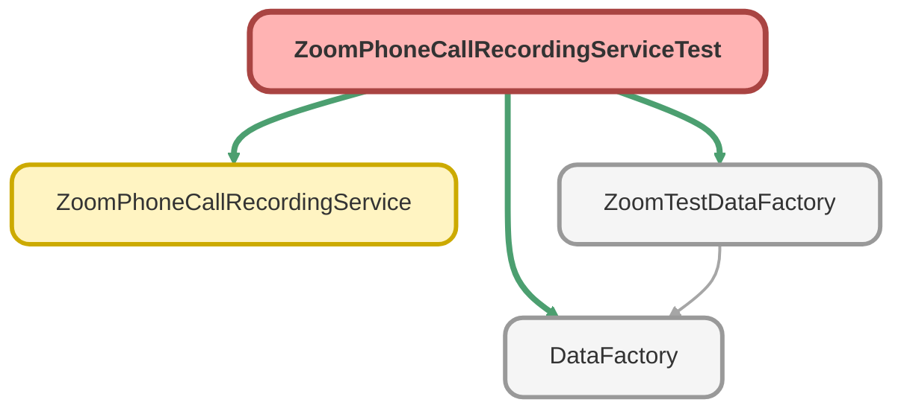

---
hide:
  - path
---

# ZoomPhoneCallRecordingServiceTest Class

`ISTEST`

**Implements**

HttpCalloutMock

## Class Diagram



<!-- Apex description -->

## Apex Code

```java
@isTest
public with sharing class ZoomPhoneCallRecordingServiceTest implements HttpCalloutMock {

    @TestSetup
    static void makeData(){
        ZoomTestDataFactory.createZoomCall();
    }

    public HTTPResponse respond(HTTPRequest request) {
        String recordingId = '1234567';

        HttpResponse response = new HttpResponse();
        response.setHeader('Content-Type', 'application/json');
        response.setHeader('location', 'https://api.zoom.us/v2/recordings/' + recordingId + '/transcript');
        response.setBody('{"call_id": "123456789","file_url": "https://domain/recording/download/EvVNLihbQ1WpeG_ALwnNzg"}');
        response.setStatusCode(200);
        return response;
    }

    @isTest
    public static void getCallTranscriptionStatusTest() {
        Zoom_Phone_Calls_Info__c call = [SELECT Id, Call_Id__c FROM Zoom_Phone_Calls_Info__c WHERE Name = 'Test Call' LIMIT 1];
        Test.setMock(HttpCalloutMock.class, new ZoomPhoneCallRecordingServiceTest());
        Test.startTest();
        ZoomPhoneCallRecordingService.getPhoneCallRecording(call.Call_Id__c, call.Id);
        Test.stopTest();
    }

}
```

## Methods
### `makeData()`

`TESTSETUP`

#### Signature
```apex
private static void makeData()
```

#### Return Type
**void**

---

### `respond(request)`

#### Signature
```apex
public HTTPResponse respond(HTTPRequest request)
```

#### Parameters
| Name | Type | Description |
|------|------|-------------|
| request | HTTPRequest |  |

#### Return Type
**HTTPResponse**

---

### `getCallTranscriptionStatusTest()`

`ISTEST`

#### Signature
```apex
public static void getCallTranscriptionStatusTest()
```

#### Return Type
**void**