---
hide:
  - path
---

# ZoomTestDataFactory Class

`ISTEST`

## Class Diagram

```mermaid
graph TD
  ZoomTestDataFactory["ZoomTestDataFactory"]:::mainApexClass
  click ZoomTestDataFactory "/objects/ZoomTestDataFactory/"
  DataFactory["DataFactory"]:::apexTestClass
  click DataFactory "/apex/DataFactory/"
  ZoomCallCenterRecordingServiceTest["ZoomCallCenterRecordingServiceTest"]:::apexTestClass
  click ZoomCallCenterRecordingServiceTest "/apex/ZoomCallCenterRecordingServiceTest/"
  ZoomCallCenterServiceMock["ZoomCallCenterServiceMock"]:::apexTestClass
  click ZoomCallCenterServiceMock "/apex/ZoomCallCenterServiceMock/"
  ZoomPhoneCallRecordingServiceTest["ZoomPhoneCallRecordingServiceTest"]:::apexTestClass
  click ZoomPhoneCallRecordingServiceTest "/apex/ZoomPhoneCallRecordingServiceTest/"
  ZoomUserInfosRecordCreatorBatchTest["ZoomUserInfosRecordCreatorBatchTest"]:::apexTestClass
  click ZoomUserInfosRecordCreatorBatchTest "/apex/ZoomUserInfosRecordCreatorBatchTest/"
  ZoomUsersInfoTriggerControllerTest["ZoomUsersInfoTriggerControllerTest"]:::apexTestClass
  click ZoomUsersInfoTriggerControllerTest "/apex/ZoomUsersInfoTriggerControllerTest/"
  ZoomUsersPermissionCheckerBatchTest["ZoomUsersPermissionCheckerBatchTest"]:::apexTestClass
  click ZoomUsersPermissionCheckerBatchTest "/apex/ZoomUsersPermissionCheckerBatchTest/"
  ZoomUsersPhoneInfosBatchHttpCalloutMock["ZoomUsersPhoneInfosBatchHttpCalloutMock"]:::apexTestClass
  click ZoomUsersPhoneInfosBatchHttpCalloutMock "/apex/ZoomUsersPhoneInfosBatchHttpCalloutMock/"

  ZoomTestDataFactory --> DataFactory

  ZoomCallCenterRecordingServiceTest --> ZoomTestDataFactory
  ZoomCallCenterServiceMock --> ZoomTestDataFactory
  ZoomPhoneCallRecordingServiceTest --> ZoomTestDataFactory
  ZoomUserInfosRecordCreatorBatchTest --> ZoomTestDataFactory
  ZoomUsersInfoTriggerControllerTest --> ZoomTestDataFactory
  ZoomUsersPermissionCheckerBatchTest --> ZoomTestDataFactory
  ZoomUsersPhoneInfosBatchHttpCalloutMock --> ZoomTestDataFactory

  ZoomCallCenterRecordingServiceTest --> DataFactory
  ZoomCallCenterServiceMock --> DataFactory
  ZoomPhoneCallRecordingServiceTest --> DataFactory
  ZoomUserInfosRecordCreatorBatchTest --> DataFactory
  ZoomUsersInfoTriggerControllerTest --> DataFactory
  ZoomUsersPermissionCheckerBatchTest --> DataFactory
  ZoomUsersPhoneInfosBatchHttpCalloutMock --> DataFactory

classDef apexClass fill:#FFF4C2,stroke:#CCAA00,stroke-width:3px,rx:12px,ry:12px,shadow:drop,color:#333;
classDef apexTestClass fill:#F5F5F5,stroke:#999999,stroke-width:3px,rx:12px,ry:12px,shadow:drop,color:#333;
classDef mainApexClass fill:#FFB3B3,stroke:#A94442,stroke-width:4px,rx:14px,ry:14px,shadow:drop,color:#333,font-weight:bold;

linkStyle 0 stroke:#4C9F70,stroke-width:4px;
linkStyle 1,2,3,4,5,6,7 stroke:#FF8C00,stroke-width:2px;
linkStyle 8,9,10,11,12,13,14 stroke:#A6A6A6,stroke-width:2px;
```



<!-- Apex description -->

## Apex Code

```java
@isTest
public with sharing class ZoomTestDataFactory {
    public static User createUser(String prof, String email) {
        CallCenter cc = [SELECT Id FROM CallCenter LIMIT 1];
        Profile profId = [SELECT Id FROM Profile WHERE Name = :prof LIMIT 1];
        User usr = new User();
        usr.Email = 'testuser' + email;
        usr.Username = 'testuser' + email;
        usr.FirstName = 'Test';
        usr.LastName = 'User';
        usr.Alias = 'tuser';
        usr.TimeZoneSidKey = 'America/Los_Angeles';
        usr.LocaleSidKey = 'en_US';
        usr.EmailEncodingKey = 'UTF-8';
        usr.LanguageLocaleKey = 'en_US';
        usr.isActive = true;
        usr.ProfileId = profId.Id;
        usr.CallCenterId = cc.Id;
        insert usr;
        return usr;
    }

    public static List<User> createListUsers(Integer count, String prof, String email) {
        CallCenter cc = [SELECT Id, name FROM CallCenter LIMIT 1];
        Profile profId = [SELECT Id FROM Profile WHERE Name = :prof LIMIT 1];
        List<User> testUsers = new List<User>();
        for (Integer i = 0; i < count; i++) {
            User usr = new User();
            usr.Email = 'testuser' + i + email;
            usr.Username = 'testuser' + i + email;
            usr.FirstName = 'Test' + i;
            usr.LastName = 'User ' + i;
            usr.Alias = 'tuser' + i;
            usr.TimeZoneSidKey = 'America/Los_Angeles';
            usr.LocaleSidKey = 'en_US';
            usr.EmailEncodingKey = 'UTF-8';
            usr.LanguageLocaleKey = 'en_US';
            usr.isActive = true;
            usr.ProfileId = profId.Id;
            usr.CallCenterId = cc.Id;
            testUsers.add(usr);
        }
        insert testUsers;
        return testUsers;
    }

    public static List<Zoom_Users_Info__c> createListZoomUsersInfo(Integer count, String prof, String email) {
        createListUsers(count, prof, email);
        List<User> usrLst = [SELECT Id, Name, Email FROM User WHERE Email LIKE :'%testuser%'];
        List<Zoom_Users_Info__c> zoomUsersInfo = new List<Zoom_Users_Info__c>();
        List<String> statuses = new List<String>{ 'Available', 'Away', 'In_Calendar_Event', 'In_Meeting', 'Offline', 'On_Phone_Call', 'Presenting', 'Do_Not_Disturb'};
        List<String> ccStatuses = new List<String>{ 'Ready', 'Not Ready', 'Occupied', 'Offline', 'Not Ready', 'Offline', 'Ready', 'Occupied' };
        for (Integer i = 0; i < count; i++) {
            Zoom_Users_Info__c zoomUser = new Zoom_Users_Info__c();
            zoomUser.User__c                    = usrLst[i].Id;
            zoomUser.Email__c                   = usrLst[i].Email;
            zoomUser.Name                       = usrLst[i].Name;
            zoomUser.Zoom_User_Id__c            = 'ukAAkZKfROKMSw1bj_RDFQ';
            zoomUser.Presence_Status__c         = statuses[i];
            zoomUser.Status_Updated__c          = DateTime.now();
            zoomUser.Tracking_Date__c           = Date.today();
            zoomUser.Available__c               = 0;
            zoomUser.Away__c                    = 0;
            zoomUser.In_Calendar_Event__c       = 0;
            zoomUser.In_Meeting__c              = 0;
            zoomUser.Offline__c                 = 0;
            zoomUser.On_Phone_Call__c           = 0;
            zoomUser.Presenting__c              = 0;
            zoomUser.Do_Not_Disturb__c          = 0;

            zoomUser.Contact_Center_Status__c   = ccStatuses[i];
            zoomUser.CC_Prev_Status__c          = i==0 ? ccStatuses[1] : ccStatuses[i-1];
            zoomUser.CC_Status_Updated__c       = DateTime.Now();
            zoomUser.Ready__c                   = 0;
            zoomUser.Not_Ready__c               = 0;
            zoomUser.Occupied__c                = 0;
            zoomUser.Offline_Status__c          = 0;
            zoomUsersInfo.add(zoomUser);
        }
        insert zoomUsersInfo;
        return zoomUsersInfo;
    }

    public static Zoom_Phone_Calls_Info__c createZoomCall(){
        List<Zoom_Users_Info__c> zoomUser = createListZoomUsersInfo(1, 'System Administrator', 'testuser@some.com');
        Zoom_Phone_Calls_Info__c zoomCall = new Zoom_Phone_Calls_Info__c();
        zoomCall.Zoom_Users_Info__c = zoomUser[0].Id;
        zoomCall.Name = 'Test Call';
        zoomCall.Call_Id__c = '123456789';
        insert zoomCall;
        return zoomCall;
    }
}
```

## Methods
### `createUser(prof, email)`

#### Signature
```apex
public static User createUser(String prof, String email)
```

#### Parameters
| Name | Type | Description |
|------|------|-------------|
| prof | String |  |
| email | String |  |

#### Return Type
**[User](../objects/User.md)**

---

### `createListUsers(count, prof, email)`

#### Signature
```apex
public static List<User> createListUsers(Integer count, String prof, String email)
```

#### Parameters
| Name | Type | Description |
|------|------|-------------|
| count | Integer |  |
| prof | String |  |
| email | String |  |

#### Return Type
**List&lt;User&gt;**

---

### `createListZoomUsersInfo(count, prof, email)`

#### Signature
```apex
public static List<Zoom_Users_Info__c> createListZoomUsersInfo(Integer count, String prof, String email)
```

#### Parameters
| Name | Type | Description |
|------|------|-------------|
| count | Integer |  |
| prof | String |  |
| email | String |  |

#### Return Type
**List&lt;Zoom_Users_Info__c&gt;**

---

### `createZoomCall()`

#### Signature
```apex
public static Zoom_Phone_Calls_Info__c createZoomCall()
```

#### Return Type
**[Zoom_Phone_Calls_Info__c](../objects/Zoom_Phone_Calls_Info__c.md)**