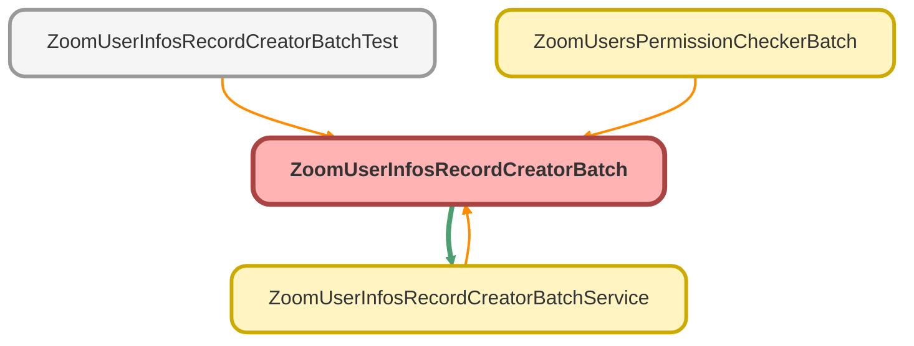

---
hide:
  - path
---

# ZoomUserInfosRecordCreatorBatch Class

**Implements**

Database.Batchable&lt;sObject&gt;, 
Database.AllowsCallouts, 
schedulable

## Class Diagram



<!-- Apex description -->

## Apex Code

```java
public with sharing class ZoomUserInfosRecordCreatorBatch implements Database.Batchable<sObject>, Database.AllowsCallouts, schedulable {
    public Database.QueryLocator start(Database.BatchableContext bc) {
        // NOTE: Retrieve Active users from org
        String query = 'SELECT Id, Name, Email, CallCenterId FROM User WHERE isActive = true AND CallCenterId != null';
        return Database.getQueryLocator(query);
    }
    public void execute(Database.BatchableContext bc, List<User> scope) {
        List<Zoom_Users_Info__c> result = new List<Zoom_Users_Info__c>();
        Map<Id, CallCenter> mapCallCenterIdName = new Map<Id, CallCenter>([SELECT Id, Name FROM CallCenter]);
        Map<String, ZoomUserInfosRecordCreatorBatchService.UsersProfWrapper> emailToZoomUsersProfileMap = ZoomUserInfosRecordCreatorBatchService.getMapUsersProfiles();

        // TODO: Refactor this to separate method
        Id recordTypePhoneId = Schema.SObjectType.Zoom_Users_Info__c.getRecordTypeInfosByName().get('Zoom Phone').getRecordTypeId();
        Id recordTypeCallCenterId = Schema.SObjectType.Zoom_Users_Info__c.getRecordTypeInfosByName().get('Contact Center').getRecordTypeId();

        for (User u : scope) {
            Zoom_Users_Info__c zoomUser = new Zoom_Users_Info__c();
            // String emailKey = u.Email.substringBefore('.invalid').toLowerCase().trim();
            String emailKey = u.Email.toLowerCase().trim();
            ZoomUserInfosRecordCreatorBatchService.UsersProfWrapper userInfo = emailToZoomUsersProfileMap.get(emailKey);
            String callCenterName = mapCallCenterIdName.get(u.CallCenterId).Name;

            zoomUser.User__c = u.id;
            // zoomUser.Email__c = u.Email.substringBefore('.invalid');// NOTE: substring used for devorg!!!
            zoomUser.Email__c = u.Email;
            zoomUser.Name                       = u.Name;
            zoomUser.OwnerId                    = u.id;
            zoomUser.Tracking_Date__c           = Date.today();
            zoomUser.Presence_Status__c         = 'Initial';
            zoomUser.Status_Updated__c          = DateTime.Now();
            zoomUser.Available__c               = 0;
            zoomUser.Away__c                    = 0;
            zoomUser.In_Calendar_Event__c       = 0;
            zoomUser.In_Meeting__c              = 0;
            zoomUser.Offline__c                 = 0;
            zoomUser.On_Phone_Call__c           = 0;
            zoomUser.Presenting__c              = 0;
            zoomUser.Do_Not_Disturb__c          = 0;
            zoomUser.Custom_Status__c           = 0;
            zoomUser.Contact_Center_Status__c   = 'Initial';
            zoomUser.CC_Status_Updated__c       = DateTime.Now();
            zoomUser.Ready__c                   = 0;
            zoomUser.Not_Ready__c               = 0;
            zoomUser.Occupied__c                = 0;
            zoomUser.Offline_Status__c          = 0;
            zoomUser.Custom_CC_Status__c        = 0;
            zoomUser.Call_Center_Member__c      = callCenterName;
            zoomUser.RecordTypeId               = callCenterName == 'Zoom Phone Call Center' ? recordTypePhoneId : recordTypeCallCenterId; // TODO: Refactor this to separet method

            if (userInfo != null) {
                zoomUser.Zoom_User_Id__c = userInfo.id;
                zoomUser.Zoom_Name__c = userInfo.name;
                zoomUser.Zoom_Department__c = userInfo.department;
                zoomUser.Zoom_Email__c = userInfo.email;
                zoomUser.Extension_Id__c = userInfo.extension_id;
                zoomUser.Extension_Number__c = userInfo.extension_number;
            }
            result.add(zoomUser);
        }
        insert result;
    }
    public void finish(Database.BatchableContext bc) {
    }

    //NOTE: Schedule interface
    public static void start(Integer hour) {
        string jobName = 'Zoom Users Info Create Records';
        if (hour == 7)
            Database.executeBatch(new ZoomUserInfosRecordCreatorBatch(), 50);
        else {
            jobName = jobName += ' - ' + DateTime.now().format();
            String cron = '0 0 ' + String.valueOf(hour) + ' ? * MON-FRI'; // NOTE: Execute From Monday - Friday
            system.schedule(jobName, cron, new ZoomUserInfosRecordCreatorBatch());
        }
    }

    public void execute(SchedulableContext SC) {
        Database.executeBatch(new ZoomUserInfosRecordCreatorBatch(), 50);
    }
}
// EXECUTE SCHEDULE
// immediately submits the batch job - 007 param just a JOKE!!!
//ZoomUserInfosRecordCreatorBatch.start(007);

// schedules the batch job to run nightly at 0am. - FROM 0 to 23
// ZoomUserInfosRecordCreatorBatch.start(0);
```

## Methods
### `start(bc)`

#### Signature
```apex
public Database.QueryLocator start(Database.BatchableContext bc)
```

#### Parameters
| Name | Type | Description |
|------|------|-------------|
| bc | Database.BatchableContext |  |

#### Return Type
**Database.QueryLocator**

---

### `execute(bc, scope)`

#### Signature
```apex
public void execute(Database.BatchableContext bc, List<User> scope)
```

#### Parameters
| Name | Type | Description |
|------|------|-------------|
| bc | Database.BatchableContext |  |
| scope | List&lt;User&gt; |  |

#### Return Type
**void**

---

### `finish(bc)`

#### Signature
```apex
public void finish(Database.BatchableContext bc)
```

#### Parameters
| Name | Type | Description |
|------|------|-------------|
| bc | Database.BatchableContext |  |

#### Return Type
**void**

---

### `start(hour)`

#### Signature
```apex
public static void start(Integer hour)
```

#### Parameters
| Name | Type | Description |
|------|------|-------------|
| hour | Integer |  |

#### Return Type
**void**

---

### `execute(SC)`

#### Signature
```apex
public void execute(SchedulableContext SC)
```

#### Parameters
| Name | Type | Description |
|------|------|-------------|
| SC | SchedulableContext |  |

#### Return Type
**void**