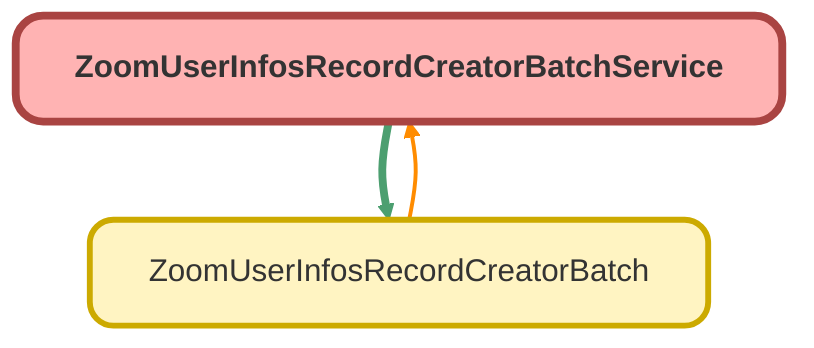

---
hide:
  - path
---

# ZoomUserInfosRecordCreatorBatchService Class

## Class Diagram



<!-- Apex description -->

## Apex Code

```java
public with sharing class ZoomUserInfosRecordCreatorBatchService {
	public static List<UsersProfWrapper> fetchActivePhoneUsers() {
		String baseUrl = 'callout:ZoomPhone/phone/users';
		Integer pageSize = 100;
		String status = 'activate';
		List<UsersProfWrapper> userWrappersList = new List<UsersProfWrapper>();

		String nextPageToken = null;
		Integer totalRecords = 0;

		do {
			String url = baseUrl + '?page_size=' + pageSize + '&status=' + status;
			if (nextPageToken != null) {
				url += '&next_page_token=' + nextPageToken;
			}
			HttpRequest req = new HttpRequest();
			req.setMethod('GET');
			req.setHeader('Content-Type', 'application/json');
			req.setEndpoint(url);

			Http http = new Http();
			HttpResponse response = http.send(req);

			if (response.getStatusCode() == 200) {
				String json = response.getBody();
				UserResponseWrapper wrapper = parse(json);
				userWrappersList.addAll(wrapper.users);
				totalRecords = wrapper.total_records;
				nextPageToken = wrapper.next_page_token;
			} else {
				System.debug('Callout failed with status code: ' + response.getStatusCode());
				nextPageToken = null;
			}
		} while (nextPageToken != null && userWrappersList.size() < totalRecords);
		return userWrappersList;
	}

	public static Map<String, UsersProfWrapper> getMapUsersProfiles() {
		List<UsersProfWrapper> lst = fetchActivePhoneUsers();
		Map<String, UsersProfWrapper> emailToZoomUsersProfileMap = new Map<String, UsersProfWrapper>();

		if (lst != null && !lst.isEmpty()) {
			for (UsersProfWrapper obj : lst) {
				String email = obj.email.toLowerCase().trim();
				emailToZoomUsersProfileMap.put(email, obj);
			}
			return emailToZoomUsersProfileMap;
		}
		return null;
	}

	public static UserResponseWrapper parse(String json){
        json.replace('"number":', '"phone":');
		return (UserResponseWrapper) System.JSON.deserialize(json, UserResponseWrapper.class);
	}

    public class UserResponseWrapper {
        public String next_page_token { get; set; }
        public Integer page_size { get; set; }
        public Integer total_records { get; set; }
        public List<UsersProfWrapper> users { get; set; }
    }
    public class UsersProfWrapper {
        public String email { get; set; }
        public String extension_id { get; set; }
        public Integer extension_number { get; set; }
        public String id { get; set; }
        public String name { get; set; }
        public String status { get; set; }
        public String department { get; set; }
        // public String phone_user_id { get; set; }
        // public String cost_center { get; set; }
        // public cls_site site { get; set; }
        // public List<CallingPlans> calling_plans { get; set; }
        // public List<PhoneNumbers> phone_numbers { get; set; }
    }

    // public class CallingPlans {
    //     public String name { get; set; }
    //     public Integer type { get; set; }
    //     public String billing_account_id { get; set; }
    //     public String billing_account_name { get; set; }
    // }

    // public class cls_site {
    //     public String id { get; set; }
    //     public String name { get; set; }
    // }

    // public class PhoneNumbers {
    //     public String id { get; set; }
    //     public String phone { get; set; }
    // }
}
```

## Methods
### `fetchActivePhoneUsers()`

#### Signature
```apex
public static List<UsersProfWrapper> fetchActivePhoneUsers()
```

#### Return Type
**List&lt;UsersProfWrapper&gt;**

---

### `getMapUsersProfiles()`

#### Signature
```apex
public static Map<String,UsersProfWrapper> getMapUsersProfiles()
```

#### Return Type
**Map&lt;String,UsersProfWrapper&gt;**

---

### `parse(json)`

#### Signature
```apex
public static UserResponseWrapper parse(String json)
```

#### Parameters
| Name | Type | Description |
|------|------|-------------|
| json | String |  |

#### Return Type
**UserResponseWrapper**

## Classes
### UserResponseWrapper Class

#### Properties
##### `next_page_token`

###### Signature
```apex
public next_page_token
```

###### Type
String

---

##### `page_size`

###### Signature
```apex
public page_size
```

###### Type
Integer

---

##### `total_records`

###### Signature
```apex
public total_records
```

###### Type
Integer

---

##### `users`

###### Signature
```apex
public users
```

###### Type
List&lt;UsersProfWrapper&gt;

### UsersProfWrapper Class

#### Properties
##### `email`

###### Signature
```apex
public email
```

###### Type
String

---

##### `extension_id`

###### Signature
```apex
public extension_id
```

###### Type
String

---

##### `extension_number`

###### Signature
```apex
public extension_number
```

###### Type
Integer

---

##### `id`

###### Signature
```apex
public id
```

###### Type
String

---

##### `name`

###### Signature
```apex
public name
```

###### Type
String

---

##### `status`

###### Signature
```apex
public status
```

###### Type
String

---

##### `department`

###### Signature
```apex
public department
```

###### Type
String