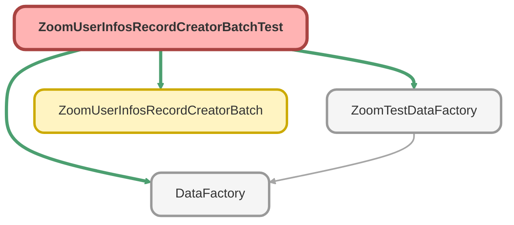

---
hide:
  - path
---

# ZoomUserInfosRecordCreatorBatchTest Class

`ISTEST`

**Implements**

HttpCalloutMock

## Class Diagram



<!-- Apex description -->

## Apex Code

```java
@isTest
private with sharing class ZoomUserInfosRecordCreatorBatchTest implements HttpCalloutMock {

    public HTTPResponse respond(HTTPRequest request) {
		HttpResponse response = new HttpResponse();
		response.setHeader('Content-Type', 'application/json');
		response.setBody(
			'{"next_page_token": "nav48KOj42vYPSG4f0cCdT575bZ980did22","page_size": 30,"total_records": 45,"users": [{"calling_plans": [{"name": "US/CA Metered Calling Plan","type": 100,"billing_account_id": "3WWAEiEjTj2IQuyDiKMd_A","billing_account_name": "Delhi billing"}],"email": "202007160003@testapi.com","extension_id": "V4UobpuxRxCwN_8iNf7k4w","extension_number": 1000001036,"id": "w0RChiauQeqRlv5fgxYULQ","name": "APITA AUTO","phone_user_id": "BOSr0vUiTl61WLR-Q_7bUw","site": {"id": "IjJ2D75SQJit1VdDvkK_mQ","name": "ApiTA_Site_2020_07_12_02_33_45_707"},"status": "activate","phone_numbers": [{"id": "---M1padRvSUtw7YihN7sA","number": "14232058798"}],"department": "Phone department","cost_center": "Phone cost center"}]}'
		);
		response.setStatusCode(200);
		return response;
	}

    @isTest
    static void batchCreatorTest() {
        Test.setMock(HttpCalloutMock.class, new ZoomUserInfosRecordCreatorBatchTest());
        User usr = ZoomTestDataFactory.createUser('System Administrator', '@some.com');
        Test.startTest();
        ZoomUserInfosRecordCreatorBatch batch = new ZoomUserInfosRecordCreatorBatch();
        Id batchId = Database.executeBatch(batch);
        Test.stopTest();
        System.assertEquals(1, [SELECT COUNT() FROM Zoom_Users_Info__c WHERE Email__c LIKE 'testuser%'], 'Zoom_Users_Info__c record should be created');
    }

    @isTest
    static void schedulerTest(){
        Test.setMock(HttpCalloutMock.class, new ZoomUserInfosRecordCreatorBatchTest());
        User usr = ZoomTestDataFactory.createUser('System Administrator', '@some.com');
        Test.startTest();
        ZoomUserInfosRecordCreatorBatch.start(007);
        ZoomUserInfosRecordCreatorBatch.start(1);
        Test.stopTest();
        System.assertEquals(1, [SELECT COUNT() FROM Zoom_Users_Info__c WHERE Email__c LIKE 'testuser%'], 'Zoom_Users_Info__c record should be created');
        System.assertEquals(1, [SELECT COUNT() FROM Zoom_Users_Info__c WHERE Email__c LIKE 'testuser%'], 'Zoom_Users_Info__c record should be created');
    }
}
```

## Methods
### `respond(request)`

#### Signature
```apex
public HTTPResponse respond(HTTPRequest request)
```

#### Parameters
| Name | Type | Description |
|------|------|-------------|
| request | HTTPRequest |  |

#### Return Type
**HTTPResponse**

---

### `batchCreatorTest()`

`ISTEST`

#### Signature
```apex
private static void batchCreatorTest()
```

#### Return Type
**void**

---

### `schedulerTest()`

`ISTEST`

#### Signature
```apex
private static void schedulerTest()
```

#### Return Type
**void**