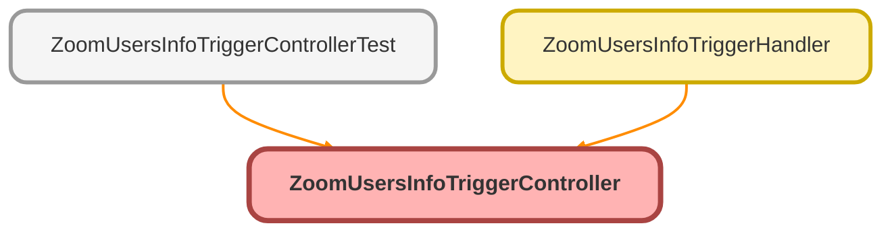

---
hide:
  - path
---

# ZoomUsersInfoTriggerController Class

## Class Diagram



<!-- Apex description -->

## Apex Code

```java
public without sharing class ZoomUsersInfoTriggerController {
	public static void checkZoomUserInfoState(List<Zoom_Users_Info__c> newUsr, List<Zoom_Users_Info__c> oldUsr) {
		DateTime nowGMT = DateTime.now();
		DateTime nowPST = nowGMT.addHours(-8);
		Boolean isWorkingHours = !Test.isRunningTest() ? nowPST.hour() >= 5 && nowPST.hour() <= 18 : true;

		DateTime statusModifiedNew 	= newUsr[0].Status_Updated__c;
		DateTime statusModifiedOld 	= oldUsr[0].Status_Updated__c;
		Integer durationSeconds 	= Integer.valueOf((statusModifiedNew.getTime() - statusModifiedOld.getTime()) / (1000));

		String statusOld 			= oldUsr[0].Presence_Status__c;
		String statusNew 			= newUsr[0].Presence_Status__c;

		DateTime ccStatusModifiedNew 	= newUsr[0].CC_Status_Updated__c;
		DateTime ccStatusModifiedOld 	= oldUsr[0].CC_Status_Updated__c;
		Integer ccDurationSeconds 	= Integer.valueOf((ccStatusModifiedNew.getTime() - ccStatusModifiedOld.getTime()) / (1000));
		String contCenterCurrentStatus 	= newUsr[0].Contact_Center_Status__c;
		String contCenterPreviousStatus = newUsr[0].CC_Prev_Status__c;

		if (isWorkingHours) {
			if (statusOld != statusNew) {
				updateZoomUserState(newUsr[0], durationSeconds, statusOld);
			}
			if (contCenterCurrentStatus != contCenterPreviousStatus) {
				updateContactCenterState(newUsr[0], ccDurationSeconds, contCenterPreviousStatus);
			}
		}
	}

	public static void updateZoomUserState(Zoom_Users_Info__c usr, Integer durationSeconds, String statusOld) {
		switch on statusOld {
			when 'Available' {
				usr.Available__c += durationSeconds;
			}
			when 'Away' {
				usr.Away__c += durationSeconds;
			}
			when 'In_Calendar_Event' {
				usr.In_Calendar_Event__c += durationSeconds;
			}
			when 'In_Meeting' {
				usr.In_Meeting__c += durationSeconds;
			}
			when 'Offline' {
				usr.Offline__c += durationSeconds;
			}
			when 'On_Phone_Call' {
				usr.On_Phone_Call__c += durationSeconds;
			}
			when 'Presenting' {
				usr.Presenting__c += durationSeconds;
			}
			when 'Do_Not_Disturb' {
				usr.Do_Not_Disturb__c += durationSeconds;
			}
		}
	}

	public static void updateContactCenterState(Zoom_Users_Info__c usr, Integer ccDurationSeconds, String previousStatus) {
		switch on previousStatus {
			when 'Ready' {
				usr.Ready__c += ccDurationSeconds;
			}
			when 'Not Ready' {
				usr.Not_Ready__c += ccDurationSeconds;
			}
			when 'Occupied' {
				usr.Occupied__c += ccDurationSeconds;
			}
			when 'Offline' {
				usr.Offline_Status__c += ccDurationSeconds;
			}
		}
	}
}

//  Available__c, Away__c, In_Calendar_Event__c, In_Meeting__c, Offline__c, On_Phone_Call__c, Presenting__c, Do_Not_Disturb__c, Custom_Status__c, Ready__c, Not_Ready__c, Occupied__c, Offline_Status__c, Custom_CC_Status__c
```

## Methods
### `checkZoomUserInfoState(newUsr, oldUsr)`

#### Signature
```apex
public static void checkZoomUserInfoState(List<Zoom_Users_Info__c> newUsr, List<Zoom_Users_Info__c> oldUsr)
```

#### Parameters
| Name | Type | Description |
|------|------|-------------|
| newUsr | List&lt;Zoom_Users_Info__c&gt; |  |
| oldUsr | List&lt;Zoom_Users_Info__c&gt; |  |

#### Return Type
**void**

---

### `updateZoomUserState(usr, durationSeconds, statusOld)`

#### Signature
```apex
public static void updateZoomUserState(Zoom_Users_Info__c usr, Integer durationSeconds, String statusOld)
```

#### Parameters
| Name | Type | Description |
|------|------|-------------|
| usr | [Zoom_Users_Info__c](../objects/Zoom_Users_Info__c.md) |  |
| durationSeconds | Integer |  |
| statusOld | String |  |

#### Return Type
**void**

---

### `updateContactCenterState(usr, ccDurationSeconds, previousStatus)`

#### Signature
```apex
public static void updateContactCenterState(Zoom_Users_Info__c usr, Integer ccDurationSeconds, String previousStatus)
```

#### Parameters
| Name | Type | Description |
|------|------|-------------|
| usr | [Zoom_Users_Info__c](../objects/Zoom_Users_Info__c.md) |  |
| ccDurationSeconds | Integer |  |
| previousStatus | String |  |

#### Return Type
**void**