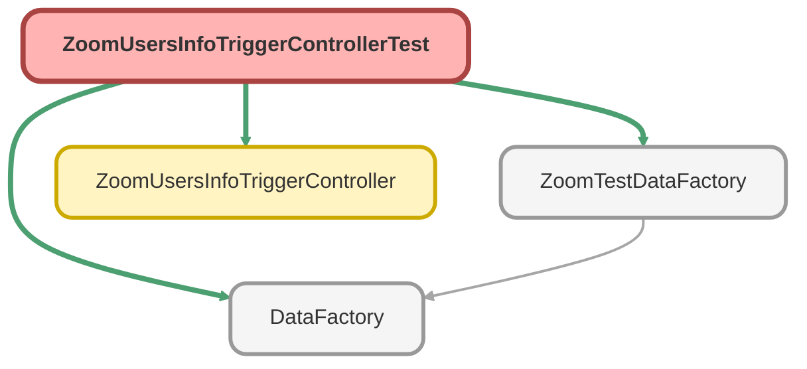

---
hide:
  - path
---

# ZoomUsersInfoTriggerControllerTest Class

`ISTEST`

## Class Diagram



<!-- Apex description -->

## Apex Code

```java
@isTest
private class ZoomUsersInfoTriggerControllerTest {

    @isTest
    private static void zoomUsersTriggerTestMethod(){
        List<Zoom_Users_Info__c> lstUsr = ZoomTestDataFactory.createListZoomUsersInfo(8, 'System Administrator', 'test@myubiquity.com');
        List<String> statuses = new List<String>{'Do_Not_Disturb','Available', 'Away', 'In_Calendar_Event', 'In_Meeting', 'Offline', 'On_Phone_Call', 'Presenting'};

        Test.startTest();
        for(Integer i=0; i<statuses.size(); i++){
            lstUsr[i].Presence_Status__c = statuses[i];
            lstUsr[i].Status_Updated__c = DateTime.now().addHours(1);
            update lstUsr[i];
        }
        Test.stopTest();
        System.assertEquals(8, lstUsr.size(), '8 Zoom Users Info records should be created');
    }
}
```

## Methods
### `zoomUsersTriggerTestMethod()`

`ISTEST`

#### Signature
```apex
private static void zoomUsersTriggerTestMethod()
```

#### Return Type
**void**