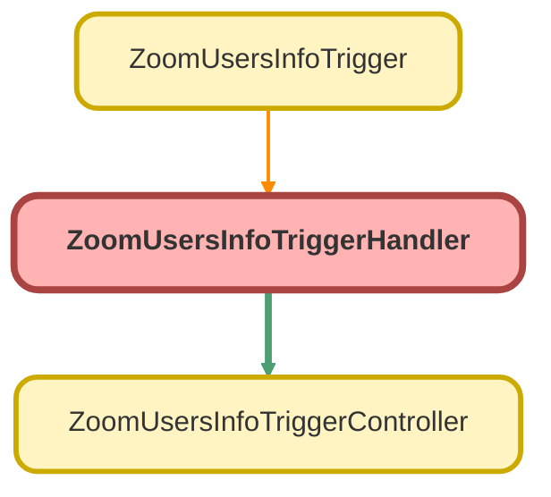

---
hide:
  - path
---

# ZoomUsersInfoTriggerHandler Class

## Class Diagram



<!-- Apex description -->

## Apex Code

```java
public without sharing class ZoomUsersInfoTriggerHandler {
    //NOTE: Create new conditions for the trigger to fire controllers

    public void OnBeforeUpdate(List<Zoom_Users_Info__c> newUsr, List<Zoom_Users_Info__c> oldUsr) {
        ZoomUsersInfoTriggerController.checkZoomUserInfoState(newUsr, oldUsr);
    }
}
```

## Methods
### `OnBeforeUpdate(newUsr, oldUsr)`

#### Signature
```apex
public void OnBeforeUpdate(List<Zoom_Users_Info__c> newUsr, List<Zoom_Users_Info__c> oldUsr)
```

#### Parameters
| Name | Type | Description |
|------|------|-------------|
| newUsr | List&lt;Zoom_Users_Info__c&gt; |  |
| oldUsr | List&lt;Zoom_Users_Info__c&gt; |  |

#### Return Type
**void**