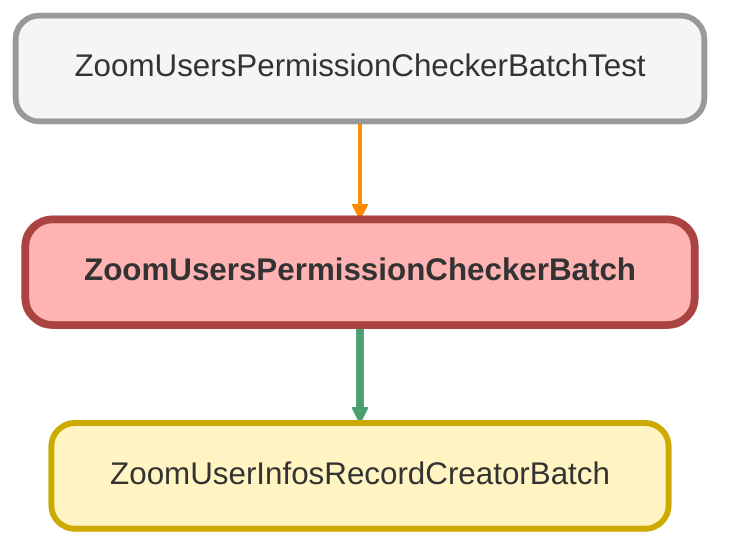

---
hide:
  - path
---

# ZoomUsersPermissionCheckerBatch Class

**Implements**

Database.Batchable&lt;sObject&gt;, 
schedulable

## Class Diagram



<!-- Apex description -->

## Apex Code

```java
public with sharing class ZoomUsersPermissionCheckerBatch implements Database.Batchable<sObject>, schedulable {
    // NOTE: Define names of the Permission Sets
    public static final String CALL_CENTER_PS = 'Zoom_Integration_Call_Center_User_Permission_Set';
    public static final String ADMIN_PS = 'Zoom_Integration_Admin_Permission_Set';
    public static final String MANAGER_PS = 'Zoom_Integration_Manager_Permission_Set';

    public Database.QueryLocator start(Database.BatchableContext bc) {
        String query = 'SELECT Id, Name FROM User WHERE isActive = true AND CallCenterId != null';
        return Database.getQueryLocator(query);
    }

    public void execute(Database.BatchableContext bc, List<User> scope) {
        List<PermissionSetAssignment> permissionSetAssignments = [SELECT AssigneeId, PermissionSet.Name FROM PermissionSetAssignment WHERE AssigneeId IN :scope];
        List<String> permissionSetNames = new List<String>{ CALL_CENTER_PS, ADMIN_PS, MANAGER_PS };
        PermissionSet callCenterPermSetId = [SELECT Id FROM PermissionSet WHERE Name = :CALL_CENTER_PS LIMIT 1];

        // NOTE: Get all users with permission sets
        Set<Id> usersWithPermissionSets = new Set<Id>();
        for (PermissionSetAssignment assignment : permissionSetAssignments) {
            if (permissionSetNames.contains(assignment.PermissionSet.Name)) {
                usersWithPermissionSets.add(assignment.AssigneeId);
            }
        }

        // NOTE: Get all users without permission sets
        List<User> usersWithoutPermissionSets = new List<User>();
        for (User usr : scope) {
            if (!usersWithPermissionSets.contains(usr.Id)) {
                usersWithoutPermissionSets.add(usr);
            }
        }

        // NOTE: Assign permission sets to users without defined permission sets
        List<PermissionSetAssignment> psaList = new List<PermissionSetAssignment>();
        for (User u : usersWithoutPermissionSets) {
            PermissionSetAssignment psa = new PermissionSetAssignment(PermissionSetId = callCenterPermSetId.id, AssigneeId = u.Id);
            psaList.add(psa);
        }
        insert psaList;
    }

    public void finish(Database.BatchableContext bc) {
        // NOTE: Execute next batch
        if(!Test.isRunningTest())Database.executeBatch(new ZoomUserInfosRecordCreatorBatch(), 50);
    }

    //NOTE: Schedule interface
    public static void start(Integer hour) {
        string jobName = 'Check Zoom Users Permission Sets';
        if (hour == 007){
            Database.executeBatch(new ZoomUsersPermissionCheckerBatch(), 50);
        }
        else {
            jobName = jobName += ' - ' + datetime.now().format();
            String cron = '0 0 ' + string.valueof(hour) + ' ? * MON-FRI'; // NOTE: Execute From Monday - Friday
            system.schedule(jobName, cron, new ZoomUsersPermissionCheckerBatch());
        }
    }
    public void execute(SchedulableContext SC) {
        database.executeBatch(new ZoomUsersPermissionCheckerBatch(), 50);
    }
}
```

## Fields
### `CALL_CENTER_PS`

#### Signature
```apex
public static final CALL_CENTER_PS
```

#### Type
String

---

### `ADMIN_PS`

#### Signature
```apex
public static final ADMIN_PS
```

#### Type
String

---

### `MANAGER_PS`

#### Signature
```apex
public static final MANAGER_PS
```

#### Type
String

## Methods
### `start(bc)`

#### Signature
```apex
public Database.QueryLocator start(Database.BatchableContext bc)
```

#### Parameters
| Name | Type | Description |
|------|------|-------------|
| bc | Database.BatchableContext |  |

#### Return Type
**Database.QueryLocator**

---

### `execute(bc, scope)`

#### Signature
```apex
public void execute(Database.BatchableContext bc, List<User> scope)
```

#### Parameters
| Name | Type | Description |
|------|------|-------------|
| bc | Database.BatchableContext |  |
| scope | List&lt;User&gt; |  |

#### Return Type
**void**

---

### `finish(bc)`

#### Signature
```apex
public void finish(Database.BatchableContext bc)
```

#### Parameters
| Name | Type | Description |
|------|------|-------------|
| bc | Database.BatchableContext |  |

#### Return Type
**void**

---

### `start(hour)`

#### Signature
```apex
public static void start(Integer hour)
```

#### Parameters
| Name | Type | Description |
|------|------|-------------|
| hour | Integer |  |

#### Return Type
**void**

---

### `execute(SC)`

#### Signature
```apex
public void execute(SchedulableContext SC)
```

#### Parameters
| Name | Type | Description |
|------|------|-------------|
| SC | SchedulableContext |  |

#### Return Type
**void**