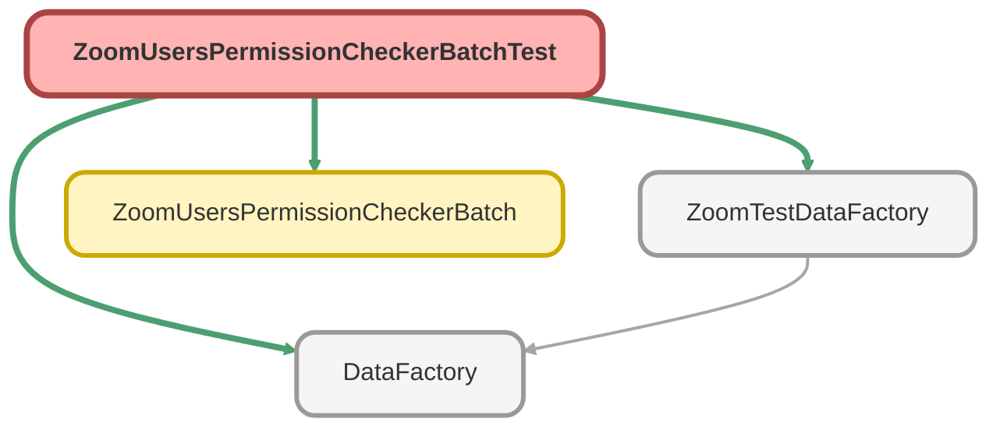

---
hide:
  - path
---

# ZoomUsersPermissionCheckerBatchTest Class

`ISTEST`

## Class Diagram



<!-- Apex description -->

## Apex Code

```java
@isTest
public with sharing class ZoomUsersPermissionCheckerBatchTest {

    @isTest
    static void testBatch() {
        User usr = ZoomTestDataFactory.createUser('System Administrator', '@some.com');
        Test.startTest();
        ZoomUsersPermissionCheckerBatch.start(0);
        ZoomUsersPermissionCheckerBatch.start(007);
        Test.stopTest();
        System.assertEquals(1, [SELECT COUNT() FROM User WHERE Email LIKE 'testuser%'], 'User record should be created');
    }

}
```

## Methods
### `testBatch()`

`ISTEST`

#### Signature
```apex
private static void testBatch()
```

#### Return Type
**void**