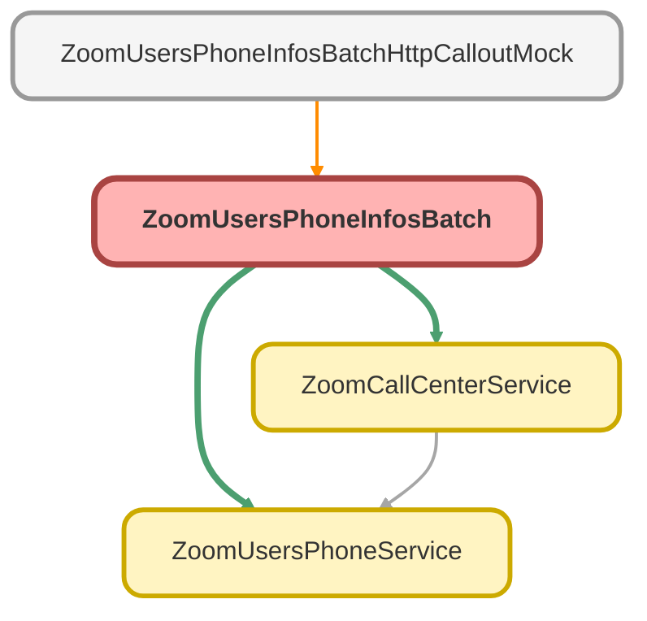

---
hide:
  - path
---

# ZoomUsersPhoneInfosBatch Class

**Implements**

Database.Batchable&lt;sObject&gt;, 
Database.AllowsCallouts, 
schedulable

## Class Diagram



<!-- Apex description -->

## Apex Code

```java
public with sharing class ZoomUsersPhoneInfosBatch implements Database.Batchable<sObject>, Database.AllowsCallouts, schedulable {
	public Database.QueryLocator start(Database.BatchableContext BC) {
		String query = 'SELECT Id, Name, Email__c, Zoom_User_Id__c FROM Zoom_Users_Info__c WHERE CreatedDate = TODAY';
		return Database.getQueryLocator(query);
	}

	public void execute(Database.BatchableContext BC, List<Zoom_Users_Info__c> scope) {
		List<Zoom_Phone_Calls_Info__c> resultCallsList = new List<Zoom_Phone_Calls_Info__c>();
		for (Zoom_Users_Info__c usr : scope) {
			List<Zoom_Phone_Calls_Info__c> userCallsList = ZoomUsersPhoneService.getPhoneCalls(usr.email__c, usr);
			if (userCallsList != null && !userCallsList.isEmpty()) {
				resultCallsList.addAll(userCallsList);
			}
		}
        if(!Test.isRunningTest()){
            List<Zoom_Phone_Calls_Info__c> callCenterCallsList = ZoomCallCenterService.createCallCenterCalls(scope);
		    if (callCenterCallsList != null && !callCenterCallsList.isEmpty()) {
		    	resultCallsList.addAll(callCenterCallsList);
		    }
        }

		if (!resultCallsList.isEmpty()) {
			insert resultCallsList;
		}
	}

	public void finish(Database.BatchableContext BC) {
		System.debug(LoggingLevel.INFO, 'ZoomUsersPhoneInfosBatch finished');
	}

	public static void start(Integer mins) {
		string jobName = 'Zoom Phone Calls updater job - ';
		if (mins == 7)
			Database.executeBatch(new ZoomUsersPhoneInfosBatch(), 50);
		else {
			jobName = jobName += mins + ' - ' + DateTime.now().format();
			String sch = '0 ' + String.valueof(mins) + ' 5-18 ? * MON-FRI *';
			System.schedule(jobName, sch, new ZoomUsersPhoneInfosBatch());
		}
	}
	public void execute(SchedulableContext SC) {
		Database.executeBatch(new ZoomUsersPhoneInfosBatch(), 50);
	}
}

//Start all batches every 10 minutes
// ZoomUsersPhoneInfosBatch.start(0);
// ZoomUsersPhoneInfosBatch.start(10);
// ZoomUsersPhoneInfosBatch.start(20);
// ZoomUsersPhoneInfosBatch.start(30);
// ZoomUsersPhoneInfosBatch.start(40);
// ZoomUsersPhoneInfosBatch.start(50);

//Id batchJobId = Database.executeBatch(new ZoomUsersPhoneInfosBatch(), 10);
```

## Methods
### `start(BC)`

#### Signature
```apex
public Database.QueryLocator start(Database.BatchableContext BC)
```

#### Parameters
| Name | Type | Description |
|------|------|-------------|
| BC | Database.BatchableContext |  |

#### Return Type
**Database.QueryLocator**

---

### `execute(BC, scope)`

#### Signature
```apex
public void execute(Database.BatchableContext BC, List<Zoom_Users_Info__c> scope)
```

#### Parameters
| Name | Type | Description |
|------|------|-------------|
| BC | Database.BatchableContext |  |
| scope | List&lt;Zoom_Users_Info__c&gt; |  |

#### Return Type
**void**

---

### `finish(BC)`

#### Signature
```apex
public void finish(Database.BatchableContext BC)
```

#### Parameters
| Name | Type | Description |
|------|------|-------------|
| BC | Database.BatchableContext |  |

#### Return Type
**void**

---

### `start(mins)`

#### Signature
```apex
public static void start(Integer mins)
```

#### Parameters
| Name | Type | Description |
|------|------|-------------|
| mins | Integer |  |

#### Return Type
**void**

---

### `execute(SC)`

#### Signature
```apex
public void execute(SchedulableContext SC)
```

#### Parameters
| Name | Type | Description |
|------|------|-------------|
| SC | SchedulableContext |  |

#### Return Type
**void**