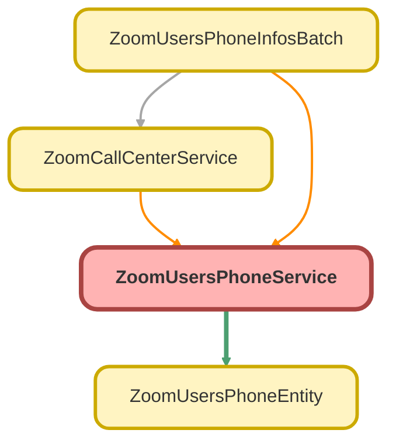

---
hide:
  - path
---

# ZoomUsersPhoneService Class

## Class Diagram



<!-- Apex description -->

## Apex Code

```java
public with sharing class ZoomUsersPhoneService {

    public static List<Zoom_Phone_Calls_Info__c> getPhoneCalls(String email, Zoom_Users_Info__c usr){
        List<Zoom_Phone_Calls_Info__c> resultCallsList = new List<Zoom_Phone_Calls_Info__c>();
        HttpResponse response = zoomPhoneCallsCallout(email);
        if (response.getStatusCode() == 200) {
            resultCallsList = createZoomPhoneCalls(response.getBody(), usr);
        }
        return resultCallsList;
    }

    public static HttpResponse zoomPhoneCallsCallout(String email){
        String address = 'callout:ZoomPhone/phone/users/' + email + '/call_logs';
        DateTime lastHour = DateTime.now().addHours(-1);
        String fromStr = lastHour.formatGMT('YYYY-MM-dd\'T\'HH:mm:ss\'Z\'');
        String toStr = DateTime.now().formatGMT('YYYY-MM-dd\'T\'HH:mm:ss\'Z\'');
        String fromTime = '?from=' + fromStr;
        String toTime = '&to=' + toStr;

        String pageSize = '&page_size=300';
        String url = address + fromTime + toTime + pageSize;

        HttpRequest req = new HttpRequest();
        req.setMethod('GET');
        req.setHeader('Content-type', 'application/json');
        req.setEndpoint(url);
        Http http = new Http();
        HttpResponse response = http.send(req);
        return response;
    }

    public static List<Zoom_Phone_Calls_Info__c> createZoomPhoneCalls(String resBody, Zoom_Users_Info__c usr){
        String recordTypeName = 'Phone Users';
        Id recordTypeId = Schema.SObjectType.Zoom_Phone_Calls_Info__c.getRecordTypeInfosByName().get(recordTypeName).getRecordTypeId();
        Map<String, Zoom_Phone_Calls_Info__c> callsIdZoomInfoMap = new Map<String, Zoom_Phone_Calls_Info__c>();

        ZoomUsersPhoneEntity wrappedResponse = ZoomUsersPhoneEntity.parse(resBody);
            if (wrappedResponse.total_records != null && wrappedResponse.total_records != 0) {
                for (ZoomUsersPhoneEntity.cls_call_logs val : wrappedResponse.call_logs) {
                    Zoom_Phone_Calls_Info__c call = new Zoom_Phone_Calls_Info__c();
                    call.Name                               = usr.name;
                    call.Zoom_Users_Info__c                 = usr.id;
                    call.Email__c                           = usr.email__c;
                    call.RecordTypeId                       = recordTypeId;
                    call.Call_Type__c                       = recordTypeName;

                    call.Call_Date_Time__c                  = val.date_time;
                    call.Call_Id__c                         = val.call_id;
                    call.caller_name__c                     = val.caller_name;
                    call.caller_number__c                   = val.caller_number;
                    call.Caller_Number_Source__c            = val.calleer_number_source;
                    call.Callee_Number_Source__c            = val.callee_number_source;
                    call.Callee_Name__c                     = val.callee_number_source;
                    call.Callee_Number__c                   = val.callee_number;
                    call.Callee_Location__c                 = val.callee_location;
                    call.Call_Result__c                     = val.result;
                    call.has_recording__c                   = val.recording_type != null ? true : false;
                    call.recording_Id__c                    = val.recording_id != null ? val.recording_id : null;
                    // call.Call_Direction__c                  = val.direction;
                    // call.Duration__c                        = val.duration;

                    if (val.direction == 'inbound') {
                        call.Inbound_Call__c                = val.direction;
                        call.Inbound_Call_Duration__c       = val.duration;
                        call.Waiting_Time__c                = val.waiting_time;
                        call.Hold_Time__c                   = val.hold_time;

                    } else if (val.direction == 'outbound') {
                        call.Outbound_Call__c               = val.direction;
                        call.Outbound_Call_Duration__c      = val.duration;
                    }
                    callsIdZoomInfoMap.put(call.Call_Id__c, call);
                }
            }
            List<Zoom_Phone_Calls_Info__c> resultCallsList = checkDuplicatePhoneCalls(callsIdZoomInfoMap);
            return resultCallsList;
    }

    public static List<Zoom_Phone_Calls_Info__c> checkDuplicatePhoneCalls(Map<String, Zoom_Phone_Calls_Info__c> callMap){
        Map<String, Zoom_Phone_Calls_Info__c> orgCallsMap = new Map<String, Zoom_Phone_Calls_Info__c>();
        for (Zoom_Phone_Calls_Info__c calls : [SELECT z.Call_Id__c,
                                                      z.id,
                                                      Name,
                                                      Call_Date_Time__c
                                               FROM Zoom_Phone_Calls_Info__c z
                                               WHERE CreatedDate = TODAY]) {
            orgCallsMap.put(calls.Call_Id__c, calls);
        }

        Map<String, Zoom_Phone_Calls_Info__c> resultMap = new Map<String, Zoom_Phone_Calls_Info__c>();
        for (String m : callMap.keySet()) {
            if (!orgCallsMap.containsKey(m)) resultMap.put(m, callMap.get(m));
        }

        List<Zoom_Phone_Calls_Info__c> resultCallsList = new List<Zoom_Phone_Calls_Info__c>();
        for (Zoom_Phone_Calls_Info__c i : resultMap.values()) {
            resultCallsList.add(i);
        }
        return resultCallsList;
    }
}
```

## Methods
### `getPhoneCalls(email, usr)`

#### Signature
```apex
public static List<Zoom_Phone_Calls_Info__c> getPhoneCalls(String email, Zoom_Users_Info__c usr)
```

#### Parameters
| Name | Type | Description |
|------|------|-------------|
| email | String |  |
| usr | [Zoom_Users_Info__c](../objects/Zoom_Users_Info__c.md) |  |

#### Return Type
**List&lt;Zoom_Phone_Calls_Info__c&gt;**

---

### `zoomPhoneCallsCallout(email)`

#### Signature
```apex
public static HttpResponse zoomPhoneCallsCallout(String email)
```

#### Parameters
| Name | Type | Description |
|------|------|-------------|
| email | String |  |

#### Return Type
**HttpResponse**

---

### `createZoomPhoneCalls(resBody, usr)`

#### Signature
```apex
public static List<Zoom_Phone_Calls_Info__c> createZoomPhoneCalls(String resBody, Zoom_Users_Info__c usr)
```

#### Parameters
| Name | Type | Description |
|------|------|-------------|
| resBody | String |  |
| usr | [Zoom_Users_Info__c](../objects/Zoom_Users_Info__c.md) |  |

#### Return Type
**List&lt;Zoom_Phone_Calls_Info__c&gt;**

---

### `checkDuplicatePhoneCalls(callMap)`

#### Signature
```apex
public static List<Zoom_Phone_Calls_Info__c> checkDuplicatePhoneCalls(Map<String,Zoom_Phone_Calls_Info__c> callMap)
```

#### Parameters
| Name | Type | Description |
|------|------|-------------|
| callMap | Map&lt;String,Zoom_Phone_Calls_Info__c&gt; |  |

#### Return Type
**List&lt;Zoom_Phone_Calls_Info__c&gt;**