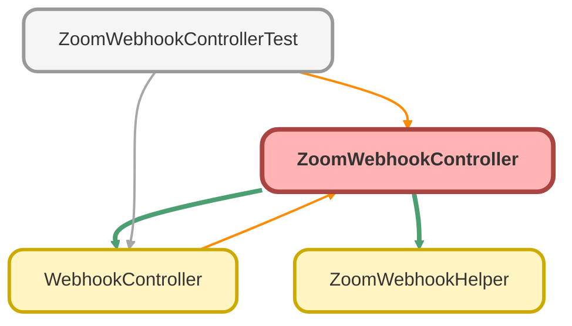

---
hide:
  - path
---

# ZoomWebhookController Class

## Class Diagram



<!-- Apex description -->

## Apex Code

```java
public without sharing class ZoomWebhookController {
	static final String PRESENCE_STATUS 					= 'user.presence_status_updated';
	static final String USER_SIGNED_IN 						= 'user.signed_in';
	static final String USER_SIGNED_OUT 					= 'user.signed_out';

	static final String CONTACT_CENTER_USER_LOGIN 			= 'contact_center.user_login';
	static final String CONTACT_CENTER_USER_LOGOUT 			= 'contact_center.user_logout';
	static final String CONTACT_CENTER_USER_STATUS_CHANGED 	= 'contact_center.user_status_changed';

	public static void checkZoomEvent(Map<String, Object> resp) {
		String jsonString = JSON.serialize(resp);
		ZoomWebhookHelper.ResponseWrapper wrapper = ZoomWebhookHelper.populateWrapper(jsonString);
		String event            = wrapper.event;
		String email            = wrapper.payload.obj.email;
		String ccEmail          = wrapper.payload.obj.user_email;
		String status           = wrapper.payload.obj.presence_status;
		String ccStatus         = wrapper.payload.obj.current_status_name;
		String ccSubStatus      = wrapper.payload.obj.current_sub_status_name;
		String ccPrevStatus     = wrapper.payload.obj.previous_status_name;
		String ccPrevSubStatus  = wrapper.payload.obj.previous_sub_status_name;
		DateTime lastChanged    = wrapper.payload.obj.date_time;

		if (event == PRESENCE_STATUS) {
			ZoomWebhookHelper.presenceStatusUpdated(email, status, lastChanged);
		}
		 if (event == USER_SIGNED_IN || event == USER_SIGNED_OUT) {
			ZoomWebhookHelper.userLogIn(email, lastChanged);
		}
		 if (event == USER_SIGNED_OUT) {
			ZoomWebhookHelper.userLogOut(email, lastChanged);
		}
		 if (event == CONTACT_CENTER_USER_LOGIN) {
			ZoomWebhookHelper.contactCenterUserLogin(ccEmail, lastChanged);
		}
		 if (event == CONTACT_CENTER_USER_LOGOUT) {
			ZoomWebhookHelper.contactCenterUserLogout(ccEmail, lastChanged);
		}
		 if (event == CONTACT_CENTER_USER_STATUS_CHANGED) {
			ZoomWebhookHelper.contactCenterUserStatusChanged(ccEmail, ccStatus, ccSubStatus, ccPrevStatus, ccPrevSubStatus, lastChanged);
		}
	}
}
```

## Fields
### `PRESENCE_STATUS`

#### Signature
```apex
private static final PRESENCE_STATUS
```

#### Type
String

---

### `USER_SIGNED_IN`

#### Signature
```apex
private static final USER_SIGNED_IN
```

#### Type
String

---

### `USER_SIGNED_OUT`

#### Signature
```apex
private static final USER_SIGNED_OUT
```

#### Type
String

---

### `CONTACT_CENTER_USER_LOGIN`

#### Signature
```apex
private static final CONTACT_CENTER_USER_LOGIN
```

#### Type
String

---

### `CONTACT_CENTER_USER_LOGOUT`

#### Signature
```apex
private static final CONTACT_CENTER_USER_LOGOUT
```

#### Type
String

---

### `CONTACT_CENTER_USER_STATUS_CHANGED`

#### Signature
```apex
private static final CONTACT_CENTER_USER_STATUS_CHANGED
```

#### Type
String

## Methods
### `checkZoomEvent(resp)`

#### Signature
```apex
public static void checkZoomEvent(Map<String,Object> resp)
```

#### Parameters
| Name | Type | Description |
|------|------|-------------|
| resp | Map&lt;String,Object&gt; |  |

#### Return Type
**void**