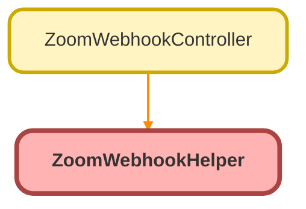

---
hide:
  - path
---

# ZoomWebhookHelper Class

## Class Diagram



<!-- Apex description -->

## Apex Code

```java
public without sharing class ZoomWebhookHelper {
    public static void presenceStatusUpdated(String email,String status,DateTime lastChanged) {
		List<Zoom_Users_Info__c> userList = getZoomUser(email);
		if (userList.size() > 0 && !userList.isEmpty()) {
			userList[0].Presence_Status__c = status;
			userList[0].Status_Updated__c = lastChanged;
			update userList;
		}
	}

	public static void userLogIn(String email, DateTime lastChanged) {
		List<Zoom_Users_Info__c> userList = getZoomUser(email);
		if (userList.size() > 0) {
			userList[0].LogIn__c = userList[0].LogIn__c == null ? lastChanged :  userList[0].LogIn__c; // TODO
			userList[0].Presence_Status__c = 'Available';
		}
		update userList;
	}

	public static void userLogOut(String email, DateTime lastChanged) {
		List<Zoom_Users_Info__c> userList = getZoomUser(email);
		if (userList.size() > 0) {
			userList[0].Presence_Status__c = 'Offline';
			userList[0].LogOut__c = lastChanged;
		}
		update userList;
	}

	public static void contactCenterUserLogin(String ccEmail, DateTime lastChanged) {

		List<Zoom_Users_Info__c> userList = getZoomUser(ccEmail);
        if (userList.size() > 0) {
            userList[0].Contact_Center_Status__c = 'Not Ready';
            userList[0].Contact_Center_Sub_Status__c = 'Forced';
            userList[0].User_Log_In__c = userList[0].User_Log_In__c == null ? lastChanged : userList[0].User_Log_In__c;
        }
        update userList;
	}
	public static void contactCenterUserLogout(String ccEmail, DateTime lastChanged) {
		List<Zoom_Users_Info__c> userList = getZoomUser(ccEmail);
        if (userList.size() > 0) {
            userList[0].Contact_Center_Status__c = 'Offline';
			userList[0].Contact_Center_Sub_Status__c = null;
            userList[0].User_Log_Out__c = lastChanged;
        }
        update userList;
	}

	public static void contactCenterUserStatusChanged(String ccEmail, String ccStatus, String ccSubStatus, String ccPrevStatus, String ccPrevSubStatus, DateTime lastChanged) {

		List<Zoom_Users_Info__c> userList = getZoomUser(ccEmail);
        if (userList.size() > 0) {
			userList[0].Contact_Center_Status__c     = ccStatus;
			userList[0].Contact_Center_Sub_Status__c = ccStatus == 'Not Ready' ? ccSubStatus : null;
			userList[0].CC_Prev_Status__c            = ccPrevStatus;
			userList[0].CC_Prev_Sub_Status__c        = ccPrevSubStatus;
			userList[0].CC_Status_Updated__c         = lastChanged;
		}
        update userList;
	}

	public static List<Zoom_Users_Info__c> getZoomUser(String email) {
		DateTime nowGMT = DateTime.now();
		DateTime nowPST = nowGMT.addHours(-8);
		Date pstDate = Date.newInstance(nowPST.year(),nowPST.month(),nowPST.day());

		String query = 'SELECT Id, Email__c, Presence_Status__c, Contact_Center_Status__c,Contact_Center_Sub_Status__c, CC_Prev_Status__c, CC_Prev_Sub_Status__c, Status_Updated__c, LogIn__c, LogOut__c, User_Log_In__c, User_Log_Out__c FROM Zoom_Users_Info__c';
		String qWhere = ' WHERE Email__c = \'';
		String qLimit = '\' AND Tracking_Date__c = :pstDate LIMIT 1';

		List<Zoom_Users_Info__c> userList = !Test.isRunningTest()
			? Database.query(query + qWhere + email + qLimit)
			: Database.query(query + qWhere + email + '\'');
		return userList;
	}

	public static ResponseWrapper populateWrapper(String jsonString) {
		String jsonStr = jsonString.replace('"object":', '"obj":');
		return (ResponseWrapper) JSON.deserialize(jsonStr,ResponseWrapper.class);
	}

	public class ResponseWrapper {
		public String event { get; set; }
		public String event_ts { get; set; }
		public PayloadWrapper payload { get; set; }
	}
	public class PayloadWrapper {
		public String account_id { get; set; }
		public ObjectWrapper obj { get; set; }
	}
	public class ObjectWrapper {
		public String user_id { get; set; }
		public String display_name { get; set; }
		public String user_email { get; set; }
		public String previous_status_id { get; set; }
		public String previous_status_name { get; set; }
		public String previous_sub_status_id { get; set; }
		public String previous_sub_status_name { get; set; }
		public String current_status_id { get; set; }
		public String current_status_name { get; set; }
		public String current_sub_status_id { get; set; }
		public String current_sub_status_name { get; set; }
		public String presence_status { get; set; }
		public String email { get; set; }
		public String id { get; set; }
		public DateTime date_time { get; set; }
	}
}
```

## Methods
### `presenceStatusUpdated(email, status, lastChanged)`

#### Signature
```apex
public static void presenceStatusUpdated(String email, String status, DateTime lastChanged)
```

#### Parameters
| Name | Type | Description |
|------|------|-------------|
| email | String |  |
| status | String |  |
| lastChanged | DateTime |  |

#### Return Type
**void**

---

### `userLogIn(email, lastChanged)`

#### Signature
```apex
public static void userLogIn(String email, DateTime lastChanged)
```

#### Parameters
| Name | Type | Description |
|------|------|-------------|
| email | String |  |
| lastChanged | DateTime |  |

#### Return Type
**void**

---

### `userLogOut(email, lastChanged)`

#### Signature
```apex
public static void userLogOut(String email, DateTime lastChanged)
```

#### Parameters
| Name | Type | Description |
|------|------|-------------|
| email | String |  |
| lastChanged | DateTime |  |

#### Return Type
**void**

---

### `contactCenterUserLogin(ccEmail, lastChanged)`

#### Signature
```apex
public static void contactCenterUserLogin(String ccEmail, DateTime lastChanged)
```

#### Parameters
| Name | Type | Description |
|------|------|-------------|
| ccEmail | String |  |
| lastChanged | DateTime |  |

#### Return Type
**void**

---

### `contactCenterUserLogout(ccEmail, lastChanged)`

#### Signature
```apex
public static void contactCenterUserLogout(String ccEmail, DateTime lastChanged)
```

#### Parameters
| Name | Type | Description |
|------|------|-------------|
| ccEmail | String |  |
| lastChanged | DateTime |  |

#### Return Type
**void**

---

### `contactCenterUserStatusChanged(ccEmail, ccStatus, ccSubStatus, ccPrevStatus, ccPrevSubStatus, lastChanged)`

#### Signature
```apex
public static void contactCenterUserStatusChanged(String ccEmail, String ccStatus, String ccSubStatus, String ccPrevStatus, String ccPrevSubStatus, DateTime lastChanged)
```

#### Parameters
| Name | Type | Description |
|------|------|-------------|
| ccEmail | String |  |
| ccStatus | String |  |
| ccSubStatus | String |  |
| ccPrevStatus | String |  |
| ccPrevSubStatus | String |  |
| lastChanged | DateTime |  |

#### Return Type
**void**

---

### `getZoomUser(email)`

#### Signature
```apex
public static List<Zoom_Users_Info__c> getZoomUser(String email)
```

#### Parameters
| Name | Type | Description |
|------|------|-------------|
| email | String |  |

#### Return Type
**List&lt;Zoom_Users_Info__c&gt;**

---

### `populateWrapper(jsonString)`

#### Signature
```apex
public static ResponseWrapper populateWrapper(String jsonString)
```

#### Parameters
| Name | Type | Description |
|------|------|-------------|
| jsonString | String |  |

#### Return Type
**ResponseWrapper**

## Classes
### ResponseWrapper Class

#### Properties
##### `event`

###### Signature
```apex
public event
```

###### Type
String

---

##### `event_ts`

###### Signature
```apex
public event_ts
```

###### Type
String

---

##### `payload`

###### Signature
```apex
public payload
```

###### Type
PayloadWrapper

### PayloadWrapper Class

#### Properties
##### `account_id`

###### Signature
```apex
public account_id
```

###### Type
String

---

##### `obj`

###### Signature
```apex
public obj
```

###### Type
ObjectWrapper

### ObjectWrapper Class

#### Properties
##### `user_id`

###### Signature
```apex
public user_id
```

###### Type
String

---

##### `display_name`

###### Signature
```apex
public display_name
```

###### Type
String

---

##### `user_email`

###### Signature
```apex
public user_email
```

###### Type
String

---

##### `previous_status_id`

###### Signature
```apex
public previous_status_id
```

###### Type
String

---

##### `previous_status_name`

###### Signature
```apex
public previous_status_name
```

###### Type
String

---

##### `previous_sub_status_id`

###### Signature
```apex
public previous_sub_status_id
```

###### Type
String

---

##### `previous_sub_status_name`

###### Signature
```apex
public previous_sub_status_name
```

###### Type
String

---

##### `current_status_id`

###### Signature
```apex
public current_status_id
```

###### Type
String

---

##### `current_status_name`

###### Signature
```apex
public current_status_name
```

###### Type
String

---

##### `current_sub_status_id`

###### Signature
```apex
public current_sub_status_id
```

###### Type
String

---

##### `current_sub_status_name`

###### Signature
```apex
public current_sub_status_name
```

###### Type
String

---

##### `presence_status`

###### Signature
```apex
public presence_status
```

###### Type
String

---

##### `email`

###### Signature
```apex
public email
```

###### Type
String

---

##### `id`

###### Signature
```apex
public id
```

###### Type
String

---

##### `date_time`

###### Signature
```apex
public date_time
```

###### Type
DateTime