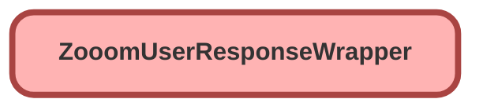

---
hide:
  - path
---

# ZooomUserResponseWrapper Class

## Class Diagram



<!-- Apex description -->

## Apex Code

```java
public with sharing class ZooomUserResponseWrapper {
	public String next_page_token;	//
	public Integer page_size;	//30
	public Integer total_records;	//7
	public String frm;	//2022-12-10
	public String to;	//2022-12-11
	public List<cls_call_logs> call_logs;
	public class cls_call_logs {
		public String id;	//1239d685-902c-414f-9676-3b53cebccde6
		public String call_type;	//pstn
		public String caller_number;	//3787 +
		public Integer caller_number_type;	//1
		public String caller_name;	//Jay Jacob +
		public String callee_number;	//+13109410034 !
		public String callee_name; // ?
		public Integer callee_number_type;	//2
		public String callee_number_source;	//internal !
		public String calleer_number_source; // ?
		public String callee_location;	//California !
		public String direction;	//outbound
		public Integer duration;	//38
		public String result;	//Call connected
		public DateTime date_time;	//2022-12-10T00:43:05Z
		public Integer waiting_time; // 17
		public Integer hold_time; // 5
		public boolean has_recording;
		public boolean has_voicemail;
		public String call_id;	//7175314034216187889
		public String caller_did_number;	//+14157663787
		public String caller_country_code;	//1
		public String caller_country_iso_code;	//US
		public String callee_did_number;	//+13109410034
		public String callee_country_code;	//1
		public String callee_country_iso_code;	//US
		public DateTime call_end_time;	//2022-12-10T00:43:50Z
		public String department;	//
		public String cost_center;	//
		public String recording_type;
		public cls_forwarded_by forwarded_by;
		public String recording_id;
	}
	class cls_forwarded_by {
		public String name;	//CE Employer Q
		public String extension_type;	//callQueue
		public String extension_number;	//5170
	}
	public static ZooomUserResponseWrapper parse(String json){
		return (ZooomUserResponseWrapper) System.JSON.deserialize(json, ZooomUserResponseWrapper.class);
	}
}
```

## Fields
### `next_page_token`

#### Signature
```apex
public next_page_token
```

#### Type
String

---

### `page_size`

#### Signature
```apex
public page_size
```

#### Type
Integer

---

### `total_records`

#### Signature
```apex
public total_records
```

#### Type
Integer

---

### `frm`

#### Signature
```apex
public frm
```

#### Type
String

---

### `to`

#### Signature
```apex
public to
```

#### Type
String

---

### `call_logs`

#### Signature
```apex
public call_logs
```

#### Type
List&lt;cls_call_logs&gt;

## Methods
### `parse(json)`

#### Signature
```apex
public static ZooomUserResponseWrapper parse(String json)
```

#### Parameters
| Name | Type | Description |
|------|------|-------------|
| json | String |  |

#### Return Type
**[ZooomUserResponseWrapper](ZooomUserResponseWrapper.md)**

## Classes
### cls_call_logs Class

#### Fields
##### `id`

###### Signature
```apex
public id
```

###### Type
String

---

##### `call_type`

###### Signature
```apex
public call_type
```

###### Type
String

---

##### `caller_number`

###### Signature
```apex
public caller_number
```

###### Type
String

---

##### `caller_number_type`

###### Signature
```apex
public caller_number_type
```

###### Type
Integer

---

##### `caller_name`

###### Signature
```apex
public caller_name
```

###### Type
String

---

##### `callee_number`

###### Signature
```apex
public callee_number
```

###### Type
String

---

##### `callee_name`

###### Signature
```apex
public callee_name
```

###### Type
String

---

##### `callee_number_type`

###### Signature
```apex
public callee_number_type
```

###### Type
Integer

---

##### `callee_number_source`

###### Signature
```apex
public callee_number_source
```

###### Type
String

---

##### `calleer_number_source`

###### Signature
```apex
public calleer_number_source
```

###### Type
String

---

##### `callee_location`

###### Signature
```apex
public callee_location
```

###### Type
String

---

##### `direction`

###### Signature
```apex
public direction
```

###### Type
String

---

##### `duration`

###### Signature
```apex
public duration
```

###### Type
Integer

---

##### `result`

###### Signature
```apex
public result
```

###### Type
String

---

##### `date_time`

###### Signature
```apex
public date_time
```

###### Type
DateTime

---

##### `waiting_time`

###### Signature
```apex
public waiting_time
```

###### Type
Integer

---

##### `hold_time`

###### Signature
```apex
public hold_time
```

###### Type
Integer

---

##### `has_recording`

###### Signature
```apex
public has_recording
```

###### Type
boolean

---

##### `has_voicemail`

###### Signature
```apex
public has_voicemail
```

###### Type
boolean

---

##### `call_id`

###### Signature
```apex
public call_id
```

###### Type
String

---

##### `caller_did_number`

###### Signature
```apex
public caller_did_number
```

###### Type
String

---

##### `caller_country_code`

###### Signature
```apex
public caller_country_code
```

###### Type
String

---

##### `caller_country_iso_code`

###### Signature
```apex
public caller_country_iso_code
```

###### Type
String

---

##### `callee_did_number`

###### Signature
```apex
public callee_did_number
```

###### Type
String

---

##### `callee_country_code`

###### Signature
```apex
public callee_country_code
```

###### Type
String

---

##### `callee_country_iso_code`

###### Signature
```apex
public callee_country_iso_code
```

###### Type
String

---

##### `call_end_time`

###### Signature
```apex
public call_end_time
```

###### Type
DateTime

---

##### `department`

###### Signature
```apex
public department
```

###### Type
String

---

##### `cost_center`

###### Signature
```apex
public cost_center
```

###### Type
String

---

##### `recording_type`

###### Signature
```apex
public recording_type
```

###### Type
String

---

##### `forwarded_by`

###### Signature
```apex
public forwarded_by
```

###### Type
cls_forwarded_by

---

##### `recording_id`

###### Signature
```apex
public recording_id
```

###### Type
String

### cls_forwarded_by Class

#### Fields
##### `name`

###### Signature
```apex
public name
```

###### Type
String

---

##### `extension_type`

###### Signature
```apex
public extension_type
```

###### Type
String

---

##### `extension_number`

###### Signature
```apex
public extension_number
```

###### Type
String