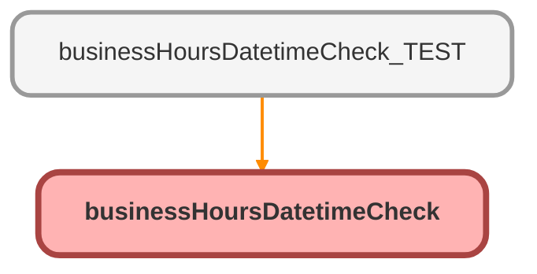

---
hide:
  - path
---

# businessHoursDatetimeCheck Class

## Class Diagram



<!-- Apex description -->

## Apex Code

```java
public without sharing class businessHoursDatetimeCheck{
    
    @InvocableMethod(label='Check if Datetime in Business Hours' description='Returns true if datetime input is within business hours, false otherwise.  If no datetime is input, it will use the datetime at runtime.  If no business hours Id is input, it will retrieve the org default.')
    public static List<returnVariables> results(List<InputVariables> inputs){
        list<returnVariables> returnVarsList = new List<returnVariables>();
        businessHours defaultBh = [SELECT id FROM businesshours WHERE isdefault = TRUE WITH SECURITY_ENFORCED LIMIT 1];
        for(InputVariables input : inputs){
            
            //Grab Flow Inputs
            datetime datetime2check = input.datetimeValue;
            boolean getNextBizHour = input.retrieveClosestBusinessDatetimeValue;
            string bh = input.businessHoursId;
            
            
            //Declare Variables
            boolean bizHourResult;
            datetime nextBizHour;

            //Check if bh is null, and grab default if so
            IF(String.ISBLANK(bh) && defaultBh.Id != NULL){
                bh = defaultBh.Id;
                }
                
            
            //Check if datetime2check is null, and set as now() if so
            IF(datetime2check == NULL){
                datetime2check = datetime.now();
            }
            
            //If bh is not null, then run iswithin check - else return null
            IF(bh != NULL){
                bizHourResult = BusinessHours.isWithin(bh, datetime2check);
            } else {
                bizHourResult = NULL;
            }

            //If result is FALSE (outside business hours), then calc next time within biz hours
            IF(bizHourResult == FALSE && getNextBizHour == TRUE){
                nextBizHour = BusinessHours.nextStartDate(bh, datetime2check);
            } else {
                nextBizHour = NULL;
            }

            returnVariables returnVars = new returnVariables();
            returnVars.isWithinBusinessHours = bizHourResult;
            returnVars.closestBusinessDatetimeValue = nextBizHour;
            returnVarsList.add(returnVars);
        }
        return returnVarsList;
    }
    public class InputVariables{
        @InvocableVariable
        public datetime datetimeValue;
        @InvocableVariable
        public string businessHoursId;
        @InvocableVariable
        public boolean retrieveClosestBusinessDatetimeValue;
    }
    public class ReturnVariables{
        @InvocableVariable
        public boolean isWithinBusinessHours;
        @InvocableVariable
        public datetime closestBusinessDatetimeValue;
    }
}
```

## Methods
### `results(inputs)`

`INVOCABLEMETHOD`

#### Signature
```apex
public static List<returnVariables> results(List<InputVariables> inputs)
```

#### Parameters
| Name | Type | Description |
|------|------|-------------|
| inputs | List&lt;InputVariables&gt; |  |

#### Return Type
**List&lt;returnVariables&gt;**

## Classes
### InputVariables Class

#### Fields
##### `datetimeValue`

`INVOCABLEVARIABLE`

###### Signature
```apex
public datetimeValue
```

###### Type
datetime

---

##### `businessHoursId`

`INVOCABLEVARIABLE`

###### Signature
```apex
public businessHoursId
```

###### Type
string

---

##### `retrieveClosestBusinessDatetimeValue`

`INVOCABLEVARIABLE`

###### Signature
```apex
public retrieveClosestBusinessDatetimeValue
```

###### Type
boolean

### ReturnVariables Class

#### Fields
##### `isWithinBusinessHours`

`INVOCABLEVARIABLE`

###### Signature
```apex
public isWithinBusinessHours
```

###### Type
boolean

---

##### `closestBusinessDatetimeValue`

`INVOCABLEVARIABLE`

###### Signature
```apex
public closestBusinessDatetimeValue
```

###### Type
datetime