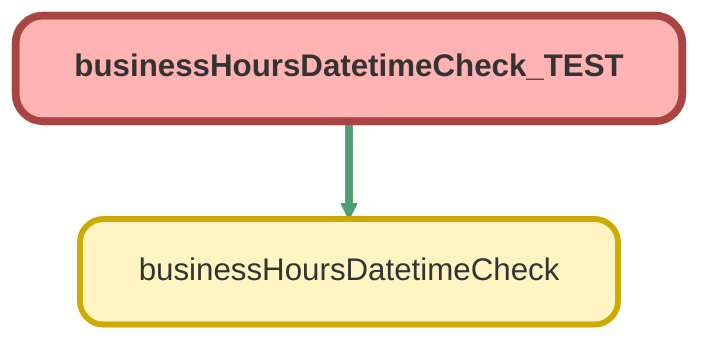

---
hide:
  - path
---

# businessHoursDatetimeCheck_TEST Class

`ISTEST`

## Class Diagram



<!-- Apex description -->

## Apex Code

```java
@istest
private class businessHoursDatetimeCheck_TEST{
    @istest
    private static void checkYESdatetime(){
        List<businessHoursDatetimeCheck.InputVariables> inputVars = new List<businessHoursDatetimeCheck.InputVariables>();
        businessHoursDatetimeCheck.inputVariables input = new businessHoursDatetimeCheck.InputVariables();
        BusinessHours bh = [SELECT id FROM BusinessHours WHERE isdefault = true LIMIT 1];
        input.datetimeValue = datetime.newinstanceGMT(2023, 12, 1, 20, 0, 0);
        input.businessHoursId = bh.Id;
        input.retrieveClosestBusinessDatetimeValue = FALSE;
        inputVars.add(input);
        test.startTest();
        List<businessHoursDatetimeCheck.ReturnVariables> outputVars = businessHoursDatetimeCheck.Results(inputVars);
        test.stopTest();
        businessHoursDatetimeCheck.ReturnVariables output = outputVars.get(0);
        system.assert(output.isWithinBusinessHours == TRUE, 'December 1st, 2023 at 12pm PST is within business hours, should return TRUE');
        system.assert(output.closestBusinessDatetimeValue == NULL, 'No future bizhours date requested nor needed, should return NULL');
    }
    @istest
    private static void checkNOdatetime(){
        List<businessHoursDatetimeCheck.InputVariables> inputVars = new List<businessHoursDatetimeCheck.InputVariables>();
        businessHoursDatetimeCheck.inputVariables input = new businessHoursDatetimeCheck.InputVariables();
        BusinessHours bh = [SELECT id FROM BusinessHours WHERE isdefault = true LIMIT 1];
        input.datetimeValue = NULL;
        input.businessHoursId = bh.Id;
        input.retrieveClosestBusinessDatetimeValue = FALSE;
        inputVars.add(input);
        test.startTest();
        List<businessHoursDatetimeCheck.ReturnVariables> outputVars = businessHoursDatetimeCheck.Results(inputVars);
        test.stopTest();
        businessHoursDatetimeCheck.ReturnVariables output = outputVars.get(0);
        system.assert(output.isWithinBusinessHours == businessHours.isWithin(bh.Id, datetime.now()), 'No datetime entered should result in a bizhour calc that matches NOW()');
        system.assert(output.closestBusinessDatetimeValue == NULL, 'No future bizhours date requested, should return NULL');
    }
    @istest
    private static void checkNOdatetimeNOid(){
        List<businessHoursDatetimeCheck.InputVariables> inputVars = new List<businessHoursDatetimeCheck.InputVariables>();
        businessHoursDatetimeCheck.inputVariables input = new businessHoursDatetimeCheck.InputVariables();
        BusinessHours bh = [SELECT id FROM BusinessHours WHERE isdefault = true LIMIT 1];
        string noBh = '';
        input.datetimeValue = NULL;
        input.businessHoursId = noBh;
        input.retrieveClosestBusinessDatetimeValue = FALSE;
        inputVars.add(input);
        test.startTest();
        List<businessHoursDatetimeCheck.ReturnVariables> outputVars = businessHoursDatetimeCheck.Results(inputVars);
        test.stopTest();
        businessHoursDatetimeCheck.ReturnVariables output = outputVars.get(0);
        system.assert(output.isWithinBusinessHours == businessHours.isWithin(bh.Id, datetime.now()), 'No datetime entered should result in a bizhour calc that matches NOW() using the org default business hours');
        system.assert(output.closestBusinessDatetimeValue == NULL, 'No future bizhours date requested, should return NULL');
    }
    @istest
    private static void checkFALSEbizhourRETURNnext(){
        List<businessHoursDatetimeCheck.InputVariables> inputVars = new List<businessHoursDatetimeCheck.InputVariables>();
        businessHoursDatetimeCheck.inputVariables input = new businessHoursDatetimeCheck.InputVariables();
        BusinessHours bh = [SELECT id FROM BusinessHours WHERE isdefault = true LIMIT 1];
        datetime testDateTime = datetime.newinstanceGMT(2023, 12, 1, 12, 0, 0);
        input.datetimeValue = testDateTime;
        input.businessHoursId = bh.Id;
        input.retrieveClosestBusinessDatetimeValue = TRUE;
        inputVars.add(input);
        test.startTest();
        List<businessHoursDatetimeCheck.ReturnVariables> outputVars = businessHoursDatetimeCheck.Results(inputVars);
        test.stopTest();
        businessHoursDatetimeCheck.ReturnVariables output = outputVars.get(0);
        system.assert(output.isWithinBusinessHours == FALSE, 'December 1st, 2023 at 4am PST is outside business hours, should return FALSE');
        system.assert(output.closestBusinessDatetimeValue == businessHours.nextStartDate(bh.Id,testDateTime), 'Should return the next business datetime, should be later that morning');
    }
}
```

## Methods
### `checkYESdatetime()`

`ISTEST`

#### Signature
```apex
private static void checkYESdatetime()
```

#### Return Type
**void**

---

### `checkNOdatetime()`

`ISTEST`

#### Signature
```apex
private static void checkNOdatetime()
```

#### Return Type
**void**

---

### `checkNOdatetimeNOid()`

`ISTEST`

#### Signature
```apex
private static void checkNOdatetimeNOid()
```

#### Return Type
**void**

---

### `checkFALSEbizhourRETURNnext()`

`ISTEST`

#### Signature
```apex
private static void checkFALSEbizhourRETURNnext()
```

#### Return Type
**void**