# Add-On Product | After Update | Master Flow

## Flow Diagram [(_View History_)](Add_On_Product_After_Update_Master_Flow-history.md)

```mermaid
%% If you read this, your Markdown visualizer does not handle MermaidJS syntax.
%% - If you are in VS Code, install extension `Markdown Preview Mermaid Support` at https://marketplace.visualstudio.com/items?itemName=bierner.markdown-mermaid
%% - If you are using sfdx-hardis, try to define env variable `MERMAID_MODES=cli,docker` ,then run again the command to regenerate markdown with SVG images.
%% - If you are within mkdocs-material, define mermaid plugin in `mkdocs.yml` as described in https://squidfunk.github.io/mkdocs-material/extensions/mermaid/
%% - As a last resort, you can copy-paste this MermaidJS code into https://mermaid.live/ to see the flow diagram

flowchart TB
START(["START<br/><b>AutoLaunched Flow</b></br>Type: <b> Record After Save</b>"]):::startClass
click START "#general-information" "3971654478"

Submit_for_Approval("⚡ <em></em><br/>Submit for Approval"):::actionCalls
click Submit_for_Approval "#submit_for_approval" "3574919231"

Downloadable_SOC_1_Requested_0{"🔀 <em></em><br/>Downloadable SOC-1 Requested"}:::decisions
click Downloadable_SOC_1_Requested_0 "#downloadable_soc_1_requested_0" "3560444634"

New_or_Existing{"🔀 <em></em><br/>New or Existing"}:::decisions
click New_or_Existing "#new_or_existing" "2458581834"

Plan_Linked{"🔀 <em></em><br/>Plan Linked"}:::decisions
click Plan_Linked "#plan_linked" "1339282403"

Product_End_Date_Entered_0{"🔀 <em></em><br/>Product End Date Entered"}:::decisions
click Product_End_Date_Entered_0 "#product_end_date_entered_0" "1815221356"

Vendor_Fees{"🔀 <em></em><br/>Vendor Fees"}:::decisions
click Vendor_Fees "#vendor_fees" "1334042579"

Existing_Plan[("🛠️ <em></em><br/>Existing Plan")]:::recordUpdates
click Existing_Plan "#existing_plan" "1936221084"

New_Plan[("🛠️ <em></em><br/>New Plan")]:::recordUpdates
click New_Plan "#new_plan" "429757099"

Update_Add_On_Product[("🛠️ <em></em><br/>Update Add-On Product")]:::recordUpdates
click Update_Add_On_Product "#update_add_on_product" "897729984"

Submit_for_Approval --> Product_End_Date_Entered_0
Downloadable_SOC_1_Requested_0 --> |"Downloadable SOC-1 Requested"| Submit_for_Approval
Downloadable_SOC_1_Requested_0 --> |"Default Outcome"| Product_End_Date_Entered_0
New_or_Existing --> |"New"| New_Plan
New_or_Existing --> |"Existing"| Existing_Plan
Plan_Linked --> |"Plan Added"| New_or_Existing
Plan_Linked --> |"Default Outcome"| END_Plan_Linked
Product_End_Date_Entered_0 --> |"Product End Date Entered"| Vendor_Fees
Product_End_Date_Entered_0 --> |"Default Outcome"| Vendor_Fees
Vendor_Fees --> |"ADP Vendor Fees"| Update_Add_On_Product
Vendor_Fees --> |"Default Outcome"| Plan_Linked
Existing_Plan --> END_Existing_Plan
New_Plan --> END_New_Plan
Update_Add_On_Product --> Plan_Linked
START -->  Downloadable_SOC_1_Requested_0
END_Plan_Linked(( END )):::endClass
END_Existing_Plan(( END )):::endClass
END_New_Plan(( END )):::endClass


classDef actionCalls fill:#D4E4FC,color:black,text-decoration:none,max-height:100px
classDef assignments fill:#FBEED7,color:black,text-decoration:none,max-height:100px
classDef collectionProcessors fill:#F0E3FA,color:black,text-decoration:none,max-height:100px
classDef customErrors fill:#FFE9E9,color:black,text-decoration:none,max-height:100px
classDef decisions fill:#FDEAF6,color:black,text-decoration:none,max-height:100px
classDef loops fill:#FDEAF6,color:black,text-decoration:none,max-height:100px
classDef recordCreates fill:#FFF8C9,color:black,text-decoration:none,max-height:100px
classDef recordDeletes fill:#FFF8C9,color:black,text-decoration:none,max-height:100px
classDef recordLookups fill:#EDEAFF,color:black,text-decoration:none,max-height:100px
classDef recordUpdates fill:#FFF8C9,color:black,text-decoration:none,max-height:100px
classDef screens fill:#DFF6FF,color:black,text-decoration:none,max-height:100px
classDef subflows fill:#D4E4FC,color:black,text-decoration:none,max-height:100px
classDef startClass fill:#D9F2E6,color:black,text-decoration:none,max-height:100px
classDef endClass fill:#F9BABA,color:black,text-decoration:none,max-height:100px
classDef transforms fill:#FDEAF6,color:black,text-decoration:none,max-height:100px


```

<!-- Flow description -->

## General Information

|<!-- -->|<!-- -->|
|:---|:---|
|Object|Add_On_Products__c|
|Process Type| Auto Launched Flow|
|Trigger Type| Record After Save|
|Record Trigger Type| Create And Update|
|Label|Add-On Product | After Update | Master Flow|
|Status|Active|
|Description|Included Approval Process Name in Submit for Approval action to prevent flow erroring. JI 10/13/23  Changed Imp Request Cases to go to PK team. 9/14 Changed Login Requested and Received decision elements to send payroll case to payroll instead of PK. 10/27- Removed Implementation Request Date entered decision path to create case for PK, Melissa said no longer necessary. Removed Login Credentials Requested case and Login Credentials received case per Stormy's request 1/31/23. 6/29/23- Removed Product End Date case for PK team based on Aaron's request.|
|Environments|Default|
|Interview Label|Add-On Product | After Update | Master Flow {!$Flow.CurrentDateTime}|
| Builder Type (PM)|LightningFlowBuilder|
| Canvas Mode (PM)|FREE_FORM_CANVAS|
| Origin Builder Type (PM)|LightningFlowBuilder|
|Connector|[Downloadable_SOC_1_Requested_0](#downloadable_soc_1_requested_0)|
|Next Node|[Downloadable_SOC_1_Requested_0](#downloadable_soc_1_requested_0)|

## Formulas

|Name|Data Type|Expression|Description|
|:-- |:--:|:-- |:--  |
|cstCaseDesc|String|{!$Record.Account__r.Name} & " has requested " & TEXT({!$Record.Integration_Type__c}) & " payroll integration via " & TEXT({!$Record.Transmission_Method__c}) & ". The payroll provider is noted as a Partner Association on the Add on Product.  What to do next:  Send the Integration Set Up email  to the sponsor, which includes instruction for them to complete the one-time setup that is their responsibility.    Additional Resources: Details and status of your client’s ongoing integration can be found in the SalesForce on the client account page under the Add-On Product section. You can find additional information and resources regarding payroll integration in Box in the “Payroll Processing Toolbox” folder== https://app.box.com/folder/61427173732"|<!-- -->|
|cstCaseSubject|String|"Payroll Integration Requested - " & TEXT( {!$Record.Integration_Type__c} ) & " via " & TEXT({!$Record.Transmission_Method__c}) & " - Send instruction to client"|<!-- -->|
|cstIntDesc|String|"The " & TEXT({!$Record.Integration_Type__c}) & " payroll integration via " & TEXT({!$Record.Transmission_Method__c}) & " for " & {!$Record.Account__r.Name} & " is complete. The sponsor will now be transitioning to their ongoing support responsibilities found in their Roles & Responsibilities Checklist included in the email template.  What to do next - 1. Send “Integration Set-Up Complete 2nd email ” Template from Payroll Integration Templates.  2. Ask client to confirm their next expected payroll date and enter the date in the Payroll Integration Add-On Product object"|<!-- -->|
|impCaseDesc|String|{!$Record.Account__r.Name} & " has requested " & TEXT({!$Record.Integration_Type__c}) & " payroll integration via " & TEXT({!$Record.Transmission_Method__c}) & ". The payroll provider is noted as a Partner Association on the Add on Product.  What to do next:  Send the Integration Set Up email  to the sponsor, which includes instruction for them to complete the one-time setup that is their responsibility.    Additional Resources: Details and status of your client’s ongoing integration can be found in the SalesForce on the client account page under the Add-On Product section. You can find additional information and resources regarding payroll integration in Box in the “Payroll Processing Toolbox” folder== https://app.box.com/folder/61427173732"|<!-- -->|
|impCaseSubject|String|"Payroll Integration Requested - " & TEXT( {!$Record.Integration_Type__c} ) & " via " & TEXT({!$Record.Transmission_Method__c}) & " - Send instruction to client"|<!-- -->|
|loginCredReceivedSubject|String|"Login Credentials & Source Mapping Received for " + {!$Record.Account__r.Name}|<!-- -->|
|loginCredRecievedDesc|String|"Create Sales Force tasks to begin payroll submissions on " + TEXT({!$Record.X1st_Payroll_Expected__c}) + BR() +  "Update source mapping object in Sales Force." + BR() +  "Complete onboarding with vendors, if applicable."|<!-- -->|
|loginCredReqDesc|String|"We receive login credentials. Please test the login access and complete the following steps based on the results:" + BR()  + BR() +  "If it’s valid, request enter a date in the Login Cred Received field." + BR() + "If it’s not valid, request contact the client for correct access level."|<!-- -->|
|loginCredReqSubject|String|"Login Credential Requested for " + {!$Record.Account__r.Name}|<!-- -->|
|prodEndDateDesc|String|"Please terminate EPS services for this client effective " + TEXT(TODAY()) + " because " + TEXT({!$Record.Product_End_Reason__c}) + "." + BR() +   "Delete future Sales Force tasks." + BR() +   "Send client term email which includes instructions to report contributions on the webform."|<!-- -->|
|prodEndDateSubject|String|"Product End Date Entered for " + {!$Record.Account__r.Name}|<!-- -->|

## Flow Nodes Details

### Submit_for_Approval

|<!-- -->|<!-- -->|
|:---|:---|
|Type|Action Call|
|Label|Submit for Approval|
|Action Type|Submit|
|Action Name|submit|
|Flow Transaction Model|CurrentTransaction|
|Name Segment|submit|
|Offset|0|
|Store Output Automatically|✅|
|Object Id (input)|$Record.Id|
|Submitter Id (input)|$User.Id|
|Process Definition Name Or Id (input)|Downloadable_SOC_1_Requested|
|Connector|[Product_End_Date_Entered_0](#product_end_date_entered_0)|

### Downloadable_SOC_1_Requested_0

|<!-- -->|<!-- -->|
|:---|:---|
|Type|Decision|
|Label|Downloadable SOC-1 Requested|
|Default Connector|[Product_End_Date_Entered_0](#product_end_date_entered_0)|
|Default Connector Label|Default Outcome|

#### Rule Downloadable_SOC_1_Requested (Downloadable SOC-1 Requested)

|<!-- -->|<!-- -->|
|:---|:---|
|Does Require Record Changed To Meet Criteria|✅|
|Connector|[Submit_for_Approval](#submit_for_approval)|
|Condition Logic|and|

|Condition Id|Left Value Reference|Operator|Right Value|
|:-- |:-- |:--:|:--: |
|1|$Record.Downloadable_SOC_1_Requested__c| Is Null|⬜|
|2|$Record.Downloadable_SOC_1_Approved__c| Equal To|⬜|

### New_or_Existing

|<!-- -->|<!-- -->|
|:---|:---|
|Type|Decision|
|Label|New or Existing|
|Default Connector|[Existing_Plan](#existing_plan)|
|Default Connector Label|Existing|

#### Rule New (New)

|<!-- -->|<!-- -->|
|:---|:---|
|Connector|[New_Plan](#new_plan)|
|Condition Logic|and|

|Condition Id|Left Value Reference|Operator|Right Value|
|:-- |:-- |:--:|:--: |
|1|$Record.Salesforce_Plan_Status__c| Equal To|Implementation in Progress|

### Plan_Linked

|<!-- -->|<!-- -->|
|:---|:---|
|Type|Decision|
|Label|Plan Linked|
|Default Connector Label|Default Outcome|

#### Rule Plan_Added (Plan Added)

|<!-- -->|<!-- -->|
|:---|:---|
|Does Require Record Changed To Meet Criteria|✅|
|Connector|[New_or_Existing](#new_or_existing)|
|Condition Logic|and|

|Condition Id|Left Value Reference|Operator|Right Value|
|:-- |:-- |:--:|:--: |
|1|$Record.Plan__c| Is Null|⬜|

### Product_End_Date_Entered_0

|<!-- -->|<!-- -->|
|:---|:---|
|Type|Decision|
|Label|Product End Date Entered|
|Default Connector|[Vendor_Fees](#vendor_fees)|
|Default Connector Label|Default Outcome|

#### Rule Product_End_Date_Entered (Product End Date Entered)

|<!-- -->|<!-- -->|
|:---|:---|
|Connector|[Vendor_Fees](#vendor_fees)|
|Condition Logic|and|

|Condition Id|Left Value Reference|Operator|Right Value|
|:-- |:-- |:--:|:--: |
|1|$Record.Scheduled_Product_End_Date__c| Is Changed|✅|
|2|$Record.Scheduled_Product_End_Date__c| Is Null|⬜|

### Vendor_Fees

|<!-- -->|<!-- -->|
|:---|:---|
|Type|Decision|
|Label|Vendor Fees|
|Default Connector|[Plan_Linked](#plan_linked)|
|Default Connector Label|Default Outcome|

#### Rule ADP_Vendor_Fees (ADP Vendor Fees)

|<!-- -->|<!-- -->|
|:---|:---|
|Does Require Record Changed To Meet Criteria|✅|
|Connector|[Update_Add_On_Product](#update_add_on_product)|
|Condition Logic|and|

|Condition Id|Left Value Reference|Operator|Right Value|
|:-- |:-- |:--:|:--: |
|1|$Record.Payroll_Vendor__c| Equal To|ADP|

### Existing_Plan

|<!-- -->|<!-- -->|
|:---|:---|
|Type|Record Update|
|Label|Existing Plan|
|Input Reference|$Record|

#### Input Assignments

|Field|Value|
|:-- |:--: |
|Client_Stage__c|Existing Client|

### New_Plan

|<!-- -->|<!-- -->|
|:---|:---|
|Type|Record Update|
|Label|New Plan|
|Input Reference|$Record|

#### Input Assignments

|Field|Value|
|:-- |:--: |
|Client_Stage__c|New Client|

### Update_Add_On_Product

|<!-- -->|<!-- -->|
|:---|:---|
|Type|Record Update|
|Label|Update Add-On Product|
|Input Reference|$Record|
|Connector|[Plan_Linked](#plan_linked)|

#### Input Assignments

|Field|Value|
|:-- |:--: |
|Payroll_Vendor_Fees__c|$Record__Prior.Plan__r.Plan_Billable_Headcount__c|

___

_Documentation generated from branch monitoring_myubiquity by [sfdx-hardis](https://sfdx-hardis.cloudity.com), featuring [salesforce-flow-visualiser](https://github.com/toddhalfpenny/salesforce-flow-visualiser)_