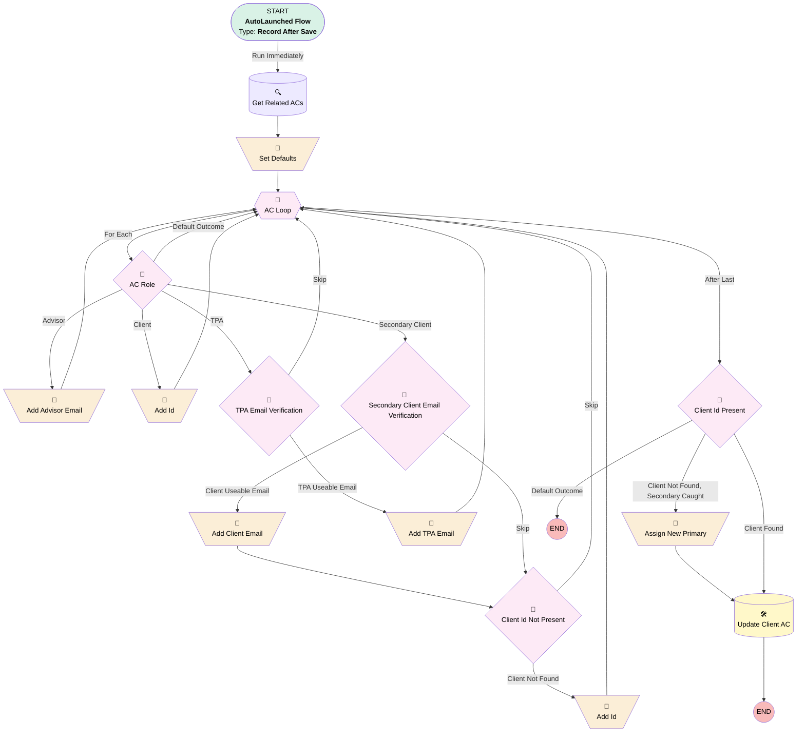

# Associated Contact | After Trigger | Update Useable Emails

## Flow Diagram [(_View History_)](Associated_Contact_After_Trigger_Update_Useable_Emails-history.md)

<!-- Flow description -->

## General Information

|<!-- -->|<!-- -->|
|:---|:---|
|Object|Associated_Contact__c|
|Process Type| Auto Launched Flow|
|Trigger Type| Record After Save|
|Record Trigger Type| Create And Update|
|Label|Associated Contact | After Trigger | Update Useable Emails|
|Status|Active|
|Environments|Default|
|Interview Label|Associated Contact | After Trigger | Update Useable Emails {!$Flow.CurrentDateTime}|
| Builder Type (PM)|LightningFlowBuilder|
| Canvas Mode (PM)|AUTO_LAYOUT_CANVAS|
| Origin Builder Type (PM)|LightningFlowBuilder|

#### Scheduled Paths

|Label|Name|Offset Number|Offset Unit|Record Field|Time Source|Connector|
|:-- |:-- |:-- |:-- |:-- |:-- |:--  |
|<!-- -->|<!-- -->|<!-- -->|<!-- -->|<!-- -->|<!-- -->|[Get_Related_ACs](#get_related_acs)|

#### Filters (logic: **(1 AND 2) OR 3**)

|Filter Id|Field|Operator|Value|
|:-- |:-- |:--:|:--: |
|1|Implementation__c| Is Null|<!-- -->|
|2|Implementation__c| Is Changed|✅|
|3|Useable_Email__c| Is Changed|✅|

## Variables

|Name|Data Type|Is Collection|Is Input|Is Output|Object Type|Description|
|:-- |:--:|:--:|:--:|:--:|:--:|:--  |
|clientAC|SObject|⬜|✅|⬜|Associated_Contact__c|<!-- -->|
|primaryCatch|String|⬜|✅|⬜|<!-- -->|<!-- -->|

## Flow Nodes Details

### Add_Advisor_Email

|<!-- -->|<!-- -->|
|:---|:---|
|Type|Assignment|
|Label|Add Advisor Email|
|Connector|[AC_Loop](#ac_loop)|

#### Assignments

|Assign To Reference|Operator|Value|
|:-- |:--:|:--: |
|clientAC.Primary_Advisor_Email__c| Assign|AC_Loop.Email__c|

### Add_Client_Email

|<!-- -->|<!-- -->|
|:---|:---|
|Type|Assignment|
|Label|Add Client Email|
|Connector|[Client_Id_Not_Present](#client_id_not_present)|

#### Assignments

|Assign To Reference|Operator|Value|
|:-- |:--:|:--: |
|clientAC.Additional_Trustee_Email__c| Assign|AC_Loop.Email__c|

### Add_Id

|<!-- -->|<!-- -->|
|:---|:---|
|Type|Assignment|
|Label|Add Id|
|Connector|[AC_Loop](#ac_loop)|

#### Assignments

|Assign To Reference|Operator|Value|
|:-- |:--:|:--: |
|clientAC.Id| Assign|AC_Loop.Id|

### Add_Id_0

|<!-- -->|<!-- -->|
|:---|:---|
|Type|Assignment|
|Label|Add Id|
|Connector|[AC_Loop](#ac_loop)|

#### Assignments

|Assign To Reference|Operator|Value|
|:-- |:--:|:--: |
|primaryCatch| Assign|AC_Loop.Id|

### Add_TPA_Email

|<!-- -->|<!-- -->|
|:---|:---|
|Type|Assignment|
|Label|Add TPA Email|
|Connector|[AC_Loop](#ac_loop)|

#### Assignments

|Assign To Reference|Operator|Value|
|:-- |:--:|:--: |
|clientAC.TPA_Operational_Email__c| Assign|AC_Loop.Email__c|

### Assign_New_Primary

|<!-- -->|<!-- -->|
|:---|:---|
|Type|Assignment|
|Label|Assign New Primary|
|Connector|[Update_Client_AC](#update_client_ac)|

#### Assignments

|Assign To Reference|Operator|Value|
|:-- |:--:|:--: |
|clientAC.Id| Assign|primaryCatch|
|clientAC.Primary__c| Assign|✅|

### Set_Defaults

|<!-- -->|<!-- -->|
|:---|:---|
|Type|Assignment|
|Label|Set Defaults|
|Connector|[AC_Loop](#ac_loop)|

#### Assignments

|Assign To Reference|Operator|Value|
|:-- |:--:|:--: |
|clientAC.Primary_Advisor_Email__c| Assign|stringValue: '' |
|clientAC.TPA_Operational_Email__c| Assign|stringValue: '' |
|clientAC.Id| Assign|stringValue: '' |
|clientAC.Additional_Trustee_Email__c| Assign|stringValue: '' |

### AC_Role

|<!-- -->|<!-- -->|
|:---|:---|
|Type|Decision|
|Label|AC Role|
|Default Connector|[AC_Loop](#ac_loop)|
|Default Connector Label|Default Outcome|

#### Rule Client (Client)

|<!-- -->|<!-- -->|
|:---|:---|
|Connector|[Add_Id](#add_id)|
|Condition Logic|(1 OR 2 OR 3) AND 4|

|Condition Id|Left Value Reference|Operator|Right Value|
|:-- |:-- |:--:|:--: |
|1|AC_Loop.Contact_Role__c| Contains|Plan Sponsor|
|2|AC_Loop.Contact_Role__c| Contains|Trustee|
|3|AC_Loop.Contact_Role__c| Equal To|Authorized Buyer|
|4|AC_Loop.Primary__c| Equal To|✅|

#### Rule Secondary_Client (Secondary Client)

|<!-- -->|<!-- -->|
|:---|:---|
|Connector|[Secondary_Client_Email_Verification](#secondary_client_email_verification)|
|Condition Logic|(1 OR 2 OR 3) AND 4|

|Condition Id|Left Value Reference|Operator|Right Value|
|:-- |:-- |:--:|:--: |
|1|AC_Loop.Contact_Role__c| Contains|Plan Sponsor|
|2|AC_Loop.Contact_Role__c| Contains|Trustee|
|3|AC_Loop.Contact_Role__c| Equal To|Authorized Buyer|
|4|AC_Loop.Primary__c| Equal To|⬜|

#### Rule Advisor (Advisor)

|<!-- -->|<!-- -->|
|:---|:---|
|Connector|[Add_Advisor_Email](#add_advisor_email)|
|Condition Logic|and|

|Condition Id|Left Value Reference|Operator|Right Value|
|:-- |:-- |:--:|:--: |
|1|AC_Loop.Contact_Role__c| Equal To|Financial Advisor|
|2|clientAC.Primary_Advisor_Email__c| Equal To|stringValue: '' |

#### Rule TPA (TPA)

|<!-- -->|<!-- -->|
|:---|:---|
|Connector|[TPA_Email_Verification](#tpa_email_verification)|
|Condition Logic|and|

|Condition Id|Left Value Reference|Operator|Right Value|
|:-- |:-- |:--:|:--: |
|1|AC_Loop.Contact_Role__c| Contains|TPA|
|2|clientAC.TPA_Operational_Email__c| Equal To|stringValue: '' |

### Client_Id_Not_Present

|<!-- -->|<!-- -->|
|:---|:---|
|Type|Decision|
|Label|Client Id Not Present|
|Default Connector|[AC_Loop](#ac_loop)|
|Default Connector Label|Skip|

#### Rule Client_Not_Found (Client Not Found)

|<!-- -->|<!-- -->|
|:---|:---|
|Connector|[Add_Id_0](#add_id_0)|
|Condition Logic|and|

|Condition Id|Left Value Reference|Operator|Right Value|
|:-- |:-- |:--:|:--: |
|1|clientAC.Id| Equal To|stringValue: '' |

### Client_Id_Present

|<!-- -->|<!-- -->|
|:---|:---|
|Type|Decision|
|Label|Client Id Present|
|Default Connector Label|Default Outcome|

#### Rule Client_Found (Client Found)

|<!-- -->|<!-- -->|
|:---|:---|
|Connector|[Update_Client_AC](#update_client_ac)|
|Condition Logic|and|

|Condition Id|Left Value Reference|Operator|Right Value|
|:-- |:-- |:--:|:--: |
|1|clientAC.Id| Not Equal To|stringValue: '' |

#### Rule Client_Not_Found_Secondary_Caught (Client Not Found, Secondary Caught)

|<!-- -->|<!-- -->|
|:---|:---|
|Connector|[Assign_New_Primary](#assign_new_primary)|
|Condition Logic|and|

|Condition Id|Left Value Reference|Operator|Right Value|
|:-- |:-- |:--:|:--: |
|1|primaryCatch| Is Null|⬜|
|2|clientAC.Id| Is Null|✅|

### Secondary_Client_Email_Verification

|<!-- -->|<!-- -->|
|:---|:---|
|Type|Decision|
|Label|Secondary Client Email Verification|
|Default Connector|[Client_Id_Not_Present](#client_id_not_present)|
|Default Connector Label|Skip|

#### Rule Client_Useable_Email (Client Useable Email)

|<!-- -->|<!-- -->|
|:---|:---|
|Connector|[Add_Client_Email](#add_client_email)|
|Condition Logic|and|

|Condition Id|Left Value Reference|Operator|Right Value|
|:-- |:-- |:--:|:--: |
|1|clientAC.Additional_Trustee_Email__c| Is Null|✅|

### TPA_Email_Verification

|<!-- -->|<!-- -->|
|:---|:---|
|Type|Decision|
|Label|TPA Email Verification|
|Default Connector|[AC_Loop](#ac_loop)|
|Default Connector Label|Skip|

#### Rule TPA_Useable_Email (TPA Useable Email)

|<!-- -->|<!-- -->|
|:---|:---|
|Connector|[Add_TPA_Email](#add_tpa_email)|
|Condition Logic|(1 AND 2) OR 3|

|Condition Id|Left Value Reference|Operator|Right Value|
|:-- |:-- |:--:|:--: |
|1|AC_Loop.Contact_Role__c| Equal To|TPA - Sales|
|2|clientAC.TPA_Operational_Email__c| Is Null|✅|
|3|AC_Loop.Contact_Role__c| Equal To|TPA - Onboarding|

### AC_Loop

|<!-- -->|<!-- -->|
|:---|:---|
|Type|Loop|
|Label|AC Loop|
|Collection Reference|[Get_Related_ACs](#get_related_acs)|
|Iteration Order|Asc|
|Next Value Connector|[AC_Role](#ac_role)|
|No More Values Connector|[Client_Id_Present](#client_id_present)|

### Get_Related_ACs

|<!-- -->|<!-- -->|
|:---|:---|
|Type|Record Lookup|
|Object|Associated_Contact__c|
|Label|Get Related ACs|
|Assign Null Values If No Records Found|⬜|
|Get First Record Only|⬜|
|Sort Field|CreatedDate|
|Sort Order|Asc|
|Store Output Automatically|✅|
|Connector|[Set_Defaults](#set_defaults)|

#### Filters (logic: **and**)

|Filter Id|Field|Operator|Value|
|:-- |:-- |:--:|:--: |
|1|Implementation__c| Equal To|$Record.Implementation__c|
|2|Implementation__c| Is Null|<!-- -->|

### Update_Client_AC

|<!-- -->|<!-- -->|
|:---|:---|
|Type|Record Update|
|Label|Update Client AC|
|Input Reference|clientAC|

___

_Documentation generated from branch monitoring_myubiquity by [sfdx-hardis](https://sfdx-hardis.cloudity.com), featuring [salesforce-flow-visualiser](https://github.com/toddhalfpenny/salesforce-flow-visualiser)_