# Associated Contact | ONETIME | Update Useable Emails

## Flow Diagram [(_View History_)](Associated_Contact_ONETIME_Update_Useable_Emails-history.md)

```mermaid
%% If you read this, your Markdown visualizer does not handle MermaidJS syntax.
%% - If you are in VS Code, install extension `Markdown Preview Mermaid Support` at https://marketplace.visualstudio.com/items?itemName=bierner.markdown-mermaid
%% - If you are using sfdx-hardis, try to define env variable `MERMAID_MODES=cli,docker` ,then run again the command to regenerate markdown with SVG images.
%% - If you are within mkdocs-material, define mermaid plugin in `mkdocs.yml` as described in https://squidfunk.github.io/mkdocs-material/extensions/mermaid/
%% - As a last resort, you can copy-paste this MermaidJS code into https://mermaid.live/ to see the flow diagram

flowchart TB
START(["START<br/><b>AutoLaunched Flow</b></br>Type: <b> Record After Save</b>"]):::startClass
click START "#general-information" "1404203612"

Add_Advisor_Email[\"🟰 <em></em><br/>Add Advisor Email"/]:::assignments
click Add_Advisor_Email "#add_advisor_email" "1882377672"

Add_Id[\"🟰 <em></em><br/>Add Id"/]:::assignments
click Add_Id "#add_id" "2002748639"

Add_TPA_Email[\"🟰 <em></em><br/>Add TPA Email"/]:::assignments
click Add_TPA_Email "#add_tpa_email" "549397927"

AC_Role{"🔀 <em></em><br/>AC Role"}:::decisions
click AC_Role "#ac_role" "4106523362"

TPA_Email_Verification{"🔀 <em></em><br/>TPA Email Verification"}:::decisions
click TPA_Email_Verification "#tpa_email_verification" "2387003524"

AC_Loop{{"🔁 <em></em><br/>AC Loop"}}:::loops
click AC_Loop "#ac_loop" "2037178093"

Get_Related_ACs[("🔍 <em></em><br/>Get Related ACs")]:::recordLookups
click Get_Related_ACs "#get_related_acs" "533207589"

Update_Client_AC[("🛠️ <em></em><br/>Update Client AC")]:::recordUpdates
click Update_Client_AC "#update_client_ac" "3280209879"

Add_Advisor_Email --> AC_Loop
Add_Id --> AC_Loop
Add_TPA_Email --> AC_Loop
AC_Role --> |"Client"| Add_Id
AC_Role --> |"Advisor"| Add_Advisor_Email
AC_Role --> |"TPA"| TPA_Email_Verification
AC_Role --> |"Default Outcome"| AC_Loop
TPA_Email_Verification --> |"TPA Useable Email"| Add_TPA_Email
TPA_Email_Verification --> |"Skip"| AC_Loop
AC_Loop --> |"For Each"|AC_Role
AC_Loop ---> |"After Last"|Update_Client_AC
Get_Related_ACs --> AC_Loop
Update_Client_AC --> END_Update_Client_AC
START -->  Get_Related_ACs
END_Update_Client_AC(( END )):::endClass


classDef actionCalls fill:#D4E4FC,color:black,text-decoration:none,max-height:100px
classDef assignments fill:#FBEED7,color:black,text-decoration:none,max-height:100px
classDef collectionProcessors fill:#F0E3FA,color:black,text-decoration:none,max-height:100px
classDef customErrors fill:#FFE9E9,color:black,text-decoration:none,max-height:100px
classDef decisions fill:#FDEAF6,color:black,text-decoration:none,max-height:100px
classDef loops fill:#FDEAF6,color:black,text-decoration:none,max-height:100px
classDef recordCreates fill:#FFF8C9,color:black,text-decoration:none,max-height:100px
classDef recordDeletes fill:#FFF8C9,color:black,text-decoration:none,max-height:100px
classDef recordLookups fill:#EDEAFF,color:black,text-decoration:none,max-height:100px
classDef recordUpdates fill:#FFF8C9,color:black,text-decoration:none,max-height:100px
classDef screens fill:#DFF6FF,color:black,text-decoration:none,max-height:100px
classDef subflows fill:#D4E4FC,color:black,text-decoration:none,max-height:100px
classDef startClass fill:#D9F2E6,color:black,text-decoration:none,max-height:100px
classDef endClass fill:#F9BABA,color:black,text-decoration:none,max-height:100px
classDef transforms fill:#FDEAF6,color:black,text-decoration:none,max-height:100px


```

<!-- Flow description -->

## General Information

|<!-- -->|<!-- -->|
|:---|:---|
|Object|Associated_Contact__c|
|Process Type| Auto Launched Flow|
|Trigger Type| Record After Save|
|Record Trigger Type| Create And Update|
|Label|Associated Contact | ONETIME | Update Useable Emails|
|Status|Obsolete|
|Interview Label|Associated Contact | ONETIME | Update Useable Emails {!$Flow.CurrentDateTime}|
| Builder Type (PM)|LightningFlowBuilder|
| Canvas Mode (PM)|AUTO_LAYOUT_CANVAS|
| Origin Builder Type (PM)|LightningFlowBuilder|
|Connector|[Get_Related_ACs](#get_related_acs)|
|Next Node|[Get_Related_ACs](#get_related_acs)|

## Variables

|Name|Data Type|Is Collection|Is Input|Is Output|Object Type|Description|
|:-- |:--:|:--:|:--:|:--:|:--:|:--  |
|clientAC|SObject|⬜|✅|⬜|Associated_Contact__c|<!-- -->|

## Flow Nodes Details

### Add_Advisor_Email

|<!-- -->|<!-- -->|
|:---|:---|
|Type|Assignment|
|Label|Add Advisor Email|
|Connector|[AC_Loop](#ac_loop)|

#### Assignments

|Assign To Reference|Operator|Value|
|:-- |:--:|:--: |
|clientAC.Primary_Advisor_Email__c| Assign|AC_Loop.Email__c|

### Add_Id

|<!-- -->|<!-- -->|
|:---|:---|
|Type|Assignment|
|Label|Add Id|
|Connector|[AC_Loop](#ac_loop)|

#### Assignments

|Assign To Reference|Operator|Value|
|:-- |:--:|:--: |
|clientAC.Id| Assign|AC_Loop.Id|

### Add_TPA_Email

|<!-- -->|<!-- -->|
|:---|:---|
|Type|Assignment|
|Label|Add TPA Email|
|Connector|[AC_Loop](#ac_loop)|

#### Assignments

|Assign To Reference|Operator|Value|
|:-- |:--:|:--: |
|clientAC.TPA_Operational_Email__c| Assign|AC_Loop.Email__c|

### AC_Role

|<!-- -->|<!-- -->|
|:---|:---|
|Type|Decision|
|Label|AC Role|
|Default Connector|[AC_Loop](#ac_loop)|
|Default Connector Label|Default Outcome|

#### Rule Client (Client)

|<!-- -->|<!-- -->|
|:---|:---|
|Connector|[Add_Id](#add_id)|
|Condition Logic|or|

|Condition Id|Left Value Reference|Operator|Right Value|
|:-- |:-- |:--:|:--: |
|1|AC_Loop.Contact_Role__c| Contains|Plan Sponsor|
|2|AC_Loop.Contact_Role__c| Contains|Trustee|
|3|AC_Loop.Contact_Role__c| Equal To|Authorized Buyer|

#### Rule Advisor (Advisor)

|<!-- -->|<!-- -->|
|:---|:---|
|Connector|[Add_Advisor_Email](#add_advisor_email)|
|Condition Logic|and|

|Condition Id|Left Value Reference|Operator|Right Value|
|:-- |:-- |:--:|:--: |
|1|AC_Loop.Contact_Role__c| Equal To|Financial Advisor|
|2|clientAC.Primary_Advisor_Email__c| Is Null|✅|

#### Rule TPA (TPA)

|<!-- -->|<!-- -->|
|:---|:---|
|Connector|[TPA_Email_Verification](#tpa_email_verification)|
|Condition Logic|and|

|Condition Id|Left Value Reference|Operator|Right Value|
|:-- |:-- |:--:|:--: |
|1|AC_Loop.Contact_Role__c| Contains|TPA|
|2|clientAC.TPA_Operational_Email__c| Is Null|✅|

### TPA_Email_Verification

|<!-- -->|<!-- -->|
|:---|:---|
|Type|Decision|
|Label|TPA Email Verification|
|Default Connector|[AC_Loop](#ac_loop)|
|Default Connector Label|Skip|

#### Rule TPA_Useable_Email (TPA Useable Email)

|<!-- -->|<!-- -->|
|:---|:---|
|Connector|[Add_TPA_Email](#add_tpa_email)|
|Condition Logic|(1 AND 2) OR 3|

|Condition Id|Left Value Reference|Operator|Right Value|
|:-- |:-- |:--:|:--: |
|1|AC_Loop.Contact_Role__c| Equal To|TPA - Sales|
|2|clientAC.TPA_Operational_Email__c| Is Null|✅|
|3|AC_Loop.Contact_Role__c| Equal To|TPA - Onboarding|

### AC_Loop

|<!-- -->|<!-- -->|
|:---|:---|
|Type|Loop|
|Label|AC Loop|
|Collection Reference|[Get_Related_ACs](#get_related_acs)|
|Iteration Order|Asc|
|Next Value Connector|[AC_Role](#ac_role)|
|No More Values Connector|[Update_Client_AC](#update_client_ac)|

### Get_Related_ACs

|<!-- -->|<!-- -->|
|:---|:---|
|Type|Record Lookup|
|Object|Associated_Contact__c|
|Label|Get Related ACs|
|Assign Null Values If No Records Found|⬜|
|Get First Record Only|⬜|
|Sort Field|CreatedDate|
|Sort Order|Asc|
|Store Output Automatically|✅|
|Connector|[AC_Loop](#ac_loop)|

#### Filters (logic: **and**)

|Filter Id|Field|Operator|Value|
|:-- |:-- |:--:|:--: |
|1|Implementation__c| Equal To|$Record.Implementation__c|

### Update_Client_AC

|<!-- -->|<!-- -->|
|:---|:---|
|Type|Record Update|
|Label|Update Client AC|
|Input Reference|clientAC|

___

_Documentation generated from branch monitoring_myubiquity by [sfdx-hardis](https://sfdx-hardis.cloudity.com), featuring [salesforce-flow-visualiser](https://github.com/toddhalfpenny/salesforce-flow-visualiser)_