# Box | Autolaunched | Batchable create folder assoc

## Flow Diagram [(_View History_)](Box_Autolaunched_Batchable_create_folder_assoc-history.md)

```mermaid
%% If you read this, your Markdown visualizer does not handle MermaidJS syntax.
%% - If you are in VS Code, install extension `Markdown Preview Mermaid Support` at https://marketplace.visualstudio.com/items?itemName=bierner.markdown-mermaid
%% - If you are using sfdx-hardis, try to define env variable `MERMAID_MODES=cli,docker` ,then run again the command to regenerate markdown with SVG images.
%% - If you are within mkdocs-material, define mermaid plugin in `mkdocs.yml` as described in https://squidfunk.github.io/mkdocs-material/extensions/mermaid/
%% - As a last resort, you can copy-paste this MermaidJS code into https://mermaid.live/ to see the flow diagram

flowchart TB
START(["START<br/><b>AutoLaunched Flow</b></br>"]):::startClass
click START "#general-information" "1138826596"

Create_Box_Folder_Assoc("⚙️ <em></em><br/>Create Box Folder Assoc"):::actionCalls
click Create_Box_Folder_Assoc "#create_box_folder_assoc" "2537593446"

Check_box_box[\"🟰 <em></em><br/>Check box box"/]:::assignments
click Check_box_box "#check_box_box" "1583581784"

frup_check{"🔀 <em></em><br/>frup check"}:::decisions
click frup_check "#frup_check" "654233389"

Get_Account[("🔍 <em></em><br/>Get Account")]:::recordLookups
click Get_Account "#get_account" "3697355439"

Update_account[("🛠️ <em></em><br/>Update account")]:::recordUpdates
click Update_account "#update_account" "542281249"

Create_Box_Folder_Assoc --> frup_check
Check_box_box --> Update_account
frup_check --> |"frup created"| Check_box_box
frup_check --> |"Default Outcome"| END_frup_check
Get_Account --> Create_Box_Folder_Assoc
Update_account --> END_Update_account
START -->  Get_Account
END_frup_check(( END )):::endClass
END_Update_account(( END )):::endClass


classDef actionCalls fill:#D4E4FC,color:black,text-decoration:none,max-height:100px
classDef assignments fill:#FBEED7,color:black,text-decoration:none,max-height:100px
classDef collectionProcessors fill:#F0E3FA,color:black,text-decoration:none,max-height:100px
classDef customErrors fill:#FFE9E9,color:black,text-decoration:none,max-height:100px
classDef decisions fill:#FDEAF6,color:black,text-decoration:none,max-height:100px
classDef loops fill:#FDEAF6,color:black,text-decoration:none,max-height:100px
classDef recordCreates fill:#FFF8C9,color:black,text-decoration:none,max-height:100px
classDef recordDeletes fill:#FFF8C9,color:black,text-decoration:none,max-height:100px
classDef recordLookups fill:#EDEAFF,color:black,text-decoration:none,max-height:100px
classDef recordUpdates fill:#FFF8C9,color:black,text-decoration:none,max-height:100px
classDef screens fill:#DFF6FF,color:black,text-decoration:none,max-height:100px
classDef subflows fill:#D4E4FC,color:black,text-decoration:none,max-height:100px
classDef startClass fill:#D9F2E6,color:black,text-decoration:none,max-height:100px
classDef endClass fill:#F9BABA,color:black,text-decoration:none,max-height:100px
classDef transforms fill:#FDEAF6,color:black,text-decoration:none,max-height:100px


```

<!-- Flow description -->

## General Information

|<!-- -->|<!-- -->|
|:---|:---|
|Process Type| Auto Launched Flow|
|Label|Box | Autolaunched | Batchable create folder assoc|
|Status|Active|
|Environments|Default|
|Interview Label|Box | Autolaunched | Batchable create folder assoc {!$Flow.CurrentDateTime}|
| Builder Type (PM)|LightningFlowBuilder|
| Canvas Mode (PM)|AUTO_LAYOUT_CANVAS|
| Origin Builder Type (PM)|LightningFlowBuilder|
|Connector|[Get_Account](#get_account)|
|Next Node|[Get_Account](#get_account)|

## Variables

|Name|Data Type|Is Collection|Is Input|Is Output|Object Type|Description|
|:-- |:--:|:--:|:--:|:--:|:--:|:--  |
|accountId|String|⬜|✅|⬜|<!-- -->|<!-- -->|
|accountRecord|SObject|⬜|⬜|⬜|Account|<!-- -->|

## Flow Nodes Details

### Create_Box_Folder_Assoc

|<!-- -->|<!-- -->|
|:---|:---|
|Type|Action Call|
|Label|Create Box Folder Assoc|
|Action Type|Apex|
|Action Name|box__CreateFolderAssociation_v2|
|Data Type Mappings|typeName: U__frupRecord typeValue: Account |
|Flow Transaction Model|CurrentTransaction|
|Name Segment|box__CreateFolderAssociation_v2|
|Offset|0|
|Store Output Automatically|✅|
|Folder Id (input)|accountRecord.Box_Folder_Id__c|
|Record Id (input)|accountRecord.Id|
|Connector|[frup_check](#frup_check)|

### Check_box_box

|<!-- -->|<!-- -->|
|:---|:---|
|Type|Assignment|
|Label|Check box box|
|Connector|[Update_account](#update_account)|

#### Assignments

|Assign To Reference|Operator|Value|
|:-- |:--:|:--: |
|accountRecord.Box_Folder_Linked__c| Assign|✅|

### frup_check

|<!-- -->|<!-- -->|
|:---|:---|
|Type|Decision|
|Label|frup check|
|Default Connector Label|Default Outcome|

#### Rule frup_created (frup created)

|<!-- -->|<!-- -->|
|:---|:---|
|Connector|[Check_box_box](#check_box_box)|
|Condition Logic|and|

|Condition Id|Left Value Reference|Operator|Right Value|
|:-- |:-- |:--:|:--: |
|1|Create_Box_Folder_Assoc.frupRecord| Is Null|⬜|

### Get_Account

|<!-- -->|<!-- -->|
|:---|:---|
|Type|Record Lookup|
|Object|Account|
|Label|Get Account|
|Assign Null Values If No Records Found|⬜|
|Output Reference|accountRecord|
|Queried Fields|- Id - Box_Folder_Id__c |
|Connector|[Create_Box_Folder_Assoc](#create_box_folder_assoc)|

#### Filters (logic: **and**)

|Filter Id|Field|Operator|Value|
|:-- |:-- |:--:|:--: |
|1|Id| Equal To|accountId|

### Update_account

|<!-- -->|<!-- -->|
|:---|:---|
|Type|Record Update|
|Label|Update account|
|Input Reference|accountRecord|

___

_Documentation generated from branch monitoring_myubiquity by [sfdx-hardis](https://sfdx-hardis.cloudity.com), featuring [salesforce-flow-visualiser](https://github.com/toddhalfpenny/salesforce-flow-visualiser)_