# Calculation | After Trigger | Create Cases for Compliance and Increment Counters

## Flow Diagram [(_View History_)](Calculation_After_Trigger_Create_Cases_for_Compliance_and_Increment_Counters-history.md)

```mermaid
%% If you read this, your Markdown visualizer does not handle MermaidJS syntax.
%% - If you are in VS Code, install extension `Markdown Preview Mermaid Support` at https://marketplace.visualstudio.com/items?itemName=bierner.markdown-mermaid
%% - If you are using sfdx-hardis, try to define env variable `MERMAID_MODES=cli,docker` ,then run again the command to regenerate markdown with SVG images.
%% - If you are within mkdocs-material, define mermaid plugin in `mkdocs.yml` as described in https://squidfunk.github.io/mkdocs-material/extensions/mermaid/
%% - As a last resort, you can copy-paste this MermaidJS code into https://mermaid.live/ to see the flow diagram

flowchart TB
START(["START<br/><b>AutoLaunched Flow</b></br>Type: <b> Record After Save</b>"]):::startClass
click START "#general-information" "2758481054"

Assign_ownerId[\"🟰 <em></em><br/>Assign ownerId"/]:::assignments
click Assign_ownerId "#assign_ownerid" "2994921665"

Transfer_Case_to_Compliance[\"🟰 <em></em><br/>Transfer Case to Compliance"/]:::assignments
click Transfer_Case_to_Compliance "#transfer_case_to_compliance" "1744958201"

Can_t_Transfer_Case("🚫 <em></em><br/>Can't Transfer Case"):::customErrors
click Can_t_Transfer_Case "#can_t_transfer_case" "1569271032"

Copy_2_of_Calculation_Requested{"🔀 <em></em><br/>Sales Calculation Requested"}:::decisions
click Copy_2_of_Calculation_Requested "#copy_2_of_calculation_requested" "4064166471"

myRule_4{"🔀 <em></em><br/>CE Calculation Requested"}:::decisions
click myRule_4 "#myrule_4" "1586981938"

Queue_Found_Check{"🔀 <em></em><br/>Queue Found Check"}:::decisions
click Queue_Found_Check "#queue_found_check" "2585759310"

Create_Case_for_Compliance[("➕ <em></em><br/>Create Case for Compliance")]:::recordCreates
click Create_Case_for_Compliance "#create_case_for_compliance" "919239495"

Get_Compliance_Queue[("🔍 <em></em><br/>Get Compliance Queue")]:::recordLookups
click Get_Compliance_Queue "#get_compliance_queue" "270842448"

Get_Related_Case[("🔍 <em></em><br/>Get Related Case")]:::recordLookups
click Get_Related_Case "#get_related_case" "2798642436"

Move_Calc_under_Case[("🛠️ <em></em><br/>Move Calc under Case")]:::recordUpdates
click Move_Calc_under_Case "#move_calc_under_case" "4020033565"

Update_Case[("🛠️ <em></em><br/>Update Case")]:::recordUpdates
click Update_Case "#update_case" "3831266912"

Assign_ownerId --> Get_Related_Case
Transfer_Case_to_Compliance --> Update_Case
Can_t_Transfer_Case --> END_Can_t_Transfer_Case
Copy_2_of_Calculation_Requested --> |"Sales Calculation Requested"| Create_Case_for_Compliance
Copy_2_of_Calculation_Requested --> |"FALSE_Calculation Requested"| END_Copy_2_of_Calculation_Requested
myRule_4 --> |"CE Calculation Requested"| Transfer_Case_to_Compliance
myRule_4 --> |"Not CE Calculation"| Copy_2_of_Calculation_Requested
Queue_Found_Check --> |"Queue Found"| Assign_ownerId
Queue_Found_Check --> |"Default Outcome"| Get_Related_Case
Create_Case_for_Compliance --> Move_Calc_under_Case
Get_Compliance_Queue --> Queue_Found_Check
Get_Related_Case --> myRule_4
Move_Calc_under_Case --> END_Move_Calc_under_Case
Update_Case --> END_Update_Case
Update_Case -. Fault .->Can_t_Transfer_Case
START -->  Get_Compliance_Queue
END_Can_t_Transfer_Case(( END )):::endClass
END_Copy_2_of_Calculation_Requested(( END )):::endClass
END_Move_Calc_under_Case(( END )):::endClass
END_Update_Case(( END )):::endClass


classDef actionCalls fill:#D4E4FC,color:black,text-decoration:none,max-height:100px
classDef assignments fill:#FBEED7,color:black,text-decoration:none,max-height:100px
classDef collectionProcessors fill:#F0E3FA,color:black,text-decoration:none,max-height:100px
classDef customErrors fill:#FFE9E9,color:black,text-decoration:none,max-height:100px
classDef decisions fill:#FDEAF6,color:black,text-decoration:none,max-height:100px
classDef loops fill:#FDEAF6,color:black,text-decoration:none,max-height:100px
classDef recordCreates fill:#FFF8C9,color:black,text-decoration:none,max-height:100px
classDef recordDeletes fill:#FFF8C9,color:black,text-decoration:none,max-height:100px
classDef recordLookups fill:#EDEAFF,color:black,text-decoration:none,max-height:100px
classDef recordUpdates fill:#FFF8C9,color:black,text-decoration:none,max-height:100px
classDef screens fill:#DFF6FF,color:black,text-decoration:none,max-height:100px
classDef subflows fill:#D4E4FC,color:black,text-decoration:none,max-height:100px
classDef startClass fill:#D9F2E6,color:black,text-decoration:none,max-height:100px
classDef endClass fill:#F9BABA,color:black,text-decoration:none,max-height:100px
classDef transforms fill:#FDEAF6,color:black,text-decoration:none,max-height:100px


```

<!-- Flow description -->

## General Information

|<!-- -->|<!-- -->|
|:---|:---|
|Object|Calculation__c|
|Process Type| Auto Launched Flow|
|Trigger Type| Record After Save|
|Record Trigger Type| Create And Update|
|Label|Calculation | After Trigger | Create Cases for Compliance and Increment Counters|
|Status|Active|
|Does Require Record Changed To Meet Criteria|✅|
|Description|Updated to get rid of child case|
|Environments|Default|
|Interview Label|Calculation | After Trigger | Create Cases for Compliance and Increment Counters {!$Flow.CurrentDateTime}|
| Builder Type (PM)|LightningFlowBuilder|
| Canvas Mode (PM)|AUTO_LAYOUT_CANVAS|
|Connector|[Get_Compliance_Queue](#get_compliance_queue)|
|Next Node|[Get_Compliance_Queue](#get_compliance_queue)|

#### Filters (logic: **and**)

|Filter Id|Field|Operator|Value|
|:-- |:-- |:--:|:--: |
|1|Status__c| Equal To|Requested|

## Variables

|Name|Data Type|Is Collection|Is Input|Is Output|Object Type|Description|
|:-- |:--:|:--:|:--:|:--:|:--:|:--  |
|ownerId|String|⬜|⬜|⬜|<!-- -->|Compliance Id for case.  Defaults to shared user id, but should be replaced with new queue id|
|relatedCase|SObject|⬜|✅|⬜|Case|<!-- -->|
|testo|Number|⬜|✅|⬜|<!-- -->|<!-- -->|

## Formulas

|Name|Data Type|Expression|Description|
|:-- |:--:|:-- |:--  |
|caseDesc|String|"Client Calculation Request from " + {!$Record.Owner:User.FirstName} +  " " + {!$Record.Owner:User.LastName}  + " - " + " See " + {!$Record.Name} + " in parent case: " + LEFT({!$Api.Partner_Server_URL_340}, FIND( '/services', {!$Api.Partner_Server_URL_340}))+"lightning/r/Calculation__c/"+{!$Record.Id}+"/view"|<!-- -->|
|caseSubject|String|"Calculation Request for " + {!$Record.Plan__r.Name} + " " + {!$Record.Plan_Year_Request__c}|<!-- -->|
|formattedError|String|IF( FIND("FIELD_CUSTOM_VALIDATION_EXCEPTION:", {!$Flow.FaultMessage}) != 0, MID({!$Flow.FaultMessage}, FIND("FIELD_CUSTOM_VALIDATION_EXCEPTION:", {!$Flow.FaultMessage})+35, FIND("You can look up ExceptionCode values",{!$Flow.FaultMessage})-(FIND("FIELD_CUSTOM_VALIDATION_EXCEPTION:", {!$Flow.FaultMessage})+35)), {!$Flow.FaultMessage})|Will format error nicely if it's a validation error.  Otherwise will display full error message.|
|formula_1_myRule_1_A1_6073656857|Number|{!relatedCase.Number_of_Child_Cases_Open__c}  + 1|<!-- -->|
|formula_4_myRule_8_A1_9028938282|Number|{!$Record.Case__r.Number_of_Child_Cases_Closed__c}  + 1|<!-- -->|
|salesCaseDesc|String|"Sales Calculation Request from " + {!$Record.Owner:User.FirstName} +  " " + {!$Record.Owner:User.LastName}  + " - " + " See " + {!$Record.Name} + " in linked Opportunity"|<!-- -->|
|salesCaseSubj|String|"Calculation Request for " + {!$Record.Plan__c.Name} + " " + {!$Record.Plan_Year_Request__c}|<!-- -->|

## Flow Nodes Details

### Assign_ownerId

|<!-- -->|<!-- -->|
|:---|:---|
|Type|Assignment|
|Label|Assign ownerId|
|Connector|[Get_Related_Case](#get_related_case)|

#### Assignments

|Assign To Reference|Operator|Value|
|:-- |:--:|:--: |
|ownerId| Assign|Get_Compliance_Queue.Id|

### Transfer_Case_to_Compliance

|<!-- -->|<!-- -->|
|:---|:---|
|Type|Assignment|
|Label|Transfer Case to Compliance|
|Connector|[Update_Case](#update_case)|

#### Assignments

|Assign To Reference|Operator|Value|
|:-- |:--:|:--: |
|relatedCase.Subject| Assign|caseSubject|
|relatedCase.OwnerId| Assign|ownerId|

### Can_t_Transfer_Case

|<!-- -->|<!-- -->|
|:---|:---|
|Type|Custom Error|
|Label|Can't Transfer Case|
|Custom Error Messages|errorMessage: Failed to transfer case! {!formattedError} isFieldError: false |

### Copy_2_of_Calculation_Requested

|<!-- -->|<!-- -->|
|:---|:---|
|Type|Decision|
|Label|Sales Calculation Requested|
|Default Connector Label|FALSE_Calculation Requested|

#### Rule Copy_2_of_CE_Calculation_Requested (Sales Calculation Requested)

|<!-- -->|<!-- -->|
|:---|:---|
|Connector|[Create_Case_for_Compliance](#create_case_for_compliance)|
|Condition Logic|and|

|Condition Id|Left Value Reference|Operator|Right Value|
|:-- |:-- |:--:|:--: |
|1|$Record.RecordTypeId| Equal To|0121G000000RlLnQAK|

### myRule_4

|<!-- -->|<!-- -->|
|:---|:---|
|Type|Decision|
|Label|CE Calculation Requested|
|Default Connector|[Copy_2_of_Calculation_Requested](#copy_2_of_calculation_requested)|
|Default Connector Label|Not CE Calculation|

#### Rule CE_Calculation_Requested (CE Calculation Requested)

|<!-- -->|<!-- -->|
|:---|:---|
|Connector|[Transfer_Case_to_Compliance](#transfer_case_to_compliance)|
|Condition Logic|and|

|Condition Id|Left Value Reference|Operator|Right Value|
|:-- |:-- |:--:|:--: |
|1|$Record.RecordTypeId| Equal To|0121G000000RlLiQAK|

### Queue_Found_Check

|<!-- -->|<!-- -->|
|:---|:---|
|Type|Decision|
|Label|Queue Found Check|
|Default Connector|[Get_Related_Case](#get_related_case)|
|Default Connector Label|Default Outcome|

#### Rule Queue_Found (Queue Found)

|<!-- -->|<!-- -->|
|:---|:---|
|Connector|[Assign_ownerId](#assign_ownerid)|
|Condition Logic|and|

|Condition Id|Left Value Reference|Operator|Right Value|
|:-- |:-- |:--:|:--: |
|1|[Get_Compliance_Queue](#get_compliance_queue)| Is Null|⬜|

### Create_Case_for_Compliance

|<!-- -->|<!-- -->|
|:---|:---|
|Type|Record Create|
|Object|Case|
|Label|Create Case for Compliance|
|Store Output Automatically|✅|
|Connector|[Move_Calc_under_Case](#move_calc_under_case)|

#### Input Assignments

|Field|Value|
|:-- |:--: |
|AccountId|$Record.Account__c|
|Case_Source__c|Internal|
|Category__c|Plan Compliance|
|Department__c|Compliance|
|Description|salesCaseDesc|
|Opportunity__c|$Record.Opportunity__c|
|Origin|Internal|
|OwnerId|ownerId|
|Plan__c|$Record.Plan__c|
|Priority|Medium|
|Status|New|
|Subject|caseSubject|

### Get_Compliance_Queue

|<!-- -->|<!-- -->|
|:---|:---|
|Type|Record Lookup|
|Object|Group|
|Label|Get Compliance Queue|
|Assign Null Values If No Records Found|⬜|
|Get First Record Only|✅|
|Queried Fields|Id|
|Store Output Automatically|✅|
|Connector|[Queue_Found_Check](#queue_found_check)|

#### Filters (logic: **and**)

|Filter Id|Field|Operator|Value|
|:-- |:-- |:--:|:--: |
|1|DeveloperName| Equal To|Compliance|
|2|Type| Equal To|Queue|

### Get_Related_Case

|<!-- -->|<!-- -->|
|:---|:---|
|Type|Record Lookup|
|Object|Case|
|Label|Get Related Case|
|Assign Null Values If No Records Found|✅|
|Output Reference|relatedCase|
|Queried Fields|- Id - Number_of_Child_Cases_Closed__c - Number_of_Child_Cases_Open__c - AccountId - Plan__c |
|Connector|[myRule_4](#myrule_4)|

#### Filters (logic: **and**)

|Filter Id|Field|Operator|Value|
|:-- |:-- |:--:|:--: |
|1|Id| Equal To|$Record.Case__c|

### Move_Calc_under_Case

|<!-- -->|<!-- -->|
|:---|:---|
|Type|Record Update|
|Label|Move Calc under Case|
|Input Reference|$Record|

#### Input Assignments

|Field|Value|
|:-- |:--: |
|Case__c|[Create_Case_for_Compliance](#create_case_for_compliance)|

### Update_Case

|<!-- -->|<!-- -->|
|:---|:---|
|Type|Record Update|
|Label|Update Case|
|Fault Connector|[Can_t_Transfer_Case](#can_t_transfer_case)|
|Input Reference|relatedCase|

___

_Documentation generated from branch monitoring_myubiquity by [sfdx-hardis](https://sfdx-hardis.cloudity.com), featuring [salesforce-flow-visualiser](https://github.com/toddhalfpenny/salesforce-flow-visualiser)_