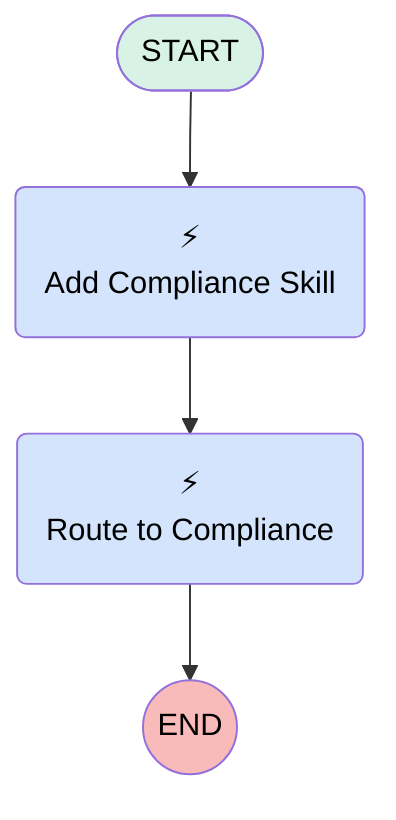

# Case | Autolaunched | Omni Routing

## Flow Diagram [(_View History_)](Case_Autolaunched_Omni_Routing-history.md)

<!-- Flow description -->

## General Information

|<!-- -->|<!-- -->|
|:---|:---|
|Process Type| Routing Flow|
|Label|Case | Autolaunched | Omni Routing|
|Status|Active|
|Environments|Default|
|Interview Label|Case | Autolaunched | Omni Routing {!$Flow.CurrentDateTime}|
| Builder Type (PM)|LightningFlowBuilder|
| Canvas Mode (PM)|AUTO_LAYOUT_CANVAS|
| Origin Builder Type (PM)|LightningFlowBuilder|
|Connector|[Add_Compliance_Skill](#add_compliance_skill)|
|Next Node|[Add_Compliance_Skill](#add_compliance_skill)|

## Variables

|Name|Data Type|Is Collection|Is Input|Is Output|Object Type|Description|
|:-- |:--:|:--:|:--:|:--:|:--:|:--  |
|input_record|SObject|⬜|✅|⬜|Case|<!-- -->|
|recordId|String|⬜|✅|⬜|<!-- -->|<!-- -->|
|skillList|SObject|✅|⬜|⬜|SkillRequirement|<!-- -->|

## Flow Nodes Details

### Add_Compliance_Skill

|<!-- -->|<!-- -->|
|:---|:---|
|Type|Action Call|
|Label|Add Compliance Skill|
|Action Type|Add Skill Requirements|
|Action Name|addSkillRequirements|
|Flow Transaction Model|CurrentTransaction|
|Name Segment|addSkillRequirements|
|Offset|0|
|Output Parameters|assignToReference: skillList name: skillRequirements |
|Version String|2.0.0|
|Skill Requirement (input)|[{"id":"92411a55","skillLabel":"Compliance","skillDevName":"Compliance","skillLevel":"0","skillPriority":"0","isAdditionalSkill":false}]|
|Skill Requirements Resource Item (input)|skillList|
|Skill1 Id (input)|setupReference: Compliance setupReferenceType: Skill |
|Connector|[Route_to_Compliance](#route_to_compliance)|

### Route_to_Compliance

|<!-- -->|<!-- -->|
|:---|:---|
|Type|Action Call|
|Label|Route to Compliance|
|Action Type|Route Work|
|Action Name|routeWork|
|Flow Transaction Model|CurrentTransaction|
|Name Segment|routeWork|
|Offset|0|
|Version String|2.0.0|
|Record Id (input)|recordId|
|Service Channel Label (input)|Case|
|Service Channel Dev Name (input)|Case|
|Routing Type (input)|SkillsBased|
|Routing Config Label (input)|Compliance Case|
|Agent Label (input)|<!-- -->|
|Queue Label (input)|<!-- -->|
|Skill Option (input)|Both|
|Skill Requirements Resource Item (input)|skillList|
|Bot Label (input)|<!-- -->|
|External Conversation Bot Label (input)|<!-- -->|
|Copilot Label (input)|<!-- -->|
|Agentforce Employee Agent Label (input)|<!-- -->|
|Service Channel Id (input)|setupReference: Case setupReferenceType: ServiceChannel |
|Routing Config Id (input)|setupReference: Compliance_Case setupReferenceType: QueueRoutingConfig |
|Bot Id (input)|<!-- -->|
|Copilot Id (input)|<!-- -->|
|Agentforce Employee Agent Id (input)|<!-- -->|
|External Conversation Bot Id (input)|<!-- -->|
|Queue Id (input)|<!-- -->|
|Agent Id (input)|<!-- -->|

___

_Documentation generated from branch monitoring_myubiquity by [sfdx-hardis](https://sfdx-hardis.cloudity.com), featuring [salesforce-flow-visualiser](https://github.com/toddhalfpenny/salesforce-flow-visualiser)_

## Dependencies

- [Case_After_Save_Invoke_Omni_Routing](Case_After_Save_Invoke_Omni_Routing.md)
