# Case | Process | Complete Connected Tasks

## Flow Diagram [(_View History_)](Case_Process_Complete_Connected_Tasks-history.md)

```mermaid
%% If you read this, your Markdown visualizer does not handle MermaidJS syntax.
%% - If you are in VS Code, install extension `Markdown Preview Mermaid Support` at https://marketplace.visualstudio.com/items?itemName=bierner.markdown-mermaid
%% - If you are using sfdx-hardis, try to define env variable `MERMAID_MODES=cli,docker` ,then run again the command to regenerate markdown with SVG images.
%% - If you are within mkdocs-material, define mermaid plugin in `mkdocs.yml` as described in https://squidfunk.github.io/mkdocs-material/extensions/mermaid/
%% - As a last resort, you can copy-paste this MermaidJS code into https://mermaid.live/ to see the flow diagram

flowchart TB
START(["START<br/><b>AutoLaunched Flow</b></br>"]):::startClass
click START "#general-information" "2323933229"

Add_Id[\"🟰 <em></em><br/>Add Id"/]:::assignments
click Add_Id "#add_id" "3785012249"

PT_Loop{{"🔁 <em></em><br/>PT Loop"}}:::loops
click PT_Loop "#pt_loop" "3077876821"

Get_Project_Tasks[("🔍 <em></em><br/>Get Project Tasks")]:::recordLookups
click Get_Project_Tasks "#get_project_tasks" "2881777483"

Complete_Tasks[["🔗 <em>Subflow</em><br/>Complete Tasks"]]:::subflows
click Complete_Tasks "#complete_tasks" "3423876680"

Add_Id --> PT_Loop
PT_Loop --> |"For Each"|Add_Id
PT_Loop ---> |"After Last"|Complete_Tasks
Get_Project_Tasks --> PT_Loop
START -->  Get_Project_Tasks
Complete_Tasks --> END_Complete_Tasks
END_Complete_Tasks(( END )):::endClass


classDef actionCalls fill:#D4E4FC,color:black,text-decoration:none,max-height:100px
classDef assignments fill:#FBEED7,color:black,text-decoration:none,max-height:100px
classDef collectionProcessors fill:#F0E3FA,color:black,text-decoration:none,max-height:100px
classDef customErrors fill:#FFE9E9,color:black,text-decoration:none,max-height:100px
classDef decisions fill:#FDEAF6,color:black,text-decoration:none,max-height:100px
classDef loops fill:#FDEAF6,color:black,text-decoration:none,max-height:100px
classDef recordCreates fill:#FFF8C9,color:black,text-decoration:none,max-height:100px
classDef recordDeletes fill:#FFF8C9,color:black,text-decoration:none,max-height:100px
classDef recordLookups fill:#EDEAFF,color:black,text-decoration:none,max-height:100px
classDef recordUpdates fill:#FFF8C9,color:black,text-decoration:none,max-height:100px
classDef screens fill:#DFF6FF,color:black,text-decoration:none,max-height:100px
classDef subflows fill:#D4E4FC,color:black,text-decoration:none,max-height:100px
classDef startClass fill:#D9F2E6,color:black,text-decoration:none,max-height:100px
classDef endClass fill:#F9BABA,color:black,text-decoration:none,max-height:100px
classDef transforms fill:#FDEAF6,color:black,text-decoration:none,max-height:100px


```

<!-- Flow description -->

## General Information

|<!-- -->|<!-- -->|
|:---|:---|
|Process Type| Auto Launched Flow|
|Label|Case | Process | Complete Connected Tasks|
|Status|Active|
|Interview Label|Case | Process | Complete Connected Tasks {!$Flow.CurrentDateTime}|
| Builder Type (PM)|LightningFlowBuilder|
| Canvas Mode (PM)|FREE_FORM_CANVAS|
| Origin Builder Type (PM)|LightningFlowBuilder|
|Connector|[Get_Project_Tasks](#get_project_tasks)|
|Next Node|[Get_Project_Tasks](#get_project_tasks)|

## Variables

|Name|Data Type|Is Collection|Is Input|Is Output|Object Type|Description|
|:-- |:--:|:--:|:--:|:--:|:--:|:--  |
|ids|String|✅|✅|⬜|<!-- -->|<!-- -->|
|recordId|String|⬜|✅|⬜|<!-- -->|<!-- -->|

## Flow Nodes Details

### Add_Id

|<!-- -->|<!-- -->|
|:---|:---|
|Type|Assignment|
|Label|Add Id|
|Connector|[PT_Loop](#pt_loop)|

#### Assignments

|Assign To Reference|Operator|Value|
|:-- |:--:|:--: |
|ids| Add|PT_Loop.Id|

### PT_Loop

|<!-- -->|<!-- -->|
|:---|:---|
|Type|Loop|
|Label|PT Loop|
|Collection Reference|[Get_Project_Tasks](#get_project_tasks)|
|Iteration Order|Asc|
|Next Value Connector|[Add_Id](#add_id)|
|No More Values Connector|[Complete_Tasks](#complete_tasks)|

### Get_Project_Tasks

|<!-- -->|<!-- -->|
|:---|:---|
|Type|Record Lookup|
|Object|Project_Task__c|
|Label|Get Project Tasks|
|Assign Null Values If No Records Found|⬜|
|Get First Record Only|⬜|
|Store Output Automatically|✅|
|Connector|[PT_Loop](#pt_loop)|

#### Filters (logic: **and**)

|Filter Id|Field|Operator|Value|
|:-- |:-- |:--:|:--: |
|1|Connected_Case__c| Equal To|recordId|

### Complete_Tasks

|<!-- -->|<!-- -->|
|:---|:---|
|Type|Subflow|
|Label|Complete Tasks|
|Flow Name|Project_Task_Button_Process_Complete_Tasks|
|Store Output Automatically|✅|

#### Input Assignments

|Field|Value|
|:-- |:--: |
|<!-- -->|ids|

___

_Documentation generated from branch monitoring_myubiquity by [sfdx-hardis](https://sfdx-hardis.cloudity.com), featuring [salesforce-flow-visualiser](https://github.com/toddhalfpenny/salesforce-flow-visualiser)_