# Case | Tab | L+D Request

## Flow Diagram [(_View History_)](Case_Tab_L_D_Request-history.md)

```mermaid
%% If you read this, your Markdown visualizer does not handle MermaidJS syntax.
%% - If you are in VS Code, install extension `Markdown Preview Mermaid Support` at https://marketplace.visualstudio.com/items?itemName=bierner.markdown-mermaid
%% - If you are using sfdx-hardis, try to define env variable `MERMAID_MODES=cli,docker` ,then run again the command to regenerate markdown with SVG images.
%% - If you are within mkdocs-material, define mermaid plugin in `mkdocs.yml` as described in https://squidfunk.github.io/mkdocs-material/extensions/mermaid/
%% - As a last resort, you can copy-paste this MermaidJS code into https://mermaid.live/ to see the flow diagram

flowchart TB
START(["START<br/><b>Screen Flow</b>"]):::startClass
click START "#general-information" "3548735825"

Create_L_D_Case[("➕ <em></em><br/>Create L+D Case")]:::recordCreates
click Create_L_D_Case "#create_l_d_case" "28302859"

Content_Information(["💻 <em></em><br/>Content Information"]):::screens
click Content_Information "#content_information" "2052814398"

Finished(["💻 <em></em><br/>Finished"]):::screens
click Finished "#finished" "1088564679"

Initial_Information(["💻 <em></em><br/>Initial Information"]):::screens
click Initial_Information "#initial_information" "510597134"

RequestDetails(["💻 <em></em><br/>RequestDetails"]):::screens
click RequestDetails "#requestdetails" "2921276"

Create_L_D_Case --> Finished
Content_Information --> Create_L_D_Case
Finished --> END_Finished
Initial_Information --> RequestDetails
RequestDetails --> Content_Information
START -->  Initial_Information
END_Finished(( END )):::endClass


classDef actionCalls fill:#D4E4FC,color:black,text-decoration:none,max-height:100px
classDef assignments fill:#FBEED7,color:black,text-decoration:none,max-height:100px
classDef collectionProcessors fill:#F0E3FA,color:black,text-decoration:none,max-height:100px
classDef customErrors fill:#FFE9E9,color:black,text-decoration:none,max-height:100px
classDef decisions fill:#FDEAF6,color:black,text-decoration:none,max-height:100px
classDef loops fill:#FDEAF6,color:black,text-decoration:none,max-height:100px
classDef recordCreates fill:#FFF8C9,color:black,text-decoration:none,max-height:100px
classDef recordDeletes fill:#FFF8C9,color:black,text-decoration:none,max-height:100px
classDef recordLookups fill:#EDEAFF,color:black,text-decoration:none,max-height:100px
classDef recordUpdates fill:#FFF8C9,color:black,text-decoration:none,max-height:100px
classDef screens fill:#DFF6FF,color:black,text-decoration:none,max-height:100px
classDef subflows fill:#D4E4FC,color:black,text-decoration:none,max-height:100px
classDef startClass fill:#D9F2E6,color:black,text-decoration:none,max-height:100px
classDef endClass fill:#F9BABA,color:black,text-decoration:none,max-height:100px
classDef transforms fill:#FDEAF6,color:black,text-decoration:none,max-height:100px


```

<!-- Flow description -->

## General Information

|<!-- -->|<!-- -->|
|:---|:---|
|Process Type| Flow|
|Label|Case | Tab | L+D Request|
|Status|Active|
|Environments|Default|
|Interview Label|Case | Tab | L+D Request {!$Flow.CurrentDateTime}|
| Builder Type (PM)|LightningFlowBuilder|
| Canvas Mode (PM)|AUTO_LAYOUT_CANVAS|
| Origin Builder Type (PM)|LightningFlowBuilder|
|Connector|[Initial_Information](#initial_information)|
|Next Node|[Initial_Information](#initial_information)|

## Variables

|Name|Data Type|Is Collection|Is Input|Is Output|Object Type|Description|
|:-- |:--:|:--:|:--:|:--:|:--:|:--  |
|parentId|String|⬜|✅|✅|<!-- -->|<!-- -->|

## Formulas

|Name|Data Type|Expression|Description|
|:-- |:--:|:-- |:--  |
|CurrentUser|String|{!$User.FirstName} + " " + {!$User.LastName}|<!-- -->|
|preferredCompDate|Date|IF({!Project_Type} = "Demo - 10 Day SLA", TODAY() + 10, IF({!Project_Type} = "Tutorial - 10 Day SLA", TODAY() + 10, IF({!Project_Type} = "Training - 15 Day SLA", TODAY() + 15, TODAY() + 5)))|<!-- -->|
|RequestDescripton|String|"Requestor: " + {!Requestor} + BR() + "Department: " +  {!Department} + BR() + "Today's Date: " + TEXT({!Today_s_Date}) + BR() + "Request Type: " + {!Project_Type} + BR() + "Preferred Completion Date: " +  TEXT({!preferredCompDate}) + BR() +BR()+ "Title of Project: " + {!Title_of_Project_File_Name}  + BR() + "New Project or Revision: " + {!Is_This_a_New_Project_or_a_Revision_Update_of_an_Existing_Asset} + BR() + IF({!Is_This_a_New_Project_or_a_Revision_Update_of_an_Existing_Asset}= "Revision", {!URL}, NULL) +BR()+ "Requires Additional Collateral: " +{!Will_the_Content_in_this_Project_Require_Any_Existing_Collateral_to_be_Updated}+ BR()+  IF({!Will_the_Content_in_this_Project_Require_Any_Existing_Collateral_to_be_Updated}= "Yes", {!If_Yes_Please_Provide_Link_s_or_Upload_the_Collateral_Content_that_will_Require}, NULL) +BR()+ "Anyone to Exclude: " + {!Are_There_Any_Specific_Audiences_that_should_be_Excluded_as_Recipients} +BR()+ IF({!Are_There_Any_Specific_Audiences_that_should_be_Excluded_as_Recipients}= "Yes", "Please Exclude: ", NULL) +IF({!Principal1} = TRUE, "Principal", Null) +" " +IF({!Sallus1} = TRUE, "Sallus", NULL) +" "+ IF({!JP_Morgan1}=TRUE, "JP Morgan", NULL)+" " + IF({!Schwab1}=TRUE, "Schwab", NULL)+" " + IF({!RewardJet1}=TRUE, "RewardJet", NULL)+" " + IF({!Other1}=TRUE, {!Please_Specify_Audience_to_Exclude}, NULL)+BR()+ "Co-Branding with Partner(s)?: " + {!Does_this_Project_Need_Co_Branding_with_a_Partner}+BR()+ IF({!Does_this_Project_Need_Co_Branding_with_a_Partner}= "Yes", "Co-Brand With:", Null)+" "+IF({!Principal2} = TRUE, "Principal/Simply Retirement", Null) +" " +IF({!Sallus2} = TRUE, "Sallus", NULL) +" "+ IF({!Sallus_NFP2}=TRUE, "Sallus/NFP", NULL)+" " + IF({!Prospective_Partner_s2}=TRUE || {!Other2}=TRUE, {!If_Prospective_Partner_s_or_Other_Please_Specify}, NULL)+BR()+ "Most Important Key Points/Ideas to Convey: " + {!sBriefly_What_are_the_Most_Important_Key_Point_s_or_Idea_s_You_Want_to_Convey} + BR() + "Notes: " + {!Notes}|<!-- -->|
|Subject|String|{!Title_of_Project_File_Name}|<!-- -->|
|Today|Date|TODAY()|<!-- -->|
|UserDepartment|String|{!$User.Department}|<!-- -->|

## Flow Nodes Details

### Create_L_D_Case

|<!-- -->|<!-- -->|
|:---|:---|
|Type|Record Create|
|Object|Case|
|Label|Create L+D Case|
|Assign Record Id To Reference|parentId|
|Connector|[Finished](#finished)|

#### Input Assignments

|Field|Value|
|:-- |:--: |
|AccountId|0013700000JH68lAAD|
|Alert_Email__c|ubteachin@myubiquity.com|
|Date_Requested__c|Today|
|Department__c|Learning & Development|
|Description|RequestDescripton|
|Origin|Flow-Based Submission|
|OwnerId|005Ho000009KwTY|
|Plan__c|a2o1G000000oQW5QAM|
|Preferred_Completion_Date__c|preferredCompDate|
|RecordTypeId|0121G000000bqxJQAQ|
|Status|New|
|Subject|Subject|
|SuppliedEmail|$User.Email|

### Content_Information

|<!-- -->|<!-- -->|
|:---|:---|
|Type|Screen|
|Label|Content Information|
|Allow Back|✅|
|Allow Finish|✅|
|Allow Pause|⬜|
|Next Or Finish Button Label|Submit|
|Show Footer|✅|
|Show Header|⬜|
|Connector|[Create_L_D_Case](#create_l_d_case)|

#### Logo3

|<!-- -->|<!-- -->|
|:---|:---|
|Extension Name|flowruntime:image|
|Field Type| Component Instance|
|Inputs On Next Nav To Assoc Scrn| Use Stored Values|
|Is Required|✅|
|Store Output Automatically|✅|
|Style Properties|verticalAlignment: &nbsp;&nbsp;stringValue: top width: &nbsp;&nbsp;stringValue: 12 |
|Image Name (input)|ubqtLogo|
|Horizontal Alignment (input)|center|

#### ContentInfoScreen

|<!-- -->|<!-- -->|
|:---|:---|
|Field Text|
<strong style="font-size: 20px;">Content Information</strong>
|
|Field Type| Display Text|
|Style Properties|verticalAlignment: &nbsp;&nbsp;stringValue: top width: &nbsp;&nbsp;stringValue: 12 |

#### sBriefly_What_are_the_Most_Important_Key_Point_s_or_Idea_s_You_Want_to_Convey

|<!-- -->|<!-- -->|
|:---|:---|
|Field Text|Briefly, What are the Most Important Key Point(s) or Idea(s) You Want to Convey?|
|Field Type| Large Text Area|
|Help Text|
E.g., why auto-enrollment should be included in your plan, you'll save more over 30 years because of flat fees, fill out this form so you don't get in trouble with the IRS, etc.
|
|Inputs On Next Nav To Assoc Scrn| Use Stored Values|
|Is Required|✅|
|Style Properties|verticalAlignment: &nbsp;&nbsp;stringValue: top width: &nbsp;&nbsp;stringValue: 12 |

#### Notes

|<!-- -->|<!-- -->|
|:---|:---|
|Field Text|Notes|
|Field Type| Large Text Area|
|Help Text|
Any additional context, requirements, or directions for your request.
|
|Inputs On Next Nav To Assoc Scrn| Use Stored Values|
|Is Required|⬜|
|Style Properties|verticalAlignment: &nbsp;&nbsp;stringValue: top width: &nbsp;&nbsp;stringValue: 12 |

### Finished

|<!-- -->|<!-- -->|
|:---|:---|
|Type|Screen|
|Label|[Finished](#finished)|
|Allow Back|⬜|
|Allow Finish|✅|
|Allow Pause|⬜|
|Next Or Finish Button Label|Done|
|Show Footer|✅|
|Show Header|⬜|

#### Confirmation

|<!-- -->|<!-- -->|
|:---|:---|
|Field Text|
<strong style="font-size: 16px; color: rgb(21, 45, 202);">Thank you, your request has been created. The Learning and Development team may contact you to set up a time to discuss the request. </strong>

 

 

 

<strong style="font-size: 16px; color: rgb(21, 45, 202);">Please review the Learning and Development team's scoping questions here: </strong>

 

<a href="https://myubiquity.my.salesforce.com/sfc/p/00000000hXNr/a/Uo000000ZpkP/ZitJ8dyqeck2qiQV0brvrVvw5VSQdH2bGb8skIgDEKE" rel="noopener noreferrer" target="_blank" style="font-size: 16px; color: rgb(21, 45, 202);"><strong>https://myubiquity.my.salesforce.com/sfc/p/00000000hXNr/a/Uo000000ZpkP/ZitJ8dyqeck2qiQV0brvrVvw5VSQdH2bGb8skIgDEKE</strong></a>
|
|Field Type| Display Text|
|Style Properties|verticalAlignment: &nbsp;&nbsp;stringValue: top width: &nbsp;&nbsp;stringValue: 12 |

### Initial_Information

|<!-- -->|<!-- -->|
|:---|:---|
|Type|Screen|
|Label|Initial Information|
|Allow Back|✅|
|Allow Finish|✅|
|Allow Pause|⬜|
|Show Footer|✅|
|Show Header|⬜|
|Connector|[RequestDetails](#requestdetails)|

#### t

|<!-- -->|<!-- -->|
|:---|:---|
|Extension Name|flowruntime:image|
|Field Type| Component Instance|
|Inputs On Next Nav To Assoc Scrn| Use Stored Values|
|Is Required|✅|
|Store Output Automatically|✅|
|Style Properties|verticalAlignment: &nbsp;&nbsp;stringValue: top width: &nbsp;&nbsp;stringValue: 12 |
|Image Name (input)|ubqtLogo|
|Horizontal Alignment (input)|center|

#### InitialInfo

|<!-- -->|<!-- -->|
|:---|:---|
|Field Text|
<strong style="font-size: 20px;">Initial Information</strong>
|
|Field Type| Display Text|
|Style Properties|verticalAlignment: &nbsp;&nbsp;stringValue: top width: &nbsp;&nbsp;stringValue: 12 |

#### Project_Type

|<!-- -->|<!-- -->|
|:---|:---|
|Data Type|String|
|Choice References|- demo - tutorial - training - help_center |
|Field Text|Project Type|
|Field Type| Dropdown Box|
|Inputs On Next Nav To Assoc Scrn| Use Stored Values|
|Is Required|✅|
|Style Properties|verticalAlignment: &nbsp;&nbsp;stringValue: top width: &nbsp;&nbsp;stringValue: 12 |

#### Today_s_Date

|<!-- -->|<!-- -->|
|:---|:---|
|Data Type|Date|
|Default Value|Today|
|Field Text|Today's Date|
|Field Type| Input Field|
|Inputs On Next Nav To Assoc Scrn| Use Stored Values|
|Is Required|✅|
|Style Properties|verticalAlignment: &nbsp;&nbsp;stringValue: top width: &nbsp;&nbsp;stringValue: 12 |

#### Requestor

|<!-- -->|<!-- -->|
|:---|:---|
|Data Type|String|
|Field Text|Your Name|
|Field Type| Input Field|
|Help Text|
Your Name
|
|Inputs On Next Nav To Assoc Scrn| Use Stored Values|
|Is Required|✅|
|Style Properties|verticalAlignment: &nbsp;&nbsp;stringValue: top width: &nbsp;&nbsp;stringValue: 12 |

#### Department

|<!-- -->|<!-- -->|
|:---|:---|
|Data Type|String|
|Default Value|UserDepartment|
|Field Text|Department|
|Field Type| Input Field|
|Help Text|
Your Department
|
|Inputs On Next Nav To Assoc Scrn| Use Stored Values|
|Is Required|✅|
|Style Properties|verticalAlignment: &nbsp;&nbsp;stringValue: top width: &nbsp;&nbsp;stringValue: 12 |

#### Intended_Use

|<!-- -->|<!-- -->|
|:---|:---|
|Data Type|String|
|Choice References|- helpCenter - Sales - lmsInternal - lmsExternal - knowledge |
|Field Text|Intended Use|
|Field Type| Dropdown Box|
|Inputs On Next Nav To Assoc Scrn| Use Stored Values|
|Is Required|⬜|
|Style Properties|verticalAlignment: &nbsp;&nbsp;stringValue: top width: &nbsp;&nbsp;stringValue: 12 |

### RequestDetails

|<!-- -->|<!-- -->|
|:---|:---|
|Type|Screen|
|Label|[RequestDetails](#requestdetails)|
|Allow Back|✅|
|Allow Finish|✅|
|Allow Pause|⬜|
|Show Footer|✅|
|Show Header|⬜|
|Connector|[Content_Information](#content_information)|

#### Logo2

|<!-- -->|<!-- -->|
|:---|:---|
|Extension Name|flowruntime:image|
|Field Type| Component Instance|
|Inputs On Next Nav To Assoc Scrn| Use Stored Values|
|Is Required|✅|
|Store Output Automatically|✅|
|Style Properties|verticalAlignment: &nbsp;&nbsp;stringValue: top width: &nbsp;&nbsp;stringValue: 12 |
|Image Name (input)|ubqtLogo|
|Horizontal Alignment (input)|center|

#### RequestDetailScreen

|<!-- -->|<!-- -->|
|:---|:---|
|Field Text|
<strong style="font-size: 20px; color: rgb(0, 0, 0);">Request Details</strong>
|
|Field Type| Display Text|
|Style Properties|verticalAlignment: &nbsp;&nbsp;stringValue: top width: &nbsp;&nbsp;stringValue: 12 |

#### Title_of_Project_File_Name

|<!-- -->|<!-- -->|
|:---|:---|
|Data Type|String|
|Field Text|Title of Project/File Name|
|Field Type| Input Field|
|Help Text|
Enter the title of project or document/file name, etc. Marketing may rename and will provide alternate title for review.
|
|Inputs On Next Nav To Assoc Scrn| Use Stored Values|
|Is Required|✅|
|Style Properties|verticalAlignment: &nbsp;&nbsp;stringValue: top width: &nbsp;&nbsp;stringValue: 12 |

#### Is_This_a_New_Project_or_a_Revision_Update_of_an_Existing_Asset

|<!-- -->|<!-- -->|
|:---|:---|
|Data Type|String|
|Choice References|- New - Revision |
|Field Text|Is This a New Project or a Revision/Update of an Existing Asset?|
|Field Type| Dropdown Box|
|Inputs On Next Nav To Assoc Scrn| Use Stored Values|
|Is Required|✅|
|Style Properties|verticalAlignment: &nbsp;&nbsp;stringValue: top width: &nbsp;&nbsp;stringValue: 12 |

#### URL

|<!-- -->|<!-- -->|
|:---|:---|
|Data Type|String|
|Field Text|URL to File in Box/Sharepoint|
|Field Type| Input Field|
|Inputs On Next Nav To Assoc Scrn| Use Stored Values|
|Is Required|⬜|
|Style Properties|verticalAlignment: &nbsp;&nbsp;stringValue: top width: &nbsp;&nbsp;stringValue: 12 |
|Visibility Rule|conditionLogic: and conditions: &nbsp;&nbsp;leftValueReference: Is_This_a_New_Project_or_a_Revision_Update_of_an_Existing_Asset &nbsp;&nbsp;operator: EqualTo &nbsp;&nbsp;rightValue: &nbsp;&nbsp;&nbsp;&nbsp;elementReference: Revision |

#### Will_the_Content_in_this_Project_Require_Any_Existing_Collateral_to_be_Updated

|<!-- -->|<!-- -->|
|:---|:---|
|Data Type|String|
|Choice References|- 'Yes' - 'No' |
|Field Text|Will the Content in this Project Require Any Existing Collateral to be Updated?|
|Field Type| Dropdown Box|
|Inputs On Next Nav To Assoc Scrn| Use Stored Values|
|Is Required|✅|
|Style Properties|verticalAlignment: &nbsp;&nbsp;stringValue: top width: &nbsp;&nbsp;stringValue: 12 |

#### If_Yes_Please_Provide_Link_s_or_Upload_the_Collateral_Content_that_will_Require

|<!-- -->|<!-- -->|
|:---|:---|
|Data Type|String|
|Field Text|If Yes, Please Provide Box/Sharepoint Link(s) for Collateral/Content that will Require Updates:|
|Field Type| Input Field|
|Inputs On Next Nav To Assoc Scrn| Use Stored Values|
|Is Required|⬜|
|Style Properties|verticalAlignment: &nbsp;&nbsp;stringValue: top width: &nbsp;&nbsp;stringValue: 12 |
|Visibility Rule|conditionLogic: and conditions: &nbsp;&nbsp;leftValueReference: >- &nbsp;&nbsp;&nbsp;&nbsp;Will_the_Content_in_this_Project_Require_Any_Existing_Collateral_to_be_Updated &nbsp;&nbsp;operator: EqualTo &nbsp;&nbsp;rightValue: &nbsp;&nbsp;&nbsp;&nbsp;elementReference: 'Yes' |

#### Are_There_Any_Specific_Audiences_that_should_be_Excluded_as_Recipients

|<!-- -->|<!-- -->|
|:---|:---|
|Data Type|String|
|Choice References|- 'Yes' - 'No' |
|Field Text|Are There Any Specific Audiences that should be Excluded as Recipients|
|Field Type| Dropdown Box|
|Help Text|
E.g. Ubiquity partners, clients with advisors should not receive emails advertising investment advisory services, terminated employees with a balance , etc.
|
|Inputs On Next Nav To Assoc Scrn| Use Stored Values|
|Is Required|✅|
|Style Properties|verticalAlignment: &nbsp;&nbsp;stringValue: top width: &nbsp;&nbsp;stringValue: 12 |

#### AudiencesToExclude

|<!-- -->|<!-- -->|
|:---|:---|
|Field Text|
Which Audiences Should Be Excluded?
|
|Field Type| Display Text|
|Style Properties|verticalAlignment: &nbsp;&nbsp;stringValue: top width: &nbsp;&nbsp;stringValue: 12 |
|Visibility Rule|conditionLogic: and conditions: &nbsp;&nbsp;leftValueReference: Are_There_Any_Specific_Audiences_that_should_be_Excluded_as_Recipients &nbsp;&nbsp;operator: EqualTo &nbsp;&nbsp;rightValue: &nbsp;&nbsp;&nbsp;&nbsp;elementReference: 'Yes' |

#### Principal1

|<!-- -->|<!-- -->|
|:---|:---|
|Data Type|Boolean|
|Field Text|Principal|
|Field Type| Input Field|
|Inputs On Next Nav To Assoc Scrn| Use Stored Values|
|Is Required|✅|
|Style Properties|verticalAlignment: &nbsp;&nbsp;stringValue: top width: &nbsp;&nbsp;stringValue: 12 |
|Visibility Rule|conditionLogic: and conditions: &nbsp;&nbsp;leftValueReference: Are_There_Any_Specific_Audiences_that_should_be_Excluded_as_Recipients &nbsp;&nbsp;operator: EqualTo &nbsp;&nbsp;rightValue: &nbsp;&nbsp;&nbsp;&nbsp;elementReference: 'Yes' |

#### Sallus1

|<!-- -->|<!-- -->|
|:---|:---|
|Data Type|Boolean|
|Field Text|Sallus|
|Field Type| Input Field|
|Inputs On Next Nav To Assoc Scrn| Use Stored Values|
|Is Required|✅|
|Style Properties|verticalAlignment: &nbsp;&nbsp;stringValue: top width: &nbsp;&nbsp;stringValue: 12 |
|Visibility Rule|conditionLogic: and conditions: &nbsp;&nbsp;leftValueReference: Are_There_Any_Specific_Audiences_that_should_be_Excluded_as_Recipients &nbsp;&nbsp;operator: EqualTo &nbsp;&nbsp;rightValue: &nbsp;&nbsp;&nbsp;&nbsp;elementReference: 'Yes' |

#### JP_Morgan1

|<!-- -->|<!-- -->|
|:---|:---|
|Data Type|Boolean|
|Field Text|JP Morgan|
|Field Type| Input Field|
|Inputs On Next Nav To Assoc Scrn| Use Stored Values|
|Is Required|✅|
|Style Properties|verticalAlignment: &nbsp;&nbsp;stringValue: top width: &nbsp;&nbsp;stringValue: 12 |
|Visibility Rule|conditionLogic: and conditions: &nbsp;&nbsp;leftValueReference: Are_There_Any_Specific_Audiences_that_should_be_Excluded_as_Recipients &nbsp;&nbsp;operator: EqualTo &nbsp;&nbsp;rightValue: &nbsp;&nbsp;&nbsp;&nbsp;elementReference: 'Yes' |

#### Schwab1

|<!-- -->|<!-- -->|
|:---|:---|
|Data Type|Boolean|
|Field Text|Schwab|
|Field Type| Input Field|
|Inputs On Next Nav To Assoc Scrn| Use Stored Values|
|Is Required|✅|
|Style Properties|verticalAlignment: &nbsp;&nbsp;stringValue: top width: &nbsp;&nbsp;stringValue: 12 |
|Visibility Rule|conditionLogic: and conditions: &nbsp;&nbsp;leftValueReference: Are_There_Any_Specific_Audiences_that_should_be_Excluded_as_Recipients &nbsp;&nbsp;operator: EqualTo &nbsp;&nbsp;rightValue: &nbsp;&nbsp;&nbsp;&nbsp;elementReference: 'Yes' |

#### RewardJet1

|<!-- -->|<!-- -->|
|:---|:---|
|Data Type|Boolean|
|Field Text|RewardJet|
|Field Type| Input Field|
|Inputs On Next Nav To Assoc Scrn| Use Stored Values|
|Is Required|✅|
|Style Properties|verticalAlignment: &nbsp;&nbsp;stringValue: top width: &nbsp;&nbsp;stringValue: 12 |
|Visibility Rule|conditionLogic: and conditions: &nbsp;&nbsp;leftValueReference: Are_There_Any_Specific_Audiences_that_should_be_Excluded_as_Recipients &nbsp;&nbsp;operator: EqualTo &nbsp;&nbsp;rightValue: &nbsp;&nbsp;&nbsp;&nbsp;elementReference: 'Yes' |

#### Other1

|<!-- -->|<!-- -->|
|:---|:---|
|Data Type|Boolean|
|Field Text|Other|
|Field Type| Input Field|
|Inputs On Next Nav To Assoc Scrn| Use Stored Values|
|Is Required|✅|
|Style Properties|verticalAlignment: &nbsp;&nbsp;stringValue: top width: &nbsp;&nbsp;stringValue: 12 |
|Visibility Rule|conditionLogic: and conditions: &nbsp;&nbsp;leftValueReference: Are_There_Any_Specific_Audiences_that_should_be_Excluded_as_Recipients &nbsp;&nbsp;operator: EqualTo &nbsp;&nbsp;rightValue: &nbsp;&nbsp;&nbsp;&nbsp;elementReference: 'Yes' |

#### Please_Specify_Audience_to_Exclude

|<!-- -->|<!-- -->|
|:---|:---|
|Data Type|String|
|Field Text|Please Specify Audience to Exclude|
|Field Type| Input Field|
|Inputs On Next Nav To Assoc Scrn| Use Stored Values|
|Is Required|⬜|
|Style Properties|verticalAlignment: &nbsp;&nbsp;stringValue: top width: &nbsp;&nbsp;stringValue: 12 |
|Visibility Rule|conditionLogic: and conditions: &nbsp;&nbsp;leftValueReference: Other1 &nbsp;&nbsp;operator: EqualTo &nbsp;&nbsp;rightValue: &nbsp;&nbsp;&nbsp;&nbsp;booleanValue: true |

#### Does_this_Project_Need_Co_Branding_with_a_Partner

|<!-- -->|<!-- -->|
|:---|:---|
|Data Type|String|
|Choice References|- 'Yes' - 'No' |
|Field Text|Does this Project Need Co-Branding with a Partner?|
|Field Type| Dropdown Box|
|Help Text|
If this is being created for a partner, do we need to add their logo in addition to Ubiquity's?
|
|Inputs On Next Nav To Assoc Scrn| Use Stored Values|
|Is Required|✅|
|Style Properties|verticalAlignment: &nbsp;&nbsp;stringValue: top width: &nbsp;&nbsp;stringValue: 12 |

#### SpecifyPartnersToCoBrand

|<!-- -->|<!-- -->|
|:---|:---|
|Field Text|
Which Partners? (Select All That Apply)
|
|Field Type| Display Text|
|Style Properties|verticalAlignment: &nbsp;&nbsp;stringValue: top width: &nbsp;&nbsp;stringValue: 12 |
|Visibility Rule|conditionLogic: and conditions: &nbsp;&nbsp;leftValueReference: Does_this_Project_Need_Co_Branding_with_a_Partner &nbsp;&nbsp;operator: EqualTo &nbsp;&nbsp;rightValue: &nbsp;&nbsp;&nbsp;&nbsp;elementReference: 'Yes' |

#### Principal2

|<!-- -->|<!-- -->|
|:---|:---|
|Data Type|Boolean|
|Field Text|Principal/Simply Retirement|
|Field Type| Input Field|
|Inputs On Next Nav To Assoc Scrn| Use Stored Values|
|Is Required|✅|
|Style Properties|verticalAlignment: &nbsp;&nbsp;stringValue: top width: &nbsp;&nbsp;stringValue: 12 |
|Visibility Rule|conditionLogic: and conditions: &nbsp;&nbsp;leftValueReference: Does_this_Project_Need_Co_Branding_with_a_Partner &nbsp;&nbsp;operator: EqualTo &nbsp;&nbsp;rightValue: &nbsp;&nbsp;&nbsp;&nbsp;elementReference: 'Yes' |

#### Sallus2

|<!-- -->|<!-- -->|
|:---|:---|
|Data Type|Boolean|
|Field Text|Sallus|
|Field Type| Input Field|
|Inputs On Next Nav To Assoc Scrn| Use Stored Values|
|Is Required|✅|
|Style Properties|verticalAlignment: &nbsp;&nbsp;stringValue: top width: &nbsp;&nbsp;stringValue: 12 |
|Visibility Rule|conditionLogic: and conditions: &nbsp;&nbsp;leftValueReference: Does_this_Project_Need_Co_Branding_with_a_Partner &nbsp;&nbsp;operator: EqualTo &nbsp;&nbsp;rightValue: &nbsp;&nbsp;&nbsp;&nbsp;elementReference: 'Yes' |

#### Sallus_NFP2

|<!-- -->|<!-- -->|
|:---|:---|
|Data Type|Boolean|
|Field Text|Sallus/NFP|
|Field Type| Input Field|
|Inputs On Next Nav To Assoc Scrn| Use Stored Values|
|Is Required|✅|
|Style Properties|verticalAlignment: &nbsp;&nbsp;stringValue: top width: &nbsp;&nbsp;stringValue: 12 |
|Visibility Rule|conditionLogic: and conditions: &nbsp;&nbsp;leftValueReference: Does_this_Project_Need_Co_Branding_with_a_Partner &nbsp;&nbsp;operator: EqualTo &nbsp;&nbsp;rightValue: &nbsp;&nbsp;&nbsp;&nbsp;elementReference: 'Yes' |

#### Prospective_Partner_s2

|<!-- -->|<!-- -->|
|:---|:---|
|Data Type|Boolean|
|Field Text|Prospective Partner(s)|
|Field Type| Input Field|
|Inputs On Next Nav To Assoc Scrn| Use Stored Values|
|Is Required|✅|
|Style Properties|verticalAlignment: &nbsp;&nbsp;stringValue: top width: &nbsp;&nbsp;stringValue: 12 |
|Visibility Rule|conditionLogic: and conditions: &nbsp;&nbsp;leftValueReference: Does_this_Project_Need_Co_Branding_with_a_Partner &nbsp;&nbsp;operator: EqualTo &nbsp;&nbsp;rightValue: &nbsp;&nbsp;&nbsp;&nbsp;elementReference: 'Yes' |

#### Other2

|<!-- -->|<!-- -->|
|:---|:---|
|Data Type|Boolean|
|Field Text|Other|
|Field Type| Input Field|
|Inputs On Next Nav To Assoc Scrn| Use Stored Values|
|Is Required|✅|
|Style Properties|verticalAlignment: &nbsp;&nbsp;stringValue: top width: &nbsp;&nbsp;stringValue: 12 |
|Visibility Rule|conditionLogic: and conditions: &nbsp;&nbsp;leftValueReference: Does_this_Project_Need_Co_Branding_with_a_Partner &nbsp;&nbsp;operator: EqualTo &nbsp;&nbsp;rightValue: &nbsp;&nbsp;&nbsp;&nbsp;elementReference: 'Yes' |

#### If_Prospective_Partner_s_or_Other_Please_Specify

|<!-- -->|<!-- -->|
|:---|:---|
|Data Type|String|
|Field Text|If Prospective Partner(s) or Other, Please Specify:|
|Field Type| Input Field|
|Inputs On Next Nav To Assoc Scrn| Use Stored Values|
|Is Required|⬜|
|Style Properties|verticalAlignment: &nbsp;&nbsp;stringValue: top width: &nbsp;&nbsp;stringValue: 12 |
|Visibility Rule|conditionLogic: or conditions: &nbsp;&nbsp;- leftValueReference: Prospective_Partner_s2 &nbsp;&nbsp;&nbsp;&nbsp;operator: EqualTo &nbsp;&nbsp;&nbsp;&nbsp;rightValue: &nbsp;&nbsp;&nbsp;&nbsp;&nbsp;&nbsp;booleanValue: true &nbsp;&nbsp;- leftValueReference: Other2 &nbsp;&nbsp;&nbsp;&nbsp;operator: EqualTo &nbsp;&nbsp;&nbsp;&nbsp;rightValue: &nbsp;&nbsp;&nbsp;&nbsp;&nbsp;&nbsp;booleanValue: true |

___

_Documentation generated from branch monitoring_myubiquity by [sfdx-hardis](https://sfdx-hardis.cloudity.com), featuring [salesforce-flow-visualiser](https://github.com/toddhalfpenny/salesforce-flow-visualiser)_