# Chat | Chat TimeStamp

## Flow Diagram [(_View History_)](Chat_Chat_TimeStamp-history.md)

```mermaid
%% If you read this, your Markdown visualizer does not handle MermaidJS syntax.
%% - If you are in VS Code, install extension `Markdown Preview Mermaid Support` at https://marketplace.visualstudio.com/items?itemName=bierner.markdown-mermaid
%% - If you are using sfdx-hardis, try to define env variable `MERMAID_MODES=cli,docker` ,then run again the command to regenerate markdown with SVG images.
%% - If you are within mkdocs-material, define mermaid plugin in `mkdocs.yml` as described in https://squidfunk.github.io/mkdocs-material/extensions/mermaid/
%% - As a last resort, you can copy-paste this MermaidJS code into https://mermaid.live/ to see the flow diagram

flowchart TB
START(["START<br/><b>LiveChatTranscript</b></br>Type: <b>On All Changes</b>"]):::startClass
click START "#general-information" "1261569568"

START --> myDecision
myDecision{"🔀 <em></em><br/>myDecision"}:::decisions
click myDecision "#mydecision" "3360702907"

myDecision2{"🔀 <em></em><br/>myDecision2"}:::decisions
click myDecision2 "#mydecision2" "4274086064"

myDecision5{"🔀 <em></em><br/>myDecision5"}:::decisions
click myDecision5 "#mydecision5" "2316450739"

myRule_1_A1[("🛠️ <em></em><br/>Chat Week")]:::recordUpdates
click myRule_1_A1 "#myrule_1_a1" "4289721522"

myRule_3_A1[("🛠️ <em></em><br/>Time Stamp")]:::recordUpdates
click myRule_3_A1 "#myrule_3_a1" "1118085521"

myRule_6_A1[("🛠️ <em></em><br/>Time Stamp")]:::recordUpdates
click myRule_6_A1 "#myrule_6_a1" "4061424135"

myDecision --> |"Chat Week"| myRule_1_A1
myDecision --> |"default"| myDecision2
myDecision2 --> |"DST"| myRule_3_A1
myDecision2 --> |"default"| myDecision5
myDecision5 --> |"Non DST"| myRule_6_A1
myDecision5 --> |"default"| END_myDecision5
myRule_1_A1 --> myDecision2
myRule_3_A1 --> myDecision5
myRule_6_A1 --> END_myRule_6_A1
END_myDecision5(( END )):::endClass
END_myRule_6_A1(( END )):::endClass


classDef actionCalls fill:#D4E4FC,color:black,text-decoration:none,max-height:100px
classDef assignments fill:#FBEED7,color:black,text-decoration:none,max-height:100px
classDef collectionProcessors fill:#F0E3FA,color:black,text-decoration:none,max-height:100px
classDef customErrors fill:#FFE9E9,color:black,text-decoration:none,max-height:100px
classDef decisions fill:#FDEAF6,color:black,text-decoration:none,max-height:100px
classDef loops fill:#FDEAF6,color:black,text-decoration:none,max-height:100px
classDef recordCreates fill:#FFF8C9,color:black,text-decoration:none,max-height:100px
classDef recordDeletes fill:#FFF8C9,color:black,text-decoration:none,max-height:100px
classDef recordLookups fill:#EDEAFF,color:black,text-decoration:none,max-height:100px
classDef recordUpdates fill:#FFF8C9,color:black,text-decoration:none,max-height:100px
classDef screens fill:#DFF6FF,color:black,text-decoration:none,max-height:100px
classDef subflows fill:#D4E4FC,color:black,text-decoration:none,max-height:100px
classDef startClass fill:#D9F2E6,color:black,text-decoration:none,max-height:100px
classDef endClass fill:#F9BABA,color:black,text-decoration:none,max-height:100px
classDef transforms fill:#FDEAF6,color:black,text-decoration:none,max-height:100px


```

<!-- Flow description -->

## General Information

|<!-- -->|<!-- -->|
|:---|:---|
|Process Type| Workflow|
|Label|Chat | Chat TimeStamp|
|Status|⚠️ Draft|
|Description|Stamps Request HHMM and ChatTimeText - converting from GMT while accounting for DST|
|Interview Label|Chat_Chat_TimeStamp-6_InterviewLabel|
|Start Element Reference|[myDecision](#mydecision)|
| Object Type (PM)|LiveChatTranscript|
| Object Variable (PM)|myVariable_current|
| Old Object Variable (PM)|myVariable_old|
| Trigger Type (PM)|onAllChanges|

## Variables

|Name|Data Type|Is Collection|Is Input|Is Output|Object Type|Description|
|:-- |:--:|:--:|:--:|:--:|:--:|:--  |
|myVariable_current|SObject|⬜|✅|✅|LiveChatTranscript|<!-- -->|
|myVariable_old|SObject|⬜|✅|⬜|LiveChatTranscript|<!-- -->|

## Formulas

|Name|Data Type|Expression|Description|
|:-- |:--:|:-- |:--  |
|formula_4_myRule_3_A1_4456536391|String|LEFT(RIGHT(text( {!myVariable_current.RequestTime}  -0.29166666 ),9),8)|<!-- -->|
|formula_7_myRule_6_A1_1692367422|String|LEFT(RIGHT(text( {!myVariable_current.RequestTime}  -0.3333333333 ),9),8)|<!-- -->|

## Flow Nodes Details

### myDecision

|<!-- -->|<!-- -->|
|:---|:---|
|Type|Decision|
|Label|[myDecision](#mydecision)|
|Default Connector|[myDecision2](#mydecision2)|
|Default Connector Label|default|
|Index (PM)|numberValue: 0 |

#### Rule myRule_1 (Chat Week)

|<!-- -->|<!-- -->|
|:---|:---|
|Connector|[myRule_1_A1](#myrule_1_a1)|
|Condition Logic|and|

|Condition Id|Left Value Reference|Operator|Right Value|
|:-- |:-- |:--:|:--: |
|1|myVariable_current.Status| Equal To|Completed|

### myDecision2

|<!-- -->|<!-- -->|
|:---|:---|
|Type|Decision|
|Label|[myDecision2](#mydecision2)|
|Default Connector|[myDecision5](#mydecision5)|
|Default Connector Label|default|
|Index (PM)|1|

#### Rule myRule_3 (DST)

|<!-- -->|<!-- -->|
|:---|:---|
|Connector|[myRule_3_A1](#myrule_3_a1)|
|Condition Logic|and|

|Condition Id|Left Value Reference|Operator|Right Value|
|:-- |:-- |:--:|:--: |
|1|myVariable_current.Status| Equal To|Completed|
|2|myVariable_current.Chat_Week_Number__c| Greater Than|10|
|3|myVariable_current.Chat_Week_Number__c| Less Than|45|

### myDecision5

|<!-- -->|<!-- -->|
|:---|:---|
|Type|Decision|
|Label|[myDecision5](#mydecision5)|
|Default Connector Label|default|
|Index (PM)|2|

#### Rule myRule_6 (Non DST)

|<!-- -->|<!-- -->|
|:---|:---|
|Connector|[myRule_6_A1](#myrule_6_a1)|
|Condition Logic|1 AND (2 OR 3)|

|Condition Id|Left Value Reference|Operator|Right Value|
|:-- |:-- |:--:|:--: |
|1|myVariable_current.Status| Equal To|Completed|
|2|myVariable_current.Chat_Week_Number__c| Less Than|10|
|3|myVariable_current.Chat_Week_Number__c| Greater Than|45|

### myRule_1_A1

|<!-- -->|<!-- -->|
|:---|:---|
|Type|Record Update|
|Object|LiveChatTranscript|
|Label|Chat Week|
|Evaluation Type (PM)|always|
|Extra Type Info (PM)|<!-- -->|
|Is Child Relationship (PM)|⬜|
|Reference (PM)|[LiveChatTranscript]|
|Reference Target Field (PM)|<!-- -->|
|Connector|[myDecision2](#mydecision2)|

#### Filters (logic: **and**)

|Filter Id|Field|Operator|Value|
|:-- |:-- |:--:|:--: |
|1|Id| Equal To|myVariable_current.Id|

#### Input Assignments

|Field|Value|
|:-- |:--: |
|Chat_Week_Number__c|myVariable_current.Request_Week__c|

### myRule_3_A1

|<!-- -->|<!-- -->|
|:---|:---|
|Type|Record Update|
|Object|LiveChatTranscript|
|Label|Time Stamp|
|Evaluation Type (PM)|always|
|Extra Type Info (PM)|<!-- -->|
|Is Child Relationship (PM)|⬜|
|Reference (PM)|[LiveChatTranscript]|
|Reference Target Field (PM)|<!-- -->|
|Connector|[myDecision5](#mydecision5)|

#### Filters (logic: **and**)

|Filter Id|Field|Operator|Value|
|:-- |:-- |:--:|:--: |
|1|Id| Equal To|myVariable_current.Id|

#### Input Assignments

|Field|Value|
|:-- |:--: |
|Chat_Request_Time_Text__c|formula_4_myRule_3_A1_4456536391|

### myRule_6_A1

|<!-- -->|<!-- -->|
|:---|:---|
|Type|Record Update|
|Object|LiveChatTranscript|
|Label|Time Stamp|
|Evaluation Type (PM)|always|
|Extra Type Info (PM)|<!-- -->|
|Is Child Relationship (PM)|⬜|
|Reference (PM)|[LiveChatTranscript]|
|Reference Target Field (PM)|<!-- -->|

#### Filters (logic: **and**)

|Filter Id|Field|Operator|Value|
|:-- |:-- |:--:|:--: |
|1|Id| Equal To|myVariable_current.Id|

#### Input Assignments

|Field|Value|
|:-- |:--: |
|Chat_Request_Time_Text__c|formula_7_myRule_6_A1_1692367422|

___

_Documentation generated from branch monitoring_myubiquity by [sfdx-hardis](https://sfdx-hardis.cloudity.com), featuring [salesforce-flow-visualiser](https://github.com/toddhalfpenny/salesforce-flow-visualiser)_