# Compliance | Calculation Case Counter

## Flow Diagram [(_View History_)](Compliance_Calculation_Case_Counter-history.md)

```mermaid
%% If you read this, your Markdown visualizer does not handle MermaidJS syntax.
%% - If you are in VS Code, install extension `Markdown Preview Mermaid Support` at https://marketplace.visualstudio.com/items?itemName=bierner.markdown-mermaid
%% - If you are using sfdx-hardis, try to define env variable `MERMAID_MODES=cli,docker` ,then run again the command to regenerate markdown with SVG images.
%% - If you are within mkdocs-material, define mermaid plugin in `mkdocs.yml` as described in https://squidfunk.github.io/mkdocs-material/extensions/mermaid/
%% - As a last resort, you can copy-paste this MermaidJS code into https://mermaid.live/ to see the flow diagram

flowchart TB
START(["START<br/><b>Calculation__c</b></br>Type: <b>On All Changes</b>"]):::startClass
click START "#general-information" "2000086018"

START --> myDecision
myDecision{"🔀 <em></em><br/>myDecision"}:::decisions
click myDecision "#mydecision" "1179678311"

myDecision3{"🔀 <em></em><br/>myDecision3"}:::decisions
click myDecision3 "#mydecision3" "1710581973"

myDecision7{"🔀 <em></em><br/>myDecision7"}:::decisions
click myDecision7 "#mydecision7" "3355114037"

myRule_1_pmetdec{"🔀 <em></em><br/>Previously Met Decision"}:::decisions
click myRule_1_pmetdec "#myrule_1_pmetdec" "2863949684"

myRule_4_pmetdec{"🔀 <em></em><br/>Previously Met Decision"}:::decisions
click myRule_4_pmetdec "#myrule_4_pmetdec" "576618534"

myRule_8_pmetdec{"🔀 <em></em><br/>Previously Met Decision"}:::decisions
click myRule_8_pmetdec "#myrule_8_pmetdec" "4125235661"

myRule_4_A1[("➕ <em></em><br/>Compliance Child Case")]:::recordCreates
click myRule_4_A1 "#myrule_4_a1" "1911491107"

myRule_1_A1[("🛠️ <em></em><br/>Open Counter  + 1")]:::recordUpdates
click myRule_1_A1 "#myrule_1_a1" "3569094222"

myRule_8_A1[("🛠️ <em></em><br/>Close Counter + 1")]:::recordUpdates
click myRule_8_A1 "#myrule_8_a1" "1328401356"

myDecision --> |"Calculation Created"| myRule_1_pmetdec
myDecision --> |"default"| myDecision3
myDecision3 --> |"Calculation Requested"| myRule_4_pmetdec
myDecision3 --> |"default"| myDecision7
myDecision7 --> |"Calculation Delivered"| myRule_8_pmetdec
myDecision7 --> |"default"| END_myDecision7
myRule_1_pmetdec --> |"Previously Met - Null"| myRule_1_A1
myRule_1_pmetdec --> |"Not Previously Met"| myRule_1_A1
myRule_4_pmetdec --> |"Previously Met - Null"| myRule_4_A1
myRule_4_pmetdec --> |"Not Previously Met"| myRule_4_A1
myRule_8_pmetdec --> |"Previously Met - Null"| myRule_8_A1
myRule_8_pmetdec --> |"Not Previously Met"| myRule_8_A1
myRule_4_A1 --> END_myRule_4_A1
myRule_1_A1 --> END_myRule_1_A1
myRule_8_A1 --> END_myRule_8_A1
END_myDecision7(( END )):::endClass
END_myRule_4_A1(( END )):::endClass
END_myRule_1_A1(( END )):::endClass
END_myRule_8_A1(( END )):::endClass


classDef actionCalls fill:#D4E4FC,color:black,text-decoration:none,max-height:100px
classDef assignments fill:#FBEED7,color:black,text-decoration:none,max-height:100px
classDef collectionProcessors fill:#F0E3FA,color:black,text-decoration:none,max-height:100px
classDef customErrors fill:#FFE9E9,color:black,text-decoration:none,max-height:100px
classDef decisions fill:#FDEAF6,color:black,text-decoration:none,max-height:100px
classDef loops fill:#FDEAF6,color:black,text-decoration:none,max-height:100px
classDef recordCreates fill:#FFF8C9,color:black,text-decoration:none,max-height:100px
classDef recordDeletes fill:#FFF8C9,color:black,text-decoration:none,max-height:100px
classDef recordLookups fill:#EDEAFF,color:black,text-decoration:none,max-height:100px
classDef recordUpdates fill:#FFF8C9,color:black,text-decoration:none,max-height:100px
classDef screens fill:#DFF6FF,color:black,text-decoration:none,max-height:100px
classDef subflows fill:#D4E4FC,color:black,text-decoration:none,max-height:100px
classDef startClass fill:#D9F2E6,color:black,text-decoration:none,max-height:100px
classDef endClass fill:#F9BABA,color:black,text-decoration:none,max-height:100px
classDef transforms fill:#FDEAF6,color:black,text-decoration:none,max-height:100px


```

<!-- Flow description -->

## General Information

|<!-- -->|<!-- -->|
|:---|:---|
|Process Type| Workflow|
|Label|Compliance | Calculation Case Counter|
|Status|Obsolete|
|Description|Increases/Decreases Case Counter based on Calc object status|
|Interview Label|Compliance_Calculation_Case_Counter-4_InterviewLabel|
|Start Element Reference|[myDecision](#mydecision)|
| Object Type (PM)|Calculation__c|
| Object Variable (PM)|myVariable_current|
| Old Object Variable (PM)|myVariable_old|
| Trigger Type (PM)|onAllChanges|

## Variables

|Name|Data Type|Is Collection|Is Input|Is Output|Object Type|Description|
|:-- |:--:|:--:|:--:|:--:|:--:|:--  |
|myVariable_current|SObject|⬜|✅|✅|Calculation__c|<!-- -->|
|myVariable_old|SObject|⬜|✅|⬜|Calculation__c|<!-- -->|

## Formulas

|Name|Data Type|Expression|Description|
|:-- |:--:|:-- |:--  |
|formula_2_myRule_1_A1_5207281657|Number|{!myVariable_current.Case__r.Number_of_Child_Cases_Open__c}  + 1|<!-- -->|
|formula_5_myRule_4_A1_1498169662|String|"Client Calculation Request from " + {!myVariable_current.Owner:User.FirstName} +  " " + {!myVariable_current.Owner:User.LastName}  + " - " + " See " + {!myVariable_current.Name} + " in parent case"|<!-- -->|
|formula_6_myRule_4_A1_4160484285|String|"Calculation Request for " + {!myVariable_current.Plan__r.Name} + " " + {!myVariable_current.Plan_Year_Request__c}|<!-- -->|
|formula_9_myRule_8_A1_8184875505|Number|{!myVariable_current.Case__r.Number_of_Child_Cases_Closed__c}  + 1|<!-- -->|

## Flow Nodes Details

### myDecision

|<!-- -->|<!-- -->|
|:---|:---|
|Type|Decision|
|Label|[myDecision](#mydecision)|
|Default Connector|[myDecision3](#mydecision3)|
|Default Connector Label|default|
|Index (PM)|numberValue: 0 |

#### Rule myRule_1 (Calculation Created)

|<!-- -->|<!-- -->|
|:---|:---|
|Connector|[myRule_1_pmetdec](#myrule_1_pmetdec)|
|Condition Logic|and|

|Condition Id|Left Value Reference|Operator|Right Value|
|:-- |:-- |:--:|:--: |
|1|myVariable_current.Status__c| Equal To|Opened|

### myDecision3

|<!-- -->|<!-- -->|
|:---|:---|
|Type|Decision|
|Label|[myDecision3](#mydecision3)|
|Default Connector|[myDecision7](#mydecision7)|
|Default Connector Label|default|
|Index (PM)|1|

#### Rule myRule_4 (Calculation Requested)

|<!-- -->|<!-- -->|
|:---|:---|
|Connector|[myRule_4_pmetdec](#myrule_4_pmetdec)|
|Condition Logic|and|

|Condition Id|Left Value Reference|Operator|Right Value|
|:-- |:-- |:--:|:--: |
|1|myVariable_current.Status__c| Equal To|Requested|
|2|myVariable_current.RecordTypeId| Contains|0121G000000RlLi|

### myDecision7

|<!-- -->|<!-- -->|
|:---|:---|
|Type|Decision|
|Label|[myDecision7](#mydecision7)|
|Default Connector Label|default|
|Index (PM)|2|

#### Rule myRule_8 (Calculation Delivered)

|<!-- -->|<!-- -->|
|:---|:---|
|Connector|[myRule_8_pmetdec](#myrule_8_pmetdec)|
|Condition Logic|and|

|Condition Id|Left Value Reference|Operator|Right Value|
|:-- |:-- |:--:|:--: |
|1|myVariable_current.Status__c| Equal To|Delivered|

### myRule_1_pmetdec

|<!-- -->|<!-- -->|
|:---|:---|
|Type|Decision|
|Label|Previously Met Decision|
|Default Connector|[myRule_1_A1](#myrule_1_a1)|
|Default Connector Label|Not Previously Met|

#### Rule myRule_1_pmetnullrule (Previously Met - Null)

|<!-- -->|<!-- -->|
|:---|:---|
|Connector|[myRule_1_A1](#myrule_1_a1)|
|Condition Logic|or|

|Condition Id|Left Value Reference|Operator|Right Value|
|:-- |:-- |:--:|:--: |
|1|myVariable_old| Is Null|✅|

#### Rule myRule_1_pmetrule (Previously Met - Prev)

|<!-- -->|<!-- -->|
|:---|:---|
|Condition Logic|and|

|Condition Id|Left Value Reference|Operator|Right Value|
|:-- |:-- |:--:|:--: |
|1|myVariable_old.Status__c| Equal To|Opened|

### myRule_4_pmetdec

|<!-- -->|<!-- -->|
|:---|:---|
|Type|Decision|
|Label|Previously Met Decision|
|Default Connector|[myRule_4_A1](#myrule_4_a1)|
|Default Connector Label|Not Previously Met|

#### Rule myRule_4_pmetnullrule (Previously Met - Null)

|<!-- -->|<!-- -->|
|:---|:---|
|Connector|[myRule_4_A1](#myrule_4_a1)|
|Condition Logic|or|

|Condition Id|Left Value Reference|Operator|Right Value|
|:-- |:-- |:--:|:--: |
|1|myVariable_old| Is Null|✅|

#### Rule myRule_4_pmetrule (Previously Met - Prev)

|<!-- -->|<!-- -->|
|:---|:---|
|Condition Logic|and|

|Condition Id|Left Value Reference|Operator|Right Value|
|:-- |:-- |:--:|:--: |
|1|myVariable_old.Status__c| Equal To|Requested|
|2|myVariable_old.RecordTypeId| Contains|0121G000000RlLi|

### myRule_8_pmetdec

|<!-- -->|<!-- -->|
|:---|:---|
|Type|Decision|
|Label|Previously Met Decision|
|Default Connector|[myRule_8_A1](#myrule_8_a1)|
|Default Connector Label|Not Previously Met|

#### Rule myRule_8_pmetnullrule (Previously Met - Null)

|<!-- -->|<!-- -->|
|:---|:---|
|Connector|[myRule_8_A1](#myrule_8_a1)|
|Condition Logic|or|

|Condition Id|Left Value Reference|Operator|Right Value|
|:-- |:-- |:--:|:--: |
|1|myVariable_old| Is Null|✅|

#### Rule myRule_8_pmetrule (Previously Met - Prev)

|<!-- -->|<!-- -->|
|:---|:---|
|Condition Logic|and|

|Condition Id|Left Value Reference|Operator|Right Value|
|:-- |:-- |:--:|:--: |
|1|myVariable_old.Status__c| Equal To|Delivered|

### myRule_4_A1

|<!-- -->|<!-- -->|
|:---|:---|
|Type|Record Create|
|Object|Case|
|Label|Compliance Child Case|

#### Input Assignments

|Field|Value|
|:-- |:--: |
|AccountId|myVariable_current.Account__c|
|BusinessHoursId|01m37000000L06l|
|Case_Source__c|Internal|
|Case_Type__c|Child Case|
|Category__c|Calculation|
|Department__c|Compliance|
|Description|formula_5_myRule_4_A1_1498169662|
|OwnerId|00537000001tb5H|
|ParentId|myVariable_current.Case__c|
|Plan__c|myVariable_current.Plan__c|
|Priority|Medium|
|RecordTypeId|01237000000Xs6B|
|Status|New|
|Subject|formula_6_myRule_4_A1_4160484285|

### myRule_1_A1

|<!-- -->|<!-- -->|
|:---|:---|
|Type|Record Update|
|Object|Case|
|Label|Open Counter  + 1|
|Evaluation Type (PM)|always|
|Extra Type Info (PM)|<!-- -->|
|Is Child Relationship (PM)|⬜|
|Reference (PM)|[Calculation__c].Case|
|Reference Target Field (PM)|<!-- -->|

#### Filters (logic: **and**)

|Filter Id|Field|Operator|Value|
|:-- |:-- |:--:|:--: |
|1|Id| Equal To|myVariable_current.Case__c|

#### Input Assignments

|Field|Value|
|:-- |:--: |
|Number_of_Child_Cases_Open__c|formula_2_myRule_1_A1_5207281657|

### myRule_8_A1

|<!-- -->|<!-- -->|
|:---|:---|
|Type|Record Update|
|Object|Case|
|Label|Close Counter + 1|
|Evaluation Type (PM)|always|
|Extra Type Info (PM)|<!-- -->|
|Is Child Relationship (PM)|⬜|
|Reference (PM)|[Calculation__c].Case|
|Reference Target Field (PM)|<!-- -->|

#### Filters (logic: **and**)

|Filter Id|Field|Operator|Value|
|:-- |:-- |:--:|:--: |
|1|Id| Equal To|myVariable_current.Case__c|

#### Input Assignments

|Field|Value|
|:-- |:--: |
|Number_of_Child_Cases_Closed__c|formula_9_myRule_8_A1_8184875505|

___

_Documentation generated from branch monitoring_myubiquity by [sfdx-hardis](https://sfdx-hardis.cloudity.com), featuring [salesforce-flow-visualiser](https://github.com/toddhalfpenny/salesforce-flow-visualiser)_