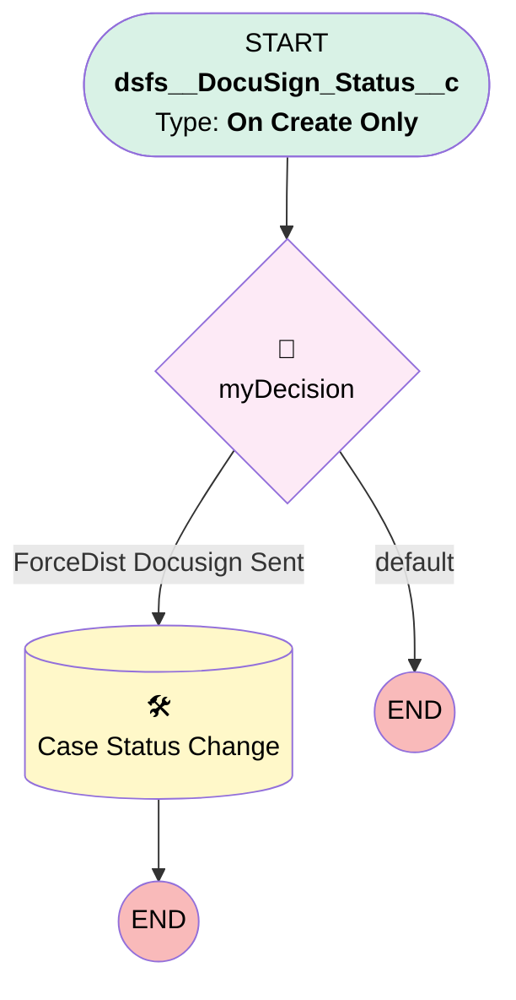

# Compliance | ForceDist DocuSign Sent

## Flow Diagram [(_View History_)](Compliance_ForceDist_DocuSign_Sent-history.md)

<!-- Flow description -->

## General Information

|<!-- -->|<!-- -->|
|:---|:---|
|Process Type| Workflow|
|Label|Compliance | ForceDist DocuSign Sent|
|Status|Active|
|Description|Updates Case Status when Docusign is Sent|
|Interview Label|Compliance_ForceDist_DocuSign_Sent-1_InterviewLabel|
|Start Element Reference|[myDecision](#mydecision)|
| Object Type (PM)|dsfs__DocuSign_Status__c|
| Object Variable (PM)|myVariable_current|
| Old Object Variable (PM)|myVariable_old|
| Trigger Type (PM)|onCreateOnly|

## Variables

|Name|Data Type|Is Collection|Is Input|Is Output|Object Type|Description|
|:-- |:--:|:--:|:--:|:--:|:--:|:--  |
|myVariable_current|SObject|⬜|✅|✅|dsfs__DocuSign_Status__c|<!-- -->|
|myVariable_old|SObject|⬜|✅|⬜|dsfs__DocuSign_Status__c|<!-- -->|

## Flow Nodes Details

### myDecision

|<!-- -->|<!-- -->|
|:---|:---|
|Type|Decision|
|Label|[myDecision](#mydecision)|
|Default Connector Label|default|
|Index (PM)|numberValue: 0 |

#### Rule myRule_1 (ForceDist Docusign Sent)

|<!-- -->|<!-- -->|
|:---|:---|
|Connector|[myRule_1_A1](#myrule_1_a1)|
|Condition Logic|and|

|Condition Id|Left Value Reference|Operator|Right Value|
|:-- |:-- |:--:|:--: |
|1|myVariable_current.dsfs__Case__c| Is Null|⬜|
|2|myVariable_current.dsfs__Case__r.RecordTypeId| Equal To|0121G000000g1ZpQAI|

### myRule_1_A1

|<!-- -->|<!-- -->|
|:---|:---|
|Type|Record Update|
|Object|Case|
|Label|Case Status Change|
|Evaluation Type (PM)|always|
|Extra Type Info (PM)|<!-- -->|
|Is Child Relationship (PM)|⬜|
|Reference (PM)|[dsfs__DocuSign_Status__c].Case|
|Reference Target Field (PM)|<!-- -->|

#### Filters (logic: **and**)

|Filter Id|Field|Operator|Value|
|:-- |:-- |:--:|:--: |
|1|Id| Equal To|myVariable_current.dsfs__Case__c|

#### Input Assignments

|Field|Value|
|:-- |:--: |
|Status|Docusign Pending Signature|

___

_Documentation generated from branch monitoring_myubiquity by [sfdx-hardis](https://sfdx-hardis.cloudity.com), featuring [salesforce-flow-visualiser](https://github.com/toddhalfpenny/salesforce-flow-visualiser)_