# Compliance | Form 5500 Alerts

## Flow Diagram [(_View History_)](Compliance_Form_5500_Alerts_1-history.md)

```mermaid
%% If you read this, your Markdown visualizer does not handle MermaidJS syntax.
%% - If you are in VS Code, install extension `Markdown Preview Mermaid Support` at https://marketplace.visualstudio.com/items?itemName=bierner.markdown-mermaid
%% - If you are using sfdx-hardis, try to define env variable `MERMAID_MODES=cli,docker` ,then run again the command to regenerate markdown with SVG images.
%% - If you are within mkdocs-material, define mermaid plugin in `mkdocs.yml` as described in https://squidfunk.github.io/mkdocs-material/extensions/mermaid/
%% - As a last resort, you can copy-paste this MermaidJS code into https://mermaid.live/ to see the flow diagram

flowchart TB
START(["START<br/><b>AutoLaunched Flow</b></br>Type: <b> Record After Save</b>"]):::startClass
click START "#general-information" "3105758789"

Final_5500_Invite_to_File("📧 <em></em><br/>Final 5500 Invite to File"):::actionCalls
click Final_5500_Invite_to_File "#final_5500_invite_to_file" "2582304693"

Final_5500_Remind_File("📧 <em></em><br/>Final 5500 Remind File"):::actionCalls
click Final_5500_Remind_File "#final_5500_remind_file" "1753975207"

Prior_5500_Filing_Confirm("📧 <em></em><br/>Prior 5500 Filing Confirm"):::actionCalls
click Prior_5500_Filing_Confirm "#prior_5500_filing_confirm" "726777726"

Prior_5500_Invite_to_File("📧 <em></em><br/>Prior 5500 - Invite to File"):::actionCalls
click Prior_5500_Invite_to_File "#prior_5500_invite_to_file" "297246048"

Prior_5500_Reminder_to_File("📧 <em></em><br/>Prior 5500 Reminder to File"):::actionCalls
click Prior_5500_Reminder_to_File "#prior_5500_reminder_to_file" "2880455101"

Prior_Final_5500_Invite("📧 <em></em><br/>Prior+Final 5500 Invite"):::actionCalls
click Prior_Final_5500_Invite "#prior_final_5500_invite" "3284192060"

Prior_Final_5500_Remind("📧 <em></em><br/>Prior+Final 5500 Remind"):::actionCalls
click Prior_Final_5500_Remind "#prior_final_5500_remind" "4135798536"

SAR_Send_Email_1("📧 <em></em><br/>SAR | Send Email #1"):::actionCalls
click SAR_Send_Email_1 "#sar_send_email_1" "1165463390"

SAR_Send_Email_2("📧 <em></em><br/>SAR | Send Email #2"):::actionCalls
click SAR_Send_Email_2 "#sar_send_email_2" "2994900872"

X5500_Invitation_to_file_Amended("📧 <em></em><br/>5500 | Invitation to file - Amended"):::actionCalls
click X5500_Invitation_to_file_Amended "#x5500_invitation_to_file_amended" "3911242698"

Set_Template_Name_1[\"🟰 <em></em><br/>Set Template Name 1"/]:::assignments
click Set_Template_Name_1 "#set_template_name_1" "345634392"

Set_Template_Name_2[\"🟰 <em></em><br/>Set Template Name 2"/]:::assignments
click Set_Template_Name_2 "#set_template_name_2" "3344580974"

Set_Template_Name_3[\"🟰 <em></em><br/>Set Template Name 3"/]:::assignments
click Set_Template_Name_3 "#set_template_name_3" "2379705857"

Invitation_to_file_amendment{"🔀 <em></em><br/>Invitation to file amended return"}:::decisions
click Invitation_to_file_amendment "#invitation_to_file_amendment" "87361278"

myRule_1{"🔀 <em></em><br/>Prior 5500 | Invitation to File"}:::decisions
click myRule_1 "#myrule_1" "1396940371"

myRule_14{"🔀 <em></em><br/>Prior 5500 | Confirmation"}:::decisions
click myRule_14 "#myrule_14" "385355170"

myRule_17{"🔀 <em></em><br/>SAR | Email 1"}:::decisions
click myRule_17 "#myrule_17" "119708169"

myRule_20{"🔀 <em></em><br/>SAR | Email 2"}:::decisions
click myRule_20 "#myrule_20" "376427275"

myRule_23{"🔀 <em></em><br/>Final 5500 | Invitation to File"}:::decisions
click myRule_23 "#myrule_23" "1876227972"

myRule_26{"🔀 <em></em><br/>Final 5500 | Reminder to File"}:::decisions
click myRule_26 "#myrule_26" "4122569988"

myRule_36{"🔀 <em></em><br/>Prior + Final 5500 | Invite to File"}:::decisions
click myRule_36 "#myrule_36" "691791776"

myRule_39{"🔀 <em></em><br/>Prior + Final 5500 | Remind to File"}:::decisions
click myRule_39 "#myrule_39" "2645212059"

myRule_4{"🔀 <em></em><br/>Prior 5500 | Reminder"}:::decisions
click myRule_4 "#myrule_4" "1359941087"

Template_Found_Check{"🔀 <em></em><br/>Template Found Check"}:::decisions
click Template_Found_Check "#template_found_check" "3008781183"

Copy_1_of_Email_Copy[("➕ <em></em><br/>Copy 1 of Email Copy")]:::recordCreates
click Copy_1_of_Email_Copy "#copy_1_of_email_copy" "698565627"

Copy_2_of_Email_Copy[("➕ <em></em><br/>Copy 2 of Email Copy")]:::recordCreates
click Copy_2_of_Email_Copy "#copy_2_of_email_copy" "1565713332"

Email_Confirmation_no_Copy[("➕ <em></em><br/>Email Confirmation no Copy")]:::recordCreates
click Email_Confirmation_no_Copy "#email_confirmation_no_copy" "3379458813"

myRule_17_A2[("➕ <em></em><br/>Email Copy")]:::recordCreates
click myRule_17_A2 "#myrule_17_a2" "53900016"

myRule_1_A1[("➕ <em></em><br/>Email Copy")]:::recordCreates
click myRule_1_A1 "#myrule_1_a1" "3060088055"

myRule_23_A3[("➕ <em></em><br/>Email Copy")]:::recordCreates
click myRule_23_A3 "#myrule_23_a3" "116379575"

myRule_26_A3[("➕ <em></em><br/>Email Copy")]:::recordCreates
click myRule_26_A3 "#myrule_26_a3" "969250470"

myRule_36_A3[("➕ <em></em><br/>Email Copy")]:::recordCreates
click myRule_36_A3 "#myrule_36_a3" "1065351405"

myRule_39_A3[("➕ <em></em><br/>Email Copy")]:::recordCreates
click myRule_39_A3 "#myrule_39_a3" "155408402"

Find_Template[("🔍 <em></em><br/>Find Template")]:::recordLookups
click Find_Template "#find_template" "2594296256"

myRule_1_A3[("🛠️ <em></em><br/>Status Update")]:::recordUpdates
click myRule_1_A3 "#myrule_1_a3" "2401596499"

myRule_23_A2[("🛠️ <em></em><br/>Status Update")]:::recordUpdates
click myRule_23_A2 "#myrule_23_a2" "2036899915"

myRule_26_A1[("🛠️ <em></em><br/>Status Update")]:::recordUpdates
click myRule_26_A1 "#myrule_26_a1" "2510866054"

myRule_36_A1[("🛠️ <em></em><br/>Status Update")]:::recordUpdates
click myRule_36_A1 "#myrule_36_a1" "3063794529"

myRule_39_A1[("🛠️ <em></em><br/>Status Update")]:::recordUpdates
click myRule_39_A1 "#myrule_39_a1" "997536269"

myRule_4_A1[("🛠️ <em></em><br/>Status Update")]:::recordUpdates
click myRule_4_A1 "#myrule_4_a1" "2815914452"

Final_5500_Invite_to_File --> myRule_23_A2
Final_5500_Remind_File --> myRule_26_A3
Prior_5500_Filing_Confirm --> Set_Template_Name_3
Prior_5500_Invite_to_File --> Set_Template_Name_1
Prior_5500_Reminder_to_File --> Set_Template_Name_2
Prior_Final_5500_Invite --> myRule_36_A3
Prior_Final_5500_Remind --> myRule_39_A3
SAR_Send_Email_1 --> myRule_17_A2
SAR_Send_Email_2 --> Copy_1_of_Email_Copy
X5500_Invitation_to_file_Amended --> Copy_2_of_Email_Copy
Set_Template_Name_1 --> myRule_1_A3
Set_Template_Name_2 --> myRule_4_A1
Set_Template_Name_3 --> Find_Template
Invitation_to_file_amendment --> |"Alert Needed"| X5500_Invitation_to_file_Amended
Invitation_to_file_amendment --> |"Default Outcome"| myRule_26
myRule_1 --> |"TRUE_Prior 5500 | Invitation to File"| Prior_5500_Invite_to_File
myRule_1 --> |"FALSE_Prior 5500 | Invitation to File"| myRule_4
myRule_14 --> |"TRUE_Prior 5500 | Confirmation"| Prior_5500_Filing_Confirm
myRule_14 --> |"FALSE_Prior 5500 | Confirmation"| myRule_17
myRule_17 --> |"TRUE_SAR | Email 1"| SAR_Send_Email_1
myRule_17 --> |"FALSE_SAR | Email 1"| myRule_20
myRule_20 --> |"TRUE_SAR | Email 2"| SAR_Send_Email_2
myRule_20 --> |"FALSE_SAR | Email 2"| myRule_23
myRule_23 --> |"TRUE_Final 5500 | Invitation to File"| Final_5500_Invite_to_File
myRule_23 --> |"FALSE_Final 5500 | Invitation to File"| Invitation_to_file_amendment
myRule_26 --> |"TRUE_Final 5500 | Reminder to File"| myRule_26_A1
myRule_26 --> |"FALSE_Final 5500 | Reminder to File"| myRule_36
myRule_36 --> |"TRUE_Prior + Final 5500 | Invite to File"| myRule_36_A1
myRule_36 --> |"FALSE_Prior + Final 5500 | Invite to File"| myRule_39
myRule_39 --> |"TRUE_Prior + Final 5500 | Remind to File"| myRule_39_A1
myRule_39 --> |"FALSE_Prior + Final 5500 | Remind to File"| END_myRule_39
myRule_4 --> |"TRUE_Prior 5500 | Reminder"| Prior_5500_Reminder_to_File
myRule_4 --> |"FALSE_Prior 5500 | Reminder"| myRule_14
Template_Found_Check --> |"Found Template"| myRule_1_A1
Template_Found_Check --> |"Default Outcome"| Email_Confirmation_no_Copy
Copy_1_of_Email_Copy --> END_Copy_1_of_Email_Copy
Copy_2_of_Email_Copy --> END_Copy_2_of_Email_Copy
Email_Confirmation_no_Copy --> END_Email_Confirmation_no_Copy
myRule_17_A2 --> END_myRule_17_A2
myRule_1_A1 --> END_myRule_1_A1
myRule_23_A3 --> END_myRule_23_A3
myRule_26_A3 --> END_myRule_26_A3
myRule_36_A3 --> END_myRule_36_A3
myRule_39_A3 --> END_myRule_39_A3
Find_Template --> Template_Found_Check
myRule_1_A3 --> Find_Template
myRule_23_A2 --> myRule_23_A3
myRule_26_A1 --> Final_5500_Remind_File
myRule_36_A1 --> Prior_Final_5500_Invite
myRule_39_A1 --> Prior_Final_5500_Remind
myRule_4_A1 --> Find_Template
START -->  myRule_1
END_myRule_39(( END )):::endClass
END_Copy_1_of_Email_Copy(( END )):::endClass
END_Copy_2_of_Email_Copy(( END )):::endClass
END_Email_Confirmation_no_Copy(( END )):::endClass
END_myRule_17_A2(( END )):::endClass
END_myRule_1_A1(( END )):::endClass
END_myRule_23_A3(( END )):::endClass
END_myRule_26_A3(( END )):::endClass
END_myRule_36_A3(( END )):::endClass
END_myRule_39_A3(( END )):::endClass


classDef actionCalls fill:#D4E4FC,color:black,text-decoration:none,max-height:100px
classDef assignments fill:#FBEED7,color:black,text-decoration:none,max-height:100px
classDef collectionProcessors fill:#F0E3FA,color:black,text-decoration:none,max-height:100px
classDef customErrors fill:#FFE9E9,color:black,text-decoration:none,max-height:100px
classDef decisions fill:#FDEAF6,color:black,text-decoration:none,max-height:100px
classDef loops fill:#FDEAF6,color:black,text-decoration:none,max-height:100px
classDef recordCreates fill:#FFF8C9,color:black,text-decoration:none,max-height:100px
classDef recordDeletes fill:#FFF8C9,color:black,text-decoration:none,max-height:100px
classDef recordLookups fill:#EDEAFF,color:black,text-decoration:none,max-height:100px
classDef recordUpdates fill:#FFF8C9,color:black,text-decoration:none,max-height:100px
classDef screens fill:#DFF6FF,color:black,text-decoration:none,max-height:100px
classDef subflows fill:#D4E4FC,color:black,text-decoration:none,max-height:100px
classDef startClass fill:#D9F2E6,color:black,text-decoration:none,max-height:100px
classDef endClass fill:#F9BABA,color:black,text-decoration:none,max-height:100px
classDef transforms fill:#FDEAF6,color:black,text-decoration:none,max-height:100px


```

<!-- Flow description -->

## General Information

|<!-- -->|<!-- -->|
|:---|:---|
|Object|Compliance__c|
|Process Type| Auto Launched Flow|
|Trigger Type| Record After Save|
|Record Trigger Type| Create And Update|
|Label|Compliance | Form 5500 Alerts|
|Status|Active|
|Description|Updated for new email templates being used for prior 5500 alerts Process running Form 5500 notification emails|
|Environments|Default|
|Interview Label|Compliance | Form 5500 Alerts_1 {!$Flow.CurrentDateTime}|
| Builder Type (PM)|LightningFlowBuilder|
| Canvas Mode (PM)|AUTO_LAYOUT_CANVAS|
|Connector|[myRule_1](#myrule_1)|
|Next Node|[myRule_1](#myrule_1)|

#### Filters (logic: **and**)

|Filter Id|Field|Operator|Value|
|:-- |:-- |:--:|:--: |
|1|RecordTypeId| Equal To|01237000000N0lpAAC|

## Variables

|Name|Data Type|Is Collection|Is Input|Is Output|Object Type|Description|
|:-- |:--:|:--:|:--:|:--:|:--:|:--  |
|templateName|String|⬜|⬜|⬜|<!-- -->|<!-- -->|

## Flow Nodes Details

### Final_5500_Invite_to_File

|<!-- -->|<!-- -->|
|:---|:---|
|Type|Action Call|
|Label|Final 5500 Invite to File|
|Action Type|Email Alert|
|Action Name|Compliance__c.Compliance_5500_Final_Invitation_to_File|
|Flow Transaction Model|CurrentTransaction|
|Name Segment|Compliance__c.Compliance_5500_Final_Invitation_to_File|
|Offset|0|
| SObject Row Id (input)|$Record.Id|
|Connector|[myRule_23_A2](#myrule_23_a2)|

### Final_5500_Remind_File

|<!-- -->|<!-- -->|
|:---|:---|
|Type|Action Call|
|Label|Final 5500 Remind File|
|Action Type|Email Alert|
|Action Name|Compliance__c.Compliance_5500_Final_Reminder_to_File|
|Flow Transaction Model|CurrentTransaction|
|Name Segment|Compliance__c.Compliance_5500_Final_Reminder_to_File|
|Offset|0|
| SObject Row Id (input)|$Record.Id|
|Connector|[myRule_26_A3](#myrule_26_a3)|

### Prior_5500_Filing_Confirm

|<!-- -->|<!-- -->|
|:---|:---|
|Type|Action Call|
|Label|Prior 5500 Filing Confirm|
|Action Type|Email Alert|
|Action Name|Compliance__c.Compliance_5500_Prior_Filing_Confirmation|
|Flow Transaction Model|CurrentTransaction|
|Name Segment|Compliance__c.Compliance_5500_Prior_Filing_Confirmation|
|Offset|0|
| SObject Row Id (input)|$Record.Id|
|Connector|[Set_Template_Name_3](#set_template_name_3)|

### Prior_5500_Invite_to_File

|<!-- -->|<!-- -->|
|:---|:---|
|Type|Action Call|
|Label|Prior 5500 - Invite to File|
|Action Type|Email Alert|
|Action Name|Compliance__c.Compliance_5500_Prior_Invitation_to_File|
|Flow Transaction Model|CurrentTransaction|
|Name Segment|Compliance__c.Compliance_5500_Prior_Invitation_to_File|
|Offset|0|
| SObject Row Id (input)|$Record.Id|
|Connector|[Set_Template_Name_1](#set_template_name_1)|

### Prior_5500_Reminder_to_File

|<!-- -->|<!-- -->|
|:---|:---|
|Type|Action Call|
|Label|Prior 5500 Reminder to File|
|Action Type|Email Alert|
|Action Name|Compliance__c.Compliance_5500_Prior_Reminder_to_File|
|Flow Transaction Model|CurrentTransaction|
|Name Segment|Compliance__c.Compliance_5500_Prior_Reminder_to_File|
|Offset|0|
| SObject Row Id (input)|$Record.Id|
|Connector|[Set_Template_Name_2](#set_template_name_2)|

### Prior_Final_5500_Invite

|<!-- -->|<!-- -->|
|:---|:---|
|Type|Action Call|
|Label|Prior+Final 5500 Invite|
|Action Type|Email Alert|
|Action Name|Compliance__c.Compliance_5500_Prior_Final_Invite_to_File|
|Flow Transaction Model|CurrentTransaction|
|Name Segment|Compliance__c.Compliance_5500_Prior_Final_Invite_to_File|
|Offset|0|
| SObject Row Id (input)|$Record.Id|
|Connector|[myRule_36_A3](#myrule_36_a3)|

### Prior_Final_5500_Remind

|<!-- -->|<!-- -->|
|:---|:---|
|Type|Action Call|
|Label|Prior+Final 5500 Remind|
|Action Type|Email Alert|
|Action Name|Compliance__c.Compliance_5500_Prior_Final_Reminder_to_File|
|Flow Transaction Model|CurrentTransaction|
|Name Segment|Compliance__c.Compliance_5500_Prior_Final_Reminder_to_File|
|Offset|0|
| SObject Row Id (input)|$Record.Id|
|Connector|[myRule_39_A3](#myrule_39_a3)|

### SAR_Send_Email_1

|<!-- -->|<!-- -->|
|:---|:---|
|Type|Action Call|
|Label|SAR | Send Email #1|
|Action Type|Email Alert|
|Action Name|Compliance__c.Compliance_SAR|
|Flow Transaction Model|CurrentTransaction|
|Name Segment|Compliance__c.Compliance_SAR|
|Offset|0|
| SObject Row Id (input)|$Record.Id|
|Connector|[myRule_17_A2](#myrule_17_a2)|

### SAR_Send_Email_2

|<!-- -->|<!-- -->|
|:---|:---|
|Type|Action Call|
|Label|SAR | Send Email #2|
|Action Type|Email Alert|
|Action Name|Compliance__c.Compliance_SAR2|
|Flow Transaction Model|CurrentTransaction|
|Name Segment|Compliance__c.Compliance_SAR2|
|Offset|0|
| SObject Row Id (input)|$Record.Id|
|Connector|[Copy_1_of_Email_Copy](#copy_1_of_email_copy)|

### X5500_Invitation_to_file_Amended

|<!-- -->|<!-- -->|
|:---|:---|
|Type|Action Call|
|Label|5500 | Invitation to file - Amended|
|Action Type|Email Alert|
|Action Name|Compliance__c.X5500_Invitation_to_file_Amended|
|Flow Transaction Model|CurrentTransaction|
|Name Segment|Compliance__c.X5500_Invitation_to_file_Amended|
|Offset|0|
| SObject Row Id (input)|$Record.Id|
|Connector|[Copy_2_of_Email_Copy](#copy_2_of_email_copy)|

### Set_Template_Name_1

|<!-- -->|<!-- -->|
|:---|:---|
|Type|Assignment|
|Label|Set Template Name 1|
|Connector|[myRule_1_A3](#myrule_1_a3)|

#### Assignments

|Assign To Reference|Operator|Value|
|:-- |:--:|:--: |
|templateName| Assign|X2025_5500_Initial_Email|

### Set_Template_Name_2

|<!-- -->|<!-- -->|
|:---|:---|
|Type|Assignment|
|Label|Set Template Name 2|
|Connector|[myRule_4_A1](#myrule_4_a1)|

#### Assignments

|Assign To Reference|Operator|Value|
|:-- |:--:|:--: |
|templateName| Assign|X2025_5500_Reminder_Email|

### Set_Template_Name_3

|<!-- -->|<!-- -->|
|:---|:---|
|Type|Assignment|
|Label|Set Template Name 3|
|Connector|[Find_Template](#find_template)|

#### Assignments

|Assign To Reference|Operator|Value|
|:-- |:--:|:--: |
|templateName| Assign|X2025_5500_Confirmation_Email|

### Invitation_to_file_amendment

|<!-- -->|<!-- -->|
|:---|:---|
|Type|Decision|
|Label|Invitation to file amended return|
|Default Connector|[myRule_26](#myrule_26)|
|Default Connector Label|Default Outcome|

#### Rule Alert_Needed (Alert Needed)

|<!-- -->|<!-- -->|
|:---|:---|
|Connector|[X5500_Invitation_to_file_Amended](#x5500_invitation_to_file_amended)|
|Condition Logic|and|

|Condition Id|Left Value Reference|Operator|Right Value|
|:-- |:-- |:--:|:--: |
|1|$Record.Amended_Return_Date__c| Is Null|⬜|
|2|$Record.Amended_Return_Date__c| Is Changed|✅|

### myRule_1

|<!-- -->|<!-- -->|
|:---|:---|
|Type|Decision|
|Label|Prior 5500 | Invitation to File|
|Default Connector|[myRule_4](#myrule_4)|
|Default Connector Label|FALSE_Prior 5500 | Invitation to File|

#### Rule TRUE_myRule_1 (TRUE_Prior 5500 | Invitation to File)

|<!-- -->|<!-- -->|
|:---|:---|
|Connector|[Prior_5500_Invite_to_File](#prior_5500_invite_to_file)|
|Condition Logic|and|

|Condition Id|Left Value Reference|Operator|Right Value|
|:-- |:-- |:--:|:--: |
|1|$Record.Invitation_to_File_Sent__c| Is Changed|✅|
|2|$Record.Invitation_to_File_Sent__c| Is Null|⬜|
|3|$Record.X5500_Situation__c| Equal To|Prior Year Only|

### myRule_14

|<!-- -->|<!-- -->|
|:---|:---|
|Type|Decision|
|Label|Prior 5500 | Confirmation|
|Default Connector|[myRule_17](#myrule_17)|
|Default Connector Label|FALSE_Prior 5500 | Confirmation|

#### Rule TRUE_myRule_14 (TRUE_Prior 5500 | Confirmation)

|<!-- -->|<!-- -->|
|:---|:---|
|Connector|[Prior_5500_Filing_Confirm](#prior_5500_filing_confirm)|
|Condition Logic|and|

|Condition Id|Left Value Reference|Operator|Right Value|
|:-- |:-- |:--:|:--: |
|1|$Record.Filing_Complete__c| Is Changed|✅|
|2|$Record.Filing_Complete__c| Is Null|⬜|
|3|$Record.X5500_Situation__c| Equal To|Prior Year Only|

### myRule_17

|<!-- -->|<!-- -->|
|:---|:---|
|Type|Decision|
|Label|SAR | Email 1|
|Default Connector|[myRule_20](#myrule_20)|
|Default Connector Label|FALSE_SAR | Email 1|

#### Rule TRUE_myRule_17 (TRUE_SAR | Email 1)

|<!-- -->|<!-- -->|
|:---|:---|
|Connector|[SAR_Send_Email_1](#sar_send_email_1)|
|Condition Logic|and|

|Condition Id|Left Value Reference|Operator|Right Value|
|:-- |:-- |:--:|:--: |
|1|$Record.SAR_1_Date__c| Is Changed|✅|
|2|$Record.SAR_1_Date__c| Is Null|⬜|

### myRule_20

|<!-- -->|<!-- -->|
|:---|:---|
|Type|Decision|
|Label|SAR | Email 2|
|Default Connector|[myRule_23](#myrule_23)|
|Default Connector Label|FALSE_SAR | Email 2|

#### Rule TRUE_myRule_20 (TRUE_SAR | Email 2)

|<!-- -->|<!-- -->|
|:---|:---|
|Connector|[SAR_Send_Email_2](#sar_send_email_2)|
|Condition Logic|and|

|Condition Id|Left Value Reference|Operator|Right Value|
|:-- |:-- |:--:|:--: |
|1|$Record.SAR_2_Date__c| Is Changed|✅|
|2|$Record.SAR_2_Date__c| Is Null|⬜|

### myRule_23

|<!-- -->|<!-- -->|
|:---|:---|
|Type|Decision|
|Label|Final 5500 | Invitation to File|
|Default Connector|[Invitation_to_file_amendment](#invitation_to_file_amendment)|
|Default Connector Label|FALSE_Final 5500 | Invitation to File|

#### Rule TRUE_myRule_23 (TRUE_Final 5500 | Invitation to File)

|<!-- -->|<!-- -->|
|:---|:---|
|Connector|[Final_5500_Invite_to_File](#final_5500_invite_to_file)|
|Condition Logic|and|

|Condition Id|Left Value Reference|Operator|Right Value|
|:-- |:-- |:--:|:--: |
|1|$Record.Invitation_to_File_Sent__c| Is Changed|✅|
|2|$Record.Invitation_to_File_Sent__c| Is Null|⬜|
|3|$Record.X5500_Situation__c| Equal To|Final 5500 Only|

### myRule_26

|<!-- -->|<!-- -->|
|:---|:---|
|Type|Decision|
|Label|Final 5500 | Reminder to File|
|Default Connector|[myRule_36](#myrule_36)|
|Default Connector Label|FALSE_Final 5500 | Reminder to File|

#### Rule TRUE_myRule_26 (TRUE_Final 5500 | Reminder to File)

|<!-- -->|<!-- -->|
|:---|:---|
|Connector|[myRule_26_A1](#myrule_26_a1)|
|Condition Logic|1 AND ((2 AND 3) OR (4 AND 5) OR (6 AND 7) OR (8 AND 9) OR (10 AND 11) OR (12 AND 13) OR (14 AND 15) OR (16 AND 17))|

|Condition Id|Left Value Reference|Operator|Right Value|
|:-- |:-- |:--:|:--: |
|1|$Record.X5500_Situation__c| Equal To|Final 5500 Only|
|2|$Record.X1st_Reminder_Sent__c| Is Changed|✅|
|3|$Record.X1st_Reminder_Sent__c| Is Null|⬜|
|4|$Record.X2nd_Reminder_Sent__c| Is Changed|✅|
|5|$Record.X2nd_Reminder_Sent__c| Is Null|⬜|
|6|$Record.X3rd_Reminder_Sent__c| Is Changed|✅|
|7|$Record.X3rd_Reminder_Sent__c| Is Null|⬜|
|8|$Record.X4th_Reminder_Sent__c| Is Changed|✅|
|9|$Record.X4th_Reminder_Sent__c| Is Null|⬜|
|10|$Record.X5th_Reminder_Sent__c| Is Changed|✅|
|11|$Record.X5th_Reminder_Sent__c| Is Null|⬜|
|12|$Record.X6th_Reminder_Sent__c| Is Changed|✅|
|13|$Record.X6th_Reminder_Sent__c| Is Null|⬜|
|14|$Record.X7th_Reminder_Sent__c| Is Changed|✅|
|15|$Record.X7th_Reminder_Sent__c| Is Null|⬜|
|16|$Record.X8th_Reminder_Sent__c| Is Changed|✅|
|17|$Record.X8th_Reminder_Sent__c| Is Null|⬜|

### myRule_36

|<!-- -->|<!-- -->|
|:---|:---|
|Type|Decision|
|Label|Prior + Final 5500 | Invite to File|
|Default Connector|[myRule_39](#myrule_39)|
|Default Connector Label|FALSE_Prior + Final 5500 | Invite to File|

#### Rule TRUE_myRule_36 (TRUE_Prior + Final 5500 | Invite to File)

|<!-- -->|<!-- -->|
|:---|:---|
|Connector|[myRule_36_A1](#myrule_36_a1)|
|Condition Logic|and|

|Condition Id|Left Value Reference|Operator|Right Value|
|:-- |:-- |:--:|:--: |
|1|$Record.Invitation_to_File_Sent__c| Is Changed|✅|
|2|$Record.Invitation_to_File_Sent__c| Is Null|⬜|
|3|$Record.X5500_Situation__c| Equal To|Prior + Final 5500|

### myRule_39

|<!-- -->|<!-- -->|
|:---|:---|
|Type|Decision|
|Label|Prior + Final 5500 | Remind to File|
|Default Connector Label|FALSE_Prior + Final 5500 | Remind to File|

#### Rule TRUE_myRule_39 (TRUE_Prior + Final 5500 | Remind to File)

|<!-- -->|<!-- -->|
|:---|:---|
|Connector|[myRule_39_A1](#myrule_39_a1)|
|Condition Logic|1 AND ((2 AND 3) OR (4 AND 5) OR (6 AND 7) OR (8 AND 9) OR (10 AND 11) OR (12 AND 13) OR (14 AND 15) OR (16 AND 17))|

|Condition Id|Left Value Reference|Operator|Right Value|
|:-- |:-- |:--:|:--: |
|1|$Record.X5500_Situation__c| Equal To|Prior + Final 5500|
|2|$Record.X1st_Reminder_Sent__c| Is Changed|✅|
|3|$Record.X1st_Reminder_Sent__c| Is Null|⬜|
|4|$Record.X2nd_Reminder_Sent__c| Is Changed|✅|
|5|$Record.X2nd_Reminder_Sent__c| Is Null|⬜|
|6|$Record.X3rd_Reminder_Sent__c| Is Changed|✅|
|7|$Record.X3rd_Reminder_Sent__c| Is Null|⬜|
|8|$Record.X4th_Reminder_Sent__c| Is Changed|✅|
|9|$Record.X4th_Reminder_Sent__c| Is Null|⬜|
|10|$Record.X5th_Reminder_Sent__c| Is Changed|✅|
|11|$Record.X5th_Reminder_Sent__c| Is Null|⬜|
|12|$Record.X6th_Reminder_Sent__c| Is Changed|✅|
|13|$Record.X6th_Reminder_Sent__c| Is Null|⬜|
|14|$Record.X7th_Reminder_Sent__c| Is Changed|✅|
|15|$Record.X7th_Reminder_Sent__c| Is Null|⬜|
|16|$Record.X8th_Reminder_Sent__c| Is Changed|✅|
|17|$Record.X8th_Reminder_Sent__c| Is Null|⬜|

### myRule_4

|<!-- -->|<!-- -->|
|:---|:---|
|Type|Decision|
|Label|Prior 5500 | Reminder|
|Default Connector|[myRule_14](#myrule_14)|
|Default Connector Label|FALSE_Prior 5500 | Reminder|

#### Rule TRUE_myRule_4 (TRUE_Prior 5500 | Reminder)

|<!-- -->|<!-- -->|
|:---|:---|
|Connector|[Prior_5500_Reminder_to_File](#prior_5500_reminder_to_file)|
|Condition Logic|1 AND 19 AND ((2 AND 3) OR (4 AND 5) OR (7 AND 8) OR (9 AND 10) OR (11 AND 12) OR (13 AND 14) OR (15 AND 16) OR (17 AND 18) )AND 6|

|Condition Id|Left Value Reference|Operator|Right Value|
|:-- |:-- |:--:|:--: |
|1|$Record.Invitation_to_File_Sent__c| Is Null|⬜|
|2|$Record.X1st_Reminder_Sent__c| Is Changed|✅|
|3|$Record.X1st_Reminder_Sent__c| Is Null|⬜|
|4|$Record.X2nd_Reminder_Sent__c| Is Changed|✅|
|5|$Record.X2nd_Reminder_Sent__c| Is Null|⬜|
|6|$Record.Status__c| Not Equal To|Filed|
|7|$Record.X3rd_Reminder_Sent__c| Is Changed|✅|
|8|$Record.X3rd_Reminder_Sent__c| Is Null|⬜|
|9|$Record.X4th_Reminder_Sent__c| Is Changed|✅|
|10|$Record.X4th_Reminder_Sent__c| Is Null|⬜|
|11|$Record.X5th_Reminder_Sent__c| Is Changed|✅|
|12|$Record.X5th_Reminder_Sent__c| Is Null|⬜|
|13|$Record.X6th_Reminder_Sent__c| Is Changed|✅|
|14|$Record.X6th_Reminder_Sent__c| Is Null|⬜|
|15|$Record.X7th_Reminder_Sent__c| Is Changed|✅|
|16|$Record.X7th_Reminder_Sent__c| Is Null|⬜|
|17|$Record.X8th_Reminder_Sent__c| Is Changed|✅|
|18|$Record.X8th_Reminder_Sent__c| Is Null|⬜|
|19|$Record.X5500_Situation__c| Equal To|Prior Year Only|

### Template_Found_Check

|<!-- -->|<!-- -->|
|:---|:---|
|Type|Decision|
|Label|Template Found Check|
|Default Connector|[Email_Confirmation_no_Copy](#email_confirmation_no_copy)|
|Default Connector Label|Default Outcome|

#### Rule Found_Template (Found Template)

|<!-- -->|<!-- -->|
|:---|:---|
|Connector|[myRule_1_A1](#myrule_1_a1)|
|Condition Logic|and|

|Condition Id|Left Value Reference|Operator|Right Value|
|:-- |:-- |:--:|:--: |
|1|[Find_Template](#find_template)| Is Null|⬜|

### Copy_1_of_Email_Copy

|<!-- -->|<!-- -->|
|:---|:---|
|Type|Record Create|
|Object|EmailMessage|
|Label|Copy 1 of Email Copy|
|Store Output Automatically|✅|

#### Input Assignments

|Field|Value|
|:-- |:--: |
|Account__c|$Record.Account__c|
|FromAddress|support@myubiquity.com|
|HtmlBody|<!DOCTYPE html PUBLIC "-//W3C//DTD XHTML 1.0 Transitional//EN" "http://www.w3.org/TR/xhtml1/DTD/xhtml1-transitional.dtd"> <html xmlns="http://www.w3.org/1999/xhtml">  <head>   <meta http-equiv="Content-Type" content="text/html; charset=UTF-8" />   <title>Ubiquity Retirement + Savings</title>   <meta name="viewport" content="width=device-width, initial-scale=1.0"/>   </head>   <body style="margin: 0; padding: 0; background-color:#F9F8FC">      <table class="full" align="center" border="0" cellpadding="0" cellspacing="0" width="600" style="border-collapse:collapse;">       <tbody>         <tr>           <td bgcolor="#F9F8FC">             

             
Click here to view the <webversion style="color: #58585b;">web version</webversion> of this email.
           </td>         </tr>         <tr>           <td style="height: 100px; padding-bottom: 1.4em;">                        </td>         </tr>         <tr>           <td>             
&nbsp;
             
&nbsp;
             
&nbsp;
           </td>         </tr>         <tr>           <td bgcolor="#ffffff" style="border-radius: 0 0 10px 10px;;">             <table align="center" border="0" cellpadding="0" cellspacing="0" width="600"; style="border-collapse:collapse;">               <tbody>                     <tr>                         
                                                      
                     </tr>                 <tr>                   <td style="padding: 0 30px 0 30px;">                       
Hello Plan Sponsor,
               
Your retirement plan’s 2019 Summary Annual Report (SAR) pertaining to the recently filed Form 5500 filing is now available to you and your employees on the <a href="https://www.myubiquity.com">Ubiquity website.</a>
                     
By law, the SAR is required to be available to all eligible employees. If you have any employees who don’t have internet access, it’s required that you provide them with a printed copy.
                     
<b>How do I access my SAR? </b>
                         <ul>                           <li> <a href="https://secure.myubiquity.com/login">Log into your portal</a></li>                              <li> Once logged in, select ‘401(k)’ on the left-side navigation bar on  your screen, then tap ‘Overview’.</li>                          <li> Scroll down to ‘Plan Documents’. Click ‘Summary Annual Report 2019’ and the document will download to your local drive.</li>                          </ul>                       <td>                 </tr>                 <tr>                   <td style="padding: 0 30px 0 30px;">                    
Remember, we’re always here to help. If you have any questions, feel free to give us a call at 855.401.4357 option 1 or email us at support@myubiquity.com.
                            
Sincerely,                        Your Support Team at Ubiquity Retirement + Savings                         <a href="mailto:support@myubiquity.com" style=" color: #5fc9e2; text-decoration: none;"> support@myubiquity.com</a>                        <a href="https://www.myubiquity.com" style="color: #5fc9e2; text-decoration: none;">myubiquity.com</a>
                   </td>                 </tr>                 <tr>                   <td style="padding-bottom: 2em;">                       <table align="center" border="0" cellpadding="0" cellspacing="0" style="border-collapse:collapse;" >                           <tbody>                             <tr>                                 <td align="center" style="padding-top: 1.4em;">PHONE: 855.401.4357 option 1 &nbsp; &nbsp; &nbsp; EMAIL:<a href="mailto:support@myubiquity.com" style=" color: #58585b; text-decoration: none;"> support@myubiquity.com</a></td>                             </tr>                           </tbody>                         </table>                     </td>                 </tr>               </tbody>             </table>               </td>         </tr>         <tr>           <td style="padding-top: 1.4em; text-align: center; opacity: 0.65;">Copyright &copy;2019 Ubiquity Retirement + Savings           </td>         </tr>         <tr>           <td style="padding-top: 1.4em; text-align: center; opacity: 0.65;">You have received this e-mail because it contains important administration information.
                
<a href="https://you.myubiquity.com/email-preferences" style="color: #5fc9e2; text-decoration: none;">Click here</a> to adjust your email preferences. You may <unsubscribe style="color: #58585b; text-decoration: none;">unsubscribe</unsubscribe>, but you will no longer receive important updates to your plan(s) via email.             </td>         </tr>         <tr style="padding-top: 1.4em; text-align: center; opacity: 0.65;">           <td>Our mailing address is:                44 Montgomery Street, Suite 3060                San Francisco, CA 94104             </td>         </tr>         <tr style="padding-top: 1.4em; text-align: center; opacity: 0.65">           <td style="padding-bottom: 3em;">                <a href="http://ubiquity.createsend1.com/t/d-l-oujidlk-l-t/" style="color: #5fc9e2; text-decoration: none; " target="_blank">Privacy, Security, &amp; Terms</a>             </td>         </tr>       </tbody>     </table>   </body> </html>|
|RelatedToId|$Record.Id|
|Status|3|
|Subject|Your 2023 Summary Annual Report is Available|

### Copy_2_of_Email_Copy

|<!-- -->|<!-- -->|
|:---|:---|
|Type|Record Create|
|Object|EmailMessage|
|Label|Copy 2 of Email Copy|
|Store Output Automatically|✅|

#### Input Assignments

|Field|Value|
|:-- |:--: |
|Account__c|$Record.Account__c|
|FromAddress|support@myubiquity.com|
|HtmlBody|Dear Retirement Plan Sponsor,     Your  amended Form 5500 is ready to file! Please designate one authorized individual to sign your amended Form 5500.     To file your Form 5500:  Go to your filing page here Enter your DOL EFAST2 User ID and PIN  Click "Sign" Watch our step-by-step tutorial for filing the Form 5500:  https://youtu.be/XFfShC4t6ug     IMPORTANT: As of January 1, 2024, Login.gov will be used to access your EFAST2 account.     If you have never registered to sign a Form 5500:  Register for your EFAST2 credentials here. Follow the on-screen steps (EFAST2 FAQs). You will be assigned a User ID and PIN upon registration. If you have existing EFAST2 login credentials:  Link to your Login.gov credentials here and select "Sign in with Login.gov." If you do not have a Login.gov account, create one here, follow the steps, then link your account here and select "Sign in with Login.gov." For more details, read our FAQ.    To confirm your filing was successful please click here and search your filing by EIN.     For further questions, contact us at support@myubiquity.com.     Thank you,  Ubiquity Retirement + Savings®|
|RelatedToId|$Record.Id|
|Status|3|
|Subject|ACTION REQUIRED: File Amended  Form  for|

### Email_Confirmation_no_Copy

|<!-- -->|<!-- -->|
|:---|:---|
|Type|Record Create|
|Object|EmailMessage|
|Label|Email Confirmation no Copy|
|Store Output Automatically|✅|

#### Input Assignments

|Field|Value|
|:-- |:--: |
|Account__c|$Record.Account__c|
|FromAddress|support@myubiquity.com|
|RelatedToId|$Record.Id|
|Status|3|
|Subject|Email Sent no Template Recorded|
|TextBody|Failed to find {!templateName} for logging|

### myRule_17_A2

|<!-- -->|<!-- -->|
|:---|:---|
|Type|Record Create|
|Object|EmailMessage|
|Label|Email Copy|
|Store Output Automatically|✅|

#### Input Assignments

|Field|Value|
|:-- |:--: |
|Account__c|$Record.Account__c|
|FromAddress|support@myubiquity.com|
|HtmlBody|Dear Retirement Plan Sponsor,     Your retirement plan’s 2023 Summary Annual Report (SAR) pertaining to the recently filed Form 5500 filing is now available to you and your employees on the Ubiquity website.     By law, the SAR is required to be available to all eligible employees. If you have employees who don’t have internet access, you must provide them with a printed copy.     How do I access my SAR?     Log into your portal  Select 401(k) Plan Settings from the left-side navigation menu Select Documents + Forms Locate Summary Annual Report 2023 under General Resources    For further questions, contact us at support@myubiquity.com.     Thank you,  Ubiquity Retirement + Savings®|
|RelatedToId|$Record.Id|
|Status|3|
|Subject|Your 2023 Summary Annual Report is Available|

### myRule_1_A1

|<!-- -->|<!-- -->|
|:---|:---|
|Type|Record Create|
|Object|EmailMessage|
|Label|Email Copy|
|Store Output Automatically|✅|

#### Input Assignments

|Field|Value|
|:-- |:--: |
|Account__c|$Record.Account__c|
|FromAddress|support@myubiquity.com|
|HtmlBody|Find_Template.HtmlValue|
|RelatedToId|$Record.Id|
|Status|3|
|Subject|Find_Template.Subject|
|TextBody|Find_Template.Body|

### myRule_23_A3

|<!-- -->|<!-- -->|
|:---|:---|
|Type|Record Create|
|Object|EmailMessage|
|Label|Email Copy|
|Store Output Automatically|✅|

#### Input Assignments

|Field|Value|
|:-- |:--: |
|Account__c|$Record.Account__c|
|FromAddress|support@myubiquity.com|
|HtmlBody|''Dear Retirement Plan Sponsor,     As the Administrator of ''+[Compliance__c.Plan__c.Name]+'', the Department of Labor (DOL) requires you to sign your +''[!Compliance__c.Form_Year_Final__c]+'' Final Form 5500 prepared by Ubiquity Retirement + Savings. Our records show that the ''+[!Compliance__c.Plan__c.Name]+'' terminated in ''+[!Compliance__c.Form_Year_Final__c]+''. The DOL requires that you file a Form 5500 until the plan assets reach a $0.00 balance. This will be the final return required for the plan.    The deadline to submit the Final Form 5500 is ''+[!Compliance__c.Due_Date_Final__c]+''. Please designate one individual copied on this email to sign your Form 5500.    To file your Form 5500:    1. Go to your Final Form 5500 filing page - visit the following link ''+[!Compliance__c.ASC_URL_Link_Final__c]+''.  2. Enter your DOL User ID and PIN   3. Click Sign   If you have never registered with the DOL, don’t worry! It only takes a couple of minutes. Here’s how:  1.	  •	Register for new credentials with the DOL  •	Follow the on-screen steps. Upon registration, a User ID and PIN will be assigned to you.  •	Watch our short step-by-step tutorial for filing the Form 5500.    After signing the form, you can check the status of your filing by visiting the DOL's EFAST website and searching for your filing by EIN.    Need more details about filing? Read our FAQ .    Don’t forget! Failure to file by the deadline can result in IRS and DOL fees and penalties for each day the filing is late.    Once you have filed your Final 5500, your Summary Annual Report (SAR) will be posted to our website no later than 2 1/2 months after ''+[!Compliance__c.Due_Date_Final__c]+''.    If you have any further questions, please contact us at compliance@myubiquity.com or call your support group at 1.855.401.4357.    Sincerely,  Your Compliance Team''|
|RelatedToId|$Record.Id|
|Status|3|
|Subject|''File Your Current year Final Form 5500 for ''&[Compliance__c.Plan__c.Name]&'' by ''&[Compliance__c.Due_Date_Final__c]|

### myRule_26_A3

|<!-- -->|<!-- -->|
|:---|:---|
|Type|Record Create|
|Object|EmailMessage|
|Label|Email Copy|
|Store Output Automatically|✅|

#### Input Assignments

|Field|Value|
|:-- |:--: |
|Account__c|$Record.Account__c|
|FromAddress|support@myubiquity.com|
|HtmlBody|
     
         
Dear Retirement Plan Sponsor,&nbsp; &nbsp; According to our records, you have not filed your&nbsp;{!$Record.Form_Year_Final__c}&nbsp;Final Form 5500 for the&nbsp;{!$Record.Plan__c}. We want to&nbsp;ensure&nbsp;you meet the Department of Labor filing deadline of&nbsp;{!$Record.Due_Date_Final__c}.&nbsp;Please file the Final Form 5500 as soon as possible.
         
 
     
     
         
To file your Form 5500:&nbsp;
         
 
     
     
         
             
1. Go to your Final Form 5500 filing page - visit the following link:({!$Record.ASC_URL_Link_Final__c}).&nbsp; 2.&nbsp;Enter your DOL User ID and PIN&nbsp;&nbsp; 3. Click &quot;Sign&quot;&nbsp;
             
 
         
         
             
If&nbsp;you&nbsp;have never registered with the DOL, don&rsquo;t worry! It&nbsp;only&nbsp;takes a couple&nbsp;of&nbsp;minutes.&nbsp;Here&rsquo;s how:&nbsp;
         
         
             <ol start="1">                 <li>                     
<a href="https://www.efast.dol.gov/portal/app/userCreate?execution=e1s1" target="_blank" rel="noreferrer noopener">Register for new credentials with the DOL</a>&nbsp;
                 </li>             </ol>         
         
             <ol start="2">                 <li>                     
Follow the on-screen steps. Upon registration, a User ID and PIN will be assigned to you.&nbsp;
                 </li>             </ol>         
         
             
&nbsp; Watch our short step-by-step tutorial for&nbsp;<a href="https://www.youtube.com/watch?v=N4dl9GbpK14+&feature=youtu.be" target="_blank" rel="noreferrer noopener">filing the Form 5500</a>.&nbsp;
         
     
     
         
 &nbsp; After signing the form, you can check the status of your filing by visiting&nbsp;<a href="https://www.efast.dol.gov/portal/app/disseminatePublic?execution=e2s1" target="_blank" rel="noreferrer noopener">the DOL&apos;s EFAST website</a> and searching for your filing by EIN.&nbsp;  &nbsp; Need more details about filing?&nbsp;<a href="https://you.myubiquity.com/l/124591/2019-05-16/9qgkmj" target="_blank" rel="noreferrer noopener">Read our FAQ</a> .&nbsp;
     
     
         
&nbsp;
     
     
         
Don&rsquo;t forget! Failure to file by the deadline can result in IRS and DOL fees and penalties for each day the filing is late. &nbsp;
     
     
         
&nbsp;
     
     
         
Once you have filed your Final 5500, your Summary Annual Report (SAR) will be posted to our website no later than 2 1/2 months after {!$Record.Due_Date_Final__c}. &nbsp; &nbsp;
     
     
         
If you have any further questions, please contact us at&nbsp;<a href="mailto:compliance@myubiquity.com" target="_blank" rel="noreferrer noopener">compliance@myubiquity.com</a> or call 1.855.401.4357.&nbsp;&nbsp; &nbsp;
     
     
         
Sincerely, &nbsp;
     
     
         
Your Compliance Team 
     
 
 
 
|
|RelatedToId|$Record.Id|
|Status|3|
|Subject|''File Your Current year Final Form 5500 for ''&[Compliance__c.Plan__c.Name]&'' by ''&[Compliance__c.Due_Date_Final__c]|

### myRule_36_A3

|<!-- -->|<!-- -->|
|:---|:---|
|Type|Record Create|
|Object|EmailMessage|
|Label|Email Copy|
|Store Output Automatically|✅|

#### Input Assignments

|Field|Value|
|:-- |:--: |
|Account__c|$Record.Account__c|
|FromAddress|support@myubiquity.com|
|HtmlBody|ACTION REQUIRED: File Your  and Final  Forms 5500 for   Dear Retirement Plan Sponsor,   As the Administrator of , the Department of Labor (DOL) requires you to sign your  and Final Forms 5500 prepared by Ubiquity Retirement + Savings. Our records show that the  terminated in . The DOL requires that you file a Form 5500 until the plan assets reach a $0.00 balance. These will be the final filings required for the plan.   The deadline to submit the  Form 5500 is .   The deadline to submit the  Final Form 5500 is .   Please designate one individual copied on this email to sign your Form 5500.     To file your Form 5500:   To access your  Form 5500 filing portal, click here .   To access your Final Form 5500 filing portal, click here Enter your DOL User ID and PIN   Click "Sign"   If you have never registered with the DOL, don’t worry! iIt only takes a couple of minutes. Here’s how:   Register for new credentials with the DOL   Follow the on-screen steps. Upon registration, a User ID and PIN will be assigned to you.      Watch our short step-by-step tutorial for filing the Form 5500.      After signing the form, you can check the status of your filing by visiting the DOL's EFAST website and searching for your filing by EIN.     Need more details about filing? Read our FAQ .     Don’t forget! Failure to file by the deadline can result in IRS and DOL fees and penalties for each day the filing is late.   Once you have filed your Final 5500, your Summary Annual Report (SAR) will be posted to our website no later than 2 1/2 months after current year due date.      If you have any further questions, please contact us at compliance@myubiquity.com or call your support group at 1.855.401.4357.     Sincerely,  Your Compliance Team|
|RelatedToId|$Record.Id|
|Status|3|
|Subject|ACTION REQUIRED: File Your and Final Forms 5500 for  Plan|

### myRule_39_A3

|<!-- -->|<!-- -->|
|:---|:---|
|Type|Record Create|
|Object|EmailMessage|
|Label|Email Copy|
|Store Output Automatically|✅|

#### Input Assignments

|Field|Value|
|:-- |:--: |
|Account__c|$Record.Account__c|
|FromAddress|support@myubiquity.com|
|HtmlBody|
     
         
             
                 
Dear Retirement Plan Sponsor,&nbsp;
             
             
                 
 
                 
According to our records, you have not filed your {!$Record.Form_Year__c} and Final {!$Record.Form_Year_Final__c} Form 5500s for the {!$Record.Plan__c}. We want to make sure you meet the Department of Labor filing deadline of {!$Record.Due_Date__c}. Please file both Form 5500s as soon as possible.&nbsp;
                 
                     
                         
                             
 
                         
                     
                 
                 
                     
                         
                             
 
                         
                     
                 
                 
 
                 
                     
                         
                             
                                 
To file your Form 5500:&nbsp;
                             
                             
                                 <ol start="1">                                     <li>                                         
To access your {!$Record.Form_Year__c} Form 5500 filing portal, click here ({!$Record.ASC_URL_Link__c}).&nbsp;
                                         
                                             
                                                 
                                                     
 
                                                 
                                             
                                         
                                     </li>                                 </ol>                             
                         
                         
                             
                                 <ol start="2">                                     <li>                                         
To access your {!$Record.Form_Year_Final__c} Final Form 5500 filing portal, click here ({!$Record.ASC_URL_Link_Final__c})&nbsp;
                                     </li>                                 </ol>                             
                             
                                 <ol start="3">                                     <li>                                         
Enter your DOL User ID and PIN&nbsp;
                                     </li>                                 </ol>                             
                             
                                 <ol start="4">                                     <li>                                         
Click &quot;Sign&quot;&nbsp;
                                     </li>                                 </ol>                             
                         
                     
                 
                 
                     
                         
 
                         
If you have never registered with the DOL, don&rsquo;t worry! It only takes a couple of minutes. Here&rsquo;s how:&nbsp;
                     
                     
                         <ol start="1">                             <li>                                 
<a href="https://www.efast.dol.gov/portal/app/userCreate?execution=e1s1" target="_blank" rel="noreferrer noopener">Register for new credentials with the DOL</a>&nbsp;
                             </li>                         </ol>                     
                     
                         <ol start="2">                             <li>                                 
Follow the on-screen steps. Upon registration, a User ID and PIN will be assigned to you.&nbsp;
                             </li>                         </ol>                     
                     
                         
&nbsp;&nbsp; Watch our short step-by-step tutorial for <a href="https://www.youtube.com/watch?v=N4dl9GbpK14+&feature=youtu.be" target="_blank" rel="noreferrer noopener">filing the Form 5500</a>.&nbsp;
                     
                 
                 
                     
 &nbsp; After signing the form, you can check the status of your filing by visiting&nbsp;<a href="https://www.efast.dol.gov/portal/app/disseminatePublic?execution=e2s1" target="_blank" rel="noreferrer noopener">the DOL&apos;s EFAST website</a> and searching for your filing by EIN.&nbsp;  &nbsp; Need more details about filing? <a href="https://you.myubiquity.com/l/124591/2019-05-16/9qgkmj" target="_blank" rel="noreferrer noopener">Read our FAQ</a> . &nbsp;
                 
                 
                     
&nbsp; Don&rsquo;t forget! Failure to file by the deadline can result in IRS and DOL fees and penalties for each day the filing is late. &nbsp;
                 
                 
                     
&nbsp;
                 
                 
                     
Once you have filed your Final 5500, your Summary Annual Report (SAR) will be posted to our website no later than 2 1/2 months after {!$Record.Due_Date_Final__c}.
                     
 
                 
                 
                     
If you have any further questions, please contact us at&nbsp;<a href="mailto:compliance@myubiquity.com" target="_blank" rel="noreferrer noopener">compliance@myubiquity.com</a> or call 1.855.401.4357. &nbsp; &nbsp;
                 
                 
                     
Sincerely, &nbsp;
                 
                 
                     
Your Compliance Team &nbsp;
                 
             
         
     
 
 
 
|
|RelatedToId|$Record.Id|
|Status|3|
|Subject|1|

### Find_Template

|<!-- -->|<!-- -->|
|:---|:---|
|Type|Record Lookup|
|Object|EmailTemplate|
|Label|Find Template|
|Assign Null Values If No Records Found|⬜|
|Get First Record Only|✅|
|Store Output Automatically|✅|
|Connector|[Template_Found_Check](#template_found_check)|

#### Filters (logic: **and**)

|Filter Id|Field|Operator|Value|
|:-- |:-- |:--:|:--: |
|1|DeveloperName| Equal To|templateName|

### myRule_1_A3

|<!-- -->|<!-- -->|
|:---|:---|
|Type|Record Update|
|Label|Status Update|
|Input Reference|$Record|
|Connector|[Find_Template](#find_template)|

#### Input Assignments

|Field|Value|
|:-- |:--: |
|Status__c|Invitation to File Sent|

### myRule_23_A2

|<!-- -->|<!-- -->|
|:---|:---|
|Type|Record Update|
|Label|Status Update|
|Input Reference|$Record|
|Connector|[myRule_23_A3](#myrule_23_a3)|

#### Input Assignments

|Field|Value|
|:-- |:--: |
|Status_Final__c|Invitation to File Sent|

### myRule_26_A1

|<!-- -->|<!-- -->|
|:---|:---|
|Type|Record Update|
|Label|Status Update|
|Input Reference|$Record|
|Connector|[Final_5500_Remind_File](#final_5500_remind_file)|

#### Input Assignments

|Field|Value|
|:-- |:--: |
|Status_Final__c|Reminder Sent|

### myRule_36_A1

|<!-- -->|<!-- -->|
|:---|:---|
|Type|Record Update|
|Label|Status Update|
|Input Reference|$Record|
|Connector|[Prior_Final_5500_Invite](#prior_final_5500_invite)|

#### Input Assignments

|Field|Value|
|:-- |:--: |
|Status_Final__c|Invitation to File Sent|
|Status__c|Invitation to File Sent|

### myRule_39_A1

|<!-- -->|<!-- -->|
|:---|:---|
|Type|Record Update|
|Label|Status Update|
|Input Reference|$Record|
|Connector|[Prior_Final_5500_Remind](#prior_final_5500_remind)|

#### Input Assignments

|Field|Value|
|:-- |:--: |
|Status_Final__c|Reminder Sent|
|Status__c|Reminder Sent|

### myRule_4_A1

|<!-- -->|<!-- -->|
|:---|:---|
|Type|Record Update|
|Label|Status Update|
|Input Reference|$Record|
|Connector|[Find_Template](#find_template)|

#### Input Assignments

|Field|Value|
|:-- |:--: |
|Status__c|Reminder Sent|

___

_Documentation generated from branch monitoring_myubiquity by [sfdx-hardis](https://sfdx-hardis.cloudity.com), featuring [salesforce-flow-visualiser](https://github.com/toddhalfpenny/salesforce-flow-visualiser)_