# Compliance | Scheduled | Auto Emails

## Flow Diagram [(_View History_)](Compliance_Scheduled_Top_Heavy_Emails-history.md)

```mermaid
%% If you read this, your Markdown visualizer does not handle MermaidJS syntax.
%% - If you are in VS Code, install extension `Markdown Preview Mermaid Support` at https://marketplace.visualstudio.com/items?itemName=bierner.markdown-mermaid
%% - If you are using sfdx-hardis, try to define env variable `MERMAID_MODES=cli,docker` ,then run again the command to regenerate markdown with SVG images.
%% - If you are within mkdocs-material, define mermaid plugin in `mkdocs.yml` as described in https://squidfunk.github.io/mkdocs-material/extensions/mermaid/
%% - As a last resort, you can copy-paste this MermaidJS code into https://mermaid.live/ to see the flow diagram

flowchart TB
START(["START<br/><b>AutoLaunched Flow</b></br>Type: <b> Scheduled</b>"]):::startClass
click START "#general-information" "2362630126"

Copy_1_of_Send_email_to_single_saver("📧 <em></em><br/>Copy 1 of Send email to single saver"):::actionCalls
click Copy_1_of_Send_email_to_single_saver "#copy_1_of_send_email_to_single_saver" "33243482"

Not_top_heavy_no_forfeiture("📧 <em></em><br/>Not top heavy no forfeiture"):::actionCalls
click Not_top_heavy_no_forfeiture "#not_top_heavy_no_forfeiture" "3637142633"

Send_email_to_single_saver("📧 <em></em><br/>Send email to single saver"):::actionCalls
click Send_email_to_single_saver "#send_email_to_single_saver" "2631605316"

Send_email_to_sponsors_and_trustees("📧 <em></em><br/>Send email to sponsors and trustees"):::actionCalls
click Send_email_to_sponsors_and_trustees "#send_email_to_sponsors_and_trustees" "3492080686"

Send_not_top_heavy_w_forfeiture("📧 <em></em><br/>Send not top heavy w forfeiture"):::actionCalls
click Send_not_top_heavy_w_forfeiture "#send_not_top_heavy_w_forfeiture" "663921643"

Send_Other_Fee_Increase("📧 <em></em><br/>Send Other Fee Increase"):::actionCalls
click Send_Other_Fee_Increase "#send_other_fee_increase" "852830049"

Send_Other_Fee_Increase_Correction("📧 <em></em><br/>Send Other Fee Increase Correction"):::actionCalls
click Send_Other_Fee_Increase_Correction "#send_other_fee_increase_correction" "742216141"

Send_RK_Single_K_Fee_Increase("📧 <em></em><br/>Send RK Single K Fee Increase"):::actionCalls
click Send_RK_Single_K_Fee_Increase "#send_rk_single_k_fee_increase" "2425208765"

Send_Simply_Fee_Increase("📧 <em></em><br/>Send Simply Fee Increase"):::actionCalls
click Send_Simply_Fee_Increase "#send_simply_fee_increase" "167517357"

Send_Single_K_Fee_Correction("📧 <em></em><br/>Send Single K Fee Correction"):::actionCalls
click Send_Single_K_Fee_Correction "#send_single_k_fee_correction" "980117435"

Send_Single_K_Fee_Increase("📧 <em></em><br/>Send Single K Fee Increase"):::actionCalls
click Send_Single_K_Fee_Increase "#send_single_k_fee_increase" "1091895255"

Send_top_heavy_no_forfeiture("📧 <em></em><br/>Send top heavy no forfeiture"):::actionCalls
click Send_top_heavy_no_forfeiture "#send_top_heavy_no_forfeiture" "2284842638"

Send_top_heavy_w_forfeiture("📧 <em></em><br/>Send top heavy w forfeiture"):::actionCalls
click Send_top_heavy_w_forfeiture "#send_top_heavy_w_forfeiture" "3689416722"

Assign_template_Id_1[\"🟰 <em></em><br/>Assign template Id 1"/]:::assignments
click Assign_template_Id_1 "#assign_template_id_1" "689808732"

Assign_template_Id_2[\"🟰 <em></em><br/>Assign template Id 2"/]:::assignments
click Assign_template_Id_2 "#assign_template_id_2" "2234810332"

Assign_template_id_3[\"🟰 <em></em><br/>Assign template id 3"/]:::assignments
click Assign_template_id_3 "#assign_template_id_3" "1324162677"

Assign_template_id_4[\"🟰 <em></em><br/>Assign template id 4"/]:::assignments
click Assign_template_id_4 "#assign_template_id_4" "3323689108"

Assignment_8[\"🟰 <em></em><br/>Assignment 8"/]:::assignments
click Assignment_8 "#assignment_8" "1204122328"

Define_final_saver_address[\"🟰 <em></em><br/>Define final saver address"/]:::assignments
click Define_final_saver_address "#define_final_saver_address" "3712145270"

Define_saver_emails_as_a_whole[\"🟰 <em></em><br/>Define saver emails as a whole"/]:::assignments
click Define_saver_emails_as_a_whole "#define_saver_emails_as_a_whole" "3162203162"

Define_single_saver_address[\"🟰 <em></em><br/>Define single saver address"/]:::assignments
click Define_single_saver_address "#define_single_saver_address" "1254351833"

Remove_single_saver_address_from_long_string[\"🟰 <em></em><br/>Remove single saver address from long string"/]:::assignments
click Remove_single_saver_address_from_long_string "#remove_single_saver_address_from_long_string" "3843027154"

Reset_counter[\"🟰 <em></em><br/>Reset counter"/]:::assignments
click Reset_counter "#reset_counter" "1108978370"

Wipe_final_address_from_long_string[\"🟰 <em></em><br/>Wipe final address from long string"/]:::assignments
click Wipe_final_address_from_long_string "#wipe_final_address_from_long_string" "2715296194"

Address_valid_check{"🔀 <em></em><br/>Address valid check"}:::decisions
click Address_valid_check "#address_valid_check" "1215024656"

Check_for_template{"🔀 <em></em><br/>Check for template"}:::decisions
click Check_for_template "#check_for_template" "2465624880"

Check_If_Email_Today{"🔀 <em></em><br/>Check If Email Today"}:::decisions
click Check_If_Email_Today "#check_if_email_today" "4113632896"

Copy_1_of_Address_valid_check{"🔀 <em></em><br/>Copy 1 of Address valid check"}:::decisions
click Copy_1_of_Address_valid_check "#copy_1_of_address_valid_check" "1276092660"

Determine_Fee_Template{"🔀 <em></em><br/>Determine Fee Template"}:::decisions
click Determine_Fee_Template "#determine_fee_template" "2391551717"

Determine_Template{"🔀 <em></em><br/>Determine Template"}:::decisions
click Determine_Template "#determine_template" "2945205312"

Do_we_have_an_address{"🔀 <em></em><br/>Do we have an address?"}:::decisions
click Do_we_have_an_address "#do_we_have_an_address" "2099353590"

Email_Group{"🔀 <em></em><br/>Email Group"}:::decisions
click Email_Group "#email_group" "2063587712"

Loop_limit_check{"🔀 <em></em><br/>Loop limit check"}:::decisions
click Loop_limit_check "#loop_limit_check" "2691719876"

Save_me_loop{"🔀 <em></em><br/>Save me loop"}:::decisions
click Save_me_loop "#save_me_loop" "1829103716"

Copy_1_of_Create_Auto_Email_Task[("➕ <em></em><br/>Copy 1 of Create Auto Email Task")]:::recordCreates
click Copy_1_of_Create_Auto_Email_Task "#copy_1_of_create_auto_email_task" "885213495"

Create_email_record[("➕ <em></em><br/>Create email record")]:::recordCreates
click Create_email_record "#create_email_record" "2162524780"

Create_fallback_email_record[("➕ <em></em><br/>Create fallback email record")]:::recordCreates
click Create_fallback_email_record "#create_fallback_email_record" "1747156958"

Grab_email_template_used[("🔍 <em></em><br/>Grab email template used")]:::recordLookups
click Grab_email_template_used "#grab_email_template_used" "661497473"

Copy_1_of_Send_email_to_single_saver --> Save_me_loop
Not_top_heavy_no_forfeiture --> Assign_template_id_4
Send_email_to_single_saver --> Loop_limit_check
Send_email_to_sponsors_and_trustees --> END_Send_email_to_sponsors_and_trustees
Send_not_top_heavy_w_forfeiture --> Assign_template_id_3
Send_Other_Fee_Increase --> Copy_1_of_Create_Auto_Email_Task
Send_Other_Fee_Increase_Correction --> Copy_1_of_Create_Auto_Email_Task
Send_RK_Single_K_Fee_Increase --> Copy_1_of_Create_Auto_Email_Task
Send_Simply_Fee_Increase --> Copy_1_of_Create_Auto_Email_Task
Send_Single_K_Fee_Correction --> Copy_1_of_Create_Auto_Email_Task
Send_Single_K_Fee_Increase --> Copy_1_of_Create_Auto_Email_Task
Send_top_heavy_no_forfeiture --> Assign_template_Id_1
Send_top_heavy_w_forfeiture --> Assign_template_Id_2
Assign_template_Id_1 --> Grab_email_template_used
Assign_template_Id_2 --> Grab_email_template_used
Assign_template_id_3 --> Grab_email_template_used
Assign_template_id_4 --> Grab_email_template_used
Assignment_8 --> Send_email_to_sponsors_and_trustees
Define_final_saver_address --> Wipe_final_address_from_long_string
Define_saver_emails_as_a_whole --> Save_me_loop
Define_single_saver_address --> Remove_single_saver_address_from_long_string
Remove_single_saver_address_from_long_string --> Address_valid_check
Reset_counter --> Save_me_loop
Wipe_final_address_from_long_string --> Copy_1_of_Address_valid_check
Address_valid_check --> |"Ok to send"| Send_email_to_single_saver
Address_valid_check --> |"Default Outcome"| Save_me_loop
Check_for_template --> |"Template retrieved"| Create_email_record
Check_for_template --> |"Oops"| Create_fallback_email_record
Check_If_Email_Today --> |"Needs Email Send"| Email_Group
Check_If_Email_Today --> |"Not Today"| END_Check_If_Email_Today
Copy_1_of_Address_valid_check --> |"Copy 1 of Ok to send"| Copy_1_of_Send_email_to_single_saver
Copy_1_of_Address_valid_check --> |"Default Outcome"| Save_me_loop
Determine_Fee_Template --> |"Simply"| Send_Simply_Fee_Increase
Determine_Fee_Template --> |"Single K"| Send_Single_K_Fee_Increase
Determine_Fee_Template --> |"Other"| Send_Other_Fee_Increase
Determine_Fee_Template --> |"RK Single K"| Send_RK_Single_K_Fee_Increase
Determine_Fee_Template --> |"Single K Correction"| Send_Single_K_Fee_Correction
Determine_Fee_Template --> |"Other Correction"| Send_Other_Fee_Increase_Correction
Determine_Fee_Template --> |"Default Outcome"| END_Determine_Fee_Template
Determine_Template --> |"Top heavy no forfeitures"| Send_top_heavy_no_forfeiture
Determine_Template --> |"Top heavy w forfeitures"| Send_top_heavy_w_forfeiture
Determine_Template --> |"Not top heavy w forfeitures"| Send_not_top_heavy_w_forfeiture
Determine_Template --> |"Not top heavy no forfeitures"| Not_top_heavy_no_forfeiture
Determine_Template --> |"Default Outcome"| END_Determine_Template
Do_we_have_an_address --> |"Yes, address present"| Assignment_8
Do_we_have_an_address --> |"Default Outcome"| END_Do_we_have_an_address
Email_Group --> |"One Time Send"| Define_saver_emails_as_a_whole
Email_Group --> |"Fee Increase"| Determine_Fee_Template
Email_Group --> |"Top Heavy"| Determine_Template
Email_Group --> |"Default Outcome"| END_Email_Group
Loop_limit_check --> |"Loop exceeded"| Wait_for_5_mins
Loop_limit_check --> |"Default Outcome"| Save_me_loop
Save_me_loop --> |"Addresses remain"| Define_single_saver_address
Save_me_loop --> |"Last Address"| Define_final_saver_address
Save_me_loop --> |"Sponsor/Trustee Send"| Do_we_have_an_address
Copy_1_of_Create_Auto_Email_Task --> END_Copy_1_of_Create_Auto_Email_Task
Create_email_record --> END_Create_email_record
Create_fallback_email_record --> END_Create_fallback_email_record
Grab_email_template_used --> Check_for_template
START -->  Check_If_Email_Today
END_Send_email_to_sponsors_and_trustees(( END )):::endClass
END_Check_If_Email_Today(( END )):::endClass
END_Determine_Fee_Template(( END )):::endClass
END_Determine_Template(( END )):::endClass
END_Do_we_have_an_address(( END )):::endClass
END_Email_Group(( END )):::endClass
END_Copy_1_of_Create_Auto_Email_Task(( END )):::endClass
END_Create_email_record(( END )):::endClass
END_Create_fallback_email_record(( END )):::endClass


classDef actionCalls fill:#D4E4FC,color:black,text-decoration:none,max-height:100px
classDef assignments fill:#FBEED7,color:black,text-decoration:none,max-height:100px
classDef collectionProcessors fill:#F0E3FA,color:black,text-decoration:none,max-height:100px
classDef customErrors fill:#FFE9E9,color:black,text-decoration:none,max-height:100px
classDef decisions fill:#FDEAF6,color:black,text-decoration:none,max-height:100px
classDef loops fill:#FDEAF6,color:black,text-decoration:none,max-height:100px
classDef recordCreates fill:#FFF8C9,color:black,text-decoration:none,max-height:100px
classDef recordDeletes fill:#FFF8C9,color:black,text-decoration:none,max-height:100px
classDef recordLookups fill:#EDEAFF,color:black,text-decoration:none,max-height:100px
classDef recordUpdates fill:#FFF8C9,color:black,text-decoration:none,max-height:100px
classDef screens fill:#DFF6FF,color:black,text-decoration:none,max-height:100px
classDef subflows fill:#D4E4FC,color:black,text-decoration:none,max-height:100px
classDef startClass fill:#D9F2E6,color:black,text-decoration:none,max-height:100px
classDef endClass fill:#F9BABA,color:black,text-decoration:none,max-height:100px
classDef transforms fill:#FDEAF6,color:black,text-decoration:none,max-height:100px


```

<!-- Flow description -->

## General Information

|<!-- -->|<!-- -->|
|:---|:---|
|Object|Compliance__c|
|Process Type| Auto Launched Flow|
|Trigger Type| Scheduled|
|Label|Compliance | Scheduled | Auto Emails|
|Status|Active|
|Description|Updating Sender Email Address from donotrespond --> dontrespond - MC 04.04.25 For scheduled sends to support compliance - updated to add proper one time send support|
|Environments|Default|
|Interview Label|Compliance | Scheduled | Top Heavy Emails {!$Flow.CurrentDateTime}|
| Builder Type (PM)|LightningFlowBuilder|
| Canvas Mode (PM)|AUTO_LAYOUT_CANVAS|
| Origin Builder Type (PM)|LightningFlowBuilder|
|Connector|[Check_If_Email_Today](#check_if_email_today)|
|Next Node|[Check_If_Email_Today](#check_if_email_today)|

#### Schedules

|Frequency|Start Date|Start Time|
|:-- |:--:|:--: |
|Daily|Feb 1, 2023|08:45|

#### Filters (logic: **and**)

|Filter Id|Field|Operator|Value|
|:-- |:-- |:--:|:--: |
|1|Type__c| Equal To|One Time Send|
|2|CreatedDate| Greater Than Or Equal To|dateTimeValue: '2024-05-28T05:00:00.000Z' |

## Variables

|Name|Data Type|Is Collection|Is Input|Is Output|Object Type|Description|
|:-- |:--:|:--:|:--:|:--:|:--:|:--  |
|emailRecipientCollection|String|✅|⬜|⬜|<!-- -->|For people who will all be in the "to" line of the same email|
|emailSubject|String|⬜|⬜|⬜|<!-- -->|<!-- -->|
|emailTemplateId|String|⬜|⬜|⬜|<!-- -->|<!-- -->|
|emailTemplateName|String|⬜|⬜|⬜|<!-- -->|<!-- -->|
|loopCounter|Number|⬜|⬜|⬜|<!-- -->|To prevent CPU timeout|
|saverEmailsString|String|⬜|⬜|⬜|<!-- -->|<!-- -->|
|singleSaverAddress|String|⬜|⬜|⬜|<!-- -->|<!-- -->|

## Formulas

|Name|Data Type|Expression|Description|
|:-- |:--:|:-- |:--  |
|placeholderBody|String|"Email alert using the template: "  + {!emailTemplateName}|<!-- -->|
|saverAddressFormulaNoComma|String|LEFT({!saverEmailsString},FIND(",", {!saverEmailsString})-1)|<!-- -->|
|saverEmailsLeftmostRemoved|String|RIGHT({!saverEmailsString}, LEN({!saverEmailsString}) - LEN({!singleSaverAddress}) - 1)|<!-- -->|
|validEmailAddress|Boolean|REGEX({!singleSaverAddress}, "^[a-zA-Z0-9._%+-]+@[a-zA-Z0-9.-]+\\.[a-zA-Z]{2,4}$")|<!-- -->|

## Flow Nodes Details

### Copy_1_of_Send_email_to_single_saver

|<!-- -->|<!-- -->|
|:---|:---|
|Type|Action Call|
|Label|Copy 1 of Send email to single saver|
|Action Type|Email Simple|
|Action Name|emailSimple|
|Flow Transaction Model|CurrentTransaction|
|Name Segment|emailSimple|
|Offset|0|
|Email Addresses (input)|singleSaverAddress|
|Sender Type (input)|OrgWideEmailAddress|
|Sender Address (input)|dontrespond@myubiquity.com|
|Email Subject (input)|emailSubject|
|Email Body (input)|emailBody|
|Send Rich Body (input)|✅|
|Use Line Breaks (input)|✅|
|Connector|isGoTo: true targetReference: Save_me_loop |

### Not_top_heavy_no_forfeiture

|<!-- -->|<!-- -->|
|:---|:---|
|Type|Action Call|
|Label|Not top heavy no forfeiture|
|Action Type|Email Alert|
|Action Name|Compliance__c.X2022_Your_plan_is_not_Top_Heavy_with_out_forfeitures|
|Flow Transaction Model|CurrentTransaction|
|Name Segment|Compliance__c.X2022_Your_plan_is_not_Top_Heavy_with_out_forfeitures|
|Offset|0|
| SObject Row Id (input)|$Record.Id|
|Connector|[Assign_template_id_4](#assign_template_id_4)|

### Send_email_to_single_saver

|<!-- -->|<!-- -->|
|:---|:---|
|Type|Action Call|
|Label|Send email to single saver|
|Action Type|Email Simple|
|Action Name|emailSimple|
|Flow Transaction Model|CurrentTransaction|
|Name Segment|emailSimple|
|Offset|0|
|Email Addresses (input)|singleSaverAddress|
|Sender Type (input)|OrgWideEmailAddress|
|Sender Address (input)|dontrespond@myubiquity.com|
|Email Subject (input)|emailSubject|
|Email Body (input)|emailBody|
|Send Rich Body (input)|✅|
|Use Line Breaks (input)|✅|
|Connector|[Loop_limit_check](#loop_limit_check)|

### Send_email_to_sponsors_and_trustees

|<!-- -->|<!-- -->|
|:---|:---|
|Type|Action Call|
|Label|Send email to sponsors and trustees|
|Action Type|Email Simple|
|Action Name|emailSimple|
|Flow Transaction Model|CurrentTransaction|
|Name Segment|emailSimple|
|Offset|0|
|Email Addresses Array (input)|emailRecipientCollection|
|Sender Type (input)|OrgWideEmailAddress|
|Sender Address (input)|dontrespond@myubiquity.com|
|Email Subject (input)|emailSubject|
|Email Body (input)|emailBody|
|Send Rich Body (input)|✅|
|Use Line Breaks (input)|✅|
|Related Record Id (input)|$Record.Id|
|Log Email On Send (input)|✅|

### Send_not_top_heavy_w_forfeiture

|<!-- -->|<!-- -->|
|:---|:---|
|Type|Action Call|
|Label|Send not top heavy w forfeiture|
|Action Type|Email Alert|
|Action Name|Compliance__c.X2022_Your_plan_is_not_Top_Heavy_with_forfeitures|
|Flow Transaction Model|CurrentTransaction|
|Name Segment|Compliance__c.X2022_Your_plan_is_not_Top_Heavy_with_forfeitures|
|Offset|0|
| SObject Row Id (input)|$Record.Id|
|Connector|[Assign_template_id_3](#assign_template_id_3)|

### Send_Other_Fee_Increase

|<!-- -->|<!-- -->|
|:---|:---|
|Type|Action Call|
|Label|Send Other Fee Increase|
|Action Type|Email Alert|
|Action Name|Compliance__c.Fee_Increase_Other|
|Flow Transaction Model|CurrentTransaction|
|Name Segment|Compliance__c.Fee_Increase_Other|
|Offset|0|
| SObject Row Id (input)|$Record.Id|
|Connector|[Copy_1_of_Create_Auto_Email_Task](#copy_1_of_create_auto_email_task)|

### Send_Other_Fee_Increase_Correction

|<!-- -->|<!-- -->|
|:---|:---|
|Type|Action Call|
|Label|Send Other Fee Increase Correction|
|Action Type|Email Alert|
|Action Name|Compliance__c.Fee_Increase_Other_Correction|
|Flow Transaction Model|CurrentTransaction|
|Name Segment|Compliance__c.Fee_Increase_Other_Correction|
|Offset|0|
| SObject Row Id (input)|$Record.Id|
|Connector|[Copy_1_of_Create_Auto_Email_Task](#copy_1_of_create_auto_email_task)|

### Send_RK_Single_K_Fee_Increase

|<!-- -->|<!-- -->|
|:---|:---|
|Type|Action Call|
|Label|Send RK Single K Fee Increase|
|Action Type|Email Alert|
|Action Name|Compliance__c.Fee_Increase_RK_Single_K|
|Flow Transaction Model|CurrentTransaction|
|Name Segment|Compliance__c.Fee_Increase_RK_Single_K|
|Offset|0|
| SObject Row Id (input)|$Record.Id|
|Connector|[Copy_1_of_Create_Auto_Email_Task](#copy_1_of_create_auto_email_task)|

### Send_Simply_Fee_Increase

|<!-- -->|<!-- -->|
|:---|:---|
|Type|Action Call|
|Label|Send Simply Fee Increase|
|Action Type|Email Alert|
|Action Name|Compliance__c.Fee_Increase_Simply|
|Flow Transaction Model|CurrentTransaction|
|Name Segment|Compliance__c.Fee_Increase_Simply|
|Offset|0|
| SObject Row Id (input)|$Record.Id|
|Connector|[Copy_1_of_Create_Auto_Email_Task](#copy_1_of_create_auto_email_task)|

### Send_Single_K_Fee_Correction

|<!-- -->|<!-- -->|
|:---|:---|
|Type|Action Call|
|Label|Send Single K Fee Correction|
|Action Type|Email Alert|
|Action Name|Compliance__c.Fee_Increase_Single_K_Correction|
|Flow Transaction Model|CurrentTransaction|
|Name Segment|Compliance__c.Fee_Increase_Single_K_Correction|
|Offset|0|
| SObject Row Id (input)|$Record.Id|
|Connector|[Copy_1_of_Create_Auto_Email_Task](#copy_1_of_create_auto_email_task)|

### Send_Single_K_Fee_Increase

|<!-- -->|<!-- -->|
|:---|:---|
|Type|Action Call|
|Label|Send Single K Fee Increase|
|Action Type|Email Alert|
|Action Name|Compliance__c.Fee_Increase_Standard_Single_K|
|Flow Transaction Model|CurrentTransaction|
|Name Segment|Compliance__c.Fee_Increase_Standard_Single_K|
|Offset|0|
| SObject Row Id (input)|$Record.Id|
|Connector|[Copy_1_of_Create_Auto_Email_Task](#copy_1_of_create_auto_email_task)|

### Send_top_heavy_no_forfeiture

|<!-- -->|<!-- -->|
|:---|:---|
|Type|Action Call|
|Label|Send top heavy no forfeiture|
|Action Type|Email Alert|
|Action Name|Compliance__c.X2022_Plan_is_Top_Heavy_with_out_forfeitures|
|Flow Transaction Model|CurrentTransaction|
|Name Segment|Compliance__c.X2022_Plan_is_Top_Heavy_with_out_forfeitures|
|Offset|0|
| SObject Row Id (input)|$Record.Id|
|Connector|[Assign_template_Id_1](#assign_template_id_1)|

### Send_top_heavy_w_forfeiture

|<!-- -->|<!-- -->|
|:---|:---|
|Type|Action Call|
|Label|Send top heavy w forfeiture|
|Action Type|Email Alert|
|Action Name|Compliance__c.X2022_Plan_is_Top_Heavy_with_forfeitures|
|Flow Transaction Model|CurrentTransaction|
|Name Segment|Compliance__c.X2022_Plan_is_Top_Heavy_with_forfeitures|
|Offset|0|
| SObject Row Id (input)|$Record.Id|
|Connector|[Assign_template_Id_2](#assign_template_id_2)|

### Assign_template_Id_1

|<!-- -->|<!-- -->|
|:---|:---|
|Type|Assignment|
|Label|Assign template Id 1|
|Connector|[Grab_email_template_used](#grab_email_template_used)|

#### Assignments

|Assign To Reference|Operator|Value|
|:-- |:--:|:--: |
|emailTemplateId| Assign|00X1G000000q2YDUAY|
|emailTemplateName| Assign|Plan is Top Heavy – with/out forfeitures|

### Assign_template_Id_2

|<!-- -->|<!-- -->|
|:---|:---|
|Type|Assignment|
|Label|Assign template Id 2|
|Connector|[Grab_email_template_used](#grab_email_template_used)|

#### Assignments

|Assign To Reference|Operator|Value|
|:-- |:--:|:--: |
|emailTemplateId| Assign|00X1G000000q2ULUAY|
|emailTemplateName| Assign|Plan is Top Heavy – with forfeitures|

### Assign_template_id_3

|<!-- -->|<!-- -->|
|:---|:---|
|Type|Assignment|
|Label|Assign template id 3|
|Connector|[Grab_email_template_used](#grab_email_template_used)|

#### Assignments

|Assign To Reference|Operator|Value|
|:-- |:--:|:--: |
|emailTemplateId| Assign|00X1G000000q2YIUAY|
|emailTemplateName| Assign|Plan is not Top Heavy – with forfeitures|

### Assign_template_id_4

|<!-- -->|<!-- -->|
|:---|:---|
|Type|Assignment|
|Label|Assign template id 4|
|Connector|[Grab_email_template_used](#grab_email_template_used)|

#### Assignments

|Assign To Reference|Operator|Value|
|:-- |:--:|:--: |
|emailTemplateId| Assign|00X1G000000q2YNUAY|
|emailTemplateName| Assign|Plan is not Top Heavy – with/out forfeitures|

### Assignment_8

|<!-- -->|<!-- -->|
|:---|:---|
|Type|Assignment|
|Label|Assignment 8|
|Connector|[Send_email_to_sponsors_and_trustees](#send_email_to_sponsors_and_trustees)|

#### Assignments

|Assign To Reference|Operator|Value|
|:-- |:--:|:--: |
|emailRecipientCollection| Add|$Record.Primary_Plan_Sponsor_Email__c|
|emailRecipientCollection| Add|$Record.Sponsor_Email_2__c|
|emailRecipientCollection| Add|$Record.Sponsor_Email_3__c|
|emailRecipientCollection| Add|$Record.Sponsor_Email_4__c|
|emailRecipientCollection| Add|$Record.Sponsor_Email_5__c|
|emailRecipientCollection| Add|$Record.Sponsor_Email_6__c|
|emailRecipientCollection| Add|$Record.Sponsor_Email_7__c|
|emailRecipientCollection| Add|$Record.Trustee_Email_1__c|
|emailRecipientCollection| Add|$Record.Trustee_Email_2__c|

### Define_final_saver_address

|<!-- -->|<!-- -->|
|:---|:---|
|Type|Assignment|
|Label|Define final saver address|
|Connector|[Wipe_final_address_from_long_string](#wipe_final_address_from_long_string)|

#### Assignments

|Assign To Reference|Operator|Value|
|:-- |:--:|:--: |
|singleSaverAddress| Assign|saverEmailsString|

### Define_saver_emails_as_a_whole

|<!-- -->|<!-- -->|
|:---|:---|
|Type|Assignment|
|Label|Define saver emails as a whole|
|Connector|[Save_me_loop](#save_me_loop)|

#### Assignments

|Assign To Reference|Operator|Value|
|:-- |:--:|:--: |
|saverEmailsString| Assign|$Record.Saver_Addresses__c|

### Define_single_saver_address

|<!-- -->|<!-- -->|
|:---|:---|
|Type|Assignment|
|Label|Define single saver address|
|Connector|[Remove_single_saver_address_from_long_string](#remove_single_saver_address_from_long_string)|

#### Assignments

|Assign To Reference|Operator|Value|
|:-- |:--:|:--: |
|singleSaverAddress| Assign|saverAddressFormulaNoComma|
|loopCounter| Add|1|

### Remove_single_saver_address_from_long_string

|<!-- -->|<!-- -->|
|:---|:---|
|Type|Assignment|
|Label|Remove single saver address from long string|
|Connector|[Address_valid_check](#address_valid_check)|

#### Assignments

|Assign To Reference|Operator|Value|
|:-- |:--:|:--: |
|saverEmailsString| Assign|saverEmailsLeftmostRemoved|

### Reset_counter

|<!-- -->|<!-- -->|
|:---|:---|
|Type|Assignment|
|Label|Reset counter|
|Connector|isGoTo: true targetReference: Save_me_loop |

#### Assignments

|Assign To Reference|Operator|Value|
|:-- |:--:|:--: |
|loopCounter| Assign|numberValue: 0 |

### Wipe_final_address_from_long_string

|<!-- -->|<!-- -->|
|:---|:---|
|Type|Assignment|
|Label|Wipe final address from long string|
|Connector|[Copy_1_of_Address_valid_check](#copy_1_of_address_valid_check)|

#### Assignments

|Assign To Reference|Operator|Value|
|:-- |:--:|:--: |
|saverEmailsString| Assign|<!-- -->|

### Address_valid_check

|<!-- -->|<!-- -->|
|:---|:---|
|Type|Decision|
|Label|Address valid check|
|Default Connector|isGoTo: true targetReference: Save_me_loop |
|Default Connector Label|Default Outcome|

#### Rule Ok_to_send (Ok to send)

|<!-- -->|<!-- -->|
|:---|:---|
|Connector|[Send_email_to_single_saver](#send_email_to_single_saver)|
|Condition Logic|and|

|Condition Id|Left Value Reference|Operator|Right Value|
|:-- |:-- |:--:|:--: |
|1|validEmailAddress| Equal To|✅|

### Check_for_template

|<!-- -->|<!-- -->|
|:---|:---|
|Type|Decision|
|Label|Check for template|
|Default Connector|[Create_fallback_email_record](#create_fallback_email_record)|
|Default Connector Label|Oops|

#### Rule Template_retrieved (Template retrieved)

|<!-- -->|<!-- -->|
|:---|:---|
|Connector|[Create_email_record](#create_email_record)|
|Condition Logic|and|

|Condition Id|Left Value Reference|Operator|Right Value|
|:-- |:-- |:--:|:--: |
|1|Grab_email_template_used.Id| Is Null|⬜|

### Check_If_Email_Today

|<!-- -->|<!-- -->|
|:---|:---|
|Type|Decision|
|Label|Check If Email Today|
|Default Connector Label|Not Today|

#### Rule Needs_Email_Send (Needs Email Send)

|<!-- -->|<!-- -->|
|:---|:---|
|Connector|[Email_Group](#email_group)|
|Condition Logic|and|

|Condition Id|Left Value Reference|Operator|Right Value|
|:-- |:-- |:--:|:--: |
|1|$Record.Email_Date__c| Equal To|$Flow.CurrentDate|

### Copy_1_of_Address_valid_check

|<!-- -->|<!-- -->|
|:---|:---|
|Type|Decision|
|Label|Copy 1 of Address valid check|
|Default Connector|isGoTo: true targetReference: Save_me_loop |
|Default Connector Label|Default Outcome|

#### Rule Copy_1_of_Ok_to_send (Copy 1 of Ok to send)

|<!-- -->|<!-- -->|
|:---|:---|
|Connector|[Copy_1_of_Send_email_to_single_saver](#copy_1_of_send_email_to_single_saver)|
|Condition Logic|and|

|Condition Id|Left Value Reference|Operator|Right Value|
|:-- |:-- |:--:|:--: |
|1|validEmailAddress| Equal To|✅|

### Determine_Fee_Template

|<!-- -->|<!-- -->|
|:---|:---|
|Type|Decision|
|Label|Determine Fee Template|
|Default Connector Label|Default Outcome|

#### Rule Simply (Simply)

|<!-- -->|<!-- -->|
|:---|:---|
|Connector|[Send_Simply_Fee_Increase](#send_simply_fee_increase)|
|Condition Logic|and|

|Condition Id|Left Value Reference|Operator|Right Value|
|:-- |:-- |:--:|:--: |
|1|$Record.Email_Template__c| Equal To|Fee Increase Simply|

#### Rule Single_K (Single K)

|<!-- -->|<!-- -->|
|:---|:---|
|Connector|[Send_Single_K_Fee_Increase](#send_single_k_fee_increase)|
|Condition Logic|and|

|Condition Id|Left Value Reference|Operator|Right Value|
|:-- |:-- |:--:|:--: |
|1|$Record.Email_Template__c| Equal To|Fee Increase Single K|

#### Rule Other (Other)

|<!-- -->|<!-- -->|
|:---|:---|
|Connector|[Send_Other_Fee_Increase](#send_other_fee_increase)|
|Condition Logic|and|

|Condition Id|Left Value Reference|Operator|Right Value|
|:-- |:-- |:--:|:--: |
|1|$Record.Email_Template__c| Equal To|Fee Increase Other|

#### Rule RK_Single_K (RK Single K)

|<!-- -->|<!-- -->|
|:---|:---|
|Connector|[Send_RK_Single_K_Fee_Increase](#send_rk_single_k_fee_increase)|
|Condition Logic|and|

|Condition Id|Left Value Reference|Operator|Right Value|
|:-- |:-- |:--:|:--: |
|1|$Record.Email_Template__c| Equal To|Fee Increase RK Single K|

#### Rule Single_K_Correction (Single K Correction)

|<!-- -->|<!-- -->|
|:---|:---|
|Connector|[Send_Single_K_Fee_Correction](#send_single_k_fee_correction)|
|Condition Logic|and|

|Condition Id|Left Value Reference|Operator|Right Value|
|:-- |:-- |:--:|:--: |
|1|$Record.Email_Template__c| Equal To|Fee Increase Single K Correction|

#### Rule Other_Correction (Other Correction)

|<!-- -->|<!-- -->|
|:---|:---|
|Connector|[Send_Other_Fee_Increase_Correction](#send_other_fee_increase_correction)|
|Condition Logic|and|

|Condition Id|Left Value Reference|Operator|Right Value|
|:-- |:-- |:--:|:--: |
|1|$Record.Email_Template__c| Equal To|Fee Increase Other Correction|

### Determine_Template

|<!-- -->|<!-- -->|
|:---|:---|
|Type|Decision|
|Label|Determine Template|
|Default Connector Label|Default Outcome|

#### Rule Top_heavy_no_forfeitures (Top heavy no forfeitures)

|<!-- -->|<!-- -->|
|:---|:---|
|Connector|[Send_top_heavy_no_forfeiture](#send_top_heavy_no_forfeiture)|
|Condition Logic|and|

|Condition Id|Left Value Reference|Operator|Right Value|
|:-- |:-- |:--:|:--: |
|1|$Record.Email_Template__c| Equal To|Plan is Top Heavy – with/out forfeitures|

#### Rule Top_heavy_w_forfeitures (Top heavy w forfeitures)

|<!-- -->|<!-- -->|
|:---|:---|
|Connector|[Send_top_heavy_w_forfeiture](#send_top_heavy_w_forfeiture)|
|Condition Logic|and|

|Condition Id|Left Value Reference|Operator|Right Value|
|:-- |:-- |:--:|:--: |
|1|$Record.Email_Template__c| Equal To|Plan is Top Heavy – with forfeitures|

#### Rule Not_top_heavy_w_forfeitures (Not top heavy w forfeitures)

|<!-- -->|<!-- -->|
|:---|:---|
|Connector|[Send_not_top_heavy_w_forfeiture](#send_not_top_heavy_w_forfeiture)|
|Condition Logic|and|

|Condition Id|Left Value Reference|Operator|Right Value|
|:-- |:-- |:--:|:--: |
|1|$Record.Email_Template__c| Equal To|Plan is not Top Heavy – with forfeitures|

#### Rule Not_top_heavy_no_forfeitures (Not top heavy no forfeitures)

|<!-- -->|<!-- -->|
|:---|:---|
|Connector|[Not_top_heavy_no_forfeiture](#not_top_heavy_no_forfeiture)|
|Condition Logic|and|

|Condition Id|Left Value Reference|Operator|Right Value|
|:-- |:-- |:--:|:--: |
|1|$Record.Email_Template__c| Equal To|Plan is not Top Heavy – with/out forfeitures|

### Do_we_have_an_address

|<!-- -->|<!-- -->|
|:---|:---|
|Type|Decision|
|Label|Do we have an address?|
|Default Connector Label|Default Outcome|

#### Rule Yes_address_present (Yes, address present)

|<!-- -->|<!-- -->|
|:---|:---|
|Connector|[Assignment_8](#assignment_8)|
|Condition Logic|or|

|Condition Id|Left Value Reference|Operator|Right Value|
|:-- |:-- |:--:|:--: |
|1|$Record.Primary_Plan_Sponsor_Email__c| Is Blank|⬜|
|2|$Record.Sponsor_Email_2__c| Is Blank|⬜|
|3|$Record.Sponsor_Email_3__c| Is Blank|⬜|
|4|$Record.Sponsor_Email_4__c| Is Blank|⬜|
|5|$Record.Sponsor_Email_5__c| Is Blank|⬜|
|6|$Record.Sponsor_Email_6__c| Is Blank|⬜|
|7|$Record.Sponsor_Email_7__c| Is Blank|⬜|
|8|$Record.Trustee_Email_1__c| Is Blank|⬜|
|9|$Record.Trustee_Email_2__c| Is Blank|⬜|

### Email_Group

|<!-- -->|<!-- -->|
|:---|:---|
|Type|Decision|
|Label|Email Group|
|Default Connector Label|Default Outcome|

#### Rule One_Time_Send (One Time Send)

|<!-- -->|<!-- -->|
|:---|:---|
|Connector|[Define_saver_emails_as_a_whole](#define_saver_emails_as_a_whole)|
|Condition Logic|and|

|Condition Id|Left Value Reference|Operator|Right Value|
|:-- |:-- |:--:|:--: |
|1|$Record.Type__c| Equal To|One Time Send|
|2|$Record.RecordTypeId| Equal To|0121G000000bquoQAA|

#### Rule Fee_Increase (Fee Increase)

|<!-- -->|<!-- -->|
|:---|:---|
|Connector|[Determine_Fee_Template](#determine_fee_template)|
|Condition Logic|and|

|Condition Id|Left Value Reference|Operator|Right Value|
|:-- |:-- |:--:|:--: |
|1|$Record.Type__c| Equal To|Fee Increase|

#### Rule Top_Heavy (Top Heavy)

|<!-- -->|<!-- -->|
|:---|:---|
|Connector|[Determine_Template](#determine_template)|
|Condition Logic|and|

|Condition Id|Left Value Reference|Operator|Right Value|
|:-- |:-- |:--:|:--: |
|1|$Record.Type__c| Equal To|Top Heavy Results|

### Loop_limit_check

|<!-- -->|<!-- -->|
|:---|:---|
|Type|Decision|
|Label|Loop limit check|
|Default Connector|isGoTo: true targetReference: Save_me_loop |
|Default Connector Label|Default Outcome|

#### Rule Loop_exceeded (Loop exceeded)

|<!-- -->|<!-- -->|
|:---|:---|
|Connector|Wait_for_5_mins|
|Condition Logic|and|

|Condition Id|Left Value Reference|Operator|Right Value|
|:-- |:-- |:--:|:--: |
|1|loopCounter| Greater Than Or Equal To|50|

### Save_me_loop

|<!-- -->|<!-- -->|
|:---|:---|
|Type|Decision|
|Label|Save me loop|
|Default Connector|[Do_we_have_an_address](#do_we_have_an_address)|
|Default Connector Label|Sponsor/Trustee Send|

#### Rule Addresses_remain (Addresses remain)

|<!-- -->|<!-- -->|
|:---|:---|
|Connector|[Define_single_saver_address](#define_single_saver_address)|
|Condition Logic|and|

|Condition Id|Left Value Reference|Operator|Right Value|
|:-- |:-- |:--:|:--: |
|1|saverEmailsString| Is Null|⬜|
|2|saverEmailsString| Contains|,|

#### Rule Last_Address (Last Address)

|<!-- -->|<!-- -->|
|:---|:---|
|Connector|[Define_final_saver_address](#define_final_saver_address)|
|Condition Logic|and|

|Condition Id|Left Value Reference|Operator|Right Value|
|:-- |:-- |:--:|:--: |
|1|saverEmailsString| Is Null|⬜|

### Copy_1_of_Create_Auto_Email_Task

|<!-- -->|<!-- -->|
|:---|:---|
|Type|Record Create|
|Object|Task|
|Label|Copy 1 of Create Auto Email Task|
|Store Output Automatically|✅|

#### Input Assignments

|Field|Value|
|:-- |:--: |
|Account__c|$Record.Account__c|
|ActivityDate|$Flow.CurrentDate|
|Activity_Type__c|Automated Email|
|Department__c|Compliance|
|OwnerId|$Record.OwnerId|
|Status|Completed|
|Subject|Fee Increase Email Sent - {!$Record.Email_Template__c}|
|Type|Automated Email|
|WhatId|$Record.Id|
|WhoId|$Record.Primary_Plan_Sponsor__c|

### Create_email_record

|<!-- -->|<!-- -->|
|:---|:---|
|Type|Record Create|
|Object|EmailMessage|
|Label|Create email record|
|Store Output Automatically|✅|

#### Input Assignments

|Field|Value|
|:-- |:--: |
|Account__c|$Record.Account__c|
|EmailTemplateId|emailTemplateId|
|FromAddress|support@myubiquity.com|
|FromName|Compliance|
|HtmlBody|Grab_email_template_used.HtmlValue|
|RelatedToId|$Record.Id|
|Status|3|
|Subject|Grab_email_template_used.Subject|
|TextBody|Grab_email_template_used.Body|
|ToAddress|$Record.Primary_Plan_Sponsor_Email__c|

### Create_fallback_email_record

|<!-- -->|<!-- -->|
|:---|:---|
|Type|Record Create|
|Object|EmailMessage|
|Label|Create fallback email record|
|Store Output Automatically|✅|

#### Input Assignments

|Field|Value|
|:-- |:--: |
|Account__c|$Record.Account__c|
|FromAddress|support@myubiquity.com|
|FromName|Compliance|
|RelatedToId|$Record.Id|
|Status|3|
|Subject|emailTemplateName|
|TextBody|placeholderBody|
|ToAddress|$Record.Primary_Plan_Sponsor_Email__c|

### Grab_email_template_used

|<!-- -->|<!-- -->|
|:---|:---|
|Type|Record Lookup|
|Object|EmailTemplate|
|Label|Grab email template used|
|Assign Null Values If No Records Found|⬜|
|Get First Record Only|✅|
|Queried Fields|- Id - HtmlValue - Subject - Body |
|Store Output Automatically|✅|
|Connector|[Check_for_template](#check_for_template)|

#### Filters (logic: **and**)

|Filter Id|Field|Operator|Value|
|:-- |:-- |:--:|:--: |
|1|Id| Equal To|emailTemplateId|

___

_Documentation generated from branch monitoring_myubiquity by [sfdx-hardis](https://sfdx-hardis.cloudity.com), featuring [salesforce-flow-visualiser](https://github.com/toddhalfpenny/salesforce-flow-visualiser)_