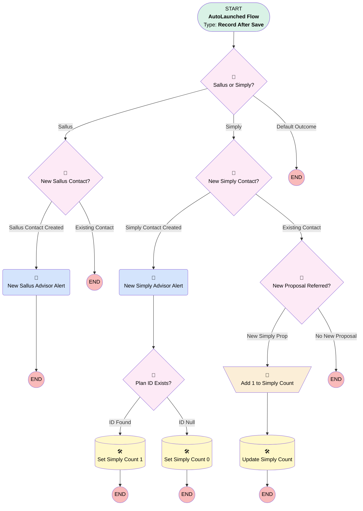

# Contact | After Trigger | Partner Advisor Alerts

## Flow Diagram [(_View History_)](Contact_After_Trigger_Partner_Advisor_Alerts-history.md)

<!-- Flow description -->

## General Information

|<!-- -->|<!-- -->|
|:---|:---|
|Object|Contact|
|Process Type| Auto Launched Flow|
|Trigger Type| Record After Save|
|Record Trigger Type| Create And Update|
|Label|Contact | After Trigger | Partner Advisor Alerts|
|Status|⚠️ Draft|
|Environments|Default|
|Interview Label|Contact | After Trigger | Partner Advisor Alerts {!$Flow.CurrentDateTime}|
| Builder Type (PM)|LightningFlowBuilder|
| Canvas Mode (PM)|AUTO_LAYOUT_CANVAS|
| Origin Builder Type (PM)|LightningFlowBuilder|
|Connector|[Sallus_or_Simply](#sallus_or_simply)|
|Next Node|[Sallus_or_Simply](#sallus_or_simply)|

#### Filters (logic: **1 AND 2 AND (3 OR 4)**)

|Filter Id|Field|Operator|Value|
|:-- |:-- |:--:|:--: |
|1|RecordTypeId| Equal To|0121G000000bptXQAQ|
|2|Role__c| Equal To|Advisor|
|3|LeadSource| Equal To|Sallus|
|4|LeadSource| Equal To|Simply Retirement|

## Formulas

|Name|Data Type|Expression|Description|
|:-- |:--:|:-- |:--  |
|Isnewcontact|Boolean|ISNEW()|<!-- -->|

## Flow Nodes Details

### New_Sallus_Advisor_Alert

|<!-- -->|<!-- -->|
|:---|:---|
|Type|Action Call|
|Label|New Sallus Advisor Alert|
|Action Type|Email Alert|
|Action Name|Contact.Sallus_Advisor_Assigned|
|Flow Transaction Model|CurrentTransaction|
|Name Segment|Contact.Sallus_Advisor_Assigned|
| SObject Row Id (input)|$Record.Id|

### New_Simply_Advisor_Alert

|<!-- -->|<!-- -->|
|:---|:---|
|Type|Action Call|
|Label|New Simply Advisor Alert|
|Action Type|Email Alert|
|Action Name|Contact.Simply_Advisor_Assigned|
|Flow Transaction Model|CurrentTransaction|
|Name Segment|Contact.Simply_Advisor_Assigned|
| SObject Row Id (input)|$Record.Id|
|Connector|[Plan_ID_Exists](#plan_id_exists)|

### Add_1_to_Simply_Count

|<!-- -->|<!-- -->|
|:---|:---|
|Type|Assignment|
|Label|Add 1 to Simply Count|
|Connector|[Update_Simply_Count](#update_simply_count)|

#### Assignments

|Assign To Reference|Operator|Value|
|:-- |:--:|:--: |
|$Record.Simply_Proposal_Count__c| Add|1|
|$Record.Last_Simply_Proposal_Run__c| Assign|$Flow.CurrentDate|

### New_Proposal_Referred

|<!-- -->|<!-- -->|
|:---|:---|
|Type|Decision|
|Label|New Proposal Referred?|
|Default Connector Label|No New Proposal|

#### Rule New_Simply_Prop (New Simply Prop)

|<!-- -->|<!-- -->|
|:---|:---|
|Connector|[Add_1_to_Simply_Count](#add_1_to_simply_count)|
|Condition Logic|and|

|Condition Id|Left Value Reference|Operator|Right Value|
|:-- |:-- |:--:|:--: |
|1|$Record.Plan_ID__c| Is Changed|✅|
|2|$Record.Plan_ID__c| Is Null|⬜|
|3|$Record.LastModifiedDate| Not Equal To|$Record.CreatedDate|

### New_Sallus_Contact

|<!-- -->|<!-- -->|
|:---|:---|
|Type|Decision|
|Label|New Sallus Contact?|
|Default Connector Label|Existing Contact|

#### Rule Sallus_Contact_Created (Sallus Contact Created)

|<!-- -->|<!-- -->|
|:---|:---|
|Connector|[New_Sallus_Advisor_Alert](#new_sallus_advisor_alert)|
|Condition Logic|and|

|Condition Id|Left Value Reference|Operator|Right Value|
|:-- |:-- |:--:|:--: |
|1|Isnewcontact| Equal To|✅|

### New_Simply_Contact

|<!-- -->|<!-- -->|
|:---|:---|
|Type|Decision|
|Label|New Simply Contact?|
|Default Connector|[New_Proposal_Referred](#new_proposal_referred)|
|Default Connector Label|Existing Contact|

#### Rule Simply_Contact_Created (Simply Contact Created)

|<!-- -->|<!-- -->|
|:---|:---|
|Connector|[New_Simply_Advisor_Alert](#new_simply_advisor_alert)|
|Condition Logic|and|

|Condition Id|Left Value Reference|Operator|Right Value|
|:-- |:-- |:--:|:--: |
|1|Isnewcontact| Equal To|✅|

### Plan_ID_Exists

|<!-- -->|<!-- -->|
|:---|:---|
|Type|Decision|
|Label|Plan ID Exists?|
|Default Connector|[Set_Simply_Count_0](#set_simply_count_0)|
|Default Connector Label|ID Null|

#### Rule ID_Found (ID Found)

|<!-- -->|<!-- -->|
|:---|:---|
|Connector|[Set_Simply_Count_1](#set_simply_count_1)|
|Condition Logic|and|

|Condition Id|Left Value Reference|Operator|Right Value|
|:-- |:-- |:--:|:--: |
|1|$Record.Plan_ID__c| Is Null|⬜|

### Sallus_or_Simply

|<!-- -->|<!-- -->|
|:---|:---|
|Type|Decision|
|Label|Sallus or Simply?|
|Default Connector Label|Default Outcome|

#### Rule Sallus (Sallus)

|<!-- -->|<!-- -->|
|:---|:---|
|Connector|[New_Sallus_Contact](#new_sallus_contact)|
|Condition Logic|and|

|Condition Id|Left Value Reference|Operator|Right Value|
|:-- |:-- |:--:|:--: |
|1|$Record.LeadSource| Equal To|Sallus|
|2|$Record.Business_Unit__c| Not Equal To|Simply Retirement|

#### Rule Simply (Simply)

|<!-- -->|<!-- -->|
|:---|:---|
|Connector|[New_Simply_Contact](#new_simply_contact)|
|Condition Logic|and|

|Condition Id|Left Value Reference|Operator|Right Value|
|:-- |:-- |:--:|:--: |
|1|$Record.LeadSource| Equal To|Simply Retirement|
|2|$Record.Business_Unit__c| Equal To|Simply Retirement|

### Set_Simply_Count_0

|<!-- -->|<!-- -->|
|:---|:---|
|Type|Record Update|
|Label|Set Simply Count 0|
|Input Reference|$Record|

#### Input Assignments

|Field|Value|
|:-- |:--: |
|Simply_Proposal_Count__c|numberValue: 0 |

### Set_Simply_Count_1

|<!-- -->|<!-- -->|
|:---|:---|
|Type|Record Update|
|Label|Set Simply Count 1|
|Input Reference|$Record|

#### Input Assignments

|Field|Value|
|:-- |:--: |
|Last_Simply_Proposal_Run__c|$Flow.CurrentDate|
|Simply_Proposal_Count__c|1|

### Update_Simply_Count

|<!-- -->|<!-- -->|
|:---|:---|
|Type|Record Update|
|Label|Update Simply Count|
|Input Reference|$Record|

___

_Documentation generated from branch monitoring_myubiquity by [sfdx-hardis](https://sfdx-hardis.cloudity.com), featuring [salesforce-flow-visualiser](https://github.com/toddhalfpenny/salesforce-flow-visualiser)_