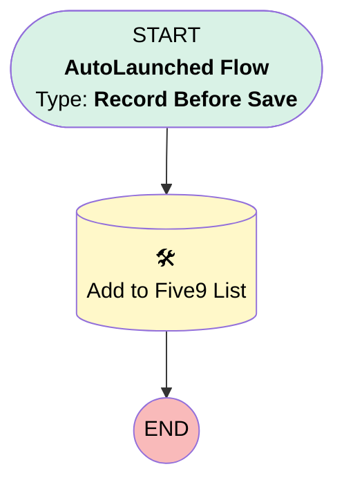

# Contact | Before Insert | Initial Five9 Sync

## Flow Diagram [(_View History_)](Contact_Before_Insert_Initial_Five9_Sync-history.md)

<!-- Flow description -->

## General Information

|<!-- -->|<!-- -->|
|:---|:---|
|Object|Contact|
|Process Type| Auto Launched Flow|
|Trigger Type| Record Before Save|
|Record Trigger Type| Create|
|Label|Contact | Before Insert | Initial Five9 Sync|
|Status|Active|
|Environments|Default|
|Interview Label|Contact | Before Insert | Initial Five9 Sync {!$Flow.CurrentDateTime}|
| Builder Type (PM)|LightningFlowBuilder|
| Canvas Mode (PM)|AUTO_LAYOUT_CANVAS|
| Origin Builder Type (PM)|LightningFlowBuilder|
|Connector|[Add_to_Five9_List](#add_to_five9_list)|
|Next Node|[Add_to_Five9_List](#add_to_five9_list)|

#### Filters (logic: **and**)

|Filter Id|Field|Operator|Value|
|:-- |:-- |:--:|:--: |
|1|Phone| Is Null|<!-- -->|

## Flow Nodes Details

### Add_to_Five9_List

|<!-- -->|<!-- -->|
|:---|:---|
|Type|Record Update|
|Label|Add to Five9 List|
|Input Reference|$Record|

#### Input Assignments

|Field|Value|
|:-- |:--: |
|Add_to_f9list_id__c|a4AUo0000009onBMAQ|

___

_Documentation generated from branch monitoring_myubiquity by [sfdx-hardis](https://sfdx-hardis.cloudity.com), featuring [salesforce-flow-visualiser](https://github.com/toddhalfpenny/salesforce-flow-visualiser)_