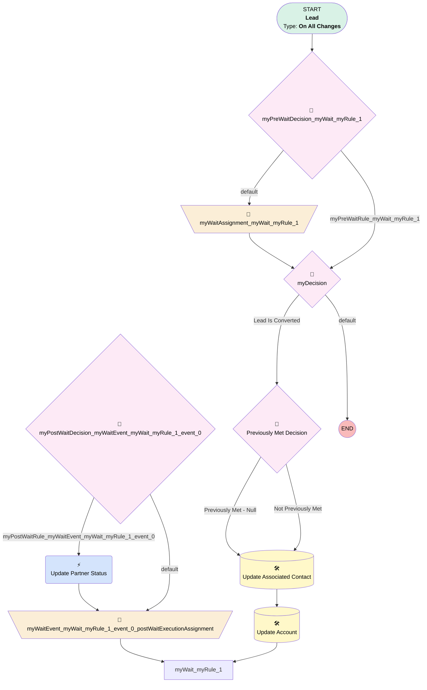

# Contact | Update Partner Status

## Flow Diagram [(_View History_)](Contact_Update_Partner_Status-history.md)

<!-- Flow description -->

## General Information

|<!-- -->|<!-- -->|
|:---|:---|
|Process Type| Workflow|
|Label|Contact | Update Partner Status|
|Status|Obsolete|
|Description|Update Partner Status if all Leads are over 1 year old|
|Interview Label|Contact_Update_Partner_Status-7_InterviewLabel|
|Start Element Reference|[myPreWaitDecision_myWait_myRule_1](#myprewaitdecision_mywait_myrule_1)|
| Object Type (PM)|Lead|
| Object Variable (PM)|myVariable_current|
| Old Object Variable (PM)|myVariable_old|
| Trigger Type (PM)|onAllChanges|

## Variables

|Name|Data Type|Is Collection|Is Input|Is Output|Object Type|Description|
|:-- |:--:|:--:|:--:|:--:|:--:|:--  |
|cancelWaits|String|✅|⬜|✅|<!-- -->|<!-- -->|
|myVariable_current|SObject|⬜|✅|✅|Lead|<!-- -->|
|myVariable_old|SObject|⬜|✅|⬜|Lead|<!-- -->|
|myWaitEvent_myWait_myRule_1_event_0_postActionExecutionVariable|Boolean|⬜|⬜|⬜|<!-- -->|<!-- -->|

## Flow Nodes Details

### myWaitEvent_myWait_myRule_1_event_0_SA1

|<!-- -->|<!-- -->|
|:---|:---|
|Type|Action Call|
|Label|Update Partner Status|
|Action Type|Flow|
|Action Name|Update_Partner_Status|
|Flow Transaction Model|CurrentTransaction|
|Name Segment|Update_Partner_Status|
| Action Call Type (PM)|flow|
|Flow Selection (PM)|Update Partner Status|
|Record Id (input)|myVariable_current.Id|
|Connector|[myWaitEvent_myWait_myRule_1_event_0_postWaitExecutionAssignment](#mywaitevent_mywait_myrule_1_event_0_postwaitexecutionassignment)|

### myWaitAssignment_myWait_myRule_1

|<!-- -->|<!-- -->|
|:---|:---|
|Type|Assignment|
|Label|[myWaitAssignment_myWait_myRule_1](#mywaitassignment_mywait_myrule_1)|
|Connector|[myDecision](#mydecision)|

#### Assignments

|Assign To Reference|Operator|Value|
|:-- |:--:|:--: |
|cancelWaits| Add|myWait_myRule_1|

### myWaitEvent_myWait_myRule_1_event_0_postWaitExecutionAssignment

|<!-- -->|<!-- -->|
|:---|:---|
|Type|Assignment|
|Label|[myWaitEvent_myWait_myRule_1_event_0_postWaitExecutionAssignment](#mywaitevent_mywait_myrule_1_event_0_postwaitexecutionassignment)|
|Connector|myWait_myRule_1|

#### Assignments

|Assign To Reference|Operator|Value|
|:-- |:--:|:--: |
|myWaitEvent_myWait_myRule_1_event_0_postActionExecutionVariable| Assign|✅|

### myDecision

|<!-- -->|<!-- -->|
|:---|:---|
|Type|Decision|
|Label|[myDecision](#mydecision)|
|Default Connector Label|default|
|Index (PM)|numberValue: 0 |

#### Rule myRule_1 (Lead Is Converted)

|<!-- -->|<!-- -->|
|:---|:---|
|Connector|[myRule_1_pmetdec](#myrule_1_pmetdec)|
|Condition Logic|1 AND (2 OR 3 OR 4)|

|Condition Id|Left Value Reference|Operator|Right Value|
|:-- |:-- |:--:|:--: |
|1|myVariable_current.Associated_Contact__c| Is Null|⬜|
|2|myVariable_current.Status| Equal To|Qualified|
|3|myVariable_current.Status| Equal To|Unable to Qualify|
|4|myVariable_current.Status| Equal To|Unqualified|

### myPostWaitDecision_myWaitEvent_myWait_myRule_1_event_0

|<!-- -->|<!-- -->|
|:---|:---|
|Type|Decision|
|Label|[myPostWaitDecision_myWaitEvent_myWait_myRule_1_event_0](#mypostwaitdecision_mywaitevent_mywait_myrule_1_event_0)|
|Default Connector|[myWaitEvent_myWait_myRule_1_event_0_postWaitExecutionAssignment](#mywaitevent_mywait_myrule_1_event_0_postwaitexecutionassignment)|
|Default Connector Label|default|

#### Rule myPostWaitRule_myWaitEvent_myWait_myRule_1_event_0 (myPostWaitRule_myWaitEvent_myWait_myRule_1_event_0)

|<!-- -->|<!-- -->|
|:---|:---|
|Connector|[myWaitEvent_myWait_myRule_1_event_0_SA1](#mywaitevent_mywait_myrule_1_event_0_sa1)|
|Condition Logic|and|

|Condition Id|Left Value Reference|Operator|Right Value|
|:-- |:-- |:--:|:--: |
|1|myVariable_current.CreatedDate| Is Null|⬜|

### myPreWaitDecision_myWait_myRule_1

|<!-- -->|<!-- -->|
|:---|:---|
|Type|Decision|
|Label|[myPreWaitDecision_myWait_myRule_1](#myprewaitdecision_mywait_myrule_1)|
|Default Connector|[myWaitAssignment_myWait_myRule_1](#mywaitassignment_mywait_myrule_1)|
|Default Connector Label|default|

#### Rule myPreWaitRule_myWait_myRule_1 (myPreWaitRule_myWait_myRule_1)

|<!-- -->|<!-- -->|
|:---|:---|
|Connector|[myDecision](#mydecision)|
|Condition Logic|1 AND (2 OR 3 OR 4)|

|Condition Id|Left Value Reference|Operator|Right Value|
|:-- |:-- |:--:|:--: |
|1|myVariable_current.Associated_Contact__c| Is Null|⬜|
|2|myVariable_current.Status| Equal To|Qualified|
|3|myVariable_current.Status| Equal To|Unable to Qualify|
|4|myVariable_current.Status| Equal To|Unqualified|

### myRule_1_pmetdec

|<!-- -->|<!-- -->|
|:---|:---|
|Type|Decision|
|Label|Previously Met Decision|
|Default Connector|[myRule_1_A1](#myrule_1_a1)|
|Default Connector Label|Not Previously Met|

#### Rule myRule_1_pmetnullrule (Previously Met - Null)

|<!-- -->|<!-- -->|
|:---|:---|
|Connector|[myRule_1_A1](#myrule_1_a1)|
|Condition Logic|or|

|Condition Id|Left Value Reference|Operator|Right Value|
|:-- |:-- |:--:|:--: |
|1|myVariable_old| Is Null|✅|

#### Rule myRule_1_pmetrule (Previously Met - Prev)

|<!-- -->|<!-- -->|
|:---|:---|
|Condition Logic|1 AND (2 OR 3 OR 4)|

|Condition Id|Left Value Reference|Operator|Right Value|
|:-- |:-- |:--:|:--: |
|1|myVariable_old.Associated_Contact__c| Is Null|⬜|
|2|myVariable_old.Status| Equal To|Qualified|
|3|myVariable_old.Status| Equal To|Unable to Qualify|
|4|myVariable_old.Status| Equal To|Unqualified|

### myRule_1_A1

|<!-- -->|<!-- -->|
|:---|:---|
|Type|Record Update|
|Object|Contact|
|Label|Update Associated Contact|
|Evaluation Type (PM)|always|
|Extra Type Info (PM)|<!-- -->|
|Is Child Relationship (PM)|⬜|
|Reference (PM)|[Lead].Associated Contact|
|Reference Target Field (PM)|<!-- -->|
|Connector|[myRule_1_A2](#myrule_1_a2)|

#### Filters (logic: **and**)

|Filter Id|Field|Operator|Value|
|:-- |:-- |:--:|:--: |
|1|Id| Equal To|myVariable_current.Associated_Contact__c|

#### Input Assignments

|Field|Value|
|:-- |:--: |
|Partner_Status__c|Active Referrer|

### myRule_1_A2

|<!-- -->|<!-- -->|
|:---|:---|
|Type|Record Update|
|Object|Account|
|Label|Update Account|
|Evaluation Type (PM)|always|
|Extra Type Info (PM)|<!-- -->|
|Is Child Relationship (PM)|⬜|
|Reference (PM)|[Lead].Associated Contact.Account ID|
|Reference Target Field (PM)|<!-- -->|
|Connector|myWait_myRule_1|

#### Filters (logic: **and**)

|Filter Id|Field|Operator|Value|
|:-- |:-- |:--:|:--: |
|1|Id| Equal To|myVariable_current.Associated_Contact__r.AccountId|

#### Input Assignments

|Field|Value|
|:-- |:--: |
|Partner_Status__c|Active Referrer|

___

_Documentation generated from branch monitoring_myubiquity by [sfdx-hardis](https://sfdx-hardis.cloudity.com), featuring [salesforce-flow-visualiser](https://github.com/toddhalfpenny/salesforce-flow-visualiser)_