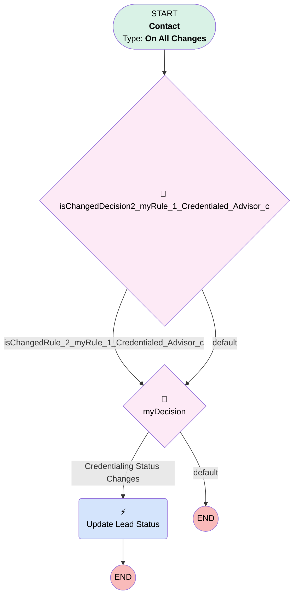

# Contact | Verify Advisor Credentialing

## Flow Diagram [(_View History_)](Contact_Verify_Advisor_Credentialing-history.md)

<!-- Flow description -->

## General Information

|<!-- -->|<!-- -->|
|:---|:---|
|Process Type| Workflow|
|Label|Contact | Verify Advisor Credentialing|
|Status|Obsolete|
|Description|Update Leads associated with Advisor when Credentialing Status changes|
|Interview Label|Contact_Verify_Advisor_Credentialing-1_InterviewLabel|
|Start Element Reference|[isChangedDecision2_myRule_1_Credentialed_Advisor_c](#ischangeddecision2_myrule_1_credentialed_advisor_c)|
| Object Type (PM)|Contact|
| Object Variable (PM)|myVariable_current|
| Old Object Variable (PM)|myVariable_old|
| Trigger Type (PM)|onAllChanges|

## Variables

|Name|Data Type|Is Collection|Is Input|Is Output|Object Type|Description|
|:-- |:--:|:--:|:--:|:--:|:--:|:--  |
|myVariable_current|SObject|⬜|✅|✅|Contact|<!-- -->|
|myVariable_old|SObject|⬜|✅|⬜|Contact|<!-- -->|

## Flow Nodes Details

### myRule_1_A1

|<!-- -->|<!-- -->|
|:---|:---|
|Type|Action Call|
|Label|Update Lead Status|
|Action Type|Flow|
|Action Name|Contact_Update_Credential_Status_on_Leads|
|Name Segment|Contact_Update_Credential_Status_on_Leads|
| Action Call Type (PM)|flow|
|Flow Selection (PM)|Contact | Update Credential Status on Leads|
|Record Id (input)|myVariable_current.Id|

### isChangedDecision2_myRule_1_Credentialed_Advisor_c

|<!-- -->|<!-- -->|
|:---|:---|
|Type|Decision|
|Label|[isChangedDecision2_myRule_1_Credentialed_Advisor_c](#ischangeddecision2_myrule_1_credentialed_advisor_c)|
|Default Connector|[myDecision](#mydecision)|
|Default Connector Label|default|

#### Rule isChangedRule_2_myRule_1_Credentialed_Advisor_c (isChangedRule_2_myRule_1_Credentialed_Advisor_c)

|<!-- -->|<!-- -->|
|:---|:---|
|Connector|[myDecision](#mydecision)|
|Condition Logic|and|

|Condition Id|Left Value Reference|Operator|Right Value|
|:-- |:-- |:--:|:--: |
|1|myVariable_old| Is Null|⬜|
|2|myVariable_old.Credentialed_Advisor__c| Not Equal To|myVariable_current.Credentialed_Advisor__c|

### myDecision

|<!-- -->|<!-- -->|
|:---|:---|
|Type|Decision|
|Label|[myDecision](#mydecision)|
|Default Connector Label|default|
|Index (PM)|numberValue: 0 |

#### Rule myRule_1 (Credentialing Status Changes)

|<!-- -->|<!-- -->|
|:---|:---|
|Connector|[myRule_1_A1](#myrule_1_a1)|
|Condition Logic|and|

|Condition Id|Left Value Reference|Operator|Right Value|
|:-- |:-- |:--:|:--: |
|1|isChangedRule_2_myRule_1_Credentialed_Advisor_c| Equal To|✅|

___

_Documentation generated from branch monitoring_myubiquity by [sfdx-hardis](https://sfdx-hardis.cloudity.com), featuring [salesforce-flow-visualiser](https://github.com/toddhalfpenny/salesforce-flow-visualiser)_