# DocuSign | Update Opp when Billing Approved

## Flow Diagram [(_View History_)](DocuSign_Update_Opp_when_Billing_Approved-history.md)

```mermaid
%% If you read this, your Markdown visualizer does not handle MermaidJS syntax.
%% - If you are in VS Code, install extension `Markdown Preview Mermaid Support` at https://marketplace.visualstudio.com/items?itemName=bierner.markdown-mermaid
%% - If you are using sfdx-hardis, try to define env variable `MERMAID_MODES=cli,docker` ,then run again the command to regenerate markdown with SVG images.
%% - If you are within mkdocs-material, define mermaid plugin in `mkdocs.yml` as described in https://squidfunk.github.io/mkdocs-material/extensions/mermaid/
%% - As a last resort, you can copy-paste this MermaidJS code into https://mermaid.live/ to see the flow diagram

flowchart TB
START(["START<br/><b>dsfs__DocuSign_Status__c</b></br>Type: <b>On All Changes</b>"]):::startClass
click START "#general-information" "3477050714"

START --> isChangedDecision2_myRule_1_dsfs_Envelope_Status_c
myRule_6_A1("⚡ <em></em><br/>Submit Approval to Billing"):::actionCalls
click myRule_6_A1 "#myrule_6_a1" "240656306"

isChangedDecision2_myRule_1_dsfs_Envelope_Status_c{"🔀 <em></em><br/>isChangedDecision2_myRule_1_dsfs_Envelope_Status_c"}:::decisions
click isChangedDecision2_myRule_1_dsfs_Envelope_Status_c "#ischangeddecision2_myrule_1_dsfs_envelope_status_c" "2840914511"

isChangedDecision9_myRule_8_Billing_Approved_c{"🔀 <em></em><br/>isChangedDecision9_myRule_8_Billing_Approved_c"}:::decisions
click isChangedDecision9_myRule_8_Billing_Approved_c "#ischangeddecision9_myrule_8_billing_approved_c" "2242399891"

myDecision{"🔀 <em></em><br/>myDecision"}:::decisions
click myDecision "#mydecision" "2817906713"

myDecision5{"🔀 <em></em><br/>myDecision5"}:::decisions
click myDecision5 "#mydecision5" "1615781356"

myDecision7{"🔀 <em></em><br/>myDecision7"}:::decisions
click myDecision7 "#mydecision7" "2393060645"

myRule_6_pmetdec{"🔀 <em></em><br/>Previously Met Decision"}:::decisions
click myRule_6_pmetdec "#myrule_6_pmetdec" "1500565181"

myRule_1_A1[("🛠️ <em></em><br/>Close Opp")]:::recordUpdates
click myRule_1_A1 "#myrule_1_a1" "3415035244"

myRule_8_A1[("🛠️ <em></em><br/>Update Opp")]:::recordUpdates
click myRule_8_A1 "#myrule_8_a1" "1999531597"

myRule_6_A1 --> myDecision7
isChangedDecision2_myRule_1_dsfs_Envelope_Status_c --> |"isChangedRule_2_myRule_1_dsfs_Envelope_Status_c"| isChangedDecision9_myRule_8_Billing_Approved_c
isChangedDecision2_myRule_1_dsfs_Envelope_Status_c --> |"default"| isChangedDecision9_myRule_8_Billing_Approved_c
isChangedDecision9_myRule_8_Billing_Approved_c --> |"isChangedRule_9_myRule_8_Billing_Approved_c"| myDecision
isChangedDecision9_myRule_8_Billing_Approved_c --> |"default"| myDecision
myDecision --> |"Upgrade LOI Signed"| myRule_1_A1
myDecision --> |"default"| myDecision5
myDecision5 --> |"A4S Completed"| myRule_6_pmetdec
myDecision5 --> |"default"| myDecision7
myDecision7 --> |"Billing Approved"| myRule_8_A1
myDecision7 --> |"default"| END_myDecision7
myRule_6_pmetdec --> |"Previously Met - Null"| myRule_6_A1
myRule_6_pmetdec --> |"Previously Met - Prev"| myDecision7
myRule_6_pmetdec --> |"Not Previously Met"| myRule_6_A1
myRule_1_A1 --> END_myRule_1_A1
myRule_8_A1 --> END_myRule_8_A1
END_myDecision7(( END )):::endClass
END_myRule_1_A1(( END )):::endClass
END_myRule_8_A1(( END )):::endClass


classDef actionCalls fill:#D4E4FC,color:black,text-decoration:none,max-height:100px
classDef assignments fill:#FBEED7,color:black,text-decoration:none,max-height:100px
classDef collectionProcessors fill:#F0E3FA,color:black,text-decoration:none,max-height:100px
classDef customErrors fill:#FFE9E9,color:black,text-decoration:none,max-height:100px
classDef decisions fill:#FDEAF6,color:black,text-decoration:none,max-height:100px
classDef loops fill:#FDEAF6,color:black,text-decoration:none,max-height:100px
classDef recordCreates fill:#FFF8C9,color:black,text-decoration:none,max-height:100px
classDef recordDeletes fill:#FFF8C9,color:black,text-decoration:none,max-height:100px
classDef recordLookups fill:#EDEAFF,color:black,text-decoration:none,max-height:100px
classDef recordUpdates fill:#FFF8C9,color:black,text-decoration:none,max-height:100px
classDef screens fill:#DFF6FF,color:black,text-decoration:none,max-height:100px
classDef subflows fill:#D4E4FC,color:black,text-decoration:none,max-height:100px
classDef startClass fill:#D9F2E6,color:black,text-decoration:none,max-height:100px
classDef endClass fill:#F9BABA,color:black,text-decoration:none,max-height:100px
classDef transforms fill:#FDEAF6,color:black,text-decoration:none,max-height:100px


```

<!-- Flow description -->

## General Information

|<!-- -->|<!-- -->|
|:---|:---|
|Process Type| Workflow|
|Label|DocuSign | Update Opp when Billing Approved|
|Status|Obsolete|
|Description|Close Opp after DocuSign records marked as Completed|
|Interview Label|DocuSign_Update_Opp_when_Billing_Approved-10_InterviewLabel|
|Start Element Reference|[isChangedDecision2_myRule_1_dsfs_Envelope_Status_c](#ischangeddecision2_myrule_1_dsfs_envelope_status_c)|
| Object Type (PM)|dsfs__DocuSign_Status__c|
| Object Variable (PM)|myVariable_current|
| Old Object Variable (PM)|myVariable_old|
| Trigger Type (PM)|onAllChanges|

## Variables

|Name|Data Type|Is Collection|Is Input|Is Output|Object Type|Description|
|:-- |:--:|:--:|:--:|:--:|:--:|:--  |
|myVariable_current|SObject|⬜|✅|✅|dsfs__DocuSign_Status__c|<!-- -->|
|myVariable_old|SObject|⬜|✅|⬜|dsfs__DocuSign_Status__c|<!-- -->|

## Formulas

|Name|Data Type|Expression|Description|
|:-- |:--:|:-- |:--  |
|formula_3_myRule_1_A1_9715685482|Date|TODAY()|<!-- -->|
|formula_4_myRule_1_A1_0474952050|Date|TODAY()|<!-- -->|

## Flow Nodes Details

### myRule_6_A1

|<!-- -->|<!-- -->|
|:---|:---|
|Type|Action Call|
|Label|Submit Approval to Billing|
|Action Type|Submit|
|Action Name|submit|
|Flow Transaction Model|CurrentTransaction|
|Name Segment|submit|
|Process Selection (PM)|Billing Approval - Billing_Approval1|
|Selection Type (PM)|selectedProcess|
|Submitter Type (PM)|currentUser|
|Object Id (input)|myVariable_current.Id|
|Comment (input)|<!-- -->|
|Process Definition Name Or Id (input)|Billing_Approval1|
|Skip Entry Criteria (input)|⬜|
|Connector|[myDecision7](#mydecision7)|

### isChangedDecision2_myRule_1_dsfs_Envelope_Status_c

|<!-- -->|<!-- -->|
|:---|:---|
|Type|Decision|
|Label|[isChangedDecision2_myRule_1_dsfs_Envelope_Status_c](#ischangeddecision2_myrule_1_dsfs_envelope_status_c)|
|Default Connector|[isChangedDecision9_myRule_8_Billing_Approved_c](#ischangeddecision9_myrule_8_billing_approved_c)|
|Default Connector Label|default|

#### Rule isChangedRule_2_myRule_1_dsfs_Envelope_Status_c (isChangedRule_2_myRule_1_dsfs_Envelope_Status_c)

|<!-- -->|<!-- -->|
|:---|:---|
|Connector|[isChangedDecision9_myRule_8_Billing_Approved_c](#ischangeddecision9_myrule_8_billing_approved_c)|
|Condition Logic|and|

|Condition Id|Left Value Reference|Operator|Right Value|
|:-- |:-- |:--:|:--: |
|1|myVariable_old| Is Null|⬜|
|2|myVariable_old.dsfs__Envelope_Status__c| Not Equal To|myVariable_current.dsfs__Envelope_Status__c|

### isChangedDecision9_myRule_8_Billing_Approved_c

|<!-- -->|<!-- -->|
|:---|:---|
|Type|Decision|
|Label|[isChangedDecision9_myRule_8_Billing_Approved_c](#ischangeddecision9_myrule_8_billing_approved_c)|
|Default Connector|[myDecision](#mydecision)|
|Default Connector Label|default|

#### Rule isChangedRule_9_myRule_8_Billing_Approved_c (isChangedRule_9_myRule_8_Billing_Approved_c)

|<!-- -->|<!-- -->|
|:---|:---|
|Connector|[myDecision](#mydecision)|
|Condition Logic|and|

|Condition Id|Left Value Reference|Operator|Right Value|
|:-- |:-- |:--:|:--: |
|1|myVariable_old| Is Null|⬜|
|2|myVariable_old.Billing_Approved__c| Not Equal To|myVariable_current.Billing_Approved__c|

### myDecision

|<!-- -->|<!-- -->|
|:---|:---|
|Type|Decision|
|Label|[myDecision](#mydecision)|
|Default Connector|[myDecision5](#mydecision5)|
|Default Connector Label|default|
|Index (PM)|numberValue: 0 |

#### Rule myRule_1 (Upgrade LOI Signed)

|<!-- -->|<!-- -->|
|:---|:---|
|Connector|[myRule_1_A1](#myrule_1_a1)|
|Condition Logic|and|

|Condition Id|Left Value Reference|Operator|Right Value|
|:-- |:-- |:--:|:--: |
|1|myVariable_current.dsfs__Envelope_Status__c| Equal To|Completed|
|2|isChangedRule_2_myRule_1_dsfs_Envelope_Status_c| Equal To|✅|
|3|myVariable_current.dsfs__Subject__c| Contains|LOI|
|4|myVariable_current.dsfs__Subject__c| Contains|Upgrade|
|5|myVariable_current.dsfs__Opportunity__r.Type| Equal To|Upgrade|
|6|myVariable_current.dsfs__Opportunity__c| Is Null|⬜|

### myDecision5

|<!-- -->|<!-- -->|
|:---|:---|
|Type|Decision|
|Label|[myDecision5](#mydecision5)|
|Default Connector|[myDecision7](#mydecision7)|
|Default Connector Label|default|
|Index (PM)|1|

#### Rule myRule_6 (A4S Completed)

|<!-- -->|<!-- -->|
|:---|:---|
|Connector|[myRule_6_pmetdec](#myrule_6_pmetdec)|
|Condition Logic|and|

|Condition Id|Left Value Reference|Operator|Right Value|
|:-- |:-- |:--:|:--: |
|1|myVariable_current.dsfs__Envelope_Status__c| Equal To|Completed|
|2|myVariable_current.dsfs__Subject__c| Contains|Agreement for Services-|

### myDecision7

|<!-- -->|<!-- -->|
|:---|:---|
|Type|Decision|
|Label|[myDecision7](#mydecision7)|
|Default Connector Label|default|
|Index (PM)|2|

#### Rule myRule_8 (Billing Approved)

|<!-- -->|<!-- -->|
|:---|:---|
|Connector|[myRule_8_A1](#myrule_8_a1)|
|Condition Logic|and|

|Condition Id|Left Value Reference|Operator|Right Value|
|:-- |:-- |:--:|:--: |
|1|myVariable_current.Billing_Approved__c| Equal To|✅|
|2|isChangedRule_9_myRule_8_Billing_Approved_c| Equal To|✅|
|3|myVariable_current.dsfs__Opportunity__c| Is Null|⬜|

### myRule_6_pmetdec

|<!-- -->|<!-- -->|
|:---|:---|
|Type|Decision|
|Label|Previously Met Decision|
|Default Connector|[myRule_6_A1](#myrule_6_a1)|
|Default Connector Label|Not Previously Met|

#### Rule myRule_6_pmetnullrule (Previously Met - Null)

|<!-- -->|<!-- -->|
|:---|:---|
|Connector|[myRule_6_A1](#myrule_6_a1)|
|Condition Logic|or|

|Condition Id|Left Value Reference|Operator|Right Value|
|:-- |:-- |:--:|:--: |
|1|myVariable_old| Is Null|✅|

#### Rule myRule_6_pmetrule (Previously Met - Prev)

|<!-- -->|<!-- -->|
|:---|:---|
|Connector|[myDecision7](#mydecision7)|
|Condition Logic|and|

|Condition Id|Left Value Reference|Operator|Right Value|
|:-- |:-- |:--:|:--: |
|1|myVariable_old.dsfs__Envelope_Status__c| Equal To|Completed|
|2|myVariable_old.dsfs__Subject__c| Contains|Agreement for Services-|

### myRule_1_A1

|<!-- -->|<!-- -->|
|:---|:---|
|Type|Record Update|
|Object|Opportunity|
|Label|Close Opp|
|Evaluation Type (PM)|always|
|Extra Type Info (PM)|<!-- -->|
|Is Child Relationship (PM)|⬜|
|Reference (PM)|[dsfs__DocuSign_Status__c].Opportunity|
|Reference Target Field (PM)|<!-- -->|

#### Filters (logic: **and**)

|Filter Id|Field|Operator|Value|
|:-- |:-- |:--:|:--: |
|1|Id| Equal To|myVariable_current.dsfs__Opportunity__c|

#### Input Assignments

|Field|Value|
|:-- |:--: |
|CloseDate|formula_3_myRule_1_A1_9715685482|
|StageName|Closed Won|
|Upgrade_Effective_Date__c|formula_4_myRule_1_A1_0474952050|

### myRule_8_A1

|<!-- -->|<!-- -->|
|:---|:---|
|Type|Record Update|
|Object|Opportunity|
|Label|Update Opp|
|Evaluation Type (PM)|always|
|Extra Type Info (PM)|<!-- -->|
|Is Child Relationship (PM)|⬜|
|Reference (PM)|[dsfs__DocuSign_Status__c].Opportunity|
|Reference Target Field (PM)|<!-- -->|

#### Filters (logic: **and**)

|Filter Id|Field|Operator|Value|
|:-- |:-- |:--:|:--: |
|1|Id| Equal To|myVariable_current.dsfs__Opportunity__c|

#### Input Assignments

|Field|Value|
|:-- |:--: |
|Agreement_for_Services_A4S__c|✅|

___

_Documentation generated from branch monitoring_myubiquity by [sfdx-hardis](https://sfdx-hardis.cloudity.com), featuring [salesforce-flow-visualiser](https://github.com/toddhalfpenny/salesforce-flow-visualiser)_