# Email Message | After Save | Notify Case Owner When Email Received

## Flow Diagram [(_View History_)](Email_Message_After_Save_Notify_BI_on_Response-history.md)

```mermaid
%% If you read this, your Markdown visualizer does not handle MermaidJS syntax.
%% - If you are in VS Code, install extension `Markdown Preview Mermaid Support` at https://marketplace.visualstudio.com/items?itemName=bierner.markdown-mermaid
%% - If you are using sfdx-hardis, try to define env variable `MERMAID_MODES=cli,docker` ,then run again the command to regenerate markdown with SVG images.
%% - If you are within mkdocs-material, define mermaid plugin in `mkdocs.yml` as described in https://squidfunk.github.io/mkdocs-material/extensions/mermaid/
%% - As a last resort, you can copy-paste this MermaidJS code into https://mermaid.live/ to see the flow diagram

flowchart TB
START(["START<br/><b>AutoLaunched Flow</b></br>Type: <b> Record After Save</b>"]):::startClass
click START "#general-information" "2914100760"

Alert("⚡ <em></em><br/>Alert"):::actionCalls
click Alert "#alert" "3545553606"

Define_Recipient_Ids[\"🟰 <em></em><br/>Define Recipient Ids"/]:::assignments
click Define_Recipient_Ids "#define_recipient_ids" "879671633"

Owner_BI_User_Check{"🔀 <em></em><br/>Owner BI User Check"}:::decisions
click Owner_BI_User_Check "#owner_bi_user_check" "3790616075"

Queue_Check{"🔀 <em></em><br/>Queue Check"}:::decisions
click Queue_Check "#queue_check" "2440082984"

Find_Case[("🔍 <em></em><br/>Find Case")]:::recordLookups
click Find_Case "#find_case" "2865025716"

Alert --> END_Alert
Define_Recipient_Ids --> Alert
Owner_BI_User_Check --> |"Yes send notif"| Define_Recipient_Ids
Owner_BI_User_Check --> |"Default Outcome"| END_Owner_BI_User_Check
Queue_Check --> |"User not Queue"| Owner_BI_User_Check
Queue_Check --> |"Default Outcome"| END_Queue_Check
Find_Case --> Queue_Check
START -->  Find_Case
END_Alert(( END )):::endClass
END_Owner_BI_User_Check(( END )):::endClass
END_Queue_Check(( END )):::endClass


classDef actionCalls fill:#D4E4FC,color:black,text-decoration:none,max-height:100px
classDef assignments fill:#FBEED7,color:black,text-decoration:none,max-height:100px
classDef collectionProcessors fill:#F0E3FA,color:black,text-decoration:none,max-height:100px
classDef customErrors fill:#FFE9E9,color:black,text-decoration:none,max-height:100px
classDef decisions fill:#FDEAF6,color:black,text-decoration:none,max-height:100px
classDef loops fill:#FDEAF6,color:black,text-decoration:none,max-height:100px
classDef recordCreates fill:#FFF8C9,color:black,text-decoration:none,max-height:100px
classDef recordDeletes fill:#FFF8C9,color:black,text-decoration:none,max-height:100px
classDef recordLookups fill:#EDEAFF,color:black,text-decoration:none,max-height:100px
classDef recordUpdates fill:#FFF8C9,color:black,text-decoration:none,max-height:100px
classDef screens fill:#DFF6FF,color:black,text-decoration:none,max-height:100px
classDef subflows fill:#D4E4FC,color:black,text-decoration:none,max-height:100px
classDef startClass fill:#D9F2E6,color:black,text-decoration:none,max-height:100px
classDef endClass fill:#F9BABA,color:black,text-decoration:none,max-height:100px
classDef transforms fill:#FDEAF6,color:black,text-decoration:none,max-height:100px


```

<!-- Flow description -->

## General Information

|<!-- -->|<!-- -->|
|:---|:---|
|Object|EmailMessage|
|Process Type| Auto Launched Flow|
|Trigger Type| Record After Save|
|Record Trigger Type| Create|
|Label|Email Message | After Save | Notify Case Owner When Email Received|
|Status|Active|
|Does Require Record Changed To Meet Criteria|✅|
|Description|Sends a custom notif to case owner when a new email is received/attached to the case.  Currently only for BI cases/users  Opted myself out- JI 10/11/23|
|Environments|Default|
|Interview Label|Email Message | After Save | Notify BI on Response {!$Flow.CurrentDateTime}|
| Builder Type (PM)|LightningFlowBuilder|
| Canvas Mode (PM)|AUTO_LAYOUT_CANVAS|
| Origin Builder Type (PM)|LightningFlowBuilder|
|Connector|[Find_Case](#find_case)|
|Next Node|[Find_Case](#find_case)|

#### Filters (logic: **1 AND (2 or 3) AND NOT 4**)

|Filter Id|Field|Operator|Value|
|:-- |:-- |:--:|:--: |
|1|RelatedToId| Starts With|500|
|2|ToAddress| Contains|BI@|
|3|CcAddress| Contains|BI@|
|4|FromAddress| Starts With|BI@|

## Variables

|Name|Data Type|Is Collection|Is Input|Is Output|Object Type|Description|
|:-- |:--:|:--:|:--:|:--:|:--:|:--  |
|recipientIds|String|✅|⬜|⬜|<!-- -->|<!-- -->|

## Formulas

|Name|Data Type|Expression|Description|
|:-- |:--:|:-- |:--  |
|notificationBody|String|LEFT({!$Record.TextBody},100) + IF(LEN({!$Record.TextBody})>100,". . .","")|<!-- -->|
|notificationSubject|String|"New email from " + IF(ISBLANK({!$Record.FromName}),"unknown",{!$Record.FromName}) + " on case " + {!Find_Case.CaseNumber}|<!-- -->|

## Flow Nodes Details

### Alert

|<!-- -->|<!-- -->|
|:---|:---|
|Type|Action Call|
|Label|[Alert](#alert)|
|Action Type|Custom Notification Action|
|Action Name|customNotificationAction|
|Flow Transaction Model|CurrentTransaction|
|Name Segment|customNotificationAction|
|Custom Notif Type Id (input)|0MLHo0000008R1tOAE|
|Recipient Ids (input)|recipientIds|
|Title (input)|notificationSubject|
|Body (input)|notificationBody|
|Target Id (input)|Find_Case.Id|

### Define_Recipient_Ids

|<!-- -->|<!-- -->|
|:---|:---|
|Type|Assignment|
|Label|Define Recipient Ids|
|Connector|[Alert](#alert)|

#### Assignments

|Assign To Reference|Operator|Value|
|:-- |:--:|:--: |
|recipientIds| Add|Find_Case.OwnerId|

### Owner_BI_User_Check

|<!-- -->|<!-- -->|
|:---|:---|
|Type|Decision|
|Label|Owner BI User Check|
|Default Connector Label|Default Outcome|

#### Rule Yes_send_notif (Yes send notif)

|<!-- -->|<!-- -->|
|:---|:---|
|Connector|[Define_Recipient_Ids](#define_recipient_ids)|
|Condition Logic|and|

|Condition Id|Left Value Reference|Operator|Right Value|
|:-- |:-- |:--:|:--: |
|1|Find_Case.Owner:User.Department| Contains|Business Intelligence|
|2|Find_Case.OwnerId| Not Equal To|0051G000006IsUiQAK|

### Queue_Check

|<!-- -->|<!-- -->|
|:---|:---|
|Type|Decision|
|Label|Queue Check|
|Default Connector Label|Default Outcome|

#### Rule User_not_Queue (User not Queue)

|<!-- -->|<!-- -->|
|:---|:---|
|Connector|[Owner_BI_User_Check](#owner_bi_user_check)|
|Condition Logic|and|

|Condition Id|Left Value Reference|Operator|Right Value|
|:-- |:-- |:--:|:--: |
|1|Find_Case.OwnerId| Starts With|5|
|2|Find_Case.Id| Is Null|⬜|

### Find_Case

|<!-- -->|<!-- -->|
|:---|:---|
|Type|Record Lookup|
|Object|Case|
|Label|Find Case|
|Assign Null Values If No Records Found|⬜|
|Get First Record Only|✅|
|Queried Fields|- Id - OwnerId - CaseNumber |
|Store Output Automatically|✅|
|Connector|[Queue_Check](#queue_check)|

#### Filters (logic: **and**)

|Filter Id|Field|Operator|Value|
|:-- |:-- |:--:|:--: |
|1|Id| Equal To|$Record.RelatedToId|

___

_Documentation generated from branch monitoring_myubiquity by [sfdx-hardis](https://sfdx-hardis.cloudity.com), featuring [salesforce-flow-visualiser](https://github.com/toddhalfpenny/salesforce-flow-visualiser)_