# Email Message | After Trigger | Update Case Activity Dates

## Flow Diagram [(_View History_)](Email_Message_After_Trigger_Update_Case_Activity_Dates-history.md)

```mermaid
%% If you read this, your Markdown visualizer does not handle MermaidJS syntax.
%% - If you are in VS Code, install extension `Markdown Preview Mermaid Support` at https://marketplace.visualstudio.com/items?itemName=bierner.markdown-mermaid
%% - If you are using sfdx-hardis, try to define env variable `MERMAID_MODES=cli,docker` ,then run again the command to regenerate markdown with SVG images.
%% - If you are within mkdocs-material, define mermaid plugin in `mkdocs.yml` as described in https://squidfunk.github.io/mkdocs-material/extensions/mermaid/
%% - As a last resort, you can copy-paste this MermaidJS code into https://mermaid.live/ to see the flow diagram

flowchart TB
START(["START<br/><b>AutoLaunched Flow</b></br>Type: <b> Record After Save</b>"]):::startClass
click START "#general-information" "3096143149"

Log_Failed_Case_Creation("⚙️ <em></em><br/>Log Failed Case Creation"):::actionCalls
click Log_Failed_Case_Creation "#log_failed_case_creation" "3594242600"

Assign_Case_Values[\"🟰 <em></em><br/>Assign Case Values"/]:::assignments
click Assign_Case_Values "#assign_case_values" "2443815290"

Assign_new_activity_datetime[\"🟰 <em></em><br/>Assign new activity datetime"/]:::assignments
click Assign_new_activity_datetime "#assign_new_activity_datetime" "1475516670"

Assign_new_inbound_date[\"🟰 <em></em><br/>Assign new inbound date"/]:::assignments
click Assign_new_inbound_date "#assign_new_inbound_date" "3991226927"

Assign_new_outbound_date[\"🟰 <em></em><br/>Assign new outbound date"/]:::assignments
click Assign_new_outbound_date "#assign_new_outbound_date" "4226247813"

Set_RR_Status[\"🟰 <em></em><br/>Set RR Status"/]:::assignments
click Set_RR_Status "#set_rr_status" "1945747684"

Stamp_First_Response[\"🟰 <em></em><br/>Stamp First Response"/]:::assignments
click Stamp_First_Response "#stamp_first_response" "3683457861"

Check_if_need_general_update{"🔀 <em></em><br/>Check if need general update"}:::decisions
click Check_if_need_general_update "#check_if_need_general_update" "205355840"

Check_if_need_inbound_update{"🔀 <em></em><br/>Check if need inbound update"}:::decisions
click Check_if_need_inbound_update "#check_if_need_inbound_update" "1902410191"

Check_if_Need_New_Case{"🔀 <em></em><br/>Check if Need New Case"}:::decisions
click Check_if_Need_New_Case "#check_if_need_new_case" "1278066226"

Check_if_need_outbound_update{"🔀 <em></em><br/>Check if need outbound update"}:::decisions
click Check_if_need_outbound_update "#check_if_need_outbound_update" "1050873845"

Check_if_need_response_received{"🔀 <em></em><br/>Check if need response received"}:::decisions
click Check_if_need_response_received "#check_if_need_response_received" "1259227781"

Email_Age_Check{"🔀 <em></em><br/>Email Age Check"}:::decisions
click Email_Age_Check "#email_age_check" "572163616"

Inbound_vs_Outbound_Split{"🔀 <em></em><br/>Inbound vs Outbound Split"}:::decisions
click Inbound_vs_Outbound_Split "#inbound_vs_outbound_split" "3517732822"

Stamp_First_Response_on_Case{"🔀 <em></em><br/>Stamp First Response on Case?"}:::decisions
click Stamp_First_Response_on_Case "#stamp_first_response_on_case" "3417911340"

Create_Email_Copy[("➕ <em></em><br/>Create Email Copy")]:::recordCreates
click Create_Email_Copy "#create_email_copy" "4234856829"

Create_New_Case[("➕ <em></em><br/>Create New Case")]:::recordCreates
click Create_New_Case "#create_new_case" "3985014347"

Update_Case[("🛠️ <em></em><br/>Update Case")]:::recordUpdates
click Update_Case "#update_case" "954042668"

Log_Failed_Case_Creation --> Check_if_need_inbound_update
Assign_Case_Values --> Inbound_vs_Outbound_Split
Assign_new_activity_datetime --> Update_Case
Assign_new_inbound_date --> Check_if_need_response_received
Assign_new_outbound_date --> Stamp_First_Response_on_Case
Set_RR_Status --> Check_if_need_general_update
Stamp_First_Response --> Check_if_need_general_update
Check_if_need_general_update --> |"Needs Activity Update"| Assign_new_activity_datetime
Check_if_need_general_update --> |"Default Outcome"| END_Check_if_need_general_update
Check_if_need_inbound_update --> |"Needs Inbound Stamp"| Assign_new_inbound_date
Check_if_need_inbound_update --> |"Default Outcome"| Check_if_need_response_received
Check_if_Need_New_Case --> |"Needs New Case"| Create_New_Case
Check_if_Need_New_Case --> |"Default Outcome"| Check_if_need_inbound_update
Check_if_need_outbound_update --> |"Needs Outbound Stamp"| Assign_new_outbound_date
Check_if_need_outbound_update --> |"Default Outcome"| Stamp_First_Response_on_Case
Check_if_need_response_received --> |"Need RR Status"| Set_RR_Status
Check_if_need_response_received --> |"Default Outcome"| Check_if_need_general_update
Email_Age_Check --> |"Default Outcome"| Assign_Case_Values
Inbound_vs_Outbound_Split --> |"Inbound Email"| Check_if_Need_New_Case
Inbound_vs_Outbound_Split --> |"Outbound"| Check_if_need_outbound_update
Stamp_First_Response_on_Case --> |"Yes, Stamp First Response"| Stamp_First_Response
Stamp_First_Response_on_Case --> |"Default Outcome"| Check_if_need_general_update
Create_Email_Copy --> END_Create_Email_Copy
Create_New_Case --> Create_Email_Copy
Create_New_Case -. Fault .->Log_Failed_Case_Creation
Update_Case --> END_Update_Case
START -->  Email_Age_Check
END_Check_if_need_general_update(( END )):::endClass
END_Create_Email_Copy(( END )):::endClass
END_Update_Case(( END )):::endClass


classDef actionCalls fill:#D4E4FC,color:black,text-decoration:none,max-height:100px
classDef assignments fill:#FBEED7,color:black,text-decoration:none,max-height:100px
classDef collectionProcessors fill:#F0E3FA,color:black,text-decoration:none,max-height:100px
classDef customErrors fill:#FFE9E9,color:black,text-decoration:none,max-height:100px
classDef decisions fill:#FDEAF6,color:black,text-decoration:none,max-height:100px
classDef loops fill:#FDEAF6,color:black,text-decoration:none,max-height:100px
classDef recordCreates fill:#FFF8C9,color:black,text-decoration:none,max-height:100px
classDef recordDeletes fill:#FFF8C9,color:black,text-decoration:none,max-height:100px
classDef recordLookups fill:#EDEAFF,color:black,text-decoration:none,max-height:100px
classDef recordUpdates fill:#FFF8C9,color:black,text-decoration:none,max-height:100px
classDef screens fill:#DFF6FF,color:black,text-decoration:none,max-height:100px
classDef subflows fill:#D4E4FC,color:black,text-decoration:none,max-height:100px
classDef startClass fill:#D9F2E6,color:black,text-decoration:none,max-height:100px
classDef endClass fill:#F9BABA,color:black,text-decoration:none,max-height:100px
classDef transforms fill:#FDEAF6,color:black,text-decoration:none,max-height:100px


```

<!-- Flow description -->

## General Information

|<!-- -->|<!-- -->|
|:---|:---|
|Object|EmailMessage|
|Process Type| Auto Launched Flow|
|Trigger Type| Record After Save|
|Record Trigger Type| Create And Update|
|Label|Email Message | After Trigger | Update Case Activity Dates|
|Status|Active|
|Does Require Record Changed To Meet Criteria|✅|
|Description|Sets values for last inbound, last outbound, and last activity date when an email is sent or received on a case.  Also creates new case if email is received on a case that's been closed for 30+ days.|
|Environments|Default|
|Interview Label|Email Message | After Trigger | Update Case Activity Dates {!$Flow.CurrentDateTime}|
| Builder Type (PM)|LightningFlowBuilder|
| Canvas Mode (PM)|AUTO_LAYOUT_CANVAS|
| Origin Builder Type (PM)|LightningFlowBuilder|
|Connector|[Email_Age_Check](#email_age_check)|
|Next Node|[Email_Age_Check](#email_age_check)|

#### Filters (logic: **and**)

|Filter Id|Field|Operator|Value|
|:-- |:-- |:--:|:--: |
|1|ParentId| Is Null|<!-- -->|
|2|Status| Not Equal To|5|

## Variables

|Name|Data Type|Is Collection|Is Input|Is Output|Object Type|Description|
|:-- |:--:|:--:|:--:|:--:|:--:|:--  |
|associatedCase|SObject|⬜|⬜|⬜|Case|<!-- -->|

## Formulas

|Name|Data Type|Expression|Description|
|:-- |:--:|:-- |:--  |
|oneHourAgo|DateTime|{!$Flow.CurrentDateTime} - (1/24)|<!-- -->|
|trimmedDescription|String|TRIM(LEFT({!$Record.TextBody},300))|<!-- -->|
|trimmedSubject|String|TRIM(LEFT({!$Record.Subject},255))|<!-- -->|
|twoMinutesAgo|DateTime|{!$Flow.CurrentDateTime} - (2/60/24)|<!-- -->|
|x30DaysAgo|Date|TODAY()-30|<!-- -->|

## Constants

|Name|Data Type|Value|Description|
|:-- |:--:|:--:|:--  |
|Tier1Support|String|00GHo000002SIjQMAW|<!-- -->|

## Flow Nodes Details

### Log_Failed_Case_Creation

|<!-- -->|<!-- -->|
|:---|:---|
|Type|Action Call|
|Label|Log Failed Case Creation|
|Action Type|Apex|
|Action Name|FlowRecordLogEntry|
|Data Type Mappings|typeName: T__record typeValue: Case |
|Flow Transaction Model|CurrentTransaction|
|Name Segment|FlowRecordLogEntry|
|Offset|0|
|Store Output Automatically|✅|
|Fault Message (input)|$Flow.FaultMessage|
|Flow Name (input)|Email_Message_After_Trigger_Update_Case_Activity_Dates|
|Logging Level Name (input)|ERROR|
|Message (input)|Failed to create new case for email received on old resolved case {!$Record.Parent.CaseNumber}.|
|Record (input)|associatedCase|
|Save Log (input)|✅|
|Connector|isGoTo: true targetReference: Check_if_need_inbound_update |

### Assign_Case_Values

|<!-- -->|<!-- -->|
|:---|:---|
|Type|Assignment|
|Label|Assign Case Values|
|Connector|[Inbound_vs_Outbound_Split](#inbound_vs_outbound_split)|

#### Assignments

|Assign To Reference|Operator|Value|
|:-- |:--:|:--: |
|associatedCase.Id| Assign|$Record.ParentId|
|associatedCase.Last_Inbound_Activity__c| Assign|$Record.Parent.Last_Inbound_Activity__c|
|associatedCase.Last_Outbound_Activity__c| Assign|$Record.Parent.Last_Outbound_Activity__c|
|associatedCase.Last_Activity_Date__c| Assign|$Record.Parent.Last_Activity_Date__c|

### Assign_new_activity_datetime

|<!-- -->|<!-- -->|
|:---|:---|
|Type|Assignment|
|Label|Assign new activity datetime|
|Connector|[Update_Case](#update_case)|

#### Assignments

|Assign To Reference|Operator|Value|
|:-- |:--:|:--: |
|associatedCase.Last_Activity_Date__c| Assign|$Flow.CurrentDateTime|

### Assign_new_inbound_date

|<!-- -->|<!-- -->|
|:---|:---|
|Type|Assignment|
|Label|Assign new inbound date|
|Connector|[Check_if_need_response_received](#check_if_need_response_received)|

#### Assignments

|Assign To Reference|Operator|Value|
|:-- |:--:|:--: |
|associatedCase.Last_Inbound_Activity__c| Assign|$Flow.CurrentDate|

### Assign_new_outbound_date

|<!-- -->|<!-- -->|
|:---|:---|
|Type|Assignment|
|Label|Assign new outbound date|
|Connector|[Stamp_First_Response_on_Case](#stamp_first_response_on_case)|

#### Assignments

|Assign To Reference|Operator|Value|
|:-- |:--:|:--: |
|associatedCase.Last_Outbound_Activity__c| Assign|$Flow.CurrentDate|

### Set_RR_Status

|<!-- -->|<!-- -->|
|:---|:---|
|Type|Assignment|
|Label|Set RR Status|
|Connector|[Check_if_need_general_update](#check_if_need_general_update)|

#### Assignments

|Assign To Reference|Operator|Value|
|:-- |:--:|:--: |
|associatedCase.Status| Assign|Response Received|

### Stamp_First_Response

|<!-- -->|<!-- -->|
|:---|:---|
|Type|Assignment|
|Label|Stamp First Response|
|Connector|[Check_if_need_general_update](#check_if_need_general_update)|

#### Assignments

|Assign To Reference|Operator|Value|
|:-- |:--:|:--: |
|associatedCase.First_Response__c| Assign|$Flow.CurrentDateTime|

### Check_if_need_general_update

|<!-- -->|<!-- -->|
|:---|:---|
|Type|Decision|
|Label|Check if need general update|
|Default Connector Label|Default Outcome|

#### Rule Needs_Activity_Update (Needs Activity Update)

|<!-- -->|<!-- -->|
|:---|:---|
|Connector|[Assign_new_activity_datetime](#assign_new_activity_datetime)|
|Condition Logic|and|

|Condition Id|Left Value Reference|Operator|Right Value|
|:-- |:-- |:--:|:--: |
|1|associatedCase.Last_Activity_Date__c| Not Equal To|$Flow.CurrentDateTime|

### Check_if_need_inbound_update

|<!-- -->|<!-- -->|
|:---|:---|
|Type|Decision|
|Label|Check if need inbound update|
|Default Connector|[Check_if_need_response_received](#check_if_need_response_received)|
|Default Connector Label|Default Outcome|

#### Rule Needs_Inbound_Stamp (Needs Inbound Stamp)

|<!-- -->|<!-- -->|
|:---|:---|
|Connector|[Assign_new_inbound_date](#assign_new_inbound_date)|
|Condition Logic|and|

|Condition Id|Left Value Reference|Operator|Right Value|
|:-- |:-- |:--:|:--: |
|1|associatedCase.Last_Inbound_Activity__c| Not Equal To|$Flow.CurrentDate|

### Check_if_Need_New_Case

|<!-- -->|<!-- -->|
|:---|:---|
|Type|Decision|
|Label|Check if Need New Case|
|Description|If case has been closed for 30+ days, create new case instead of reopening|
|Default Connector|[Check_if_need_inbound_update](#check_if_need_inbound_update)|
|Default Connector Label|Default Outcome|

#### Rule Needs_New_Case (Needs New Case)

|<!-- -->|<!-- -->|
|:---|:---|
|Connector|[Create_New_Case](#create_new_case)|
|Condition Logic|and|

|Condition Id|Left Value Reference|Operator|Right Value|
|:-- |:-- |:--:|:--: |
|1|$Record.Parent.Status| Equal To|Resolved|
|2|$Record.Parent.ClosedDate| Less Than|x30DaysAgo|

### Check_if_need_outbound_update

|<!-- -->|<!-- -->|
|:---|:---|
|Type|Decision|
|Label|Check if need outbound update|
|Default Connector|[Stamp_First_Response_on_Case](#stamp_first_response_on_case)|
|Default Connector Label|Default Outcome|

#### Rule Needs_Outbound_Stamp (Needs Outbound Stamp)

|<!-- -->|<!-- -->|
|:---|:---|
|Connector|[Assign_new_outbound_date](#assign_new_outbound_date)|
|Condition Logic|and|

|Condition Id|Left Value Reference|Operator|Right Value|
|:-- |:-- |:--:|:--: |
|1|associatedCase.Last_Outbound_Activity__c| Not Equal To|$Flow.CurrentDate|

### Check_if_need_response_received

|<!-- -->|<!-- -->|
|:---|:---|
|Type|Decision|
|Label|Check if need response received|
|Default Connector|[Check_if_need_general_update](#check_if_need_general_update)|
|Default Connector Label|Default Outcome|

#### Rule Need_RR_Status (Need RR Status)

|<!-- -->|<!-- -->|
|:---|:---|
|Connector|[Set_RR_Status](#set_rr_status)|
|Condition Logic|and|

|Condition Id|Left Value Reference|Operator|Right Value|
|:-- |:-- |:--:|:--: |
|1|$Record.Parent.Status| Not Equal To|Response Received|
|2|$Record.Parent.CreatedDate| Less Than|twoMinutesAgo|

### Email_Age_Check

|<!-- -->|<!-- -->|
|:---|:---|
|Type|Decision|
|Label|Email Age Check|
|Description|Checks if the email's message date is less than an hour ago. If so, it's probably being unarchived and this flow shouldn't run.|
|Default Connector|[Assign_Case_Values](#assign_case_values)|
|Default Connector Label|Default Outcome|

#### Rule Old_Email (Old Email)

|<!-- -->|<!-- -->|
|:---|:---|
|Condition Logic|and|

|Condition Id|Left Value Reference|Operator|Right Value|
|:-- |:-- |:--:|:--: |
|1|$Record.MessageDate| Less Than|oneHourAgo|

### Inbound_vs_Outbound_Split

|<!-- -->|<!-- -->|
|:---|:---|
|Type|Decision|
|Label|Inbound vs Outbound Split|
|Default Connector|[Check_if_need_outbound_update](#check_if_need_outbound_update)|
|Default Connector Label|Outbound|

#### Rule Inbound_Email (Inbound Email)

|<!-- -->|<!-- -->|
|:---|:---|
|Connector|[Check_if_Need_New_Case](#check_if_need_new_case)|
|Condition Logic|and|

|Condition Id|Left Value Reference|Operator|Right Value|
|:-- |:-- |:--:|:--: |
|1|$Record.Incoming| Equal To|✅|

### Stamp_First_Response_on_Case

|<!-- -->|<!-- -->|
|:---|:---|
|Type|Decision|
|Label|Stamp First Response on Case?|
|Default Connector|[Check_if_need_general_update](#check_if_need_general_update)|
|Default Connector Label|Default Outcome|

#### Rule Yes_Stamp_First_Response (Yes, Stamp First Response)

|<!-- -->|<!-- -->|
|:---|:---|
|Connector|[Stamp_First_Response](#stamp_first_response)|
|Condition Logic|and|

|Condition Id|Left Value Reference|Operator|Right Value|
|:-- |:-- |:--:|:--: |
|1|$Record.Parent.First_Response__c| Is Blank|✅|
|2|$Record.CreatedById| Not Equal To|00500000006xUkgAAE|

### Create_Email_Copy

|<!-- -->|<!-- -->|
|:---|:---|
|Type|Record Create|
|Object|EmailMessage|
|Label|Create Email Copy|
|Store Output Automatically|✅|

#### Input Assignments

|Field|Value|
|:-- |:--: |
|BccAddress|$Record.BccAddress|
|CcAddress|$Record.CcAddress|
|FromAddress|$Record.FromAddress|
|FromName|$Record.FromName|
|HtmlBody|$Record.HtmlBody|
|Incoming|✅|
|ParentId|[Create_New_Case](#create_new_case)|
|Subject|$Record.Subject|
|TextBody|$Record.TextBody|
|ToAddress|$Record.ToAddress|

### Create_New_Case

|<!-- -->|<!-- -->|
|:---|:---|
|Type|Record Create|
|Object|Case|
|Label|Create New Case|
|Fault Connector|[Log_Failed_Case_Creation](#log_failed_case_creation)|
|Store Output Automatically|✅|
|Connector|[Create_Email_Copy](#create_email_copy)|

#### Input Assignments

|Field|Value|
|:-- |:--: |
|AccountId|$Record.Parent.AccountId|
|ContactId|$Record.Parent.ContactId|
|Description|trimmedDescription|
|Origin|$Record.Parent.Origin|
|OwnerId|Tier1Support|
|Plan__c|$Record.Parent.Plan__c|
|Splited_From__c|$Record.Parent.Id|
|Status|New|
|Subject|trimmedSubject|
|SuppliedEmail|$Record.FromAddress|
|SuppliedName|$Record.FromName|

### Update_Case

|<!-- -->|<!-- -->|
|:---|:---|
|Type|Record Update|
|Label|Update Case|
|Input Reference|associatedCase|

___

_Documentation generated from branch monitoring_myubiquity by [sfdx-hardis](https://sfdx-hardis.cloudity.com), featuring [salesforce-flow-visualiser](https://github.com/toddhalfpenny/salesforce-flow-visualiser)_