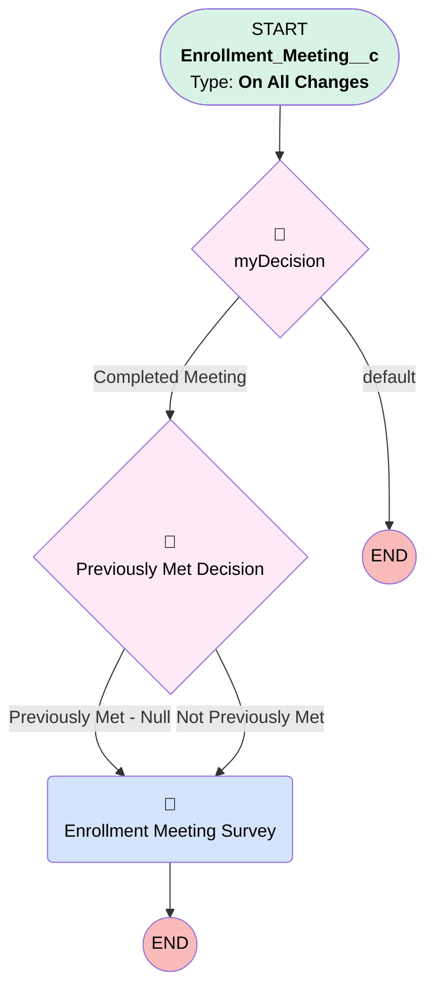

# Enrollment | Survey

## Flow Diagram [(_View History_)](Enrollment_Survey-history.md)

<!-- Flow description -->

## General Information

|<!-- -->|<!-- -->|
|:---|:---|
|Process Type| Workflow|
|Label|Enrollment | Survey|
|Status|Obsolete|
|Description|Send Survey after enrollment meeting is completed|
|Interview Label|Enrollment_Survey-2_InterviewLabel|
|Start Element Reference|[myDecision](#mydecision)|
| Object Type (PM)|Enrollment_Meeting__c|
| Object Variable (PM)|myVariable_current|
| Old Object Variable (PM)|myVariable_old|
| Trigger Type (PM)|onAllChanges|

## Variables

|Name|Data Type|Is Collection|Is Input|Is Output|Object Type|Description|
|:-- |:--:|:--:|:--:|:--:|:--:|:--  |
|myVariable_current|SObject|⬜|✅|✅|Enrollment_Meeting__c|<!-- -->|
|myVariable_old|SObject|⬜|✅|⬜|Enrollment_Meeting__c|<!-- -->|

## Flow Nodes Details

### myRule_1_A1

|<!-- -->|<!-- -->|
|:---|:---|
|Type|Action Call|
|Label|Enrollment Meeting Survey|
|Action Type|Email Alert|
|Action Name|Enrollment_Meeting__c.Enrollment_Meeting_Survey|
|Name Segment|Enrollment_Meeting__c.Enrollment_Meeting_Survey|
|Email Alert Selection (PM)|Enrollment_Meeting_Survey|
| SObject Row Id (input)|myVariable_current.Id|

### myDecision

|<!-- -->|<!-- -->|
|:---|:---|
|Type|Decision|
|Label|[myDecision](#mydecision)|
|Default Connector Label|default|
|Index (PM)|numberValue: 0 |

#### Rule myRule_1 (Completed Meeting)

|<!-- -->|<!-- -->|
|:---|:---|
|Connector|[myRule_1_pmetdec](#myrule_1_pmetdec)|
|Condition Logic|1 AND (2 OR 3 OR 4 OR 5)|

|Condition Id|Left Value Reference|Operator|Right Value|
|:-- |:-- |:--:|:--: |
|1|myVariable_current.Status__c| Equal To|Completed|
|2|myVariable_current.Meeting_Type__c| Contains|Complete meeting|
|3|myVariable_current.Meeting_Type__c| Contains|Tailored deck|
|4|myVariable_current.Meeting_Type__c| Contains|Recording sent to employees|
|5|myVariable_current.Meeting_Type__c| Contains|Train_Sponsor_Recording_to_Employees|

### myRule_1_pmetdec

|<!-- -->|<!-- -->|
|:---|:---|
|Type|Decision|
|Label|Previously Met Decision|
|Default Connector|[myRule_1_A1](#myrule_1_a1)|
|Default Connector Label|Not Previously Met|

#### Rule myRule_1_pmetnullrule (Previously Met - Null)

|<!-- -->|<!-- -->|
|:---|:---|
|Connector|[myRule_1_A1](#myrule_1_a1)|
|Condition Logic|or|

|Condition Id|Left Value Reference|Operator|Right Value|
|:-- |:-- |:--:|:--: |
|1|myVariable_old| Is Null|✅|

#### Rule myRule_1_pmetrule (Previously Met - Prev)

|<!-- -->|<!-- -->|
|:---|:---|
|Condition Logic|1 AND (2 OR 3 OR 4 OR 5)|

|Condition Id|Left Value Reference|Operator|Right Value|
|:-- |:-- |:--:|:--: |
|1|myVariable_old.Status__c| Equal To|Completed|
|2|myVariable_old.Meeting_Type__c| Contains|Complete meeting|
|3|myVariable_old.Meeting_Type__c| Contains|Tailored deck|
|4|myVariable_old.Meeting_Type__c| Contains|Recording sent to employees|
|5|myVariable_old.Meeting_Type__c| Contains|Train_Sponsor_Recording_to_Employees|

___

_Documentation generated from branch monitoring_myubiquity by [sfdx-hardis](https://sfdx-hardis.cloudity.com), featuring [salesforce-flow-visualiser](https://github.com/toddhalfpenny/salesforce-flow-visualiser)_