# Forecast | Scheduled | Sync Actual Numbers

## Flow Diagram [(_View History_)](Forecast_Scheduled_Sync_Actual_Numbers-history.md)

```mermaid
%% If you read this, your Markdown visualizer does not handle MermaidJS syntax.
%% - If you are in VS Code, install extension `Markdown Preview Mermaid Support` at https://marketplace.visualstudio.com/items?itemName=bierner.markdown-mermaid
%% - If you are using sfdx-hardis, try to define env variable `MERMAID_MODES=cli,docker` ,then run again the command to regenerate markdown with SVG images.
%% - If you are within mkdocs-material, define mermaid plugin in `mkdocs.yml` as described in https://squidfunk.github.io/mkdocs-material/extensions/mermaid/
%% - As a last resort, you can copy-paste this MermaidJS code into https://mermaid.live/ to see the flow diagram

flowchart TB
START(["START<br/><b>AutoLaunched Flow</b></br>Type: <b> Scheduled</b>"]):::startClass
click START "#general-information" "1976844539"

Add_Opp_to_Null_Forecast[\"🟰 <em></em><br/>Add Opp to Null Forecast"/]:::assignments
click Add_Opp_to_Null_Forecast "#add_opp_to_null_forecast" "1641372174"

index[\"🟰 <em></em><br/>index++"/]:::assignments
click index "#index" "4273038467"

Mark_Opp_for_Reset[\"🟰 <em></em><br/>Mark Opp for Reset"/]:::assignments
click Mark_Opp_for_Reset "#mark_opp_for_reset" "2562186622"

Remove_Bad_Opps_From_Related[\"🟰 <em></em><br/>Remove Bad Opps From Related"/]:::assignments
click Remove_Bad_Opps_From_Related "#remove_bad_opps_from_related" "2778996091"

Check_if_forecast_needs_update{"🔀 <em></em><br/>Check if forecast needs update"}:::decisions
click Check_if_forecast_needs_update "#check_if_forecast_needs_update" "2686034093"

Current_Forecast_Check{"🔀 <em></em><br/>Current Forecast Check"}:::decisions
click Current_Forecast_Check "#current_forecast_check" "994108668"

Forecast_Needs_Zeroing{"🔀 <em></em><br/>Forecast Needs Zeroing"}:::decisions
click Forecast_Needs_Zeroing "#forecast_needs_zeroing" "2464413577"

Opp_in_correct_forecast{"🔀 <em></em><br/>Opp in correct forecast"}:::decisions
click Opp_in_correct_forecast "#opp_in_correct_forecast" "3116834634"

Opps_Found_Check{"🔀 <em></em><br/>Opps Found Check"}:::decisions
click Opps_Found_Check "#opps_found_check" "2317199660"

Opps_to_reset_check{"🔀 <em></em><br/>Opps to reset check"}:::decisions
click Opps_to_reset_check "#opps_to_reset_check" "1488235455"

Addition_Loop{{"🔁 <em></em><br/>Addition Loop"}}:::loops
click Addition_Loop "#addition_loop" "1503457373"

Opp_Removal_Loop{{"🔁 <em></em><br/>Opp Removal Loop"}}:::loops
click Opp_Removal_Loop "#opp_removal_loop" "1076181436"

Grab_related_ops[("🔍 <em></em><br/>Grab related ops")]:::recordLookups
click Grab_related_ops "#grab_related_ops" "4054306922"

Commit_forecast_update[("🛠️ <em></em><br/>Commit forecast update")]:::recordUpdates
click Commit_forecast_update "#commit_forecast_update" "3730947674"

Reset_Opp_Forecasts[("🛠️ <em></em><br/>Reset Opp Forecasts")]:::recordUpdates
click Reset_Opp_Forecasts "#reset_opp_forecasts" "635735177"

Zero_Out_Forecast[("🛠️ <em></em><br/>Zero Out Forecast")]:::recordUpdates
click Zero_Out_Forecast "#zero_out_forecast" "2082579736"

Calculate_Forecast_Actuals[["🔗 <em>Subflow</em><br/>Calculate Forecast Actuals"]]:::subflows
click Calculate_Forecast_Actuals "#calculate_forecast_actuals" "4003904831"

Add_Opp_to_Null_Forecast --> Addition_Loop
index --> Opp_in_correct_forecast
Mark_Opp_for_Reset --> Add_Opp_to_Null_Forecast
Remove_Bad_Opps_From_Related --> Opp_Removal_Loop
Check_if_forecast_needs_update --> |"Update actuals"| Commit_forecast_update
Check_if_forecast_needs_update --> |"Default Outcome"| Opps_to_reset_check
Current_Forecast_Check --> |"Date Valid"| Grab_related_ops
Current_Forecast_Check --> |"Default Outcome"| END_Current_Forecast_Check
Forecast_Needs_Zeroing --> |"Needs Zero"| Zero_Out_Forecast
Forecast_Needs_Zeroing --> |"Default Outcome"| END_Forecast_Needs_Zeroing
Opp_in_correct_forecast --> |"Forecast Match"| Addition_Loop
Opp_in_correct_forecast --> |"Mismatch"| Mark_Opp_for_Reset
Opps_Found_Check --> |"Opps In Collection"| Addition_Loop
Opps_Found_Check --> |"Default Outcome"| Forecast_Needs_Zeroing
Opps_to_reset_check --> |"Opps Needing Reset"| Reset_Opp_Forecasts
Opps_to_reset_check --> |"Default Outcome"| END_Opps_to_reset_check
Addition_Loop --> |"For Each"|index
Addition_Loop ---> |"After Last"|Opp_Removal_Loop
Opp_Removal_Loop --> |"For Each"|Remove_Bad_Opps_From_Related
Opp_Removal_Loop ---> |"After Last"|Calculate_Forecast_Actuals
Grab_related_ops --> Opps_Found_Check
Commit_forecast_update --> Opps_to_reset_check
Reset_Opp_Forecasts --> END_Reset_Opp_Forecasts
Zero_Out_Forecast --> END_Zero_Out_Forecast
START -->  Current_Forecast_Check
Calculate_Forecast_Actuals --> Check_if_forecast_needs_update
END_Current_Forecast_Check(( END )):::endClass
END_Forecast_Needs_Zeroing(( END )):::endClass
END_Opps_to_reset_check(( END )):::endClass
END_Reset_Opp_Forecasts(( END )):::endClass
END_Zero_Out_Forecast(( END )):::endClass


classDef actionCalls fill:#D4E4FC,color:black,text-decoration:none,max-height:100px
classDef assignments fill:#FBEED7,color:black,text-decoration:none,max-height:100px
classDef collectionProcessors fill:#F0E3FA,color:black,text-decoration:none,max-height:100px
classDef customErrors fill:#FFE9E9,color:black,text-decoration:none,max-height:100px
classDef decisions fill:#FDEAF6,color:black,text-decoration:none,max-height:100px
classDef loops fill:#FDEAF6,color:black,text-decoration:none,max-height:100px
classDef recordCreates fill:#FFF8C9,color:black,text-decoration:none,max-height:100px
classDef recordDeletes fill:#FFF8C9,color:black,text-decoration:none,max-height:100px
classDef recordLookups fill:#EDEAFF,color:black,text-decoration:none,max-height:100px
classDef recordUpdates fill:#FFF8C9,color:black,text-decoration:none,max-height:100px
classDef screens fill:#DFF6FF,color:black,text-decoration:none,max-height:100px
classDef subflows fill:#D4E4FC,color:black,text-decoration:none,max-height:100px
classDef startClass fill:#D9F2E6,color:black,text-decoration:none,max-height:100px
classDef endClass fill:#F9BABA,color:black,text-decoration:none,max-height:100px
classDef transforms fill:#FDEAF6,color:black,text-decoration:none,max-height:100px


```

<!-- Flow description -->

## General Information

|<!-- -->|<!-- -->|
|:---|:---|
|Object|Forecast__c|
|Process Type| Auto Launched Flow|
|Trigger Type| Scheduled|
|Label|Forecast | Scheduled | Sync Actual Numbers|
|Status|Active|
|Description|Grabs won opps attached to forecast, loops through and removes them if they don't belong.  Forecast is recalculated with correct opps.  If there are any bad opps, they're reset at the end.  Redesigned Sept 2024|
|Environments|Default|
|Interview Label|Forecast | Scheduled | Sync Actual Numbers {!$Flow.CurrentDateTime}|
| Builder Type (PM)|LightningFlowBuilder|
| Canvas Mode (PM)|AUTO_LAYOUT_CANVAS|
| Origin Builder Type (PM)|LightningFlowBuilder|
|Connector|[Current_Forecast_Check](#current_forecast_check)|
|Next Node|[Current_Forecast_Check](#current_forecast_check)|

#### Schedules

|Frequency|Start Date|Start Time|
|:-- |:--:|:--: |
|Daily|Feb 8, 2023|06:00|

## Variables

|Name|Data Type|Is Collection|Is Input|Is Output|Object Type|Description|
|:-- |:--:|:--:|:--:|:--:|:--:|:--  |
|ChannelLeadSourceText|String|⬜|⬜|⬜|<!-- -->|<!-- -->|
|forecastChannelLSDtext|String|⬜|⬜|⬜|<!-- -->|<!-- -->|
|need2UpdateForecast|Boolean|⬜|⬜|⬜|<!-- -->|<!-- -->|
|NeedForecastReset|SObject|✅|⬜|⬜|Opportunity|<!-- -->|
|oppRecIndex|Number|⬜|⬜|⬜|<!-- -->|<!-- -->|
|OppRecs|SObject|✅|⬜|⬜|Opportunity|<!-- -->|
|oppRemovePositions|Number|✅|⬜|⬜|<!-- -->|<!-- -->|
|TotalAmount|Currency|⬜|⬜|⬜|<!-- -->|<!-- -->|
|TotalPlans|Number|⬜|⬜|⬜|<!-- -->|<!-- -->|

## Formulas

|Name|Data Type|Expression|Description|
|:-- |:--:|:-- |:--  |
|productTypeBucket|String|IF( ISPICKVAL({!Addition_Loop.Product_Type__c}, "Upgrade")||ISPICKVAL({!Addition_Loop.Product_Type__c}, "Plan Amendment")||ISPICKVAL({!Addition_Loop.Product_Type__c}, "Add-On Product"),"Expansion", IF(ISPICKVAL({!Addition_Loop.Product_Type__c},"PEP"),"401(k)",TEXT({!Addition_Loop.Product_Type__c})))|<!-- -->|
|TodayLess6mo|Date|ADDMONTHS(TODAY(),-6)|<!-- -->|

## Flow Nodes Details

### Add_Opp_to_Null_Forecast

|<!-- -->|<!-- -->|
|:---|:---|
|Type|Assignment|
|Label|Add Opp to Null Forecast|
|Connector|[Addition_Loop](#addition_loop)|

#### Assignments

|Assign To Reference|Operator|Value|
|:-- |:--:|:--: |
|NeedForecastReset| Add|[Addition_Loop](#addition_loop)|
|oppRemovePositions| Add|oppRecIndex|

### index

|<!-- -->|<!-- -->|
|:---|:---|
|Type|Assignment|
|Label|index++|
|Connector|[Opp_in_correct_forecast](#opp_in_correct_forecast)|

#### Assignments

|Assign To Reference|Operator|Value|
|:-- |:--:|:--: |
|oppRecIndex| Add|1|

### Mark_Opp_for_Reset

|<!-- -->|<!-- -->|
|:---|:---|
|Type|Assignment|
|Label|Mark Opp for Reset|
|Connector|[Add_Opp_to_Null_Forecast](#add_opp_to_null_forecast)|

#### Assignments

|Assign To Reference|Operator|Value|
|:-- |:--:|:--: |
|Addition_Loop.Forecast__c| Assign|<!-- -->|

### Remove_Bad_Opps_From_Related

|<!-- -->|<!-- -->|
|:---|:---|
|Type|Assignment|
|Label|Remove Bad Opps From Related|
|Connector|[Opp_Removal_Loop](#opp_removal_loop)|

#### Assignments

|Assign To Reference|Operator|Value|
|:-- |:--:|:--: |
|OppRecs| Remove Position|[Opp_Removal_Loop](#opp_removal_loop)|

### Check_if_forecast_needs_update

|<!-- -->|<!-- -->|
|:---|:---|
|Type|Decision|
|Label|Check if forecast needs update|
|Description|After running calc, do we need to update actuals|
|Default Connector|[Opps_to_reset_check](#opps_to_reset_check)|
|Default Connector Label|Default Outcome|

#### Rule Update_actuals (Update actuals)

|<!-- -->|<!-- -->|
|:---|:---|
|Connector|[Commit_forecast_update](#commit_forecast_update)|
|Condition Logic|and|

|Condition Id|Left Value Reference|Operator|Right Value|
|:-- |:-- |:--:|:--: |
|1|need2UpdateForecast| Equal To|✅|

### Current_Forecast_Check

|<!-- -->|<!-- -->|
|:---|:---|
|Type|Decision|
|Label|Current Forecast Check|
|Default Connector Label|Default Outcome|

#### Rule Date_Valid (Date Valid)

|<!-- -->|<!-- -->|
|:---|:---|
|Connector|[Grab_related_ops](#grab_related_ops)|
|Condition Logic|and|

|Condition Id|Left Value Reference|Operator|Right Value|
|:-- |:-- |:--:|:--: |
|1|$Record.End_Date__c| Greater Than|TodayLess6mo|

### Forecast_Needs_Zeroing

|<!-- -->|<!-- -->|
|:---|:---|
|Type|Decision|
|Label|Forecast Needs Zeroing|
|Default Connector Label|Default Outcome|

#### Rule Needs_Zero (Needs Zero)

|<!-- -->|<!-- -->|
|:---|:---|
|Connector|[Zero_Out_Forecast](#zero_out_forecast)|
|Condition Logic|or|

|Condition Id|Left Value Reference|Operator|Right Value|
|:-- |:-- |:--:|:--: |
|1|$Record.Actual_Revenue__c| Not Equal To|numberValue: 0 |
|2|$Record.Actual_Plan_Sales__c| Not Equal To|numberValue: 0 |

### Opp_in_correct_forecast

|<!-- -->|<!-- -->|
|:---|:---|
|Type|Decision|
|Label|Opp in correct forecast|
|Default Connector|[Mark_Opp_for_Reset](#mark_opp_for_reset)|
|Default Connector Label|Mismatch|

#### Rule Forecast_Match (Forecast Match)

|<!-- -->|<!-- -->|
|:---|:---|
|Connector|[Addition_Loop](#addition_loop)|
|Condition Logic|2 AND 3 AND (1 OR (4 AND 5) OR (6 AND 7))|

|Condition Id|Left Value Reference|Operator|Right Value|
|:-- |:-- |:--:|:--: |
|1|ChannelLeadSourceText| Contains|Addition_Loop.LeadSource|
|2|Addition_Loop.CloseDate| Less Than Or Equal To|$Record.End_Date__c|
|3|Addition_Loop.CloseDate| Greater Than Or Equal To|$Record.Start_Date__c|
|4|productTypeBucket| Equal To|Expansion|
|5|$Record.Forecast_Plan__r.Product__c| Equal To|Expansion|
|6|$Record.Forecast_Plan__r.Forecast_Channel__r.Partner_Referral_Source__c| Equal To|✅|
|7|forecastChannelLSDtext| Contains|Addition_Loop.LeadSourceDetail__c|

### Opps_Found_Check

|<!-- -->|<!-- -->|
|:---|:---|
|Type|Decision|
|Label|Opps Found Check|
|Default Connector|[Forecast_Needs_Zeroing](#forecast_needs_zeroing)|
|Default Connector Label|Default Outcome|

#### Rule Opps_In_Collection (Opps In Collection)

|<!-- -->|<!-- -->|
|:---|:---|
|Connector|[Addition_Loop](#addition_loop)|
|Condition Logic|and|

|Condition Id|Left Value Reference|Operator|Right Value|
|:-- |:-- |:--:|:--: |
|1|OppRecs| Is Empty|⬜|

### Opps_to_reset_check

|<!-- -->|<!-- -->|
|:---|:---|
|Type|Decision|
|Label|Opps to reset check|
|Default Connector Label|Default Outcome|

#### Rule Opps_Needing_Reset (Opps Needing Reset)

|<!-- -->|<!-- -->|
|:---|:---|
|Connector|[Reset_Opp_Forecasts](#reset_opp_forecasts)|
|Condition Logic|and|

|Condition Id|Left Value Reference|Operator|Right Value|
|:-- |:-- |:--:|:--: |
|1|NeedForecastReset| Is Empty|⬜|

### Addition_Loop

|<!-- -->|<!-- -->|
|:---|:---|
|Type|Loop|
|Label|Addition Loop|
|Collection Reference|OppRecs|
|Iteration Order|Asc|
|Next Value Connector|[index](#index)|
|No More Values Connector|[Opp_Removal_Loop](#opp_removal_loop)|

### Opp_Removal_Loop

|<!-- -->|<!-- -->|
|:---|:---|
|Type|Loop|
|Label|Opp Removal Loop|
|Description|Loops through index #'s of bad opps|
|Collection Reference|oppRemovePositions|
|Iteration Order|Desc|
|Next Value Connector|[Remove_Bad_Opps_From_Related](#remove_bad_opps_from_related)|
|No More Values Connector|[Calculate_Forecast_Actuals](#calculate_forecast_actuals)|

### Grab_related_ops

|<!-- -->|<!-- -->|
|:---|:---|
|Type|Record Lookup|
|Object|Opportunity|
|Label|Grab related ops|
|Assign Null Values If No Records Found|⬜|
|Output Reference|OppRecs|
|Queried Fields|- Id - Amount - LeadSource - CloseDate - Product_Type__c |
|Connector|[Opps_Found_Check](#opps_found_check)|

#### Filters (logic: **and**)

|Filter Id|Field|Operator|Value|
|:-- |:-- |:--:|:--: |
|1|Forecast__c| Equal To|$Record.Id|
|2|StageName| Equal To|Closed Won|

### Commit_forecast_update

|<!-- -->|<!-- -->|
|:---|:---|
|Type|Record Update|
|Label|Commit forecast update|
|Input Reference|$Record|
|Connector|[Opps_to_reset_check](#opps_to_reset_check)|

### Reset_Opp_Forecasts

|<!-- -->|<!-- -->|
|:---|:---|
|Type|Record Update|
|Label|Reset Opp Forecasts|
|Input Reference|NeedForecastReset|

### Zero_Out_Forecast

|<!-- -->|<!-- -->|
|:---|:---|
|Type|Record Update|
|Label|Zero Out Forecast|
|Input Reference|$Record|

#### Input Assignments

|Field|Value|
|:-- |:--: |
|Actual_Plan_Sales__c|numberValue: 0 |
|Actual_Revenue__c|numberValue: 0 |

### Calculate_Forecast_Actuals

|<!-- -->|<!-- -->|
|:---|:---|
|Type|Subflow|
|Label|Calculate Forecast Actuals|
|Flow Name|Forecast_Autolaunched_Calculate_Actuals|
|Output Assignments|- assignToReference: $Record &nbsp;&nbsp;name: forecastRecord - assignToReference: need2UpdateForecast &nbsp;&nbsp;name: needsUpdate |
|Connector|[Check_if_forecast_needs_update](#check_if_forecast_needs_update)|

#### Input Assignments

|Field|Value|
|:-- |:--: |
|<!-- -->|OppRecs|
|<!-- -->|$Record|
|<!-- -->|✅|

___

_Documentation generated from branch monitoring_myubiquity by [sfdx-hardis](https://sfdx-hardis.cloudity.com), featuring [salesforce-flow-visualiser](https://github.com/toddhalfpenny/salesforce-flow-visualiser)_