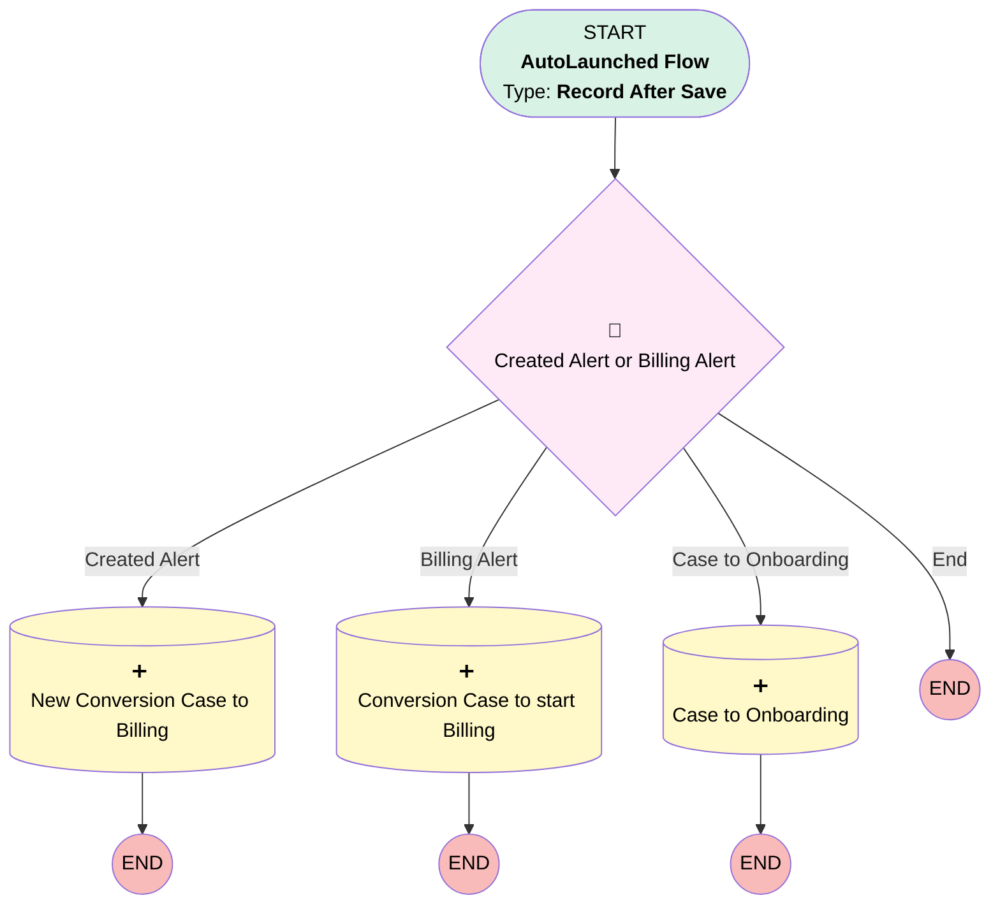

# Implementation | After Trigger | Notices to A&F

## Flow Diagram [(_View History_)](Implementation_After_Trigger_Notices_to_A_F-history.md)

<!-- Flow description -->

## General Information

|<!-- -->|<!-- -->|
|:---|:---|
|Object|Implementation__c|
|Process Type| Auto Launched Flow|
|Trigger Type| Record After Save|
|Record Trigger Type| Create And Update|
|Label|Implementation | After Trigger | Notices to A&F|
|Status|Active|
|Filter Formula|(ISNEW() && ISPICKVAL({!$Record.Plan_Type__c}, "Conversion Plan") && NOT(ISPICKVAL({!$Record.Conversion_Type__c}, "PEO 401(k) Plan"))) || (NOT(ISBLANK({!$Record.Activated_in_PRKS__c} )) && ISCHANGED({!$Record.Activated_in_PRKS__c} ) && ISPICKVAL({!$Record.Plan_Type__c}, "Conversion Plan") && NOT(ISPICKVAL({!$Record.Conversion_Type__c}, "PEO 401(k) Plan")))|
|Environments|Default|
|Interview Label|Implementation | After Trigger | Notices to A&F {!$Flow.CurrentDateTime}|
| Builder Type (PM)|LightningFlowBuilder|
| Canvas Mode (PM)|AUTO_LAYOUT_CANVAS|
| Origin Builder Type (PM)|LightningFlowBuilder|
|Connector|[Created_Alert_or_Billing_Alert](#created_alert_or_billing_alert)|
|Next Node|[Created_Alert_or_Billing_Alert](#created_alert_or_billing_alert)|

## Formulas

|Name|Data Type|Expression|Description|
|:-- |:--:|:-- |:--  |
|isNew|Boolean|ISNEW()|<!-- -->|

## Text Templates

|Name|Text|Description|
|:-- |:-- |:--  |
|billingCaseDesc|Please begin billing for this conversion plan as of the Ubiquity Plan Effective Date: {!$Record.Ubiquity_Plan_Effective_Date__c}|<!-- -->|
|billingCaseSub|Begin Billing for {!$Record.Name}|<!-- -->|
|impCaseDesc|The alert to A&F did not send for this implementation because the Ubiquity Plan Effective Date is blank. Please enter that date and create a case for A&F manually to bill the client.|<!-- -->|
|newCaseDesc|A new Conversion Implementation was created. Please remove the Quarterly Subscription in Paradigm.|<!-- -->|

## Flow Nodes Details

### Created_Alert_or_Billing_Alert

|<!-- -->|<!-- -->|
|:---|:---|
|Type|Decision|
|Label|Created Alert or Billing Alert|
|Default Connector Label|End|

#### Rule Created_Alert (Created Alert)

|<!-- -->|<!-- -->|
|:---|:---|
|Connector|[New_Conversion_Case_to_Billing](#new_conversion_case_to_billing)|
|Condition Logic|and|

|Condition Id|Left Value Reference|Operator|Right Value|
|:-- |:-- |:--:|:--: |
|1|isNew| Equal To|✅|

#### Rule Billing_Alert (Billing Alert)

|<!-- -->|<!-- -->|
|:---|:---|
|Does Require Record Changed To Meet Criteria|✅|
|Connector|[Copy_1_of_New_Conversion_Case_to_Billing](#copy_1_of_new_conversion_case_to_billing)|
|Condition Logic|and|

|Condition Id|Left Value Reference|Operator|Right Value|
|:-- |:-- |:--:|:--: |
|1|$Record.Activated_in_PRKS__c| Is Blank|⬜|
|2|$Record.Ubiquity_Plan_Effective_Date__c| Is Blank|⬜|

#### Rule Case_to_Onboarding1 (Case to Onboarding)

|<!-- -->|<!-- -->|
|:---|:---|
|Connector|[Case_to_Onboarding](#case_to_onboarding)|
|Condition Logic|and|

|Condition Id|Left Value Reference|Operator|Right Value|
|:-- |:-- |:--:|:--: |
|1|$Record.Activated_in_PRKS__c| Is Blank|⬜|
|2|$Record.Ubiquity_Plan_Effective_Date__c| Is Blank|✅|

### Case_to_Onboarding

|<!-- -->|<!-- -->|
|:---|:---|
|Type|Record Create|
|Object|Case|
|Label|Case to Onboarding|
|Store Output Automatically|✅|

#### Input Assignments

|Field|Value|
|:-- |:--: |
|AccountId|$Record.Account__c|
|Department__c|Client Onboarding|
|Description|impCaseDesc|
|Implementation__c|$Record.Id|
|Origin|Internal|
|OwnerId|00G37000000PDff|
|Plan__c|$Record.Plan__c|
|Sender_Role__c|Sponsor|
|Subject|Billing Alert Not Sent|

### Copy_1_of_New_Conversion_Case_to_Billing

|<!-- -->|<!-- -->|
|:---|:---|
|Type|Record Create|
|Object|Case|
|Label|Conversion Case to start Billing|
|Store Output Automatically|✅|

#### Input Assignments

|Field|Value|
|:-- |:--: |
|AccountId|$Record.Account__c|
|Department__c|Accounting & Finance|
|Description|billingCaseDesc|
|Implementation__c|$Record.Id|
|Origin|Internal|
|OwnerId|00500000006yEak|
|Plan__c|$Record.Plan__c|
|Sender_Role__c|Sponsor|
|Subject|billingCaseSub|

### New_Conversion_Case_to_Billing

|<!-- -->|<!-- -->|
|:---|:---|
|Type|Record Create|
|Object|Case|
|Label|New Conversion Case to Billing|
|Store Output Automatically|✅|

#### Input Assignments

|Field|Value|
|:-- |:--: |
|AccountId|$Record.Account__c|
|Department__c|Accounting & Finance|
|Description|newCaseDesc|
|Implementation__c|$Record.Id|
|Origin|Internal|
|OwnerId|00500000006yEak|
|Plan__c|$Record.Plan__c|
|Sender_Role__c|Sponsor|
|Subject|New Conversion Implementation Created|

___

_Documentation generated from branch monitoring_myubiquity by [sfdx-hardis](https://sfdx-hardis.cloudity.com), featuring [salesforce-flow-visualiser](https://github.com/toddhalfpenny/salesforce-flow-visualiser)_