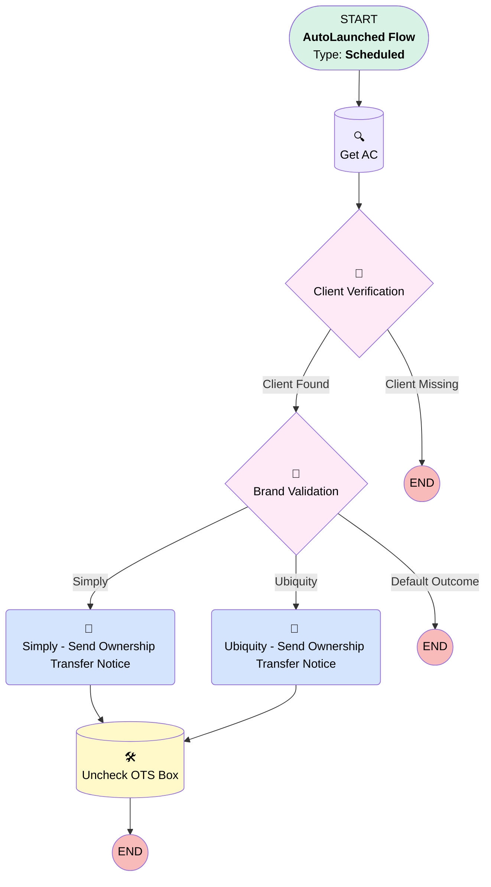

# Implementation | ONE TIME | Ownership Transfer

## Flow Diagram [(_View History_)](Implementation_ONE_TIME_Ownership_Transfer-history.md)

<!-- Flow description -->

## General Information

|<!-- -->|<!-- -->|
|:---|:---|
|Object|Implementation__c|
|Process Type| Auto Launched Flow|
|Trigger Type| Scheduled|
|Label|Implementation | ONE TIME | Ownership Transfer|
|Status|Obsolete|
|Environments|Default|
|Interview Label|Implementation | ONE TIME | Ownership Transfer {!$Flow.CurrentDateTime}|
| Builder Type (PM)|LightningFlowBuilder|
| Canvas Mode (PM)|AUTO_LAYOUT_CANVAS|
| Origin Builder Type (PM)|LightningFlowBuilder|
|Connector|[Get_AC](#get_ac)|
|Next Node|[Get_AC](#get_ac)|

#### Schedules

|Frequency|Start Date|Start Time|
|:-- |:--:|:--: |
|Once|Mar 1, 2024|10:33|

#### Filters (logic: **and**)

|Filter Id|Field|Operator|Value|
|:-- |:-- |:--:|:--: |
|1|One_Time_Send__c| Equal To|✅|

## Variables

|Name|Data Type|Is Collection|Is Input|Is Output|Object Type|Description|
|:-- |:--:|:--:|:--:|:--:|:--:|:--  |
|aCon|SObject|⬜|✅|⬜|Associated_Contact__c|<!-- -->|
|completeTasks|SObject|✅|✅|⬜|Project_Task__c|<!-- -->|
|openProjTasks|SObject|✅|✅|⬜|Project_Task__c|<!-- -->|

## Formulas

|Name|Data Type|Expression|Description|
|:-- |:--:|:-- |:--  |
|now|DateTime|NOW()|<!-- -->|
|today|Date|TODAY()|<!-- -->|

## Flow Nodes Details

### Simply_Send_Ownership_Transfer_Notice

|<!-- -->|<!-- -->|
|:---|:---|
|Type|Action Call|
|Label|Simply - Send Ownership Transfer Notice|
|Action Type|Email Alert|
|Action Name|Associated_Contact__c.Ownership_Transfer_Simply|
|Flow Transaction Model|CurrentTransaction|
|Name Segment|Associated_Contact__c.Ownership_Transfer_Simply|
| SObject Row Id (input)|aCon.Id|
|Connector|[Uncheck_OTS_Box](#uncheck_ots_box)|

### Ubiquity_Send_Ownership_Transfer_Notice

|<!-- -->|<!-- -->|
|:---|:---|
|Type|Action Call|
|Label|Ubiquity - Send Ownership Transfer Notice|
|Action Type|Email Alert|
|Action Name|Associated_Contact__c.Ownership_Transfer_Ubiquity|
|Flow Transaction Model|CurrentTransaction|
|Name Segment|Associated_Contact__c.Ownership_Transfer_Ubiquity|
| SObject Row Id (input)|aCon.Id|
|Connector|[Uncheck_OTS_Box](#uncheck_ots_box)|

### Brand_Validation

|<!-- -->|<!-- -->|
|:---|:---|
|Type|Decision|
|Label|Brand Validation|
|Default Connector Label|Default Outcome|

#### Rule Simply (Simply)

|<!-- -->|<!-- -->|
|:---|:---|
|Connector|[Simply_Send_Ownership_Transfer_Notice](#simply_send_ownership_transfer_notice)|
|Condition Logic|and|

|Condition Id|Left Value Reference|Operator|Right Value|
|:-- |:-- |:--:|:--: |
|1|$Record.Brand__c| Equal To|Simply Retirement|

#### Rule Ubiquity (Ubiquity)

|<!-- -->|<!-- -->|
|:---|:---|
|Connector|[Ubiquity_Send_Ownership_Transfer_Notice](#ubiquity_send_ownership_transfer_notice)|
|Condition Logic|and|

|Condition Id|Left Value Reference|Operator|Right Value|
|:-- |:-- |:--:|:--: |
|1|$Record.Brand__c| Equal To|Ubiquity Retirement + Savings|

### Client_Verification_0

|<!-- -->|<!-- -->|
|:---|:---|
|Type|Decision|
|Label|Client Verification|
|Default Connector Label|Client Missing|

#### Rule Client_Found_0 (Client Found)

|<!-- -->|<!-- -->|
|:---|:---|
|Connector|[Brand_Validation](#brand_validation)|
|Condition Logic|and|

|Condition Id|Left Value Reference|Operator|Right Value|
|:-- |:-- |:--:|:--: |
|1|aCon.Id| Is Null|⬜|

### Get_AC

|<!-- -->|<!-- -->|
|:---|:---|
|Type|Record Lookup|
|Object|Associated_Contact__c|
|Label|Get AC|
|Assign Null Values If No Records Found|✅|
|Output Reference|aCon|
|Queried Fields|- Id - Implementation_Owner_Title__c |
|Connector|[Client_Verification_0](#client_verification_0)|

#### Filters (logic: **and**)

|Filter Id|Field|Operator|Value|
|:-- |:-- |:--:|:--: |
|1|Implementation__c| Equal To|$Record.Id|
|2|Primary__c| Equal To|✅|
|3|Implementation_Status__c| Contains|In Progress|

### Uncheck_OTS_Box

|<!-- -->|<!-- -->|
|:---|:---|
|Type|Record Update|
|Label|Uncheck OTS Box|
|Input Reference|$Record|

#### Input Assignments

|Field|Value|
|:-- |:--: |
|One_Time_Send__c|⬜|

___

_Documentation generated from branch monitoring_myubiquity by [sfdx-hardis](https://sfdx-hardis.cloudity.com), featuring [salesforce-flow-visualiser](https://github.com/toddhalfpenny/salesforce-flow-visualiser)_