# Implementations | Welcome Email

## Flow Diagram [(_View History_)](Implementations_Welcome_Email-history.md)

```mermaid
%% If you read this, your Markdown visualizer does not handle MermaidJS syntax.
%% - If you are in VS Code, install extension `Markdown Preview Mermaid Support` at https://marketplace.visualstudio.com/items?itemName=bierner.markdown-mermaid
%% - If you are using sfdx-hardis, try to define env variable `MERMAID_MODES=cli,docker` ,then run again the command to regenerate markdown with SVG images.
%% - If you are within mkdocs-material, define mermaid plugin in `mkdocs.yml` as described in https://squidfunk.github.io/mkdocs-material/extensions/mermaid/
%% - As a last resort, you can copy-paste this MermaidJS code into https://mermaid.live/ to see the flow diagram

flowchart TB
START(["START<br/><b>Associated_Contact__c</b></br>Type: <b>On All Changes</b>"]):::startClass
click START "#general-information" "1845750521"

START --> myPreWaitDecision_myWait_myRule_7
myRule_1_A1("📧 <em></em><br/>Send Email"):::actionCalls
click myRule_1_A1 "#myrule_1_a1" "1848189047"

myWaitEvent_myWait_myRule_3_event_0_SA2("📧 <em></em><br/>Welcome Email"):::actionCalls
click myWaitEvent_myWait_myRule_3_event_0_SA2 "#mywaitevent_mywait_myrule_3_event_0_sa2" "1056980995"

myWaitEvent_myWait_myRule_5_event_0_SA2("📧 <em></em><br/>Welcome Email"):::actionCalls
click myWaitEvent_myWait_myRule_5_event_0_SA2 "#mywaitevent_mywait_myrule_5_event_0_sa2" "790697711"

myWaitEvent_myWait_myRule_7_event_0_SA2("📧 <em></em><br/>Welcome Email"):::actionCalls
click myWaitEvent_myWait_myRule_7_event_0_SA2 "#mywaitevent_mywait_myrule_7_event_0_sa2" "312627488"

myWaitAssignment_myWait_myRule_3[\"🟰 <em></em><br/>myWaitAssignment_myWait_myRule_3"/]:::assignments
click myWaitAssignment_myWait_myRule_3 "#mywaitassignment_mywait_myrule_3" "893231301"

myWaitAssignment_myWait_myRule_5[\"🟰 <em></em><br/>myWaitAssignment_myWait_myRule_5"/]:::assignments
click myWaitAssignment_myWait_myRule_5 "#mywaitassignment_mywait_myrule_5" "3761601311"

myWaitAssignment_myWait_myRule_7[\"🟰 <em></em><br/>myWaitAssignment_myWait_myRule_7"/]:::assignments
click myWaitAssignment_myWait_myRule_7 "#mywaitassignment_mywait_myrule_7" "2871997333"

myWaitEvent_myWait_myRule_3_event_0_postWaitExecutionAssignment[\"🟰 <em></em><br/>myWaitEvent_myWait_myRule_3_event_0_postWaitExecutionAssignment"/]:::assignments
click myWaitEvent_myWait_myRule_3_event_0_postWaitExecutionAssignment "#mywaitevent_mywait_myrule_3_event_0_postwaitexecutionassignment" "1264607434"

myWaitEvent_myWait_myRule_5_event_0_postWaitExecutionAssignment[\"🟰 <em></em><br/>myWaitEvent_myWait_myRule_5_event_0_postWaitExecutionAssignment"/]:::assignments
click myWaitEvent_myWait_myRule_5_event_0_postWaitExecutionAssignment "#mywaitevent_mywait_myrule_5_event_0_postwaitexecutionassignment" "1630825638"

myWaitEvent_myWait_myRule_7_event_0_postWaitExecutionAssignment[\"🟰 <em></em><br/>myWaitEvent_myWait_myRule_7_event_0_postWaitExecutionAssignment"/]:::assignments
click myWaitEvent_myWait_myRule_7_event_0_postWaitExecutionAssignment "#mywaitevent_mywait_myrule_7_event_0_postwaitexecutionassignment" "3794827466"

myDecision{"🔀 <em></em><br/>myDecision"}:::decisions
click myDecision "#mydecision" "2686044066"

myDecision2{"🔀 <em></em><br/>myDecision2"}:::decisions
click myDecision2 "#mydecision2" "832062635"

myDecision4{"🔀 <em></em><br/>myDecision4"}:::decisions
click myDecision4 "#mydecision4" "4048821249"

myDecision6{"🔀 <em></em><br/>myDecision6"}:::decisions
click myDecision6 "#mydecision6" "1351457436"

myPostWaitDecision_myWaitEvent_myWait_myRule_3_event_0{"🔀 <em></em><br/>myPostWaitDecision_myWaitEvent_myWait_myRule_3_event_0"}:::decisions
click myPostWaitDecision_myWaitEvent_myWait_myRule_3_event_0 "#mypostwaitdecision_mywaitevent_mywait_myrule_3_event_0" "2314881881"

myPostWaitDecision_myWaitEvent_myWait_myRule_5_event_0{"🔀 <em></em><br/>myPostWaitDecision_myWaitEvent_myWait_myRule_5_event_0"}:::decisions
click myPostWaitDecision_myWaitEvent_myWait_myRule_5_event_0 "#mypostwaitdecision_mywaitevent_mywait_myrule_5_event_0" "374387017"

myPostWaitDecision_myWaitEvent_myWait_myRule_7_event_0{"🔀 <em></em><br/>myPostWaitDecision_myWaitEvent_myWait_myRule_7_event_0"}:::decisions
click myPostWaitDecision_myWaitEvent_myWait_myRule_7_event_0 "#mypostwaitdecision_mywaitevent_mywait_myrule_7_event_0" "2445807761"

myPreWaitDecision_myWait_myRule_3{"🔀 <em></em><br/>myPreWaitDecision_myWait_myRule_3"}:::decisions
click myPreWaitDecision_myWait_myRule_3 "#myprewaitdecision_mywait_myrule_3" "1429647547"

myPreWaitDecision_myWait_myRule_5{"🔀 <em></em><br/>myPreWaitDecision_myWait_myRule_5"}:::decisions
click myPreWaitDecision_myWait_myRule_5 "#myprewaitdecision_mywait_myrule_5" "3294132805"

myPreWaitDecision_myWait_myRule_7{"🔀 <em></em><br/>myPreWaitDecision_myWait_myRule_7"}:::decisions
click myPreWaitDecision_myWait_myRule_7 "#myprewaitdecision_mywait_myrule_7" "332204059"

myRule_1_pmetdec{"🔀 <em></em><br/>Previously Met Decision"}:::decisions
click myRule_1_pmetdec "#myrule_1_pmetdec" "287210945"

myRule_3_pmetdec{"🔀 <em></em><br/>Previously Met Decision"}:::decisions
click myRule_3_pmetdec "#myrule_3_pmetdec" "1383574671"

myRule_5_pmetdec{"🔀 <em></em><br/>Previously Met Decision"}:::decisions
click myRule_5_pmetdec "#myrule_5_pmetdec" "2261703791"

myRule_7_pmetdec{"🔀 <em></em><br/>Previously Met Decision"}:::decisions
click myRule_7_pmetdec "#myrule_7_pmetdec" "460535639"

myWaitEvent_myWait_myRule_3_event_0_SA1[("➕ <em></em><br/>Task")]:::recordCreates
click myWaitEvent_myWait_myRule_3_event_0_SA1 "#mywaitevent_mywait_myrule_3_event_0_sa1" "1369645623"

myWaitEvent_myWait_myRule_5_event_0_SA1[("➕ <em></em><br/>Task")]:::recordCreates
click myWaitEvent_myWait_myRule_5_event_0_SA1 "#mywaitevent_mywait_myrule_5_event_0_sa1" "743115433"

myWaitEvent_myWait_myRule_7_event_0_SA1[("➕ <em></em><br/>Task")]:::recordCreates
click myWaitEvent_myWait_myRule_7_event_0_SA1 "#mywaitevent_mywait_myrule_7_event_0_sa1" "3537701629"

myRule_3_A1[("🛠️ <em></em><br/>Update Email")]:::recordUpdates
click myRule_3_A1 "#myrule_3_a1" "2216014310"

myRule_5_A1[("🛠️ <em></em><br/>Update Email")]:::recordUpdates
click myRule_5_A1 "#myrule_5_a1" "17794704"

myRule_7_A1[("🛠️ <em></em><br/>Update Email")]:::recordUpdates
click myRule_7_A1 "#myrule_7_a1" "3796899814"

myRule_1_A1 --> END_myRule_1_A1
myWaitEvent_myWait_myRule_3_event_0_SA2 --> myWaitEvent_myWait_myRule_3_event_0_postWaitExecutionAssignment
myWaitEvent_myWait_myRule_5_event_0_SA2 --> myWaitEvent_myWait_myRule_5_event_0_postWaitExecutionAssignment
myWaitEvent_myWait_myRule_7_event_0_SA2 --> myWaitEvent_myWait_myRule_7_event_0_postWaitExecutionAssignment
myWaitAssignment_myWait_myRule_3 --> myDecision
myWaitAssignment_myWait_myRule_5 --> myPreWaitDecision_myWait_myRule_3
myWaitAssignment_myWait_myRule_7 --> myPreWaitDecision_myWait_myRule_5
myWaitEvent_myWait_myRule_3_event_0_postWaitExecutionAssignment --> myWait_myRule_3
myWaitEvent_myWait_myRule_5_event_0_postWaitExecutionAssignment --> myWait_myRule_5
myWaitEvent_myWait_myRule_7_event_0_postWaitExecutionAssignment --> myWait_myRule_7
myDecision --> |"Nano Banc Opp Closed"| myRule_1_pmetdec
myDecision --> |"default"| myDecision2
myDecision2 --> |"Single(k) Closed - Schwab"| myRule_3_pmetdec
myDecision2 --> |"default"| myDecision4
myDecision4 --> |"Single(k) Closed - Not Schwab"| myRule_5_pmetdec
myDecision4 --> |"default"| myDecision6
myDecision6 --> |"Edukate Closed"| myRule_7_pmetdec
myDecision6 --> |"default"| END_myDecision6
myPostWaitDecision_myWaitEvent_myWait_myRule_3_event_0 --> |"myPostWaitRule_myWaitEvent_myWait_myRule_3_event_0"| myWaitEvent_myWait_myRule_3_event_0_SA1
myPostWaitDecision_myWaitEvent_myWait_myRule_3_event_0 --> |"default"| myWaitEvent_myWait_myRule_3_event_0_postWaitExecutionAssignment
myPostWaitDecision_myWaitEvent_myWait_myRule_5_event_0 --> |"myPostWaitRule_myWaitEvent_myWait_myRule_5_event_0"| myWaitEvent_myWait_myRule_5_event_0_SA1
myPostWaitDecision_myWaitEvent_myWait_myRule_5_event_0 --> |"default"| myWaitEvent_myWait_myRule_5_event_0_postWaitExecutionAssignment
myPostWaitDecision_myWaitEvent_myWait_myRule_7_event_0 --> |"myPostWaitRule_myWaitEvent_myWait_myRule_7_event_0"| myWaitEvent_myWait_myRule_7_event_0_SA1
myPostWaitDecision_myWaitEvent_myWait_myRule_7_event_0 --> |"default"| myWaitEvent_myWait_myRule_7_event_0_postWaitExecutionAssignment
myPreWaitDecision_myWait_myRule_3 --> |"myPreWaitRule_myWait_myRule_3"| myDecision
myPreWaitDecision_myWait_myRule_3 --> |"default"| myWaitAssignment_myWait_myRule_3
myPreWaitDecision_myWait_myRule_5 --> |"myPreWaitRule_myWait_myRule_5"| myPreWaitDecision_myWait_myRule_3
myPreWaitDecision_myWait_myRule_5 --> |"default"| myWaitAssignment_myWait_myRule_5
myPreWaitDecision_myWait_myRule_7 --> |"myPreWaitRule_myWait_myRule_7"| myPreWaitDecision_myWait_myRule_5
myPreWaitDecision_myWait_myRule_7 --> |"default"| myWaitAssignment_myWait_myRule_7
myRule_1_pmetdec --> |"Previously Met - Null"| myRule_1_A1
myRule_1_pmetdec --> |"Not Previously Met"| myRule_1_A1
myRule_3_pmetdec --> |"Previously Met - Null"| myRule_3_A1
myRule_3_pmetdec --> |"Not Previously Met"| myRule_3_A1
myRule_5_pmetdec --> |"Previously Met - Null"| myRule_5_A1
myRule_5_pmetdec --> |"Not Previously Met"| myRule_5_A1
myRule_7_pmetdec --> |"Previously Met - Null"| myRule_7_A1
myRule_7_pmetdec --> |"Not Previously Met"| myRule_7_A1
myWaitEvent_myWait_myRule_3_event_0_SA1 --> myWaitEvent_myWait_myRule_3_event_0_SA2
myWaitEvent_myWait_myRule_5_event_0_SA1 --> myWaitEvent_myWait_myRule_5_event_0_SA2
myWaitEvent_myWait_myRule_7_event_0_SA1 --> myWaitEvent_myWait_myRule_7_event_0_SA2
myRule_3_A1 --> myWait_myRule_3
myRule_5_A1 --> myWait_myRule_5
myRule_7_A1 --> myWait_myRule_7
END_myRule_1_A1(( END )):::endClass
END_myDecision6(( END )):::endClass


classDef actionCalls fill:#D4E4FC,color:black,text-decoration:none,max-height:100px
classDef assignments fill:#FBEED7,color:black,text-decoration:none,max-height:100px
classDef collectionProcessors fill:#F0E3FA,color:black,text-decoration:none,max-height:100px
classDef customErrors fill:#FFE9E9,color:black,text-decoration:none,max-height:100px
classDef decisions fill:#FDEAF6,color:black,text-decoration:none,max-height:100px
classDef loops fill:#FDEAF6,color:black,text-decoration:none,max-height:100px
classDef recordCreates fill:#FFF8C9,color:black,text-decoration:none,max-height:100px
classDef recordDeletes fill:#FFF8C9,color:black,text-decoration:none,max-height:100px
classDef recordLookups fill:#EDEAFF,color:black,text-decoration:none,max-height:100px
classDef recordUpdates fill:#FFF8C9,color:black,text-decoration:none,max-height:100px
classDef screens fill:#DFF6FF,color:black,text-decoration:none,max-height:100px
classDef subflows fill:#D4E4FC,color:black,text-decoration:none,max-height:100px
classDef startClass fill:#D9F2E6,color:black,text-decoration:none,max-height:100px
classDef endClass fill:#F9BABA,color:black,text-decoration:none,max-height:100px
classDef transforms fill:#FDEAF6,color:black,text-decoration:none,max-height:100px


```

<!-- Flow description -->

## General Information

|<!-- -->|<!-- -->|
|:---|:---|
|Process Type| Workflow|
|Label|Implementations | Welcome Email|
|Status|⚠️ Draft|
|Description|Send welcome email when opportunity is marked closed won|
|Interview Label|Implementations_Welcome_Email-27_InterviewLabel|
|Start Element Reference|[myPreWaitDecision_myWait_myRule_7](#myprewaitdecision_mywait_myrule_7)|
| Object Type (PM)|Associated_Contact__c|
| Object Variable (PM)|myVariable_current|
| Old Object Variable (PM)|myVariable_old|
| Trigger Type (PM)|onAllChanges|

## Variables

|Name|Data Type|Is Collection|Is Input|Is Output|Object Type|Description|
|:-- |:--:|:--:|:--:|:--:|:--:|:--  |
|cancelWaits|String|✅|⬜|✅|<!-- -->|<!-- -->|
|myVariable_current|SObject|⬜|✅|✅|Associated_Contact__c|<!-- -->|
|myVariable_old|SObject|⬜|✅|⬜|Associated_Contact__c|<!-- -->|
|myWaitEvent_myWait_myRule_3_event_0_postActionExecutionVariable|Boolean|⬜|⬜|⬜|<!-- -->|<!-- -->|
|myWaitEvent_myWait_myRule_5_event_0_postActionExecutionVariable|Boolean|⬜|⬜|⬜|<!-- -->|<!-- -->|
|myWaitEvent_myWait_myRule_7_event_0_postActionExecutionVariable|Boolean|⬜|⬜|⬜|<!-- -->|<!-- -->|

## Flow Nodes Details

### myRule_1_A1

|<!-- -->|<!-- -->|
|:---|:---|
|Type|Action Call|
|Label|Send Email|
|Action Type|Email Alert|
|Action Name|Associated_Contact__c.Nano_Banc_Opp_Closed|
|Flow Transaction Model|CurrentTransaction|
|Name Segment|Associated_Contact__c.Nano_Banc_Opp_Closed|
|Email Alert Selection (PM)|Nano_Banc_Opp_Closed|
| SObject Row Id (input)|myVariable_current.Id|

### myWaitEvent_myWait_myRule_3_event_0_SA2

|<!-- -->|<!-- -->|
|:---|:---|
|Type|Action Call|
|Label|Welcome Email|
|Action Type|Email Alert|
|Action Name|Associated_Contact__c.Single_k_Welcome_Email_Schwab|
|Flow Transaction Model|CurrentTransaction|
|Name Segment|Associated_Contact__c.Single_k_Welcome_Email_Schwab|
|Email Alert Selection (PM)|Single_k_Welcome_Email_Schwab|
| SObject Row Id (input)|myVariable_current.Id|
|Connector|[myWaitEvent_myWait_myRule_3_event_0_postWaitExecutionAssignment](#mywaitevent_mywait_myrule_3_event_0_postwaitexecutionassignment)|

### myWaitEvent_myWait_myRule_5_event_0_SA2

|<!-- -->|<!-- -->|
|:---|:---|
|Type|Action Call|
|Label|Welcome Email|
|Action Type|Email Alert|
|Action Name|Associated_Contact__c.Single_k_Welcome_Email_Other_Custodian|
|Flow Transaction Model|CurrentTransaction|
|Name Segment|Associated_Contact__c.Single_k_Welcome_Email_Other_Custodian|
|Email Alert Selection (PM)|Single_k_Welcome_Email_Other_Custodian|
| SObject Row Id (input)|myVariable_current.Id|
|Connector|[myWaitEvent_myWait_myRule_5_event_0_postWaitExecutionAssignment](#mywaitevent_mywait_myrule_5_event_0_postwaitexecutionassignment)|

### myWaitEvent_myWait_myRule_7_event_0_SA2

|<!-- -->|<!-- -->|
|:---|:---|
|Type|Action Call|
|Label|Welcome Email|
|Action Type|Email Alert|
|Action Name|Associated_Contact__c.Edukate_Welcome_Email|
|Flow Transaction Model|CurrentTransaction|
|Name Segment|Associated_Contact__c.Edukate_Welcome_Email|
|Email Alert Selection (PM)|Edukate_Welcome_Email|
| SObject Row Id (input)|myVariable_current.Id|
|Connector|[myWaitEvent_myWait_myRule_7_event_0_postWaitExecutionAssignment](#mywaitevent_mywait_myrule_7_event_0_postwaitexecutionassignment)|

### myWaitAssignment_myWait_myRule_3

|<!-- -->|<!-- -->|
|:---|:---|
|Type|Assignment|
|Label|[myWaitAssignment_myWait_myRule_3](#mywaitassignment_mywait_myrule_3)|
|Connector|[myDecision](#mydecision)|

#### Assignments

|Assign To Reference|Operator|Value|
|:-- |:--:|:--: |
|cancelWaits| Add|myWait_myRule_3|

### myWaitAssignment_myWait_myRule_5

|<!-- -->|<!-- -->|
|:---|:---|
|Type|Assignment|
|Label|[myWaitAssignment_myWait_myRule_5](#mywaitassignment_mywait_myrule_5)|
|Connector|[myPreWaitDecision_myWait_myRule_3](#myprewaitdecision_mywait_myrule_3)|

#### Assignments

|Assign To Reference|Operator|Value|
|:-- |:--:|:--: |
|cancelWaits| Add|myWait_myRule_5|

### myWaitAssignment_myWait_myRule_7

|<!-- -->|<!-- -->|
|:---|:---|
|Type|Assignment|
|Label|[myWaitAssignment_myWait_myRule_7](#mywaitassignment_mywait_myrule_7)|
|Connector|[myPreWaitDecision_myWait_myRule_5](#myprewaitdecision_mywait_myrule_5)|

#### Assignments

|Assign To Reference|Operator|Value|
|:-- |:--:|:--: |
|cancelWaits| Add|myWait_myRule_7|

### myWaitEvent_myWait_myRule_3_event_0_postWaitExecutionAssignment

|<!-- -->|<!-- -->|
|:---|:---|
|Type|Assignment|
|Label|[myWaitEvent_myWait_myRule_3_event_0_postWaitExecutionAssignment](#mywaitevent_mywait_myrule_3_event_0_postwaitexecutionassignment)|
|Connector|myWait_myRule_3|

#### Assignments

|Assign To Reference|Operator|Value|
|:-- |:--:|:--: |
|myWaitEvent_myWait_myRule_3_event_0_postActionExecutionVariable| Assign|✅|

### myWaitEvent_myWait_myRule_5_event_0_postWaitExecutionAssignment

|<!-- -->|<!-- -->|
|:---|:---|
|Type|Assignment|
|Label|[myWaitEvent_myWait_myRule_5_event_0_postWaitExecutionAssignment](#mywaitevent_mywait_myrule_5_event_0_postwaitexecutionassignment)|
|Connector|myWait_myRule_5|

#### Assignments

|Assign To Reference|Operator|Value|
|:-- |:--:|:--: |
|myWaitEvent_myWait_myRule_5_event_0_postActionExecutionVariable| Assign|✅|

### myWaitEvent_myWait_myRule_7_event_0_postWaitExecutionAssignment

|<!-- -->|<!-- -->|
|:---|:---|
|Type|Assignment|
|Label|[myWaitEvent_myWait_myRule_7_event_0_postWaitExecutionAssignment](#mywaitevent_mywait_myrule_7_event_0_postwaitexecutionassignment)|
|Connector|myWait_myRule_7|

#### Assignments

|Assign To Reference|Operator|Value|
|:-- |:--:|:--: |
|myWaitEvent_myWait_myRule_7_event_0_postActionExecutionVariable| Assign|✅|

### myDecision

|<!-- -->|<!-- -->|
|:---|:---|
|Type|Decision|
|Label|[myDecision](#mydecision)|
|Default Connector|[myDecision2](#mydecision2)|
|Default Connector Label|default|
|Index (PM)|numberValue: 0 |

#### Rule myRule_1 (Nano Banc Opp Closed)

|<!-- -->|<!-- -->|
|:---|:---|
|Connector|[myRule_1_pmetdec](#myrule_1_pmetdec)|
|Condition Logic|and|

|Condition Id|Left Value Reference|Operator|Right Value|
|:-- |:-- |:--:|:--: |
|1|myVariable_current.Opportunity__c| Is Null|⬜|
|2|myVariable_current.Referral_Partner__c| Equal To|Nano Banc|

### myDecision2

|<!-- -->|<!-- -->|
|:---|:---|
|Type|Decision|
|Label|[myDecision2](#mydecision2)|
|Default Connector|[myDecision4](#mydecision4)|
|Default Connector Label|default|
|Index (PM)|1|

#### Rule myRule_3 (Single(k) Closed - Schwab)

|<!-- -->|<!-- -->|
|:---|:---|
|Connector|[myRule_3_pmetdec](#myrule_3_pmetdec)|
|Condition Logic|(1 AND 2 AND 3 AND 4 AND 13 AND 5 AND 11 AND 12 AND (9 OR 10)) OR (1 AND 2 AND 3 AND 4 AND 13 AND 6 AND 11 AND 12 AND (9 OR 10)) OR (1 AND 2 AND 3 AND 4 AND 13 AND 7 AND 11 AND 12 AND (9 OR 10)) OR (1 AND 2 AND 3 AND 4 AND 13 AND 8 AND 11 AND 12 AND (9 OR 10))|

|Condition Id|Left Value Reference|Operator|Right Value|
|:-- |:-- |:--:|:--: |
|1|myVariable_current.New_Opportunity_Stage__c| Equal To|Closed Won|
|2|myVariable_current.Opportunity__c| Is Null|⬜|
|3|myVariable_current.Opportunity__r.Product_Type__c| Is Null|⬜|
|4|myVariable_current.Opportunity__r.Product_Type__c| Equal To|Single(k)|
|5|myVariable_current.Contact_Role__c| Equal To|Authorized Buyer|
|6|myVariable_current.Contact_Role__c| Equal To|Plan Sponsor|
|7|myVariable_current.Contact_Role__c| Equal To|Trustee|
|8|myVariable_current.Contact_Role__c| Equal To|Plan Sponsor & Trustee|
|9|myVariable_current.Opportunity__r.Custodian__c| Equal To|Schwab & Co., Inc.|
|10|myVariable_current.Opportunity__r.Custodian__c| Equal To|Schwab Trust|
|11|myVariable_current.Lead_Source__c| Not Equal To|Advisor|
|12|myVariable_current.How_Did_You_Hear_About_Ubiquity__c| Not Equal To|Financial Advisor|
|13|myVariable_current.Opportunity__r.Service_Option__c| Not Equal To|Single(k) Plus|

### myDecision4

|<!-- -->|<!-- -->|
|:---|:---|
|Type|Decision|
|Label|[myDecision4](#mydecision4)|
|Default Connector|[myDecision6](#mydecision6)|
|Default Connector Label|default|
|Index (PM)|2|

#### Rule myRule_5 (Single(k) Closed - Not Schwab)

|<!-- -->|<!-- -->|
|:---|:---|
|Connector|[myRule_5_pmetdec](#myrule_5_pmetdec)|
|Condition Logic|(1 AND 2 AND 3 AND 4 AND 13 AND 5 AND 11 AND 12 AND (9 OR 10)) OR (1 AND 2 AND 3 AND 4 AND 13 AND 6 AND 11 AND 12 AND (9 OR 10)) OR (1 AND 2 AND 3 AND 4 AND 13 AND 7 AND 11 AND 12 AND (9 OR 10)) OR (1 AND 2 AND 3 AND 4 AND 13 AND 8 AND 11 AND 12 AND (9 OR 10))|

|Condition Id|Left Value Reference|Operator|Right Value|
|:-- |:-- |:--:|:--: |
|1|myVariable_current.New_Opportunity_Stage__c| Equal To|Closed Won|
|2|myVariable_current.Opportunity__c| Is Null|⬜|
|3|myVariable_current.Opportunity__r.Product_Type__c| Is Null|⬜|
|4|myVariable_current.Opportunity__r.Product_Type__c| Equal To|Single(k)|
|5|myVariable_current.Contact_Role__c| Equal To|Authorized Buyer|
|6|myVariable_current.Contact_Role__c| Equal To|Plan Sponsor|
|7|myVariable_current.Contact_Role__c| Equal To|Trustee|
|8|myVariable_current.Contact_Role__c| Equal To|Plan Sponsor & Trustee|
|9|myVariable_current.Opportunity__r.Custodian__c| Not Equal To|Schwab & Co., Inc.|
|10|myVariable_current.Opportunity__r.Custodian__c| Not Equal To|Schwab Trust|
|11|myVariable_current.Lead_Source__c| Not Equal To|Advisor|
|12|myVariable_current.How_Did_You_Hear_About_Ubiquity__c| Not Equal To|Financial Advisor|
|13|myVariable_current.Opportunity__r.Service_Option__c| Not Equal To|Single(k) Plus|

### myDecision6

|<!-- -->|<!-- -->|
|:---|:---|
|Type|Decision|
|Label|[myDecision6](#mydecision6)|
|Default Connector Label|default|
|Index (PM)|3|

#### Rule myRule_7 (Edukate Closed)

|<!-- -->|<!-- -->|
|:---|:---|
|Connector|[myRule_7_pmetdec](#myrule_7_pmetdec)|
|Condition Logic|(1 AND 2 AND 3 AND 4 AND 5 AND 9 AND 10) OR (1 AND 2 AND 3 AND 4 AND 6 AND 9 AND 10) OR (1 AND 2 AND 3 AND 4 AND 7 AND 9 AND 10) OR (1 AND 2 AND 3 AND 4 AND 8 AND 9 AND 10)|

|Condition Id|Left Value Reference|Operator|Right Value|
|:-- |:-- |:--:|:--: |
|1|myVariable_current.New_Opportunity_Stage__c| Equal To|Closed Won|
|2|myVariable_current.Opportunity__c| Is Null|⬜|
|3|myVariable_current.Opportunity__r.Product_Type__c| Is Null|⬜|
|4|myVariable_current.Opportunity__r.Service_Option__c| Equal To|Edukate|
|5|myVariable_current.Contact_Role__c| Equal To|Authorized Buyer|
|6|myVariable_current.Contact_Role__c| Equal To|Plan Sponsor|
|7|myVariable_current.Contact_Role__c| Equal To|Trustee|
|8|myVariable_current.Contact_Role__c| Equal To|Plan Sponsor & Trustee|
|9|myVariable_current.Lead_Source__c| Not Equal To|Advisor|
|10|myVariable_current.How_Did_You_Hear_About_Ubiquity__c| Not Equal To|Financial Advisor|

### myPostWaitDecision_myWaitEvent_myWait_myRule_3_event_0

|<!-- -->|<!-- -->|
|:---|:---|
|Type|Decision|
|Label|[myPostWaitDecision_myWaitEvent_myWait_myRule_3_event_0](#mypostwaitdecision_mywaitevent_mywait_myrule_3_event_0)|
|Default Connector|[myWaitEvent_myWait_myRule_3_event_0_postWaitExecutionAssignment](#mywaitevent_mywait_myrule_3_event_0_postwaitexecutionassignment)|
|Default Connector Label|default|

#### Rule myPostWaitRule_myWaitEvent_myWait_myRule_3_event_0 (myPostWaitRule_myWaitEvent_myWait_myRule_3_event_0)

|<!-- -->|<!-- -->|
|:---|:---|
|Connector|[myWaitEvent_myWait_myRule_3_event_0_SA1](#mywaitevent_mywait_myrule_3_event_0_sa1)|
|Condition Logic|and|

|Condition Id|Left Value Reference|Operator|Right Value|
|:-- |:-- |:--:|:--: |
|1|myVariable_current.CreatedDate| Is Null|⬜|

### myPostWaitDecision_myWaitEvent_myWait_myRule_5_event_0

|<!-- -->|<!-- -->|
|:---|:---|
|Type|Decision|
|Label|[myPostWaitDecision_myWaitEvent_myWait_myRule_5_event_0](#mypostwaitdecision_mywaitevent_mywait_myrule_5_event_0)|
|Default Connector|[myWaitEvent_myWait_myRule_5_event_0_postWaitExecutionAssignment](#mywaitevent_mywait_myrule_5_event_0_postwaitexecutionassignment)|
|Default Connector Label|default|

#### Rule myPostWaitRule_myWaitEvent_myWait_myRule_5_event_0 (myPostWaitRule_myWaitEvent_myWait_myRule_5_event_0)

|<!-- -->|<!-- -->|
|:---|:---|
|Connector|[myWaitEvent_myWait_myRule_5_event_0_SA1](#mywaitevent_mywait_myrule_5_event_0_sa1)|
|Condition Logic|and|

|Condition Id|Left Value Reference|Operator|Right Value|
|:-- |:-- |:--:|:--: |
|1|myVariable_current.CreatedDate| Is Null|⬜|

### myPostWaitDecision_myWaitEvent_myWait_myRule_7_event_0

|<!-- -->|<!-- -->|
|:---|:---|
|Type|Decision|
|Label|[myPostWaitDecision_myWaitEvent_myWait_myRule_7_event_0](#mypostwaitdecision_mywaitevent_mywait_myrule_7_event_0)|
|Default Connector|[myWaitEvent_myWait_myRule_7_event_0_postWaitExecutionAssignment](#mywaitevent_mywait_myrule_7_event_0_postwaitexecutionassignment)|
|Default Connector Label|default|

#### Rule myPostWaitRule_myWaitEvent_myWait_myRule_7_event_0 (myPostWaitRule_myWaitEvent_myWait_myRule_7_event_0)

|<!-- -->|<!-- -->|
|:---|:---|
|Connector|[myWaitEvent_myWait_myRule_7_event_0_SA1](#mywaitevent_mywait_myrule_7_event_0_sa1)|
|Condition Logic|and|

|Condition Id|Left Value Reference|Operator|Right Value|
|:-- |:-- |:--:|:--: |
|1|myVariable_current.CreatedDate| Is Null|⬜|

### myPreWaitDecision_myWait_myRule_3

|<!-- -->|<!-- -->|
|:---|:---|
|Type|Decision|
|Label|[myPreWaitDecision_myWait_myRule_3](#myprewaitdecision_mywait_myrule_3)|
|Default Connector|[myWaitAssignment_myWait_myRule_3](#mywaitassignment_mywait_myrule_3)|
|Default Connector Label|default|

#### Rule myPreWaitRule_myWait_myRule_3 (myPreWaitRule_myWait_myRule_3)

|<!-- -->|<!-- -->|
|:---|:---|
|Connector|[myDecision](#mydecision)|
|Condition Logic|(1 AND 2 AND 3 AND 4 AND 13 AND 5 AND 11 AND 12 AND (9 OR 10)) OR (1 AND 2 AND 3 AND 4 AND 13 AND 6 AND 11 AND 12 AND (9 OR 10)) OR (1 AND 2 AND 3 AND 4 AND 13 AND 7 AND 11 AND 12 AND (9 OR 10)) OR (1 AND 2 AND 3 AND 4 AND 13 AND 8 AND 11 AND 12 AND (9 OR 10))|

|Condition Id|Left Value Reference|Operator|Right Value|
|:-- |:-- |:--:|:--: |
|1|myVariable_current.New_Opportunity_Stage__c| Equal To|Closed Won|
|2|myVariable_current.Opportunity__c| Is Null|⬜|
|3|myVariable_current.Opportunity__r.Product_Type__c| Is Null|⬜|
|4|myVariable_current.Opportunity__r.Product_Type__c| Equal To|Single(k)|
|5|myVariable_current.Contact_Role__c| Equal To|Authorized Buyer|
|6|myVariable_current.Contact_Role__c| Equal To|Plan Sponsor|
|7|myVariable_current.Contact_Role__c| Equal To|Trustee|
|8|myVariable_current.Contact_Role__c| Equal To|Plan Sponsor & Trustee|
|9|myVariable_current.Opportunity__r.Custodian__c| Equal To|Schwab & Co., Inc.|
|10|myVariable_current.Opportunity__r.Custodian__c| Equal To|Schwab Trust|
|11|myVariable_current.Lead_Source__c| Not Equal To|Advisor|
|12|myVariable_current.How_Did_You_Hear_About_Ubiquity__c| Not Equal To|Financial Advisor|
|13|myVariable_current.Opportunity__r.Service_Option__c| Not Equal To|Single(k) Plus|

### myPreWaitDecision_myWait_myRule_5

|<!-- -->|<!-- -->|
|:---|:---|
|Type|Decision|
|Label|[myPreWaitDecision_myWait_myRule_5](#myprewaitdecision_mywait_myrule_5)|
|Default Connector|[myWaitAssignment_myWait_myRule_5](#mywaitassignment_mywait_myrule_5)|
|Default Connector Label|default|

#### Rule myPreWaitRule_myWait_myRule_5 (myPreWaitRule_myWait_myRule_5)

|<!-- -->|<!-- -->|
|:---|:---|
|Connector|[myPreWaitDecision_myWait_myRule_3](#myprewaitdecision_mywait_myrule_3)|
|Condition Logic|(1 AND 2 AND 3 AND 4 AND 13 AND 5 AND 11 AND 12 AND (9 OR 10)) OR (1 AND 2 AND 3 AND 4 AND 13 AND 6 AND 11 AND 12 AND (9 OR 10)) OR (1 AND 2 AND 3 AND 4 AND 13 AND 7 AND 11 AND 12 AND (9 OR 10)) OR (1 AND 2 AND 3 AND 4 AND 13 AND 8 AND 11 AND 12 AND (9 OR 10))|

|Condition Id|Left Value Reference|Operator|Right Value|
|:-- |:-- |:--:|:--: |
|1|myVariable_current.New_Opportunity_Stage__c| Equal To|Closed Won|
|2|myVariable_current.Opportunity__c| Is Null|⬜|
|3|myVariable_current.Opportunity__r.Product_Type__c| Is Null|⬜|
|4|myVariable_current.Opportunity__r.Product_Type__c| Equal To|Single(k)|
|5|myVariable_current.Contact_Role__c| Equal To|Authorized Buyer|
|6|myVariable_current.Contact_Role__c| Equal To|Plan Sponsor|
|7|myVariable_current.Contact_Role__c| Equal To|Trustee|
|8|myVariable_current.Contact_Role__c| Equal To|Plan Sponsor & Trustee|
|9|myVariable_current.Opportunity__r.Custodian__c| Not Equal To|Schwab & Co., Inc.|
|10|myVariable_current.Opportunity__r.Custodian__c| Not Equal To|Schwab Trust|
|11|myVariable_current.Lead_Source__c| Not Equal To|Advisor|
|12|myVariable_current.How_Did_You_Hear_About_Ubiquity__c| Not Equal To|Financial Advisor|
|13|myVariable_current.Opportunity__r.Service_Option__c| Not Equal To|Single(k) Plus|

### myPreWaitDecision_myWait_myRule_7

|<!-- -->|<!-- -->|
|:---|:---|
|Type|Decision|
|Label|[myPreWaitDecision_myWait_myRule_7](#myprewaitdecision_mywait_myrule_7)|
|Default Connector|[myWaitAssignment_myWait_myRule_7](#mywaitassignment_mywait_myrule_7)|
|Default Connector Label|default|

#### Rule myPreWaitRule_myWait_myRule_7 (myPreWaitRule_myWait_myRule_7)

|<!-- -->|<!-- -->|
|:---|:---|
|Connector|[myPreWaitDecision_myWait_myRule_5](#myprewaitdecision_mywait_myrule_5)|
|Condition Logic|(1 AND 2 AND 3 AND 4 AND 5 AND 9 AND 10) OR (1 AND 2 AND 3 AND 4 AND 6 AND 9 AND 10) OR (1 AND 2 AND 3 AND 4 AND 7 AND 9 AND 10) OR (1 AND 2 AND 3 AND 4 AND 8 AND 9 AND 10)|

|Condition Id|Left Value Reference|Operator|Right Value|
|:-- |:-- |:--:|:--: |
|1|myVariable_current.New_Opportunity_Stage__c| Equal To|Closed Won|
|2|myVariable_current.Opportunity__c| Is Null|⬜|
|3|myVariable_current.Opportunity__r.Product_Type__c| Is Null|⬜|
|4|myVariable_current.Opportunity__r.Service_Option__c| Equal To|Edukate|
|5|myVariable_current.Contact_Role__c| Equal To|Authorized Buyer|
|6|myVariable_current.Contact_Role__c| Equal To|Plan Sponsor|
|7|myVariable_current.Contact_Role__c| Equal To|Trustee|
|8|myVariable_current.Contact_Role__c| Equal To|Plan Sponsor & Trustee|
|9|myVariable_current.Lead_Source__c| Not Equal To|Advisor|
|10|myVariable_current.How_Did_You_Hear_About_Ubiquity__c| Not Equal To|Financial Advisor|

### myRule_1_pmetdec

|<!-- -->|<!-- -->|
|:---|:---|
|Type|Decision|
|Label|Previously Met Decision|
|Default Connector|[myRule_1_A1](#myrule_1_a1)|
|Default Connector Label|Not Previously Met|

#### Rule myRule_1_pmetnullrule (Previously Met - Null)

|<!-- -->|<!-- -->|
|:---|:---|
|Connector|[myRule_1_A1](#myrule_1_a1)|
|Condition Logic|or|

|Condition Id|Left Value Reference|Operator|Right Value|
|:-- |:-- |:--:|:--: |
|1|myVariable_old| Is Null|✅|

#### Rule myRule_1_pmetrule (Previously Met - Prev)

|<!-- -->|<!-- -->|
|:---|:---|
|Condition Logic|and|

|Condition Id|Left Value Reference|Operator|Right Value|
|:-- |:-- |:--:|:--: |
|1|myVariable_old.Opportunity__c| Is Null|⬜|
|2|myVariable_old.Referral_Partner__c| Equal To|Nano Banc|

### myRule_3_pmetdec

|<!-- -->|<!-- -->|
|:---|:---|
|Type|Decision|
|Label|Previously Met Decision|
|Default Connector|[myRule_3_A1](#myrule_3_a1)|
|Default Connector Label|Not Previously Met|

#### Rule myRule_3_pmetnullrule (Previously Met - Null)

|<!-- -->|<!-- -->|
|:---|:---|
|Connector|[myRule_3_A1](#myrule_3_a1)|
|Condition Logic|or|

|Condition Id|Left Value Reference|Operator|Right Value|
|:-- |:-- |:--:|:--: |
|1|myVariable_old| Is Null|✅|

#### Rule myRule_3_pmetrule (Previously Met - Prev)

|<!-- -->|<!-- -->|
|:---|:---|
|Condition Logic|(1 AND 2 AND 3 AND 4 AND 13 AND 5 AND 11 AND 12 AND (9 OR 10)) OR (1 AND 2 AND 3 AND 4 AND 13 AND 6 AND 11 AND 12 AND (9 OR 10)) OR (1 AND 2 AND 3 AND 4 AND 13 AND 7 AND 11 AND 12 AND (9 OR 10)) OR (1 AND 2 AND 3 AND 4 AND 13 AND 8 AND 11 AND 12 AND (9 OR 10))|

|Condition Id|Left Value Reference|Operator|Right Value|
|:-- |:-- |:--:|:--: |
|1|myVariable_old.New_Opportunity_Stage__c| Equal To|Closed Won|
|2|myVariable_old.Opportunity__c| Is Null|⬜|
|3|myVariable_old.Opportunity__r.Product_Type__c| Is Null|⬜|
|4|myVariable_old.Opportunity__r.Product_Type__c| Equal To|Single(k)|
|5|myVariable_old.Contact_Role__c| Equal To|Authorized Buyer|
|6|myVariable_old.Contact_Role__c| Equal To|Plan Sponsor|
|7|myVariable_old.Contact_Role__c| Equal To|Trustee|
|8|myVariable_old.Contact_Role__c| Equal To|Plan Sponsor & Trustee|
|9|myVariable_old.Opportunity__r.Custodian__c| Equal To|Schwab & Co., Inc.|
|10|myVariable_old.Opportunity__r.Custodian__c| Equal To|Schwab Trust|
|11|myVariable_old.Lead_Source__c| Not Equal To|Advisor|
|12|myVariable_old.How_Did_You_Hear_About_Ubiquity__c| Not Equal To|Financial Advisor|
|13|myVariable_old.Opportunity__r.Service_Option__c| Not Equal To|Single(k) Plus|

### myRule_5_pmetdec

|<!-- -->|<!-- -->|
|:---|:---|
|Type|Decision|
|Label|Previously Met Decision|
|Default Connector|[myRule_5_A1](#myrule_5_a1)|
|Default Connector Label|Not Previously Met|

#### Rule myRule_5_pmetnullrule (Previously Met - Null)

|<!-- -->|<!-- -->|
|:---|:---|
|Connector|[myRule_5_A1](#myrule_5_a1)|
|Condition Logic|or|

|Condition Id|Left Value Reference|Operator|Right Value|
|:-- |:-- |:--:|:--: |
|1|myVariable_old| Is Null|✅|

#### Rule myRule_5_pmetrule (Previously Met - Prev)

|<!-- -->|<!-- -->|
|:---|:---|
|Condition Logic|(1 AND 2 AND 3 AND 4 AND 13 AND 5 AND 11 AND 12 AND (9 OR 10)) OR (1 AND 2 AND 3 AND 4 AND 13 AND 6 AND 11 AND 12 AND (9 OR 10)) OR (1 AND 2 AND 3 AND 4 AND 13 AND 7 AND 11 AND 12 AND (9 OR 10)) OR (1 AND 2 AND 3 AND 4 AND 13 AND 8 AND 11 AND 12 AND (9 OR 10))|

|Condition Id|Left Value Reference|Operator|Right Value|
|:-- |:-- |:--:|:--: |
|1|myVariable_old.New_Opportunity_Stage__c| Equal To|Closed Won|
|2|myVariable_old.Opportunity__c| Is Null|⬜|
|3|myVariable_old.Opportunity__r.Product_Type__c| Is Null|⬜|
|4|myVariable_old.Opportunity__r.Product_Type__c| Equal To|Single(k)|
|5|myVariable_old.Contact_Role__c| Equal To|Authorized Buyer|
|6|myVariable_old.Contact_Role__c| Equal To|Plan Sponsor|
|7|myVariable_old.Contact_Role__c| Equal To|Trustee|
|8|myVariable_old.Contact_Role__c| Equal To|Plan Sponsor & Trustee|
|9|myVariable_old.Opportunity__r.Custodian__c| Not Equal To|Schwab & Co., Inc.|
|10|myVariable_old.Opportunity__r.Custodian__c| Not Equal To|Schwab Trust|
|11|myVariable_old.Lead_Source__c| Not Equal To|Advisor|
|12|myVariable_old.How_Did_You_Hear_About_Ubiquity__c| Not Equal To|Financial Advisor|
|13|myVariable_old.Opportunity__r.Service_Option__c| Not Equal To|Single(k) Plus|

### myRule_7_pmetdec

|<!-- -->|<!-- -->|
|:---|:---|
|Type|Decision|
|Label|Previously Met Decision|
|Default Connector|[myRule_7_A1](#myrule_7_a1)|
|Default Connector Label|Not Previously Met|

#### Rule myRule_7_pmetnullrule (Previously Met - Null)

|<!-- -->|<!-- -->|
|:---|:---|
|Connector|[myRule_7_A1](#myrule_7_a1)|
|Condition Logic|or|

|Condition Id|Left Value Reference|Operator|Right Value|
|:-- |:-- |:--:|:--: |
|1|myVariable_old| Is Null|✅|

#### Rule myRule_7_pmetrule (Previously Met - Prev)

|<!-- -->|<!-- -->|
|:---|:---|
|Condition Logic|(1 AND 2 AND 3 AND 4 AND 5 AND 9 AND 10) OR (1 AND 2 AND 3 AND 4 AND 6 AND 9 AND 10) OR (1 AND 2 AND 3 AND 4 AND 7 AND 9 AND 10) OR (1 AND 2 AND 3 AND 4 AND 8 AND 9 AND 10)|

|Condition Id|Left Value Reference|Operator|Right Value|
|:-- |:-- |:--:|:--: |
|1|myVariable_old.New_Opportunity_Stage__c| Equal To|Closed Won|
|2|myVariable_old.Opportunity__c| Is Null|⬜|
|3|myVariable_old.Opportunity__r.Product_Type__c| Is Null|⬜|
|4|myVariable_old.Opportunity__r.Service_Option__c| Equal To|Edukate|
|5|myVariable_old.Contact_Role__c| Equal To|Authorized Buyer|
|6|myVariable_old.Contact_Role__c| Equal To|Plan Sponsor|
|7|myVariable_old.Contact_Role__c| Equal To|Trustee|
|8|myVariable_old.Contact_Role__c| Equal To|Plan Sponsor & Trustee|
|9|myVariable_old.Lead_Source__c| Not Equal To|Advisor|
|10|myVariable_old.How_Did_You_Hear_About_Ubiquity__c| Not Equal To|Financial Advisor|

### myWaitEvent_myWait_myRule_3_event_0_SA1

|<!-- -->|<!-- -->|
|:---|:---|
|Type|Record Create|
|Object|Task|
|Label|Task|
|Connector|[myWaitEvent_myWait_myRule_3_event_0_SA2](#mywaitevent_mywait_myrule_3_event_0_sa2)|

#### Input Assignments

|Field|Value|
|:-- |:--: |
|Priority|Normal|
|Status|Completed|
|Subject|Welcome Email - Schwab|
|Type|Email|
|WhoId|myVariable_current.Contact__c|

### myWaitEvent_myWait_myRule_5_event_0_SA1

|<!-- -->|<!-- -->|
|:---|:---|
|Type|Record Create|
|Object|Task|
|Label|Task|
|Connector|[myWaitEvent_myWait_myRule_5_event_0_SA2](#mywaitevent_mywait_myrule_5_event_0_sa2)|

#### Input Assignments

|Field|Value|
|:-- |:--: |
|Priority|Normal|
|Status|Completed|
|Subject|Welcome Email|
|Type|Email|
|WhoId|myVariable_current.Contact__c|

### myWaitEvent_myWait_myRule_7_event_0_SA1

|<!-- -->|<!-- -->|
|:---|:---|
|Type|Record Create|
|Object|Task|
|Label|Task|
|Connector|[myWaitEvent_myWait_myRule_7_event_0_SA2](#mywaitevent_mywait_myrule_7_event_0_sa2)|

#### Input Assignments

|Field|Value|
|:-- |:--: |
|Priority|Normal|
|Status|Completed|
|Subject|Welcome Email|
|Type|Email|
|WhoId|myVariable_current.Contact__c|

### myRule_3_A1

|<!-- -->|<!-- -->|
|:---|:---|
|Type|Record Update|
|Object|Associated_Contact__c|
|Label|Update Email|
|Evaluation Type (PM)|always|
|Extra Type Info (PM)|<!-- -->|
|Is Child Relationship (PM)|⬜|
|Reference (PM)|[Associated_Contact__c]|
|Reference Target Field (PM)|<!-- -->|
|Connector|myWait_myRule_3|

#### Filters (logic: **and**)

|Filter Id|Field|Operator|Value|
|:-- |:-- |:--:|:--: |
|1|Id| Equal To|myVariable_current.Id|

#### Input Assignments

|Field|Value|
|:-- |:--: |
|Useable_Email__c|myVariable_current.Contact__r.Email|

### myRule_5_A1

|<!-- -->|<!-- -->|
|:---|:---|
|Type|Record Update|
|Object|Associated_Contact__c|
|Label|Update Email|
|Evaluation Type (PM)|always|
|Extra Type Info (PM)|<!-- -->|
|Is Child Relationship (PM)|⬜|
|Reference (PM)|[Associated_Contact__c]|
|Reference Target Field (PM)|<!-- -->|
|Connector|myWait_myRule_5|

#### Filters (logic: **and**)

|Filter Id|Field|Operator|Value|
|:-- |:-- |:--:|:--: |
|1|Id| Equal To|myVariable_current.Id|

#### Input Assignments

|Field|Value|
|:-- |:--: |
|Useable_Email__c|myVariable_current.Contact__r.Email|

### myRule_7_A1

|<!-- -->|<!-- -->|
|:---|:---|
|Type|Record Update|
|Object|Associated_Contact__c|
|Label|Update Email|
|Evaluation Type (PM)|always|
|Extra Type Info (PM)|<!-- -->|
|Is Child Relationship (PM)|⬜|
|Reference (PM)|[Associated_Contact__c]|
|Reference Target Field (PM)|<!-- -->|
|Connector|myWait_myRule_7|

#### Filters (logic: **and**)

|Filter Id|Field|Operator|Value|
|:-- |:-- |:--:|:--: |
|1|Id| Equal To|myVariable_current.Id|

#### Input Assignments

|Field|Value|
|:-- |:--: |
|Useable_Email__c|myVariable_current.Contact__r.Email|

___

_Documentation generated from branch monitoring_myubiquity by [sfdx-hardis](https://sfdx-hardis.cloudity.com), featuring [salesforce-flow-visualiser](https://github.com/toddhalfpenny/salesforce-flow-visualiser)_