# Junction | Autolaunched | Sync Imp Plan Opp Trans Ids

## Flow Diagram [(_View History_)](Junction_Autolaunched_Sync_Imp_Plan_Opp_Trans_Ids-history.md)

```mermaid
%% If you read this, your Markdown visualizer does not handle MermaidJS syntax.
%% - If you are in VS Code, install extension `Markdown Preview Mermaid Support` at https://marketplace.visualstudio.com/items?itemName=bierner.markdown-mermaid
%% - If you are using sfdx-hardis, try to define env variable `MERMAID_MODES=cli,docker` ,then run again the command to regenerate markdown with SVG images.
%% - If you are within mkdocs-material, define mermaid plugin in `mkdocs.yml` as described in https://squidfunk.github.io/mkdocs-material/extensions/mermaid/
%% - As a last resort, you can copy-paste this MermaidJS code into https://mermaid.live/ to see the flow diagram

flowchart TB
START(["START<br/><b>AutoLaunched Flow</b></br>"]):::startClass
click START "#general-information" "125274802"

Add_to_AC_update_collection[\"🟰 <em></em><br/>Add to AC update collection"/]:::assignments
click Add_to_AC_update_collection "#add_to_ac_update_collection" "2856371276"

Add_to_AP_update_collection[\"🟰 <em></em><br/>Add to AP update collection"/]:::assignments
click Add_to_AP_update_collection "#add_to_ap_update_collection" "2043232293"

Assign_new_AC_field_vars[\"🟰 <em></em><br/>Assign new AC field vars"/]:::assignments
click Assign_new_AC_field_vars "#assign_new_ac_field_vars" "2528770797"

Assign_new_AP_field_vars[\"🟰 <em></em><br/>Assign new AP field vars"/]:::assignments
click Assign_new_AP_field_vars "#assign_new_ap_field_vars" "1050346952"

Declare_Contact_Record[\"🟰 <em></em><br/>Declare Contact Record"/]:::assignments
click Declare_Contact_Record "#declare_contact_record" "1336765272"

Declare_Partner_Record[\"🟰 <em></em><br/>Declare Partner Record"/]:::assignments
click Declare_Partner_Record "#declare_partner_record" "1027760551"

Set_Contact_Id_Vars[\"🟰 <em></em><br/>Set Contact Id Vars"/]:::assignments
click Set_Contact_Id_Vars "#set_contact_id_vars" "789708722"

Set_Imp_Id[\"🟰 <em></em><br/>Set Imp Id"/]:::assignments
click Set_Imp_Id "#set_imp_id" "1320720479"

Set_Opportunity_Id[\"🟰 <em></em><br/>Set Opportunity Id"/]:::assignments
click Set_Opportunity_Id "#set_opportunity_id" "2760711783"

Set_Partner_Id_Vars[\"🟰 <em></em><br/>Set Partner Id Vars"/]:::assignments
click Set_Partner_Id_Vars "#set_partner_id_vars" "3235846970"

Set_Plan_Id[\"🟰 <em></em><br/>Set Plan Id"/]:::assignments
click Set_Plan_Id "#set_plan_id" "1906526424"

Set_Transition_Id[\"🟰 <em></em><br/>Set Transition Id"/]:::assignments
click Set_Transition_Id "#set_transition_id" "687483064"

Imp_Check{"🔀 <em></em><br/>Imp Check"}:::decisions
click Imp_Check "#imp_check" "3356170603"

Opportunity_Check{"🔀 <em></em><br/>Opportunity Check"}:::decisions
click Opportunity_Check "#opportunity_check" "1895212649"

Partner_vs_Contact_Check{"🔀 <em></em><br/>Partner vs Contact Check"}:::decisions
click Partner_vs_Contact_Check "#partner_vs_contact_check" "1393492935"

Plan_Check{"🔀 <em></em><br/>Plan Check"}:::decisions
click Plan_Check "#plan_check" "70831975"

Transition_Check{"🔀 <em></em><br/>Transition Check"}:::decisions
click Transition_Check "#transition_check" "3993016480"

What_am_I{"🔀 <em></em><br/>What am I"}:::decisions
click What_am_I "#what_am_i" "1928511655"

Contact_Loop{{"🔁 <em></em><br/>Contact Loop"}}:::loops
click Contact_Loop "#contact_loop" "2686783615"

Partner_Loop{{"🔁 <em></em><br/>Partner Loop"}}:::loops
click Partner_Loop "#partner_loop" "872488024"

Add_to_AC_update_collection --> Contact_Loop
Add_to_AP_update_collection --> Partner_Loop
Assign_new_AC_field_vars --> Add_to_AC_update_collection
Assign_new_AP_field_vars --> Add_to_AP_update_collection
Declare_Contact_Record --> Contact_Loop
Declare_Partner_Record --> Partner_Loop
Set_Contact_Id_Vars --> Opportunity_Check
Set_Imp_Id --> Transition_Check
Set_Opportunity_Id --> Plan_Check
Set_Partner_Id_Vars --> Opportunity_Check
Set_Plan_Id --> Imp_Check
Set_Transition_Id --> What_am_I
Imp_Check --> |"Implementation Needs Update"| Set_Imp_Id
Imp_Check --> |"Default Outcome"| Transition_Check
Opportunity_Check --> |"Opportunity Needs Update"| Set_Opportunity_Id
Opportunity_Check --> |"Default Outcome"| Plan_Check
Partner_vs_Contact_Check --> |"Associated Contact"| Declare_Contact_Record
Partner_vs_Contact_Check --> |"Associated Partner"| Declare_Partner_Record
Partner_vs_Contact_Check --> |"No inputs"| END_Partner_vs_Contact_Check
Plan_Check --> |"Plan Needs Update"| Set_Plan_Id
Plan_Check --> |"Default Outcome"| Imp_Check
Transition_Check --> |"Transition Needs Update"| Set_Transition_Id
Transition_Check --> |"Default Outcome"| What_am_I
What_am_I --> |"I am an AC needing update"| Assign_new_AC_field_vars
What_am_I --> |"I am an AC"| Contact_Loop
What_am_I --> |"I am an AP needing update"| Assign_new_AP_field_vars
What_am_I --> |"I am an AP"| Partner_Loop
Contact_Loop --> |"For Each"|Set_Contact_Id_Vars
Contact_Loop ---> |"After Last"|Partner_vs_Contact_Check
Partner_Loop --> |"For Each"|Set_Partner_Id_Vars
Partner_Loop ---> |"After Last"|END
START -->  Partner_vs_Contact_Check
END_Partner_vs_Contact_Check(( END )):::endClass


classDef actionCalls fill:#D4E4FC,color:black,text-decoration:none,max-height:100px
classDef assignments fill:#FBEED7,color:black,text-decoration:none,max-height:100px
classDef collectionProcessors fill:#F0E3FA,color:black,text-decoration:none,max-height:100px
classDef customErrors fill:#FFE9E9,color:black,text-decoration:none,max-height:100px
classDef decisions fill:#FDEAF6,color:black,text-decoration:none,max-height:100px
classDef loops fill:#FDEAF6,color:black,text-decoration:none,max-height:100px
classDef recordCreates fill:#FFF8C9,color:black,text-decoration:none,max-height:100px
classDef recordDeletes fill:#FFF8C9,color:black,text-decoration:none,max-height:100px
classDef recordLookups fill:#EDEAFF,color:black,text-decoration:none,max-height:100px
classDef recordUpdates fill:#FFF8C9,color:black,text-decoration:none,max-height:100px
classDef screens fill:#DFF6FF,color:black,text-decoration:none,max-height:100px
classDef subflows fill:#D4E4FC,color:black,text-decoration:none,max-height:100px
classDef startClass fill:#D9F2E6,color:black,text-decoration:none,max-height:100px
classDef endClass fill:#F9BABA,color:black,text-decoration:none,max-height:100px
classDef transforms fill:#FDEAF6,color:black,text-decoration:none,max-height:100px


```

<!-- Flow description -->

## General Information

|<!-- -->|<!-- -->|
|:---|:---|
|Process Type| Auto Launched Flow|
|Label|Junction | Autolaunched | Sync Imp Plan Opp Trans Ids|
|Status|Active|
|Description|Compares input ACs and/or APs to one or more ref Id inputs.  If a record is missing the corresponding field of an Id input, that Id is assigned to it and it's added to the outputs.|
|Environments|Default|
|Interview Label|Junction | Autolaunched | Sync Imp Plan Opp Trans Ids {!$Flow.CurrentDateTime}|
| Builder Type (PM)|LightningFlowBuilder|
| Canvas Mode (PM)|FREE_FORM_CANVAS|
| Origin Builder Type (PM)|LightningFlowBuilder|
|Connector|[Partner_vs_Contact_Check](#partner_vs_contact_check)|
|Next Node|[Partner_vs_Contact_Check](#partner_vs_contact_check)|

## Variables

|Name|Data Type|Is Collection|Is Input|Is Output|Object Type|Description|
|:-- |:--:|:--:|:--:|:--:|:--:|:--  |
|acNeedingUpdate|SObject|✅|⬜|✅|Associated_Contact__c|Collection of associated contacts that need to be updated|
|apNeedingUpdate|SObject|✅|⬜|✅|Associated_Partner__c|<!-- -->|
|associatedContacts|SObject|✅|✅|⬜|Associated_Contact__c|<!-- -->|
|associatedPartners|SObject|✅|✅|⬜|Associated_Partner__c|<!-- -->|
|currentRecordType|Number|⬜|⬜|⬜|<!-- -->|<!-- -->|
|implementationId|String|⬜|⬜|⬜|<!-- -->|<!-- -->|
|needsUpdate|Boolean|⬜|⬜|⬜|<!-- -->|<!-- -->|
|opportunityId|String|⬜|⬜|⬜|<!-- -->|<!-- -->|
|planId|String|⬜|⬜|⬜|<!-- -->|<!-- -->|
|refImplementationId|String|⬜|✅|⬜|<!-- -->|If an input record is missing an Imp Id, this Id will be assigned to it (unless its null)|
|refOpportunityId|String|⬜|✅|⬜|<!-- -->|If an input record is missing an Opp Id, this Id will be assigned to it (unless its null)|
|refPlanId|String|⬜|✅|⬜|<!-- -->|If an input record is missing an Plan Id, this Id will be assigned to it (unless its null)|
|refTransitionId|String|⬜|✅|⬜|<!-- -->|If an input record is missing an Transition Id, this Id will be assigned to it (unless its null)|
|transitionId|String|⬜|⬜|⬜|<!-- -->|<!-- -->|

## Flow Nodes Details

### Add_to_AC_update_collection

|<!-- -->|<!-- -->|
|:---|:---|
|Type|Assignment|
|Label|Add to AC update collection|
|Connector|[Contact_Loop](#contact_loop)|

#### Assignments

|Assign To Reference|Operator|Value|
|:-- |:--:|:--: |
|acNeedingUpdate| Add|[Contact_Loop](#contact_loop)|

### Add_to_AP_update_collection

|<!-- -->|<!-- -->|
|:---|:---|
|Type|Assignment|
|Label|Add to AP update collection|
|Connector|[Partner_Loop](#partner_loop)|

#### Assignments

|Assign To Reference|Operator|Value|
|:-- |:--:|:--: |
|apNeedingUpdate| Add|[Partner_Loop](#partner_loop)|

### Assign_new_AC_field_vars

|<!-- -->|<!-- -->|
|:---|:---|
|Type|Assignment|
|Label|Assign new AC field vars|
|Connector|[Add_to_AC_update_collection](#add_to_ac_update_collection)|

#### Assignments

|Assign To Reference|Operator|Value|
|:-- |:--:|:--: |
|Contact_Loop.Implementation__c| Assign|implementationId|
|Contact_Loop.Opportunity__c| Assign|opportunityId|
|Contact_Loop.Plan__c| Assign|planId|
|Contact_Loop.Transition__c| Assign|transitionId|
|needsUpdate| Assign|⬜|

### Assign_new_AP_field_vars

|<!-- -->|<!-- -->|
|:---|:---|
|Type|Assignment|
|Label|Assign new AP field vars|
|Connector|[Add_to_AP_update_collection](#add_to_ap_update_collection)|

#### Assignments

|Assign To Reference|Operator|Value|
|:-- |:--:|:--: |
|Partner_Loop.Opportunity__c| Assign|opportunityId|
|Partner_Loop.Plan__c| Assign|planId|
|Partner_Loop.Implementation__c| Assign|implementationId|
|Partner_Loop.Transition__c| Assign|transitionId|

### Declare_Contact_Record

|<!-- -->|<!-- -->|
|:---|:---|
|Type|Assignment|
|Label|Declare Contact Record|
|Connector|[Contact_Loop](#contact_loop)|

#### Assignments

|Assign To Reference|Operator|Value|
|:-- |:--:|:--: |
|currentRecordType| Assign|numberValue: 0 |

### Declare_Partner_Record

|<!-- -->|<!-- -->|
|:---|:---|
|Type|Assignment|
|Label|Declare Partner Record|
|Connector|[Partner_Loop](#partner_loop)|

#### Assignments

|Assign To Reference|Operator|Value|
|:-- |:--:|:--: |
|currentRecordType| Assign|1|

### Set_Contact_Id_Vars

|<!-- -->|<!-- -->|
|:---|:---|
|Type|Assignment|
|Label|Set Contact Id Vars|
|Connector|[Opportunity_Check](#opportunity_check)|

#### Assignments

|Assign To Reference|Operator|Value|
|:-- |:--:|:--: |
|planId| Assign|Contact_Loop.Plan__c|
|transitionId| Assign|Contact_Loop.Transition__c|
|opportunityId| Assign|Contact_Loop.Opportunity__c|
|implementationId| Assign|Contact_Loop.Implementation__c|

### Set_Imp_Id

|<!-- -->|<!-- -->|
|:---|:---|
|Type|Assignment|
|Label|Set Imp Id|
|Connector|[Transition_Check](#transition_check)|

#### Assignments

|Assign To Reference|Operator|Value|
|:-- |:--:|:--: |
|implementationId| Assign|refImplementationId|
|needsUpdate| Assign|✅|

### Set_Opportunity_Id

|<!-- -->|<!-- -->|
|:---|:---|
|Type|Assignment|
|Label|Set Opportunity Id|
|Connector|[Plan_Check](#plan_check)|

#### Assignments

|Assign To Reference|Operator|Value|
|:-- |:--:|:--: |
|opportunityId| Assign|refOpportunityId|
|needsUpdate| Assign|✅|

### Set_Partner_Id_Vars

|<!-- -->|<!-- -->|
|:---|:---|
|Type|Assignment|
|Label|Set Partner Id Vars|
|Connector|[Opportunity_Check](#opportunity_check)|

#### Assignments

|Assign To Reference|Operator|Value|
|:-- |:--:|:--: |
|planId| Assign|Partner_Loop.Plan__c|
|transitionId| Assign|Partner_Loop.Transition__c|
|opportunityId| Assign|Partner_Loop.Opportunity__c|
|implementationId| Assign|Partner_Loop.Implementation__c|

### Set_Plan_Id

|<!-- -->|<!-- -->|
|:---|:---|
|Type|Assignment|
|Label|Set Plan Id|
|Connector|[Imp_Check](#imp_check)|

#### Assignments

|Assign To Reference|Operator|Value|
|:-- |:--:|:--: |
|planId| Assign|refPlanId|
|needsUpdate| Assign|✅|

### Set_Transition_Id

|<!-- -->|<!-- -->|
|:---|:---|
|Type|Assignment|
|Label|Set Transition Id|
|Connector|[What_am_I](#what_am_i)|

#### Assignments

|Assign To Reference|Operator|Value|
|:-- |:--:|:--: |
|transitionId| Assign|refTransitionId|
|needsUpdate| Assign|✅|

### Imp_Check

|<!-- -->|<!-- -->|
|:---|:---|
|Type|Decision|
|Label|Imp Check|
|Default Connector|[Transition_Check](#transition_check)|
|Default Connector Label|Default Outcome|

#### Rule Implementation_Needs_Update (Implementation Needs Update)

|<!-- -->|<!-- -->|
|:---|:---|
|Connector|[Set_Imp_Id](#set_imp_id)|
|Condition Logic|and|

|Condition Id|Left Value Reference|Operator|Right Value|
|:-- |:-- |:--:|:--: |
|1|refImplementationId| Is Blank|⬜|
|2|implementationId| Is Blank|✅|

### Opportunity_Check

|<!-- -->|<!-- -->|
|:---|:---|
|Type|Decision|
|Label|Opportunity Check|
|Default Connector|[Plan_Check](#plan_check)|
|Default Connector Label|Default Outcome|

#### Rule Opportunity_Needs_Update (Opportunity Needs Update)

|<!-- -->|<!-- -->|
|:---|:---|
|Connector|[Set_Opportunity_Id](#set_opportunity_id)|
|Condition Logic|and|

|Condition Id|Left Value Reference|Operator|Right Value|
|:-- |:-- |:--:|:--: |
|1|refOpportunityId| Is Blank|⬜|
|2|opportunityId| Is Blank|✅|

### Partner_vs_Contact_Check

|<!-- -->|<!-- -->|
|:---|:---|
|Type|Decision|
|Label|Partner vs Contact Check|
|Default Connector Label|No inputs|

#### Rule Associated_Contact (Associated Contact)

|<!-- -->|<!-- -->|
|:---|:---|
|Connector|[Declare_Contact_Record](#declare_contact_record)|
|Condition Logic|and|

|Condition Id|Left Value Reference|Operator|Right Value|
|:-- |:-- |:--:|:--: |
|1|associatedContacts| Is Empty|⬜|
|2|currentRecordType| Not Equal To|numberValue: 0 |

#### Rule Associated_Partner (Associated Partner)

|<!-- -->|<!-- -->|
|:---|:---|
|Connector|[Declare_Partner_Record](#declare_partner_record)|
|Condition Logic|and|

|Condition Id|Left Value Reference|Operator|Right Value|
|:-- |:-- |:--:|:--: |
|1|associatedPartners| Is Empty|⬜|

### Plan_Check

|<!-- -->|<!-- -->|
|:---|:---|
|Type|Decision|
|Label|Plan Check|
|Default Connector|[Imp_Check](#imp_check)|
|Default Connector Label|Default Outcome|

#### Rule Plan_Needs_Update (Plan Needs Update)

|<!-- -->|<!-- -->|
|:---|:---|
|Connector|[Set_Plan_Id](#set_plan_id)|
|Condition Logic|and|

|Condition Id|Left Value Reference|Operator|Right Value|
|:-- |:-- |:--:|:--: |
|1|refPlanId| Is Blank|⬜|
|2|planId| Is Blank|✅|

### Transition_Check

|<!-- -->|<!-- -->|
|:---|:---|
|Type|Decision|
|Label|Transition Check|
|Default Connector|[What_am_I](#what_am_i)|
|Default Connector Label|Default Outcome|

#### Rule Transition_Needs_Update (Transition Needs Update)

|<!-- -->|<!-- -->|
|:---|:---|
|Connector|[Set_Transition_Id](#set_transition_id)|
|Condition Logic|and|

|Condition Id|Left Value Reference|Operator|Right Value|
|:-- |:-- |:--:|:--: |
|1|refTransitionId| Is Blank|⬜|
|2|transitionId| Is Blank|✅|

### What_am_I

|<!-- -->|<!-- -->|
|:---|:---|
|Type|Decision|
|Label|What am I|
|Default Connector|[Partner_Loop](#partner_loop)|
|Default Connector Label|I am an AP|

#### Rule I_am_an_AC_needing_update (I am an AC needing update)

|<!-- -->|<!-- -->|
|:---|:---|
|Connector|[Assign_new_AC_field_vars](#assign_new_ac_field_vars)|
|Condition Logic|and|

|Condition Id|Left Value Reference|Operator|Right Value|
|:-- |:-- |:--:|:--: |
|1|currentRecordType| Equal To|numberValue: 0 |
|2|needsUpdate| Equal To|✅|

#### Rule I_am_an_AC (I am an AC)

|<!-- -->|<!-- -->|
|:---|:---|
|Connector|[Contact_Loop](#contact_loop)|
|Condition Logic|and|

|Condition Id|Left Value Reference|Operator|Right Value|
|:-- |:-- |:--:|:--: |
|1|currentRecordType| Equal To|numberValue: 0 |

#### Rule I_am_an_AP_needing_update (I am an AP needing update)

|<!-- -->|<!-- -->|
|:---|:---|
|Connector|[Assign_new_AP_field_vars](#assign_new_ap_field_vars)|
|Condition Logic|and|

|Condition Id|Left Value Reference|Operator|Right Value|
|:-- |:-- |:--:|:--: |
|1|needsUpdate| Equal To|✅|
|2|currentRecordType| Equal To|1|

### Contact_Loop

|<!-- -->|<!-- -->|
|:---|:---|
|Type|Loop|
|Label|Contact Loop|
|Collection Reference|associatedContacts|
|Iteration Order|Asc|
|Next Value Connector|[Set_Contact_Id_Vars](#set_contact_id_vars)|
|No More Values Connector|[Partner_vs_Contact_Check](#partner_vs_contact_check)|

### Partner_Loop

|<!-- -->|<!-- -->|
|:---|:---|
|Type|Loop|
|Label|Partner Loop|
|Collection Reference|associatedPartners|
|Iteration Order|Asc|
|Next Value Connector|[Set_Partner_Id_Vars](#set_partner_id_vars)|

___

_Documentation generated from branch monitoring_myubiquity by [sfdx-hardis](https://sfdx-hardis.cloudity.com), featuring [salesforce-flow-visualiser](https://github.com/toddhalfpenny/salesforce-flow-visualiser)_

## Dependencies

- [Plan_After_Save_Master_Flow](Plan_After_Save_Master_Flow.md)
