# Lead | After Create or Update | Master Flow

## Flow Diagram [(_View History_)](Lead_After_Create_or_Update_Master_Flow-history.md)

```mermaid
%% If you read this, your Markdown visualizer does not handle MermaidJS syntax.
%% - If you are in VS Code, install extension `Markdown Preview Mermaid Support` at https://marketplace.visualstudio.com/items?itemName=bierner.markdown-mermaid
%% - If you are using sfdx-hardis, try to define env variable `MERMAID_MODES=cli,docker` ,then run again the command to regenerate markdown with SVG images.
%% - If you are within mkdocs-material, define mermaid plugin in `mkdocs.yml` as described in https://squidfunk.github.io/mkdocs-material/extensions/mermaid/
%% - As a last resort, you can copy-paste this MermaidJS code into https://mermaid.live/ to see the flow diagram

flowchart TB
START(["START<br/><b>AutoLaunched Flow</b></br>Type: <b> Record After Save</b>"]):::startClass
click START "#general-information" "2052757059"

Biz_Dev_Lead_Converted{"🔀 <em></em><br/>Biz Dev Lead Converted?"}:::decisions
click Biz_Dev_Lead_Converted "#biz_dev_lead_converted" "596272060"

Promo_Included{"🔀 <em></em><br/>Promo Included?"}:::decisions
click Promo_Included "#promo_included" "2947645525"

Yes_Simply_Bundled_Safe_Harbor{"🔀 <em></em><br/>Is Simply Bundled Safe Harbor?"}:::decisions
click Yes_Simply_Bundled_Safe_Harbor "#yes_simply_bundled_safe_harbor" "2371104245"

Create_Opp_Promotion[("➕ <em></em><br/>Create Opp Promotion")]:::recordCreates
click Create_Opp_Promotion "#create_opp_promotion" "1729669817"

Update_Disc_Match[("🛠️ <em></em><br/>Update Disc. Match on Opp")]:::recordUpdates
click Update_Disc_Match "#update_disc_match" "315338380"

Update_Disc_Match_on_Opp[("🛠️ <em></em><br/>Update Disc. Match on Opp")]:::recordUpdates
click Update_Disc_Match_on_Opp "#update_disc_match_on_opp" "642647444"

Update_Records_3[("🛠️ <em></em><br/>Update Records 3")]:::recordUpdates
click Update_Records_3 "#update_records_3" "2047466297"

Create_Junction_Objs[["🔗 <em>Subflow</em><br/>Create Junction Objs"]]:::subflows
click Create_Junction_Objs "#create_junction_objs" "2253319032"

Biz_Dev_Lead_Converted --> |"Yes, Biz Dev Lead"| Update_Records_3
Biz_Dev_Lead_Converted --> |"Default Outcome"| END_Biz_Dev_Lead_Converted
Promo_Included --> |"Yes"| Create_Opp_Promotion
Promo_Included --> |"Default Outcome"| Biz_Dev_Lead_Converted
Yes_Simply_Bundled_Safe_Harbor --> |"Yes"| Update_Disc_Match_on_Opp
Yes_Simply_Bundled_Safe_Harbor --> |"No"| Update_Disc_Match
Yes_Simply_Bundled_Safe_Harbor --> |"Default Outcome"| Promo_Included
Create_Opp_Promotion --> Biz_Dev_Lead_Converted
Update_Disc_Match --> Promo_Included
Update_Disc_Match_on_Opp --> Promo_Included
Update_Records_3 --> END_Update_Records_3
START -->  Create_Junction_Objs
Create_Junction_Objs --> Yes_Simply_Bundled_Safe_Harbor
END_Biz_Dev_Lead_Converted(( END )):::endClass
END_Update_Records_3(( END )):::endClass


classDef actionCalls fill:#D4E4FC,color:black,text-decoration:none,max-height:100px
classDef assignments fill:#FBEED7,color:black,text-decoration:none,max-height:100px
classDef collectionProcessors fill:#F0E3FA,color:black,text-decoration:none,max-height:100px
classDef customErrors fill:#FFE9E9,color:black,text-decoration:none,max-height:100px
classDef decisions fill:#FDEAF6,color:black,text-decoration:none,max-height:100px
classDef loops fill:#FDEAF6,color:black,text-decoration:none,max-height:100px
classDef recordCreates fill:#FFF8C9,color:black,text-decoration:none,max-height:100px
classDef recordDeletes fill:#FFF8C9,color:black,text-decoration:none,max-height:100px
classDef recordLookups fill:#EDEAFF,color:black,text-decoration:none,max-height:100px
classDef recordUpdates fill:#FFF8C9,color:black,text-decoration:none,max-height:100px
classDef screens fill:#DFF6FF,color:black,text-decoration:none,max-height:100px
classDef subflows fill:#D4E4FC,color:black,text-decoration:none,max-height:100px
classDef startClass fill:#D9F2E6,color:black,text-decoration:none,max-height:100px
classDef endClass fill:#F9BABA,color:black,text-decoration:none,max-height:100px
classDef transforms fill:#FDEAF6,color:black,text-decoration:none,max-height:100px


```

<!-- Flow description -->

## General Information

|<!-- -->|<!-- -->|
|:---|:---|
|Object|Lead|
|Process Type| Auto Launched Flow|
|Trigger Type| Record After Save|
|Record Trigger Type| Create And Update|
|Label|Lead | After Create or Update | Master Flow|
|Status|Active|
|Does Require Record Changed To Meet Criteria|✅|
|Description|Updated for new lead source/partner build.  Trimmed off "direct referrer" stamp so that this will only run ONCE for newly converted leads.|
|Environments|Default|
|Interview Label|Lead | After Create or Update | Master Flow {!$Flow.CurrentDateTime}|
| Builder Type (PM)|LightningFlowBuilder|
| Canvas Mode (PM)|AUTO_LAYOUT_CANVAS|
| Origin Builder Type (PM)|LightningFlowBuilder|
|Connector|[Create_Junction_Objs](#create_junction_objs)|
|Next Node|[Create_Junction_Objs](#create_junction_objs)|

#### Filters (logic: **and**)

|Filter Id|Field|Operator|Value|
|:-- |:-- |:--:|:--: |
|1|IsConverted| Equal To|✅|

## Formulas

|Name|Data Type|Expression|Description|
|:-- |:--:|:-- |:--  |
|TODAY|Date|TODAY()|<!-- -->|

## Flow Nodes Details

### Biz_Dev_Lead_Converted

|<!-- -->|<!-- -->|
|:---|:---|
|Type|Decision|
|Label|Biz Dev Lead Converted?|
|Default Connector Label|Default Outcome|

#### Rule Yes_Biz_Dev_Lead (Yes, Biz Dev Lead)

|<!-- -->|<!-- -->|
|:---|:---|
|Connector|[Update_Records_3](#update_records_3)|
|Condition Logic|and|

|Condition Id|Left Value Reference|Operator|Right Value|
|:-- |:-- |:--:|:--: |
|1|$Record.RecordType.Name| Equal To|Business Development|

### Promo_Included

|<!-- -->|<!-- -->|
|:---|:---|
|Type|Decision|
|Label|Promo Included?|
|Default Connector|[Biz_Dev_Lead_Converted](#biz_dev_lead_converted)|
|Default Connector Label|Default Outcome|

#### Rule Yes4 (Yes)

|<!-- -->|<!-- -->|
|:---|:---|
|Connector|[Create_Opp_Promotion](#create_opp_promotion)|
|Condition Logic|and|

|Condition Id|Left Value Reference|Operator|Right Value|
|:-- |:-- |:--:|:--: |
|1|$Record.Promotions__c| Is Null|⬜|
|2|$Record.Promotions__r.End_Date__c| Greater Than|TODAY|

### Yes_Simply_Bundled_Safe_Harbor

|<!-- -->|<!-- -->|
|:---|:---|
|Type|Decision|
|Label|Is Simply Bundled Safe Harbor?|
|Description|this only should apply to bundled per Suzanne|
|Default Connector|[Promo_Included](#promo_included)|
|Default Connector Label|Default Outcome|

#### Rule Yes2 (Yes)

|<!-- -->|<!-- -->|
|:---|:---|
|Connector|[Update_Disc_Match_on_Opp](#update_disc_match_on_opp)|
|Condition Logic|and|

|Condition Id|Left Value Reference|Operator|Right Value|
|:-- |:-- |:--:|:--: |
|1|$Record.ConvertedOpportunityId| Is Null|⬜|
|2|$Record.Business_Unit__c| Equal To|Simply Retirement|
|3|$Record.Safe_Harbor__c| Is Null|⬜|
|4|$Record.Safe_Harbor__c| Not Equal To|None|
|5|$Record.Service_Option__c| Equal To|Simply Retirement Bundled|

#### Rule No (No)

|<!-- -->|<!-- -->|
|:---|:---|
|Connector|[Update_Disc_Match](#update_disc_match)|
|Condition Logic|and|

|Condition Id|Left Value Reference|Operator|Right Value|
|:-- |:-- |:--:|:--: |
|1|$Record.ConvertedOpportunityId| Is Null|⬜|
|2|$Record.Business_Unit__c| Equal To|Simply Retirement|
|3|$Record.Safe_Harbor__c| Equal To|None|
|4|$Record.Safe_Harbor__c| Is Null|✅|
|5|$Record.IsConverted| Equal To|✅|
|6|$Record.IsConverted| Is Changed|✅|

### Create_Opp_Promotion

|<!-- -->|<!-- -->|
|:---|:---|
|Type|Record Create|
|Object|Opportunity_Promotion__c|
|Label|Create Opp Promotion|
|Store Output Automatically|✅|
|Connector|[Biz_Dev_Lead_Converted](#biz_dev_lead_converted)|

#### Input Assignments

|Field|Value|
|:-- |:--: |
|Name|$Record.Promotions__r.Name|
|Opportunity__c|$Record.ConvertedOpportunityId|
|Promotion__c|$Record.Promotions__c|

### Update_Disc_Match

|<!-- -->|<!-- -->|
|:---|:---|
|Type|Record Update|
|Object|Opportunity|
|Label|Update Disc. Match on Opp|
|Connector|[Promo_Included](#promo_included)|

#### Filters (logic: **and**)

|Filter Id|Field|Operator|Value|
|:-- |:-- |:--:|:--: |
|1|Id| Equal To|$Record.ConvertedOpportunityId|

#### Input Assignments

|Field|Value|
|:-- |:--: |
|Discretionary_Match__c|Yes|

### Update_Disc_Match_on_Opp

|<!-- -->|<!-- -->|
|:---|:---|
|Type|Record Update|
|Object|Opportunity|
|Label|Update Disc. Match on Opp|
|Connector|[Promo_Included](#promo_included)|

#### Filters (logic: **and**)

|Filter Id|Field|Operator|Value|
|:-- |:-- |:--:|:--: |
|1|Id| Equal To|$Record.ConvertedOpportunityId|

#### Input Assignments

|Field|Value|
|:-- |:--: |
|Discretionary_Match__c|No|

### Update_Records_3

|<!-- -->|<!-- -->|
|:---|:---|
|Type|Record Update|
|Object|Account|
|Label|Update Records 3|

#### Filters (logic: **and**)

|Filter Id|Field|Operator|Value|
|:-- |:-- |:--:|:--: |
|1|Id| Equal To|$Record.ConvertedAccountId|

#### Input Assignments

|Field|Value|
|:-- |:--: |
|Partner__c|✅|

### Create_Junction_Objs

|<!-- -->|<!-- -->|
|:---|:---|
|Type|Subflow|
|Label|Create Junction Objs|
|Flow Name|Create_Junction_After_Conversion|
|Store Output Automatically|✅|
|Connector|[Yes_Simply_Bundled_Safe_Harbor](#yes_simply_bundled_safe_harbor)|

#### Input Assignments

|Field|Value|
|:-- |:--: |
|<!-- -->|$Record|

___

_Documentation generated from branch monitoring_myubiquity by [sfdx-hardis](https://sfdx-hardis.cloudity.com), featuring [salesforce-flow-visualiser](https://github.com/toddhalfpenny/salesforce-flow-visualiser)_