# Lead | After Trigger | Add Paycor Referrer

## Flow Diagram [(_View History_)](Lead_After_Trigger-history.md)

```mermaid
%% If you read this, your Markdown visualizer does not handle MermaidJS syntax.
%% - If you are in VS Code, install extension `Markdown Preview Mermaid Support` at https://marketplace.visualstudio.com/items?itemName=bierner.markdown-mermaid
%% - If you are using sfdx-hardis, try to define env variable `MERMAID_MODES=cli,docker` ,then run again the command to regenerate markdown with SVG images.
%% - If you are within mkdocs-material, define mermaid plugin in `mkdocs.yml` as described in https://squidfunk.github.io/mkdocs-material/extensions/mermaid/
%% - As a last resort, you can copy-paste this MermaidJS code into https://mermaid.live/ to see the flow diagram

flowchart TB
START(["START<br/><b>AutoLaunched Flow</b></br>Type: <b> Record After Save</b>"]):::startClass
click START "#general-information" "809300189"

Referrer_Found{"🔀 <em></em><br/>Referrer Found?"}:::decisions
click Referrer_Found "#referrer_found" "3396159785"

Create_Referring_Contact[("➕ <em></em><br/>Create Referring Contact")]:::recordCreates
click Create_Referring_Contact "#create_referring_contact" "2589843971"

Grab_Referrer_Contact[("🔍 <em></em><br/>Grab Referrer Contact")]:::recordLookups
click Grab_Referrer_Contact "#grab_referrer_contact" "3733580390"

Update_Lead_Existing[("🛠️ <em></em><br/>Update Lead Existing")]:::recordUpdates
click Update_Lead_Existing "#update_lead_existing" "2553933981"

Update_Lead_New[("🛠️ <em></em><br/>Update Lead New")]:::recordUpdates
click Update_Lead_New "#update_lead_new" "2499450973"

Referrer_Found --> |"Yes"| Update_Lead_Existing
Referrer_Found --> |"No"| Create_Referring_Contact
Create_Referring_Contact --> Update_Lead_New
Grab_Referrer_Contact --> Referrer_Found
Update_Lead_Existing --> END_Update_Lead_Existing
Update_Lead_New --> END_Update_Lead_New
START -->  Grab_Referrer_Contact
END_Update_Lead_Existing(( END )):::endClass
END_Update_Lead_New(( END )):::endClass


classDef actionCalls fill:#D4E4FC,color:black,text-decoration:none,max-height:100px
classDef assignments fill:#FBEED7,color:black,text-decoration:none,max-height:100px
classDef collectionProcessors fill:#F0E3FA,color:black,text-decoration:none,max-height:100px
classDef customErrors fill:#FFE9E9,color:black,text-decoration:none,max-height:100px
classDef decisions fill:#FDEAF6,color:black,text-decoration:none,max-height:100px
classDef loops fill:#FDEAF6,color:black,text-decoration:none,max-height:100px
classDef recordCreates fill:#FFF8C9,color:black,text-decoration:none,max-height:100px
classDef recordDeletes fill:#FFF8C9,color:black,text-decoration:none,max-height:100px
classDef recordLookups fill:#EDEAFF,color:black,text-decoration:none,max-height:100px
classDef recordUpdates fill:#FFF8C9,color:black,text-decoration:none,max-height:100px
classDef screens fill:#DFF6FF,color:black,text-decoration:none,max-height:100px
classDef subflows fill:#D4E4FC,color:black,text-decoration:none,max-height:100px
classDef startClass fill:#D9F2E6,color:black,text-decoration:none,max-height:100px
classDef endClass fill:#F9BABA,color:black,text-decoration:none,max-height:100px
classDef transforms fill:#FDEAF6,color:black,text-decoration:none,max-height:100px


```

<!-- Flow description -->

## General Information

|<!-- -->|<!-- -->|
|:---|:---|
|Object|Lead|
|Process Type| Auto Launched Flow|
|Trigger Type| Record After Save|
|Record Trigger Type| Create And Update|
|Label|Lead | After Trigger | Add Paycor Referrer|
|Status|Active|
|Environments|Default|
|Interview Label|Lead | After Trigger | {!$Flow.CurrentDateTime}|
| Builder Type (PM)|LightningFlowBuilder|
| Canvas Mode (PM)|FREE_FORM_CANVAS|
| Origin Builder Type (PM)|LightningFlowBuilder|
|Connector|[Grab_Referrer_Contact](#grab_referrer_contact)|
|Next Node|[Grab_Referrer_Contact](#grab_referrer_contact)|

#### Filters (logic: **and**)

|Filter Id|Field|Operator|Value|
|:-- |:-- |:--:|:--: |
|1|Lead_Origin__c| Equal To|Ubiquity Generated|
|2|Referrer_s_Email__c| Is Null|<!-- -->|
|3|Associated_Contact__c| Is Null|<!-- -->|
|4|Associated_Partner__c| Equal To|001000000033x7dAAA|

## Formulas

|Name|Data Type|Expression|Description|
|:-- |:--:|:-- |:--  |
|ReferrerFirstName|String|LEFT({!$Record.Referral_Info_Last_Name__c},FIND(" ",{!$Record.Referral_Info_Last_Name__c})-1)|<!-- -->|
|ReferrerLastName|String|RIGHT({!$Record.Referral_Info_Last_Name__c}, LEN({!$Record.Referral_Info_Last_Name__c}) - FIND(" ",{!$Record.Referral_Info_Last_Name__c}))|<!-- -->|

## Flow Nodes Details

### Referrer_Found

|<!-- -->|<!-- -->|
|:---|:---|
|Type|Decision|
|Label|Referrer Found?|
|Default Connector|[Create_Referring_Contact](#create_referring_contact)|
|Default Connector Label|No|

#### Rule Yes (Yes)

|<!-- -->|<!-- -->|
|:---|:---|
|Connector|[Update_Lead_Existing](#update_lead_existing)|
|Condition Logic|and|

|Condition Id|Left Value Reference|Operator|Right Value|
|:-- |:-- |:--:|:--: |
|1|Grab_Referrer_Contact.Id| Is Null|⬜|

### Create_Referring_Contact

|<!-- -->|<!-- -->|
|:---|:---|
|Type|Record Create|
|Object|Contact|
|Label|Create Referring Contact|
|Store Output Automatically|✅|
|Connector|[Update_Lead_New](#update_lead_new)|

#### Input Assignments

|Field|Value|
|:-- |:--: |
|AccountId|001000000033x7dAAA|
|Email|$Record.Referrer_s_Email__c|
|FirstName|ReferrerFirstName|
|LastName|ReferrerLastName|
|RecordTypeId|0121G000000bptXQAQ|

### Grab_Referrer_Contact

|<!-- -->|<!-- -->|
|:---|:---|
|Type|Record Lookup|
|Object|Contact|
|Label|Grab Referrer Contact|
|Description|Searches for referrer contact via email|
|Assign Null Values If No Records Found|⬜|
|Get First Record Only|✅|
|Queried Fields|Id|
|Store Output Automatically|✅|
|Connector|[Referrer_Found](#referrer_found)|

#### Filters (logic: **or**)

|Filter Id|Field|Operator|Value|
|:-- |:-- |:--:|:--: |
|1|Email| Equal To|$Record.Referrer_s_Email__c|
|2|Secondary_Email__c| Equal To|$Record.Referrer_s_Email__c|

### Update_Lead_Existing

|<!-- -->|<!-- -->|
|:---|:---|
|Type|Record Update|
|Label|Update Lead Existing|
|Description|Add referrer info to triggering lead|
|Input Reference|$Record|

#### Input Assignments

|Field|Value|
|:-- |:--: |
|Associated_Contact_Role__c|Payroll Provider|
|Associated_Contact__c|Grab_Referrer_Contact.Id|
|Associated_Partner_Role__c|Payroll Provider|

### Update_Lead_New

|<!-- -->|<!-- -->|
|:---|:---|
|Type|Record Update|
|Label|Update Lead New|
|Input Reference|$Record|

#### Input Assignments

|Field|Value|
|:-- |:--: |
|Associated_Contact_Role__c|Payroll Provider|
|Associated_Contact__c|[Create_Referring_Contact](#create_referring_contact)|
|Associated_Partner_Role__c|Payroll Provider|
|Associated_Partner__c|001000000033x7dAAA|

___

_Documentation generated from branch monitoring_myubiquity by [sfdx-hardis](https://sfdx-hardis.cloudity.com), featuring [salesforce-flow-visualiser](https://github.com/toddhalfpenny/salesforce-flow-visualiser)_