# Messaging Session | After Save | Send Chat Survey

## Flow Diagram [(_View History_)](Messaging_Session_After_Save_Send_Chat_Survey-history.md)

```mermaid
%% If you read this, your Markdown visualizer does not handle MermaidJS syntax.
%% - If you are in VS Code, install extension `Markdown Preview Mermaid Support` at https://marketplace.visualstudio.com/items?itemName=bierner.markdown-mermaid
%% - If you are using sfdx-hardis, try to define env variable `MERMAID_MODES=cli,docker` ,then run again the command to regenerate markdown with SVG images.
%% - If you are within mkdocs-material, define mermaid plugin in `mkdocs.yml` as described in https://squidfunk.github.io/mkdocs-material/extensions/mermaid/
%% - As a last resort, you can copy-paste this MermaidJS code into https://mermaid.live/ to see the flow diagram

flowchart TB
START(["START<br/><b>AutoLaunched Flow</b></br>Type: <b> Record After Save</b>"]):::startClass
click START "#general-information" "2250536257"

Send_Survey("📧 <em></em><br/>Send Survey"):::actionCalls
click Send_Survey "#send_survey" "4123857869"

Contact_Survey_Eligibility_Check{"🔀 <em></em><br/>Contact Survey Eligibility Check"}:::decisions
click Contact_Survey_Eligibility_Check "#contact_survey_eligibility_check" "175821010"

Session_Eligibility_Check{"🔀 <em></em><br/>Session Eligibility Check"}:::decisions
click Session_Eligibility_Check "#session_eligibility_check" "1325916826"

Get_Contact[("🔍 <em></em><br/>Get Contact")]:::recordLookups
click Get_Contact "#get_contact" "2331444060"

Update_Contact[("🛠️ <em></em><br/>Update Contact")]:::recordUpdates
click Update_Contact "#update_contact" "2207755172"

Send_Survey --> Update_Contact
Contact_Survey_Eligibility_Check --> |"Contact Eligible"| Send_Survey
Contact_Survey_Eligibility_Check --> |"Default Outcome"| END_Contact_Survey_Eligibility_Check
Session_Eligibility_Check --> |"Session Eligible"| Get_Contact
Session_Eligibility_Check --> |"Default Outcome"| END_Session_Eligibility_Check
Get_Contact --> Contact_Survey_Eligibility_Check
Update_Contact --> END_Update_Contact
START --> |"15 Minute Delay"| Session_Eligibility_Check
END_Contact_Survey_Eligibility_Check(( END )):::endClass
END_Session_Eligibility_Check(( END )):::endClass
END_Update_Contact(( END )):::endClass


classDef actionCalls fill:#D4E4FC,color:black,text-decoration:none,max-height:100px
classDef assignments fill:#FBEED7,color:black,text-decoration:none,max-height:100px
classDef collectionProcessors fill:#F0E3FA,color:black,text-decoration:none,max-height:100px
classDef customErrors fill:#FFE9E9,color:black,text-decoration:none,max-height:100px
classDef decisions fill:#FDEAF6,color:black,text-decoration:none,max-height:100px
classDef loops fill:#FDEAF6,color:black,text-decoration:none,max-height:100px
classDef recordCreates fill:#FFF8C9,color:black,text-decoration:none,max-height:100px
classDef recordDeletes fill:#FFF8C9,color:black,text-decoration:none,max-height:100px
classDef recordLookups fill:#EDEAFF,color:black,text-decoration:none,max-height:100px
classDef recordUpdates fill:#FFF8C9,color:black,text-decoration:none,max-height:100px
classDef screens fill:#DFF6FF,color:black,text-decoration:none,max-height:100px
classDef subflows fill:#D4E4FC,color:black,text-decoration:none,max-height:100px
classDef startClass fill:#D9F2E6,color:black,text-decoration:none,max-height:100px
classDef endClass fill:#F9BABA,color:black,text-decoration:none,max-height:100px
classDef transforms fill:#FDEAF6,color:black,text-decoration:none,max-height:100px


```

<!-- Flow description -->

## General Information

|<!-- -->|<!-- -->|
|:---|:---|
|Object|MessagingSession|
|Process Type| Auto Launched Flow|
|Trigger Type| Record After Save|
|Record Trigger Type| Create And Update|
|Label|Messaging Session | After Save | Send Chat Survey|
|Status|Active|
|Does Require Record Changed To Meet Criteria|✅|
|Environments|Default|
|Interview Label|Messaging Session | After Save | Send Chat Survey {!$Flow.CurrentDateTime}|
| Builder Type (PM)|LightningFlowBuilder|
| Canvas Mode (PM)|AUTO_LAYOUT_CANVAS|
| Origin Builder Type (PM)|LightningFlowBuilder|

#### Scheduled Paths

|Label|Name|Offset Number|Offset Unit|Record Field|Time Source|Connector|
|:-- |:-- |:-- |:-- |:-- |:-- |:--  |
|15 Minute Delay|X15_Minute_Delay|15|Minutes|<!-- -->|RecordTriggerEvent|[Session_Eligibility_Check](#session_eligibility_check)|

#### Filters (logic: **and**)

|Filter Id|Field|Operator|Value|
|:-- |:-- |:--:|:--: |
|1|Status| Equal To|Ended|

## Variables

|Name|Data Type|Is Collection|Is Input|Is Output|Object Type|Description|
|:-- |:--:|:--:|:--:|:--:|:--:|:--  |
|messagingContact|SObject|⬜|✅|⬜|Contact|<!-- -->|

## Formulas

|Name|Data Type|Expression|Description|
|:-- |:--:|:-- |:--  |
|sixtyDaysAgo|Date|TODAY()-60|<!-- -->|

## Flow Nodes Details

### Send_Survey

|<!-- -->|<!-- -->|
|:---|:---|
|Type|Action Call|
|Label|Send Survey|
|Action Type|Email Alert|
|Action Name|MessagingSession.Agentforce_Chat_CSAT|
|Flow Transaction Model|CurrentTransaction|
|Name Segment|MessagingSession.Agentforce_Chat_CSAT|
|Offset|0|
| SObject Row Id (input)|$Record.Id|
|Connector|[Update_Contact](#update_contact)|

### Contact_Survey_Eligibility_Check

|<!-- -->|<!-- -->|
|:---|:---|
|Type|Decision|
|Label|Contact Survey Eligibility Check|
|Default Connector Label|Default Outcome|

#### Rule Contact_Eligible (Contact Eligible)

|<!-- -->|<!-- -->|
|:---|:---|
|Connector|[Send_Survey](#send_survey)|
|Condition Logic|1 AND 2 AND 3 AND NOT (4 OR 5)|

|Condition Id|Left Value Reference|Operator|Right Value|
|:-- |:-- |:--:|:--: |
|1|messagingContact.Id| Is Null|⬜|
|2|messagingContact.Last_Created_Survey_Date__c| Less Than|sixtyDaysAgo|
|3|messagingContact.Survey_Opt_Out__c| Equal To|⬜|
|4|messagingContact.Email| Contains|@myubiquity|
|5|messagingContact.Email| Contains|@principal|

### Session_Eligibility_Check

|<!-- -->|<!-- -->|
|:---|:---|
|Type|Decision|
|Label|Session Eligibility Check|
|Default Connector Label|Default Outcome|

#### Rule Session_Eligible (Session Eligible)

|<!-- -->|<!-- -->|
|:---|:---|
|Connector|[Get_Contact](#get_contact)|
|Condition Logic|(1 OR 2) AND 3|

|Condition Id|Left Value Reference|Operator|Right Value|
|:-- |:-- |:--:|:--: |
|1|$Record.MessagingEndUser.Contact.Id| Is Blank|⬜|
|2|$Record.Email__c| Is Blank|⬜|
|3|$Record.Survey_Email__c| Is Blank|⬜|

### Get_Contact

|<!-- -->|<!-- -->|
|:---|:---|
|Type|Record Lookup|
|Object|Contact|
|Label|Get Contact|
|Assign Null Values If No Records Found|✅|
|Output Reference|messagingContact|
|Queried Fields|- Id - Email - Last_Created_Survey_Date__c - Survey_Opt_Out__c |
|Connector|[Contact_Survey_Eligibility_Check](#contact_survey_eligibility_check)|

#### Filters (logic: **1 AND (2 OR 3)**)

|Filter Id|Field|Operator|Value|
|:-- |:-- |:--:|:--: |
|1|Email| Is Null|<!-- -->|
|2|Email| Equal To|$Record.Email__c|
|3|Id| Equal To|$Record.MessagingEndUser.ContactId|

### Update_Contact

|<!-- -->|<!-- -->|
|:---|:---|
|Type|Record Update|
|Object|Contact|
|Label|Update Contact|

#### Filters (logic: **and**)

|Filter Id|Field|Operator|Value|
|:-- |:-- |:--:|:--: |
|1|Id| Equal To|messagingContact.Id|

#### Input Assignments

|Field|Value|
|:-- |:--: |
|Last_Created_Survey_Date__c|$Flow.CurrentDate|

___

_Documentation generated from branch monitoring_myubiquity by [sfdx-hardis](https://sfdx-hardis.cloudity.com), featuring [salesforce-flow-visualiser](https://github.com/toddhalfpenny/salesforce-flow-visualiser)_